# 量化可视化指南：大语言模型压缩入门

原文标题：A Visual Guide to Quantization  
原文副标题：Demystifying the Compression of Large Language Models  
原文作者：Maarten Grootendorst  
原文链接：https://newsletter.maartengrootendorst.com/p/a-visual-guide-to-quantization  
访问日期：2026-04-26  
原文发布日期：2024-07-22  
译文版本：v0.1

## 译文说明

本文为 Maarten Grootendorst 文章《A Visual Guide to Quantization》的中文翻译版。

为保证正文可读性，本文未收录原文中的订阅提示和重复出现的书籍推广文案。

## 引言

顾名思义，大语言模型（Large Language Models, LLMs）往往大到无法直接在消费级硬件上运行。它们常常拥有数十亿个参数，而要让推理足够快，通常又需要配备大量显存的 GPU。

因此，越来越多的研究开始围绕“如何让模型变小”展开，例如改进训练方法、引入 adapter，或者采用各种压缩手段。其中最关键的一类技术，就是量化（quantization）。

本文会在语言建模的语境下，从直觉出发介绍量化。我们会依次梳理量化的目标、常见方法、具体用法，以及它们背后的原理。原文最大的特点之一，是通过大量示意图来帮助读者建立直觉，这里也保留了这些配图。

## 第一部分：LLM 的“问题”

LLM 之所以叫“大”，首先是因为它们的参数规模。现在的主流模型往往拥有数十亿个参数，而这些参数绝大多数都是权重（weights），仅存储它们本身就可能非常昂贵。

在推理过程中，还会由输入和权重共同生成激活值（activations），而这些中间值同样可能相当大。

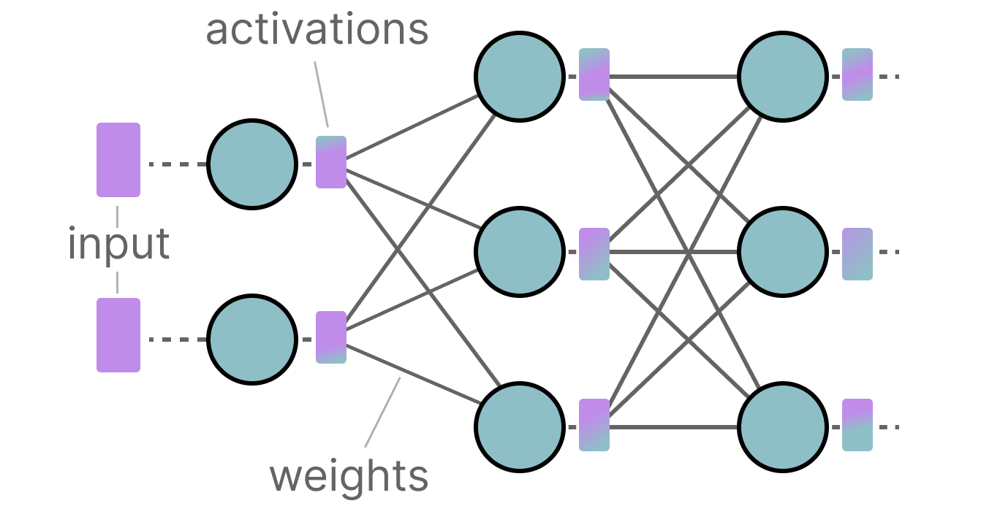

因此，我们希望尽可能高效地表示这数以十亿计的数值，用更少的空间来存储单个值。

在正式讨论如何优化之前，先从最基本的问题开始：数值本身到底是如何被表示的。

### 数值是如何表示的

一个数值通常会被表示为浮点数（floating point number），也就是带小数点的正数或负数。

这些数值最终都由比特（bit）表示。IEEE-754 标准规定，一组比特通常会分别承担三类功能：符号位（sign）、指数（exponent）和尾数/分数部分（fraction 或 mantissa）。

这三部分组合起来，就能根据一组具体的 bit 值计算出对应的实数。

一般来说，用来表示一个值的 bit 越多，精度也就越高。

### 内存约束

可用 bit 越多，可表示的数值范围通常也越大。

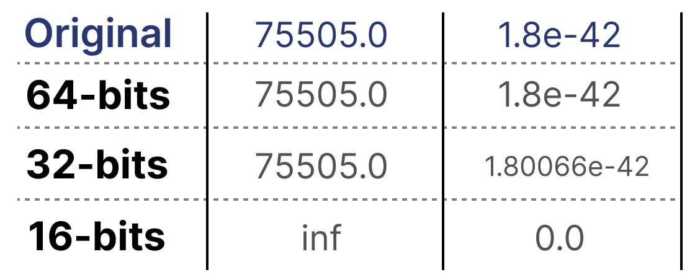

一种表示方式所能覆盖的数值区间，叫作动态范围（dynamic range）；相邻两个可表示值之间的距离，则叫作精度（precision）。

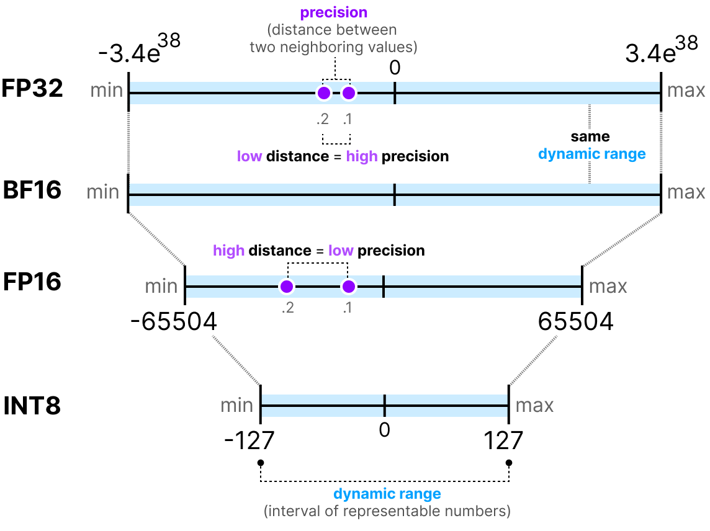

这些 bit 还有一个很实用的地方：它们可以让我们直接估算设备需要多少内存来存储一个值。因为 1 字节等于 8 bit，所以对大多数浮点表示而言，我们都可以写出一个简单的内存估算公式。

当然，实际推理时的显存需求并不只由参数位宽决定，上下文长度、模型结构等因素也会影响总体开销。

现在假设我们有一个 700 亿参数的模型。如果它原生以 32 位浮点数（FP32，全精度）表示，那么仅仅把模型加载进内存，就需要约 280GB。

因此，无论是训练还是推理，尽量减少表示参数所需的 bit 数都极具吸引力。问题在于，随着精度下降，模型准确率通常也会受到影响。

我们真正想做的是：在尽量不损失性能的前提下，减少表示这些数值所需的 bit 数。这正是量化要解决的问题。

## 第二部分：量化入门

量化的目标，是把模型参数从更高位宽的表示，例如 32 位浮点数，映射到更低位宽的表示，例如 8 位整数。

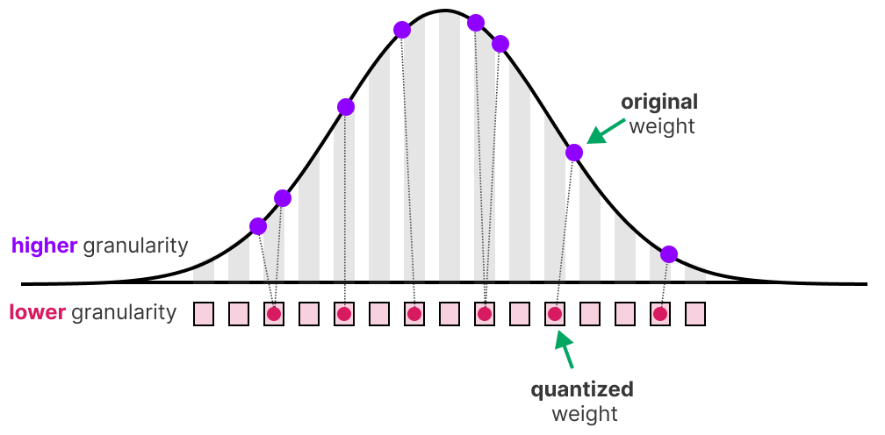

当 bit 数变少时，通常会带来一定的精度损失，也就是数值颗粒度（granularity）变粗。

为了直观说明这一点，可以把任意一张图像限制为只用 8 种颜色来表示。

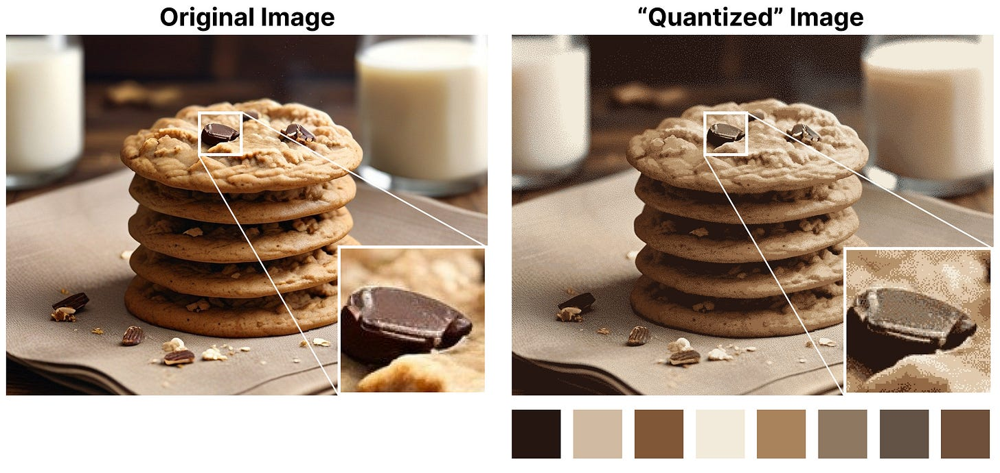

这张图改编自 Slava Sidorov 的原图。你可以看到，放大后的局部比原图更“粗糙”，因为可以使用的颜色变少了。

量化的核心目标，就是用更少的“颜色”，也就是更少的 bit，去表示原始参数，同时尽量保留原本的精度。

### 常见数据类型

先来看几种常见的数据类型，以及它们相对于 32 位表示，也就是全精度 FP32，会带来什么变化。

#### FP16

先看从 32 位浮点数降到 16 位浮点数，也就是半精度（FP16）的例子。

可以看到，FP16 能表示的数值范围要比 FP32 小得多。

#### BF16

为了在只使用 16 bit 的情况下，尽量保留 FP32 的数值范围，人们提出了 bfloat16，也就是 BF16。它可以看作是一种“截断版 FP32”。

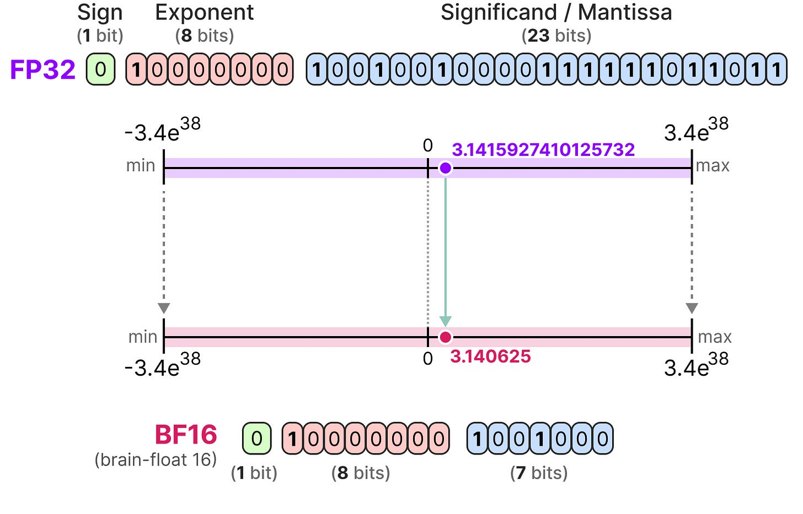

BF16 和 FP16 使用相同数量的 bit，但它能覆盖更宽的数值范围，因此在深度学习里非常常见。

#### INT8

如果继续减少 bit 数，我们就会逐渐进入整数表示的世界，而不是浮点表示的世界。比如从 FP32 到 INT8，只剩下原来四分之一的 bit 数。

在某些硬件上，整数计算会比浮点计算更快，虽然这并不是绝对规律；但总体上，bit 越少，计算往往也越快。

每次降低 bit 数时，本质上都要做一次映射，把原来的 FP32 数值“挤压”到更低位宽的表示里。

在实践中，我们并不需要把整个 FP32 的范围 `[-3.4e38, 3.4e38]` 全部映射进 INT8。我们真正要做的，只是把“当前数据，也就是模型参数本身”的取值范围映射进 INT8。

最常见的“压缩/映射”方式，是对称量化（symmetric quantization）和非对称量化（asymmetric quantization）。它们都属于线性映射。

下面就以从 FP32 量化到 INT8 为例，分别看看这两种方法。

### 对称量化

对称量化会把原始浮点值的范围，映射到一个以 0 为中心的、对称的量化空间里。前面的示意图里也能看出来：量化前后，范围都围绕 0 对称展开。

这意味着，浮点空间中的 0，在量化空间里仍然对应精确的 0。

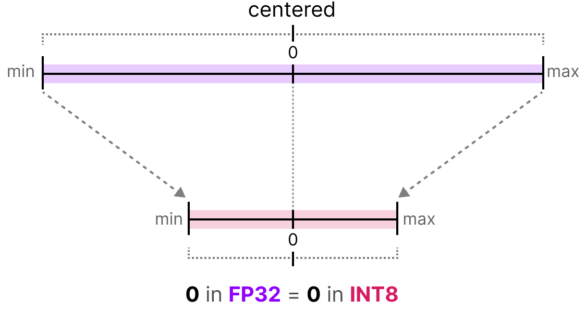

一个非常典型的对称量化方法，叫作绝对最大值量化（absolute maximum quantization，absmax）。

给定一组数值，我们取其中绝对值最大的那个数 `α` 作为映射范围。

这里图中使用的是受限范围 `[-127, 127]`。不受限的 INT8 范围其实是 `[-128, 127]`，具体采用哪一种，要看量化实现细节。

由于这是一个围绕 0 的线性映射，因此公式相对直接。

我们首先计算缩放因子（scale factor）`s`。这里的 `b` 表示量化位宽，在这个例子里取 8；`α` 则是最大绝对值。

随后，用这个 `s` 把输入值 `x` 量化到 INT8。

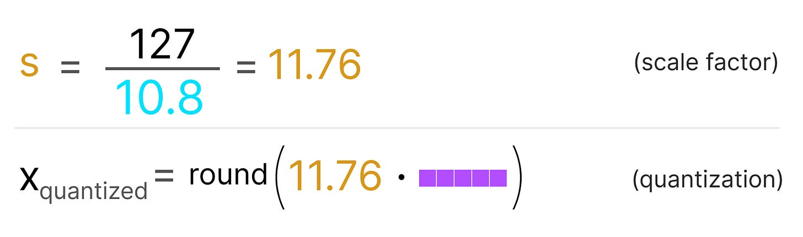

把具体数值代进去之后，映射过程就会变成下图这样。

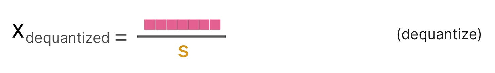

要把量化后的值还原回原来的 FP32 近似值，我们再用同一个缩放因子 `s` 做反量化（dequantization）。

完整地做一遍“量化再反量化”，大致会得到下面的结果。

你会发现，像 `3.08` 和 `3.02` 这样的不同数值，在量化后都可能映射到同一个 INT8 值，例如 36。等再反量化回 FP32 时，它们就不再能被区分了。

这部分损失通常就叫作量化误差（quantization error），也就是原始值和反量化值之间的差异。

通常来说，bit 越少，量化误差就越大。

### 非对称量化

与对称量化不同，非对称量化不再围绕 0 对称。它会把浮点范围中的最小值 `β` 和最大值 `α`，直接映射到量化范围里的最小值和最大值。

这里要介绍的方法，叫作零点量化（zero-point quantization）。

注意图里 0 的位置已经偏移了，这也是它被称为“非对称”的原因。在示例范围 `[-7.59, 10.8]` 中，最小值和最大值到 0 的距离并不相等。

也正因为 0 被平移了，我们需要先计算 INT8 空间中的零点（zero-point）`z`，才能完成线性映射。和前面一样，我们也需要缩放因子 `s`，只是这里使用的是 INT8 范围差值 `[-128, 127]`。

可以看到，相比对称量化，这个过程更复杂一些，因为要显式计算 INT8 空间里的零点 `z`，从而把权重整体平移。

把具体数值代入后，过程如下。

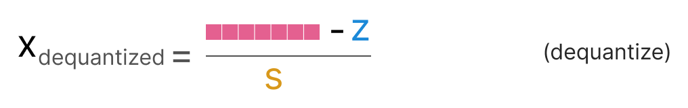

反量化时，我们同样需要前面算出的 `s` 和 `z`，再把 INT8 值近似还原回 FP32。

把对称量化和非对称量化放在一起，就能很直观地看出两者差异。

最核心的区别，就是对称量化始终以 0 为中心，而非对称量化会让这个中心发生偏移。

### 范围映射与裁剪

前面的例子里，我们都假设：一个向量里的全部取值范围，都会被完整映射到低位宽表示里。但这么做有一个明显的问题，就是离群值（outliers）。

假设你有这样一个向量。

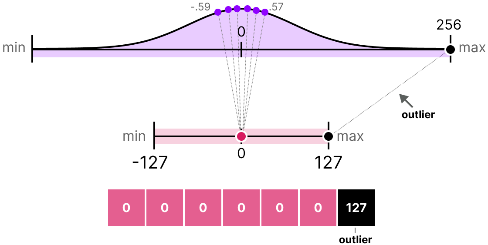

其中有一个值明显比其他值大得多，可以看作离群点。如果我们坚持映射这个向量的完整范围，那么其他大部分小值就会被挤压到同一个低位宽表示里，彼此之间的差异也会丢失。

这其实就是前面用过的 absmax 行为。在不做裁剪时，非对称量化也会出现类似问题。

因此，我们往往会主动对部分数值做裁剪（clipping）。所谓裁剪，就是人为指定一个更合适的动态范围，让超出范围的离群值都落到同一个饱和值上。

例如下面这个例子中，如果手动把动态范围定为 `[-5, 5]`，那么所有超出范围的值都会直接映射到 `-127` 或 `127`。

这样做的主要好处，是非离群值的量化误差会显著下降。当然，对离群值本身来说，量化误差则会变大。

### 校准

前面把范围手动设成 `[-5, 5]` 只是一个朴素示例。真正选择这个范围的过程，叫作校准（calibration）。它的目标是尽量覆盖更多数据，同时最小化量化误差。

不过，不同类型的参数，校准方式并不完全一样。

#### 权重（以及偏置）

对 LLM 来说，权重和偏置可以视为静态值，因为在模型真正运行之前，它们就已经是确定的了。比如一个二十多 GB 的 Llama 3 模型文件，主体几乎都是权重和偏置。

由于偏置的数量远小于权重，通常只有数百万级，而权重可能有数十亿级，所以实践里常常让偏置保留更高精度，例如 INT16，而把主要量化工作放在权重上。

对于这种“静态且已知”的权重，常见的校准方式包括：

- 手动选择输入范围的某个百分位数。
- 优化原始权重与量化权重之间的均方误差（MSE）。
- 最小化原始分布与量化分布之间的熵差，也就是 KL 散度。

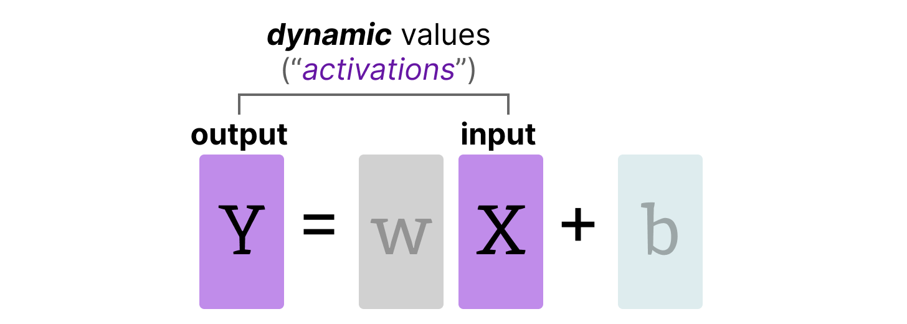

例如，按百分位数选择范围，本质上就会产生前面提到的那种“裁剪离群值”的效果。

#### 激活值

模型在前向过程中不断更新的输入/中间表示，通常统称为激活值（activations）。

与权重不同，激活值会随着输入样本的不同而变化，因此更难被准确量化。

因为这些值会在每一层之后不断更新，所以只有在推理真正发生时，我们才知道它们的实际分布会是什么样。

广义上看，针对权重和激活值的量化，主要有两条路线：

- 训练后量化（Post-Training Quantization, PTQ）：训练完成之后再做量化。
- 量化感知训练（Quantization Aware Training, QAT）：在训练或微调阶段就把量化过程纳入进来。

## 第三部分：训练后量化

训练后量化（PTQ）是最常见的量化技术之一。它的思路，是在模型训练完成之后，再去量化模型的参数，包括权重和激活值。

权重量化通常直接采用对称量化或非对称量化即可。

但激活值的量化不同。由于它们的分布只有在模型真正推理时才能观测到，所以必须先通过一次或多次推理来估计它们可能的取值范围。

激活值的量化通常有两种形式：

- 动态量化（Dynamic Quantization）
- 静态量化（Static Quantization）

### 动态量化

当数据流过某一层时，我们先收集这一层输出的激活值。

随后，利用这组激活值分布来计算量化所需的零点 `z` 和缩放因子 `s`。

这个过程会在数据经过每一层时重复进行。因此，不同层会有不同的 `z` 和 `s`，也就对应着不同的量化方案。

### 静态量化

静态量化则相反。它不会在推理过程中实时计算零点和缩放因子，而是在推理开始之前先把这些值确定好。

为此，通常会准备一个校准数据集（calibration dataset），先把它送进模型，收集可能出现的激活值分布。

收集完成后，就可以预先算出推理时所需的 `s` 和 `z`。正式推理时，这些值不再重新计算，而是直接用于激活值量化。

一般而言，动态量化往往更准确一些，因为它会按层、按当前输入实时估计量化参数；但代价是额外的计算开销。静态量化则更快，因为量化参数早已准备好，只是精度通常会略差一些。

### 4 比特量化的世界

降到 8 bit 以下一直都很难，因为每少一位，量化误差都会进一步增大。尽管如此，研究和工程实践还是发展出了不少足够聪明的方法，把位宽降到 6 bit、4 bit，甚至 2 bit。当然，再继续往下压，通常就不太建议沿用这些方法了。

在 Hugging Face 生态里，最常见的两类低比特方案可以简单概括为：

- GPTQ：通常面向“整模型尽量放在 GPU 上”的场景。
- GGUF：更适合在显存不够时，把部分层卸载到 CPU 上。

#### GPTQ

GPTQ 是实践中最著名的 4 bit 量化方法之一。它采用的是非对称量化，并且按层（layer by layer）处理：每一层都独立量化，完成后再继续下一层。

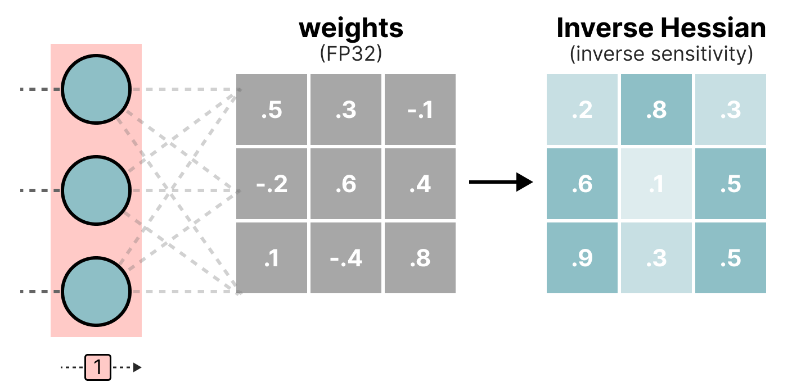

在这个按层量化的过程中，它会先把这一层的权重转换到与逆 Hessian（inverse-Hessian）相关的表示上。Hessian 是损失函数的二阶导信息，它告诉我们：模型输出对各个权重变化到底有多敏感。

简化地说，它描述的是每个权重的重要性。某个权重在 Hessian 相关矩阵中的值越小，通常说明它越“关键”，因为对它做一点点改动，都可能显著影响模型表现。

接下来，GPTQ 会先把权重矩阵第一行中的某个权重量化，再反量化回来。

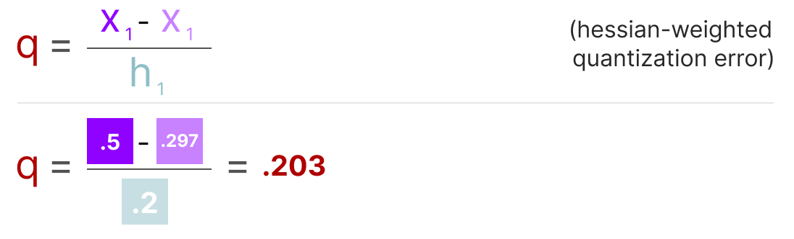

这样就可以得到对应的量化误差 `q`。然后，再用刚才算出的逆 Hessian 值 `h_1` 去对这个误差加权。

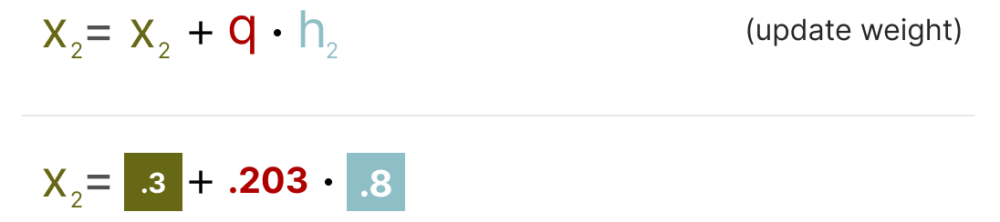

接下来，这个加权后的量化误差会被重新分配到同一行的其他权重上，从而尽量维持网络整体的函数和输出不变。

例如，如果要处理第二个权重，也就是 `x_2 = 0.3`，那么就会把量化误差 `q` 按第二个权重对应的逆 Hessian `h_2` 重新分摊过去。

对第三个权重也同样如此。

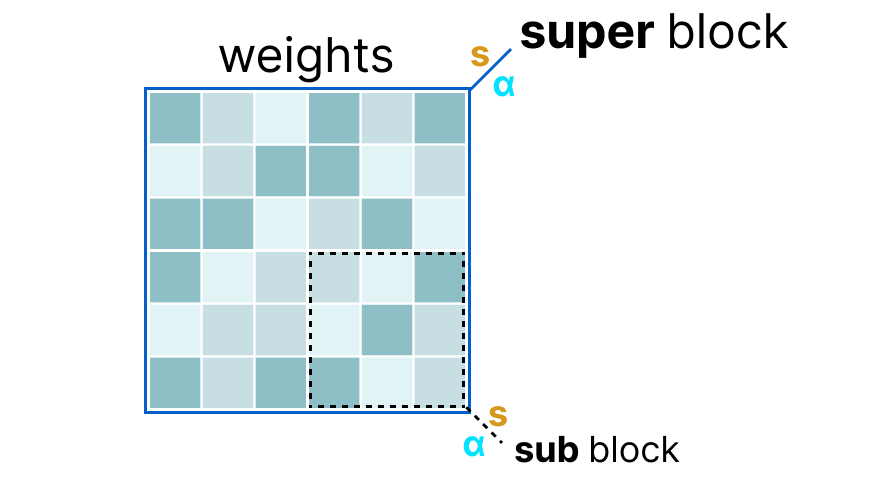

整个过程会不断重复，直到所有值都被量化完成。GPTQ 之所以有效，是因为权重彼此之间往往不是独立的。当某个权重因为量化而产生误差时，相关权重可以在逆 Hessian 的指导下做出补偿。

原论文还使用了多种加速和提效技巧，例如给 Hessian 增加阻尼项、使用 lazy batching，以及利用 Cholesky 方法做预计算。想看更直观的讲解，可以参考这段 [YouTube 视频](https://www.youtube.com/watch?v=mii-xFaPCrA)。如果更关心推理性能，也可以看看 [EXL2](https://github.com/turboderp/exllamav2)。

#### GGUF

如果你有足够的 GPU 显存，GPTQ 是很不错的选择。但现实里，很多时候显存并不够。这时，GGUF 的优势就体现出来了：它允许你把模型中的部分层卸载到 CPU 上运行。

这意味着，在显存不足时，你可以同时利用 CPU 和 GPU 来跑模型。

GGUF 的具体量化细节会随着位宽和实现不断演进，但其大体思路可以概括为：先把一层权重切分成若干“超级块（super blocks）”，每个超级块下面再包含若干“子块（sub blocks）”。随后，从这些块中分别提取缩放因子 `s` 和 `α`。

对子块进行量化时，可以继续使用前面介绍过的 absmax 量化，也就是把某个权重乘以对应的缩放因子 `s`。

这里比较关键的一点是：子块的缩放因子，本身也要量化。而它的量化，又会借助超级块中的信息来完成。

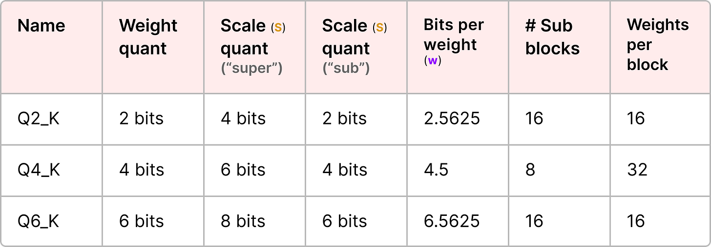

换句话说，GGUF 的块级量化，会使用超级块的缩放因子 `s_super` 去量化子块的缩放因子 `s_sub`。

不同层级的缩放因子，量化精度可以不同。通常来说，超级块的 scale 会比子块的 scale 保持更高精度。

下图给出了几种典型量化等级的例子，例如 2 bit、4 bit 和 6 bit。

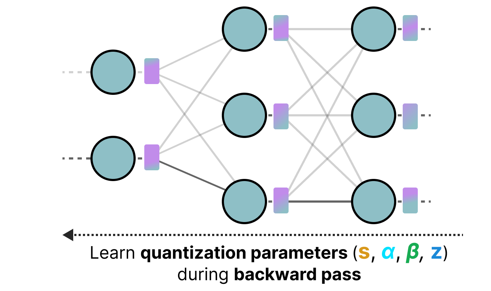

有些量化类型还会额外引入一个最小值 `m`，用于进一步调整 zero-point；它的量化方式和缩放因子 `s` 类似。

如果你想了解 llama.cpp 中各种量化等级的总览，可以看 [这份 pull request](https://github.com/ggerganov/llama.cpp/pull/1684)。想了解 importance matrices 相关的扩展，可以看 [这份 pull request](https://github.com/ggerganov/llama.cpp/pull/4861)。

## 第四部分：量化感知训练

在前一部分里，我们看到的是“训练完再量化”的思路。但这种做法的缺点也很明显：量化本身并没有参与训练过程。

量化感知训练（Quantization Aware Training, QAT）正是为了解决这个问题。它的目标不是在训练后才去做 PTQ，而是让模型在训练阶段就“学会”如何适应量化。

因为量化带来的误差已经在训练时被纳入考虑，所以 QAT 往往会比 PTQ 更准确。它的大致思路如下。

训练过程中会插入所谓的“fake quant”，也就是先把权重压到某个低位宽，比如 INT4，然后再把它反量化回 FP32 继续参与后续计算。

这样一来，模型在计算损失和更新权重时，就已经把量化的影响纳入进去了。

从优化角度看，QAT 会更倾向于探索“宽谷底（wide minima）”而不是“窄谷底（narrow minima）”，因为窄谷底往往对量化更敏感，量化误差也会更大。

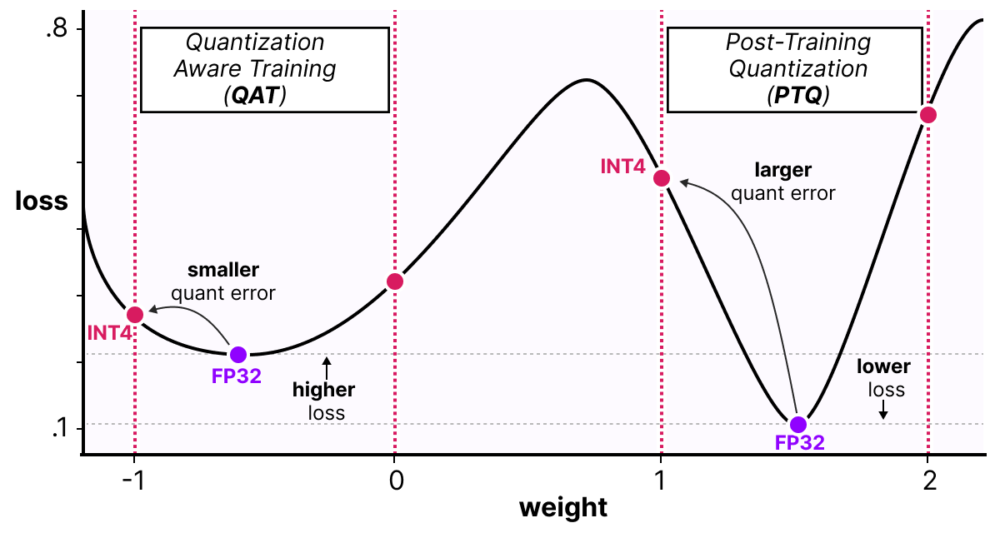

例如，如果在反向传播时完全不考虑量化，那么梯度下降会选中一个高精度下损失最小的权重更新点；但这个点一旦量化，很可能会因为落在“窄谷底”而引入更大的误差。

相反，如果把量化过程考虑进去，训练就可能选择另一个位于“宽谷底”的权重更新点，它在低精度下反而更稳定。

因此，虽然 PTQ 在高精度表示下的损失可能更低，例如 FP32 下更优，但 QAT 在真正关心的低精度部署环境，例如 INT4 下，往往能得到更低的损失。

### 1 比特 LLM 的时代：BitNet

前面我们已经看到，4 bit 已经很小了。但如果再进一步呢？

BitNet 就是在这样的背景下出现的。它尝试把模型权重压到单个 1 bit，只允许每个权重取 `-1` 或 `1` 两个值。

BitNet 的关键思路，是把量化过程直接注入 Transformer 架构本身。

还记得吗？绝大多数 LLM 的基础都是 Transformer，而 Transformer 的核心计算里有大量线性层（linear layers）。

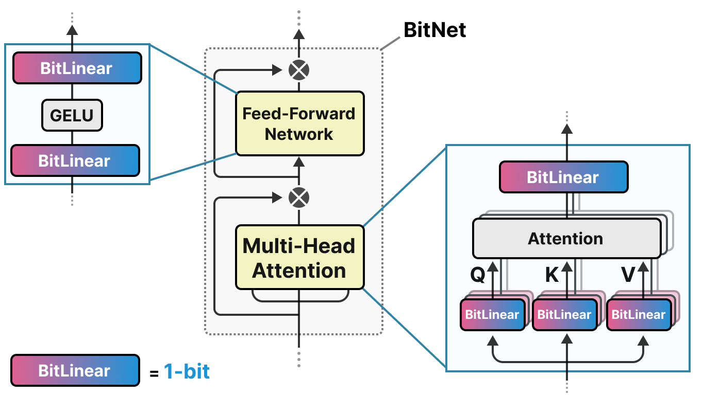

这些线性层通常会用更高精度表示，例如 FP16，而模型的大部分权重也都集中在这里。

BitNet 会把这些普通线性层，替换成它所谓的 BitLinear。

BitLinear 在功能上和普通 linear layer 一样，依然是用权重乘激活值来计算输出。

不同的是，BitLinear 会把权重量化到 1 bit，同时把激活值量化到 INT8。

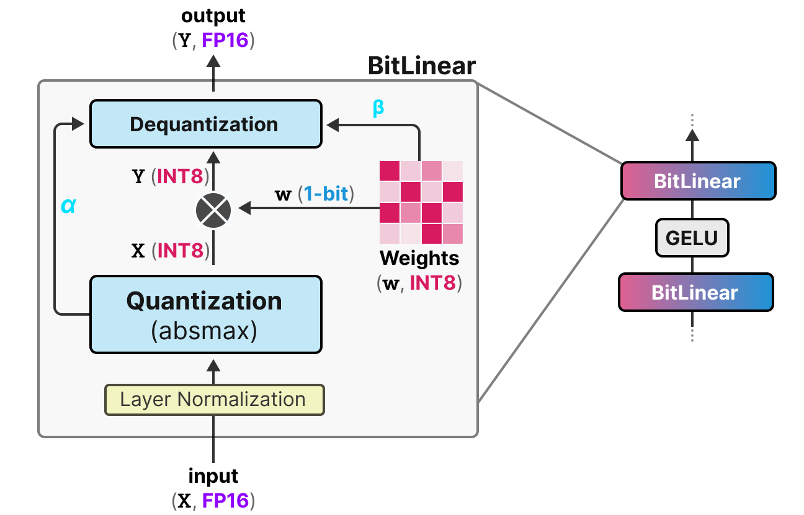

像 QAT 一样，BitLinear 也会在训练阶段执行一种“fake quantization”，从而显式分析权重和激活值量化所带来的影响。

原论文里使用的符号略有不同。图中沿用了本文前面一直使用的 `α` 记号；同时，这里的 `β` 也不是前面零点量化里的 `β`，而是“权重绝对值的平均值”。

下面按步骤看看 BitLinear 是如何工作的。

#### 权重量化

训练时，权重先以 INT8 存储，然后再通过一个很简单的策略，也就是 signum 函数，被量化为 1 bit。

本质上，它会先把权重分布平移到以 0 为中心，然后把所有小于 0 的值映射为 `-1`，大于 0 的值映射为 `1`。

同时，它还会记录一个 `β`，也就是权重绝对值的平均值，供后续反量化使用。

#### 激活值量化

对于激活值，BitLinear 使用的是 absmax 量化。它会把激活值从 FP16 压到 INT8，因为矩阵乘法阶段仍然需要相对更高的精度。

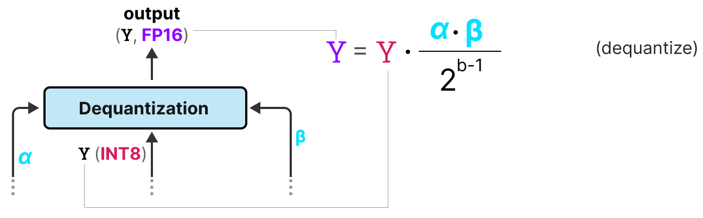

同样地，它还会记录一个 `α`，也就是激活值的最大绝对值，后面反量化时会用到。

#### 反量化

因为前面已经记录了激活值的最大绝对值 `α`，以及权重绝对值的平均值 `β`，所以这些量都可以用于把输出激活值重新缩放回原始精度附近。

整个流程并不复杂，但它让模型的权重只需要两个值 `-1` 和 `1` 就能被表示。

作者观察到，随着模型规模不断变大，1 bit 训练和 FP16 训练之间的性能差距会逐渐缩小。不过，这种现象主要出现在更大的模型上，例如超过 300 亿参数；对较小模型来说，差距依然很明显。

### 所有大语言模型都在 1.58 比特里

随后，BitNet 1.58b 被提出，用来进一步改进前面提到的扩展性问题。

在这个新方法里，每个权重不再只能取 `-1` 或 `1`，而是还能取 `0`。也就是说，权重变成了三值（ternary）表示。看似只是多加了一个 `0`，但这一步却显著提升了效果，并且还能大幅加快计算。

#### 0 的力量

为什么多出来的 `0` 会这么重要？

答案与矩阵乘法直接相关。

先回顾普通矩阵乘法。计算输出时，我们会用权重矩阵乘以输入向量。下图展示了第一层中第一次矩阵乘法的过程。

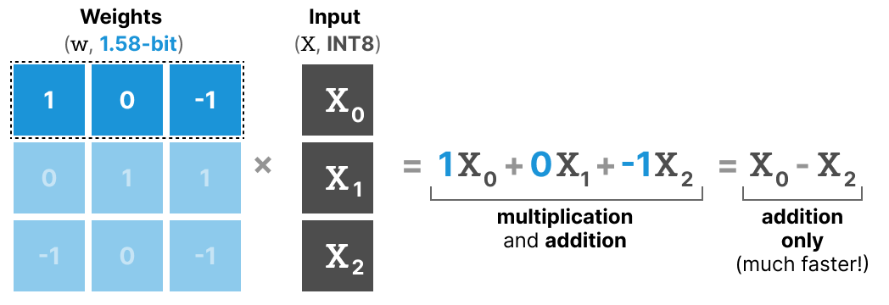

注意这里有两个动作：先把每个权重和输入相乘，再把所有结果加起来。

而在 BitNet 1.58b 里，三值权重本质上已经把“乘法”简化成了三种语义：

- `1`：把这个值加上。
- `0`：忽略这个值。
- `-1`：把这个值减去。

因此，当权重量化到 1.58 bit 时，你几乎只需要做加法和减法，而不必真的执行一般意义上的乘法。

这不仅显著提升了计算效率，还带来了一个额外好处：特征过滤（feature filtering）。

因为当某个权重被置为 `0` 时，对应特征就会被直接忽略；而在 1 bit 表示里，它只能被加上或减去，无法被真正“关掉”。

#### 量化

在权重量化上，BitNet 1.58b 使用的是 absmean quantization。它可以看作前面 absmax 的一个变体。

它的思路是先压缩权重分布，再用绝对均值 `α` 来完成量化，最后把值四舍五入到 `-1`、`0` 或 `1` 三个离散点上。

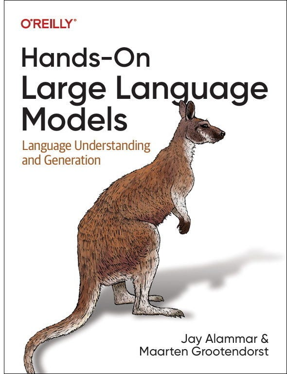

与 BitNet 相比，它在激活值量化上基本保持一致，只改了一个地方：不再把激活值缩放到 `[0, 2^{b-1}]`，而是用 absmax 把它们缩放到 `[-2^{b-1}, 2^{b-1}]`。

概括起来，1.58 bit 量化主要依赖两件事：

- 引入 `0`，把权重从二值扩展为三值表示 `[-1, 0, 1]`。
- 对权重使用 absmean quantization。

原文里引用了一句很有代表性的话：“13B 的 BitNet b1.58 在延迟、内存占用和能耗方面，都比 3B 的 FP16 LLM 更高效。”

也正因为如此，我们才会得到一种既轻量、又计算上更高效的 1.58 bit 模型表示。

## 结论

到这里，这趟量化之旅就告一段落了。希望这篇文章能帮你更直观地理解量化、GPTQ、GGUF 与 BitNet 这几类方法到底在做什么。

量化真正有趣的地方在于，它不是单一技巧，而是一整套“如何用更少 bit 保住更多能力”的方法论。未来模型究竟还能被压到多小，很难提前下结论，但这条路线显然还远没有走到头。

## 资源

如果你想继续深入，原文给出的延伸材料很值得一看：

- [Hugging Face 关于 LLM.int8() 的文章](https://huggingface.co/blog/hf-bitsandbytes-integration)，以及对应的 [论文](https://arxiv.org/pdf/2208.07339)。
- [Hugging Face 关于 embedding quantization 的文章](https://huggingface.co/blog/embedding-quantization)。
- [Transformer Math 101](https://blog.eleuther.ai/transformer-math/)，讲解 Transformer 计算与内存开销的基本数学。
- [LLM VRAM Calculator](https://huggingface.co/spaces/NyxKrage/LLM-Model-VRAM-Calculator) 与 [VRAM Estimator](https://vram.asmirnov.xyz/)，用于估算模型运行所需的显存/内存。
- [关于 GPTQ 的直观 YouTube 讲解](https://www.youtube.com/watch?v=mii-xFaPCrA)。
- 如果你关心量化微调，可以继续阅读 QLoRA 相关资料。

## 参考

- Frantar, Elias, et al. “GPTQ: Accurate Post-Training Quantization for Generative Pre-trained Transformers.” arXiv:2210.17323, 2022.
- [GGUF 文档](https://github.com/ggerganov/ggml/blob/master/docs/gguf.md)。
- Wang, Hongyu, et al. “BitNet: Scaling 1-bit Transformers for Large Language Models.” arXiv:2310.11453, 2023.
- Ma, Shuming, et al. “The Era of 1-bit LLMs: All Large Language Models are in 1.58 Bits.” arXiv:2402.17764, 2024.
- Dettmers, Tim, et al. “QLoRA: Efficient Finetuning of Quantized LLMs.” Advances in Neural Information Processing Systems 36, 2024.
