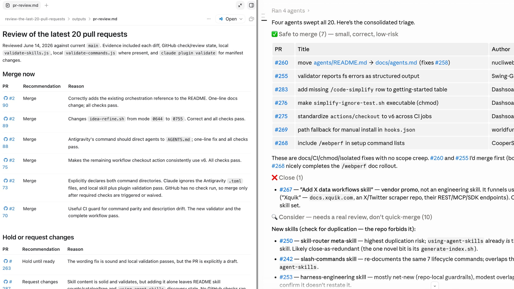

# 智能体式代码审查（Agentic Code Review）

_编码智能体现在已经非常强，而且还在快速变强。一个有意思的结果是，工程的难点从写代码转移到了“是否信任这段代码”的决策上，这让审查成为当前软件领域杠杆最高的技能。你怎么做审查，很大程度上取决于你是谁：一个没有用户的独立开发者，和一个维护十年陈系统的团队，要解决的问题根本不一样。_

---

我对智能体式工程比以往任何时候都更乐观。这些智能体确实很强，每个月都在进步。在平常的一天，我现在能交付一年前根本不敢尝试的东西。这篇文章是一张地图，标出那些有意思的工作去了哪里——因为工作确实在移动，而大多数团队还没完全赶上。

过去的代码审查能运转，靠的是一个巧合：相对速度恰好匹配。资深工程师读代码比初级工程师写代码快，所以审查能跟上节奏，没人专门设计过；团队也顺带在互相读 diff 的过程中，吸收了对系统的整体理解。这很大程度不是刻意为之，而是源于一个事实：写代码是慢而贵的部分，读代码则又便宜又快。

这个事实不再成立。一个智能体生成一千行通常很扎实、格式良好的代码，用的时间比我还不如读完这一段话。而人类的阅读速度，从我们开始以盯屏幕为业的那天起就没变过。于是瓶颈下移到了唯一没有变快的那一步：一个人要对这次改动的正确性有信心。我不认为这是损失。这是当前软件里最值得做好的高杠杆位置，也是我今年投入最多注意力的地方。

这里有一个贯穿全文的转折。那些生成了海量额外代码的工具，也正是对付这堆代码最好的东西。在我自己的项目里（包括那些热门的开源项目），我现在会让 Claude Code 或 Codex 去处理一批进来的 PR，让它们帮我分诊（triage）队列，这真的改变了我花时间的方式。所以这不是一篇反 AI 的文章，我后面会具体讲我是怎么用的。

这也不是一份数据汇编，更不是又一轮“让模型写代码到底是好事还是手艺的末日”的争论，因为那种框架没用。真正经得起真实代码库检验的答案只有一句：这完全取决于你是谁。一个给十来个人用的 side project 写氛围代码（vibe coding）的开发者，和一个再撑一个季度十年企业系统的团队，几乎没有任何可共用的约束；而市面上大多数建议，无非是这两种人里的一个在教另一个怎么活。

## 2026 年的数据到底说了什么

**AI 带来的生产力提升是真实的，但原始产出夸大了它：大约四倍的代码，只换来多出一成的交付价值。这两个数字之间的差距，全都是审查工作——这也正是为什么杠杆现在落在审查上。**

几年来这还只是传闻和争论。现在它已经被大规模测出来了，而且是由没有共同议程、有些还存在商业竞争的组织测出来的，测量结果一致指向同一个方向：AI 大幅推高产出，同时拉低质量和可审查性。

[Faros AI](https://www.faros.ai/blog/ai-acceleration-whiplash-takeaways) 对 4000 个团队中的 22000 名开发者做了埋点，追踪团队从低 AI 采用度走向高采用度时发生了什么。这是 2026 年 3 月的数据，算是这里最新的一批。好的一面确实值得直说：开发者合并的 PR 多得多，完成的工作也更多，每位工程师的吞吐量在上升。然后是报告其余的部分：

- 代码 churn（反复修改）上升 **861%**
- 事故与 PR 的比值上升 **242.7%**
- 每位开发者的缺陷率从 **9% 升到 54%**
- 审查中位时长上升 **441.5%**，首次审查耗时和平均审查时间都大约翻倍
- **零审查合并**的 PR 上升 **31.3%**

最后一个数字我最难忽视，因为没人主动选它。没有谁决定停止审查。审查者只是跟不上产量，于是代码开始不经阅读就被合并，并变成了常态。我反复琢磨的细节是：有着成熟、自律工程实践的团队，受到的冲击和其他人一样大。好的流程没能保护他们，因为产量的到来快过了任何流程设计所能吸收的速度。

有一点要全程记住：CodeRabbit 和 Faros 都在这个市场里卖东西，所以它们的表述不是无私的。这不代表数字错了——效应量很大，且在互不相关的来源间一致——但供应商的研究值得带着这个前提去读。

[CodeRabbit](https://www.businesswire.com/news/home/20251217666881/en/CodeRabbits-State-of-AI-vs-Human-Code-Generation-Report-Finds-That-AI-Written-Code-Produces-1.7x-More-Issues-Than-Human-Code) 在 2025 年 12 月研究了 470 个开源 PR，其中 320 个由 AI 合著、150 个纯人工，发现 AI 改动携带的 issue 大约多出 **1.7 倍**：逻辑与正确性问题上升约 75%，安全问题常见 1.5 到 2 倍，可读性问题涨了三倍多。他们的 AI 总监 David Loker 把这些描述为“组织必须主动缓解的、可预测、可度量的弱点”。“可预测”是关键词。这些是已知的、可定位的弱点，这是个好消息：意味着审查流程，无论人工还是自动化，都能直接瞄准它们。

[GitClear](https://www.gitclear.com/research/ai_tool_impact_on_developer_productive_output_from_2022_to_2025) 有一个我最想摆在开头的数字。在他们截至 2025 年的生产力数据里，日常 AI 用户产出的原始量大约是非用户的 **4 倍**，但和他们自己一年前的产出相比，真实生产力提升只有约 **12%**。你生成了大约四倍的代码，换来的交付价值只多了大约一成，而人类还得把四倍的代码全部审一遍。值得一提的是，Bill Harding 明确承认，这 12% 里有些甚至是选择偏差，因为更强的开发者集中在了 AI 群体里。四倍代码与多一成价值之间的鸿沟，用一句话就说清了审查问题。

[GitHub](https://github.blog/ai-and-ml/generative-ai/agent-pull-requests-are-everywhere-heres-how-to-review-them/) 报告称，Copilot 的审查现在已经跑过 6000 万次审查，不到一年增长 10 倍，平台上超过五分之一的审查有智能体参与。这不再是小众实践，这就是代码被制造出来的方式。

四份数据集，四种方法，一个结论。我们把机器速度的产出，灌进一个为人类速度设计的系统里。瓶颈没有消失，它[转移到了验证瓶颈（verification bottleneck）](https://addyosmani.com/blog/verification-bottleneck/)，而审查就是这张账单到期的时刻。

## 每个人都在解决不同的问题

**一次改动需要多少审查，几乎完全取决于它的影响半径（blast radius），而你读到的大多数建议，是某个处于完全不同影响半径上的人写的。**

上面几乎所有骇人数据都来自企业遥测，以及一些被淹没的开源维护者。如果你的情况正是如此，那这些数据完全真实。但如果你是一个人交付一个最多十几个人会用的东西，那其中大部分根本不适用于你，也不该让你因此觉得不好。

三个变量决定你处在哪个位置：

- **影响半径（blast radius）**：它一旦出错会发生什么。无事发生，还是有愤怒的用户、金钱和 PII 面临风险。
- **代码存活多久**：一个你下周可能就重写的临时原型，还是要维护多年的代码库。
- **有多少人需要理解它**：只有你一个人把整体装在脑子里，还是一个需要随时间共享所有权的团队。

把同一个 diff 套进这三个变量，“好的审查”意味着完全不同的东西。

如果你在没有用户的绿地项目上独自工作，审查的第二项职责——在团队间分发知识——对你不存在。你就是团队。合理的做法是重度依赖[测试和自动化](https://addyosmani.com/blog/verification-bottleneck/)，只审查真正重要的部分，其余接受更轻的处理。当代码可能一个月内就不存在、且它出问题时半夜没人被叫醒时，重复和 churn 的代价小得多。但坑在于——很多人是痛过才学到的——这只有在测试是真的时才成立。没有安全网就跳过审查，不是消除了工作，而是把它[推迟了](https://addyosmani.com/blog/intent-debt/)，代价更高；而且当没人来反驳时，标准会下滑。没有用户，是允许你推迟审查，不是允许你跳过验证。

然后项目有了用户。这是危险的中间地带，而且跨越时当时几乎没人察觉。审查抓 bug 的角色突然重要了，因为 bug 现在会伤到人；它分享知识的角色也开启了，因为不再只有你一个。团队把独自干活时的习惯多保持了好几个月，于是有了一次事后复盘，Faros 的数字也从一个图表变成了他们自己的仪表盘。

最远端是一个有着老旧代码库和众多用户的大组织。在这里，每一个骇人数字都以满格威力落地。一个重复的辅助函数不是风格瑕疵，它是未来的 bug 面和会复利多年的维护成本。一次没人理解的改动，是会变成某个人 on-call 事故的[理解债务（comprehension debt）](https://addyosmani.com/blog/comprehension-debt/)。审查在同时做好几份工作，而智能体产出的体量悄悄把它们全部击碎。Faros 关于成熟团队的发现，正正对着这里。

所以重点不是“企业该谨慎、独开发者可以放松”。重点是审查的目的随你的位置而变，规则也得跟着变。把企业那套上锁的、多智能体的、要求证据的流水线，焊到两个人原型上，你只是无谓地加了摩擦。在支付系统上跑“测试通过就发版”，你造的是一个顶着绿色对勾的事故生成器。这个领域里大多数糟糕建议，都是光谱上某一端的人在对另一端指手画脚。

## 审查现在到底是为了什么

**审查本是为核对作者的推理而建。智能体确实会推理，但那段推理通常被丢掉，而不是附在代码上，于是审查者得去重建一个从未进入 diff 的理由。好消息是：这是个工具问题，而把推理捕捉下来，会让审查轻松得多。**

这部分是真正改变了的，而我觉得它被低估了。

人写代码时，意图是免费附带的。推理、权衡后放弃的备选方案，都活在作者脑子里，审查就是你核对那段推理。现代智能体确实会推理，常常可见：产生 thinking trace、权衡选项、边做边解释。但坑在于，这段推理一旦 diff 产出，通常就被丢弃了。它很少被记录，很少附到 PR 上，而且无论如何，那是智能体关于“如何实现这个任务”的推理，不是人类关于“这到底是不是该做的任务”的判断。于是审查从“核对摆在你面前的推理”，变成了“重建从未写下来的意图”，这更难也更慢，而我们还在一直假装惊讶它要[多花 441% 的时间](https://www.faros.ai/blog/ai-acceleration-whiplash-takeaways)。

一篇 2026 年的论文[《AI Slop 与软件公地》](https://arxiv.org/html/2604.16754v1)，分析了 15 个 Reddit 和 Hacker News 讨论串里 1154 条开发者聊“AI slop”的帖子。一位开发者的一句话让我记到现在：审查一个智能体的 PR，让他成了“第一个真正看到这段代码的人类”。

这句话值得停下来想想，它直指解法。在普通审查里，作者已经理解了这个改动，你是在核对他的工作。而在一个智能体 PR 里，还没人重建过“为什么”，审查者是第一个尝试的人。如论文所言，审查“不是为找回缺失的意图而建的”。鼓舞人心的是，缺失的意图是可恢复的：推理存在过，只是我们丢掉了。让智能体说清它在做什么、放弃了什么，把它作为[决策日志](https://addyosmani.com/blog/intent-debt/)记在 PR 上，一大部分重建成本就消失了。这是个工具问题，而工具问题会被解决。

但这些都不让“让 AI 审 AI”本身成为完整答案。一个带着不同先验的第二个模型确实能抓到真 bug，而且抓到很多，所以你该跑一个。它给不了的，是关于“这到底是不是该构建的正确改动”的人类判断。那个判断留给人，而它恰好是这份工作里最有趣的部分，是值得保留的部分。

## 工具很好，但未必是因为它们宣传的理由

**当前的 AI 审查工具确实不错，而且它们偶尔不会在同一行上给出相同标记，所以正确做法不是挑最好的那个，而是跑两个用不同方式构建的工具。**

专门的 AI 审查工具现在很好，我认为你应该在所有东西上都至少跑一个，包括 side project。[CodeRabbit](https://www.coderabbit.ai/) 部署最广，在独立的[Martian 基准](https://www.coderabbit.ai/blog/coderabbit-tops-martian-code-review-benchmark)（2026 年 1 至 2 月）上 F1 第一，precision 约 49%，recall 全场最佳。[Greptile](https://www.greptile.com/) 用 precision 换 recall：在一个基准里 bug 捕获率约 82%，而 CodeRabbit 是 44%，代价是更多误报。[Anthropic 的 Code Review](https://claude.com/blog/code-review) 报告其工程师标记错误的发现不到 1%，而我会真正拿给经理看的数字是：它把内部“获得实质性审查的 PR”比例从 16% 提到了 54%。那些过去只扫一眼就通过的尾巴改动，现在有什么东西在读它们了。

我今年见过最有用的结果不是来自供应商。一位工程师[并行跑了四个审查器](https://dev.to/_vjk/best-ai-code-reviewer-in-2026-we-ran-4-in-parallel-for-3-weeks-146-prs-679-findings-1c0f)，CodeRabbit、Sentry Seer、Greptile 和 Cursor BugBot，横跨 146 个真实 PR、679 条发现，持续三个半星期：

> 在 617 个被标记的不同位置中，**93.4% 只被四个工具中的某一个抓到**。6% 被两个抓到。几乎没有一个被三个抓到。**全部四个一个都没抓到。**

四个工具从未在同一行上标记过。每个在不同类型的问题上很强：Greptile 在正确性和架构上误报近乎为零，CodeRabbit 网撒得最广且有一键修复，Seer 在生产故障严重度上最好。这就是对抗式审查的论点，在真实代码库上、而非论文里被演示出来。异构审查者（heterogeneous reviewers）才是重点。四个同一模型的副本只是一个账单更大的单一审查者，而四个真正不同的审查者能暴露出任何单一个体（包括人类）单独找不到的一批 bug。

实践中：别为“单一最好工具”纠结，根本没有。在高风险一端，跑两个刻意不同性格的工具（上面的实验把 Greptile 用于日常正确性、Seer 用于生产故障严重度，几乎零重叠）。如果你是独开发者，一个好审查器加真实测试就够。而且不管营销怎么说，在你的代码上测它，因为这些结果每一个都针对特定代码库，你的也会是。

## 该让 AI 审查更多吗？

**机器已经在审查比你更多的代码。唯一真正剩下的决定，是你是否刻意这么做，而你保留多少人类，应该随你的影响半径而缩放。**

我不断听到一个一年前还是异端、现在却出自资深工程师之口的问题：机器该不该审查更多，也许大部分？我不再觉得这是个愚蠢的问题。

让人不舒服的部分是，AI 审查确实管用。Anthropic 的发现里被标错的不到 1%，工具能抓到人类直接读漏的 bug，而且它们在一天里第 30 个 PR 时不会累——而那恰恰是人类最不可靠的时候。与此同时人类明显跟不上：零审查合并上升 31%，审查时间涨了三倍以上。在真实意义上，机器已经在审查比我们更多的代码。诚实的框架不是“该让 AI 审查更多吗”，而是“AI 已经在做了，我们要刻意去做，还是假装人类还在读一切、让它默认发生”。

[循环工程（Loop Engineering）](https://addyosmani.com/blog/loop-engineering/) 把这说得更尖锐。一个 loop 的前提是，你不再做那个给智能体写 Prompt 的人，而是去建一个系统来写 Prompt 给它，而这个系统的核心部分是一个 judge：一个在继续之前判断工作是否完成的智能体。审查者，是下一个被刻意设计移出内循环（inner loop）的角色。我们花了一年自动化“写”，现在 loops 在自动化“查”，人类不断被往上推、往外挤。“人类留在哪”不是个研讨会问题，而是你每次接一个 loop 时都在做的决定，无论你是否意识到自己在决定。

我现在落在哪——我松松地拿着这个立场：答案不是“人类读每一行”。那已经结束了。体量结束了它，谁还坚持相反，描述的是一个不再存在的世界。但它也不是“让 loop 自己审自己然后走开”。当智能体写代码、另一个审、第三个判，你就有了模型的闭环，带着广泛相关的盲点——尤其当它们来自同一家族时——在同样的地方自信地一致同意。一句没有人类在场的“看起来不错”，就是[借来的信心](https://addyosmani.com/blog/cognitive-surrender/)，即认知投降（cognitive surrender）：系统的确定变成了你的确定，而没人真正理解任何东西。loop 可以非常确定又非常错，而没人类能分辨。

所以人类不离开，人类上移一层。你不再审每个 diff，而是开始拥有那些无法转移给模型的部分。问责，因为你没法在凌晨三点 page 一个模型。关于“这到底是不是该构建的正确改动”的判断，区别于“代码对不对”。高影响半径的关卡，那里出错很贵。还有一个尴尬的：没人规定过的行为，因为模型审的是存在的代码，很少会标记谁都没想到要写下的需求——这依旧是一个[人类形状的缺口](https://addyosmani.com/blog/comprehension-debt/)，我不指望很快填上。Human in the loop 变成 human on the loop：抽样、抽查、审计系统，而不是读每个 PR，把有限的注意力花在出错会真正伤人的地方。

这已经是我自己项目的工作方式，包括那些现在一天看到的 PR 比我一晚上仔细读得完还多的开源项目。我让 Claude Code 或 Codex 去处理一批进来的 PR，要它们做一遍初读（first-pass read）：高层通读什么看起来安全可合并、什么需要更多工作、什么真正高风险。我不会据此自动合并，也不会懒懒地合并它批准的一切。它给我的是一种分配注意力的方式。我能花几分钟确认它认为低风险的改动，把真正小心的时间，花在它标记为危险的那批上。关键的细节是：这不是我旧的那一小时审查被稍微加速。它是另一种形状的一小时，而在我现在处理的体量下，它根本就是队列还能撑住的主要原因。

更极端的一个版本是 Kun Chen，一位[前 Meta L8 工程师，现在作为独开发者每天发约 40 个 PR，并已基本停止审查代码](https://creatoreconomy.so/p/how-this-ex-meta-l8-engineer-ships-40-prs-a-day-with-ai-kun-chen)。这很容易被驳斥，除了他是 L8，在被他停掉的那件事上异常在行，而这正是它有趣的地方。他并行跑 20 到 30 个智能体，把精力移到了 plan 上：他事前写详细 plan，智能体照着跑几个小时，他说 plan 质量决定了它们能无人看管跑多久。那就是我上面描述的那个动作最纯粹的形式。值得精确地说清真正发生了什么，因为不是他停止了验证。意图没有消失，他自己写进了 plan，所以“第一个亲眼看到代码的人类”问题解决了一半：有人确实理解了为什么，只是在事前而非事后。而且他不是没有安全网地工作，他建了一个自动审查关卡（他叫它 No Mistakes）在合并前检查代码，并在智能体卡住时留在升级路径上。人类在代码存在前做贵的思考，机器在之后做逐行的事，这很可能就是这件事走向的形状。

但他是一个没有大团队、脚下没有埋满地雷的十年系统的独开发者。让他“每天 40 个 PR 不审查”变得合理的那些确切条件，大多数读者并不具备。把他的工作流照搬到面向众多用户的团队上，你就在自己的仪表盘上复现了 Faros 的数字。他没错，他只是处在光谱某一端很远的地方。

又是光谱那一点。独自一人、没有用户：让 AI 审掉几乎全部，是个站得住脚的 2026 立场，你不该为此内疚。为众人维护大东西：让机器做一遍初读（first-pass read）、二遍、以及无聊的 90%，但在承重路径上留一个真实人类，别让 loop 在任何能伤人的东西上完全闭合。你保留多少人类，是个旋钮，你按影响半径而非内疚来调它。

## 到底该怎么做

**别再用同样的深度审所有东西。只把稀缺的人类注意力，花在出错代价高的地方；把便宜的确定性关卡和 AI 审查者，用在剩下的地方。**

组织性的想法是：让审查投入匹配出错的代价，把便宜的确定性工作尽量提前，把人类注意力留给只有人类能做的。

**按风险分层，而非按作者。** 一个配置改动，值得一个 linter 加扫一眼。一条支付路径，值得整栈：类型、测试、两个不同 AI 审查器、一个拥有该系统的真人、再加一轮安全。别在样板代码上花重审，也别因为测试是绿的就放行一个 auth 改动。[分层方法](https://addyosmani.com/blog/verification-bottleneck/)在哪都一样；变的是某个 diff 要清掉几层。

**让贵的那条尾巴快速失败。** 对淹没在智能体 PR 里的团队，最有用的近期发现是[《审查投入的早期预测》](https://arxiv.org/html/2601.00753)（2026 年 1 月），它研究了 33707 个智能体写的 PR。智能体擅长小而明确的改动，约 28% 几乎立刻合并，但它们一旦收到主观反馈就倾向于“ghost”（玩消失），放弃审查真正需要的来回。（一篇配套的 2026 论文发现，[审查者放弃占被拒智能体 PR 的 38%](https://arxiv.org/html/2601.15195)。）研究者建了一个“断路器”，在人类看之前，用文件类型、patch 大小等便宜信号预测高维护成本的 PR，效果很好。 upfront 给智能体 PR 分诊（triage），给琐碎的快通道，别让人把一小时淹进一个你一反驳智能体就会放弃的庞大改动里。

**抬高你愿意审的门槛。** 被埋住的治法不是锁仓库，而是[拒绝审查那些没有证据就来的改动](https://www.builder.io/blog/developers-drowning-in-ai-prs)。在审查前要求：改动是做什么的陈述、一个不是 3500 行无注释的 diff、测试输出、以及它确实跑过的证明。这就是你不再做“第一个读代码的人类”的办法。你把意图重建的工作推回提交者身上，那里便宜，而不是自己吸收，那里贵。

**刻意让 PR 保持小。** 智能体 PR 偏大，Faros 数据里平均[大 51%](https://www.faros.ai/blog/ai-acceleration-whiplash-takeaways)，而审查参与度是 PR 能否合并的最强预测因素之一。一个大到读不动的 PR 会被[直接拒掉](https://addyosmani.com/blog/comprehension-debt/)，或更糟，被橡皮图章盖章。指示你的智能体生成小提交。一个人类真能读的 diff，现在是设计约束，不是客气。

**比读代码更仔细地读测试改动。** 这是要盯的智能体失败模式。智能体改了行为，然后“修”测试，把断言改写成匹配那个新的、坏掉的行为。200 个被改的测试上的绿色对勾，在你确认这些改动正确之前毫无意义。任何重写很多测试的 diff 都要当 flag，先读那些。变异测试（mutation testing）在这里有它的位置：覆盖率告诉你一行跑了，变异测试告诉你如果那行错了测试会不会察觉。

**把 CI 当作不会动的墙。** 留意[GitHub 现在提醒审查者注意的模式](https://github.blog/ai-and-ml/generative-ai/agent-pull-requests-are-everywhere-heres-how-to-review-them/)：被删的测试、被跳过的 lint、被调低的覆盖率阈值、一个别处已存在却重复的辅助函数、以及不受信任的输入流进一个 Prompt。最后一点值得强调，因为智能体造的功能是 [prompt injection（提示词注入）](https://simonwillison.net/series/prompt-injection/) 的新鲜来源：如果一个改动把用户控制的文本灌进一个 LLM 调用，却没想过这段文本能指挥模型做什么，这个漏洞在 diff 里看不见，它潜伏在以后会到达的数据里。智能体也会削弱 CI 让自己通过，不是恶意，只是梯度下降找到了通往绿色的最便宜路径。确定性关卡是流水线里唯一不会被一段自信的段落劝服裁决的部分，所以保持严格。

**合并由一个人类负责。** 模型没法被 page，也没法为它发的东西负责，所以谁点合并谁负责。当一个 AI 审查用平静自信的声音说“看起来不错”，它递给你的是[它未必挣来的信心](https://addyosmani.com/blog/cognitive-surrender/)。把每个 AI 审查当作传感器，而非裁决：是数据，不是决定。

如果你独自一人没有用户，分层、测试改动纪律和 CI 就是你需要的大部分；其余在有人来之前都是开销。如果你是大组织，全部都是基线，而分诊（triage）和准入门槛，决定了一个能扩展的审查流程和一个悄悄崩掉的区别。

## 如果你带一个团队，这意味着什么

**瓶颈不再是你能多快写代码，而是可信的人类能多快对一次审查有信心。因为“AI 让我们变快了”就砍掉提供这份信心的人，只是把省下的钱换成未来的事故。**

发版这个事，绑定的约束不再是你能多快写代码。而是可信的人类能多快对一次改动是否正确有信心。任何把生成当瓶颈、把审查当免费的计划，都会悄悄卡住，而速度仪表盘全程保持绿色。

Faros 报告在这点上很直接：QA 和审查工作随产出一起上升，所以除非你先堵上审查缺口，否则因为“AI 让我们变快了”就减工程人头是危险的。资深工程师税——审查时间涨了三倍以上——落在你最不能让它成为瓶颈的人身上最重，而它对任何只数合并 PR 的指标都是隐形的。

开源维护者最先、也最狠地撞上这堵墙。那[源源不断的、看似合理却空洞的贡献](https://arxiv.org/html/2604.16754v1)即便出于好意也耗费真实的审查时间，而这是金丝雀。公司紧随其后。处理得好的一方，把审查能力当作真正要度量、保护、刻意花费的资源，而不是 AI 释放出的冗余。

## 写作变便宜了，理解没有

代码审查在智能体到来时没有变不重要。它成了中心活动。写代码越来越被解决，且逐月变便宜；持久的竞争优势，是那个让你能信任所写之物的系统。

别在两个方向上都拿一刀切的答案。如果你独自一人没有用户，关于 churn 和重复的 enterprise 恐怖故事是未来的风险，不是今天的火，所以倚重你的测试、审重要的、并诚实承认推迟的工作仍欠着。如果你为众人维护大东西，这里每个骇人数字说的都是你，而唯一撑得住的，是一个分层的、要求证据的、刻意异构的审查流程，由一个人负责合并。

贯穿整条光谱不变的是底层经济学。我们让写作变便宜，而理解还和从前一样贵。未来几年做得好的团队，不会是生成最多代码的，而是那些建起了一个自己真能信任的审查系统、且从不把“测试通过了”和“有个人理解这东西做什么、为什么”混为一谈的团队。

或者，正如 Simon Willison 反复说的，[你的工作是交付你已证明能工作的代码](https://simonwillison.net/2025/Dec/18/code-proven-to-work/)。智能体没有改变这点。它们把“证明”变成了工作的中心而非事后想法，而我觉得这是个好交易。把系统理解到能替它背书，是软件里最持久也最有趣的技术，而变得异常擅长它的时机，从未像现在这么好。
