# 反向传播：想法、数学原理、思想史与最值得读的 5 篇文献

## Executive Summary
反向传播的核心，是在单次前向—反向过程中高效计算梯度。它把神经网络表示为复合函数或计算图，使损失函数对全部参数的导数可以通过链式法则系统地递推出来。对现代机器学习而言，它的重要性主要体现在两个层面：一是它使多层可微模型的训练在计算上变得可行，二是它把参数学习、表示学习与数值优化统一到同一套可微框架中。

从历史发展看，反向传播并不是孤立出现的神经网络技巧，而是最优控制（optimal control）、伴随方法（adjoint method）和自动微分（automatic differentiation，简称 AD）逐步汇聚后的结果。Linnainmaa 奠定了反向模式自动微分（Reverse Mode Automatic Differentiation，下文简称反向模式 AD）的算法骨架，Werbos 较早把这一思路明确连接到神经网络学习，Rumelhart、Hinton 与 Williams 在 1986 年的论文则推动了它在 AI 社区中的广泛传播。今天的 PyTorch、TensorFlow、JAX 等框架，本质上都在执行这一思路的软件化版本。

## Background
在神经网络训练流程中，反向传播与梯度下降经常并列出现，却承担着不同职责：前者负责高效计算当前损失对各参数的梯度，后者则负责利用这些梯度更新参数。具体而言，模型先根据输入得到输出与损失，再由反向传播求出梯度，最后由随机梯度下降（stochastic gradient descent，SGD）及其变体完成参数更新。表面上看，这只是训练中的一个技术步骤；但从方法论上看，它处理的是一个更一般的问题：当一个多层系统的最终输出出现偏差时，这个偏差应当如何分配给中间变量和底层参数。这正是经典的信用分配问题（credit assignment problem）。

如果缺少一套可扩展的信用分配机制，多层网络虽然在表达能力上可能很强，但在训练上会遇到显著困难。反向传播之所以长期处于机器学习核心位置，并不在于它只适用于某一类模型，而在于只要一个系统能够写成由可微操作构成的计算图，原则上就可以用反向传播或更一般的反向模式自动微分来计算梯度。因此，它不仅出现在多层感知机中，也延伸到卷积网络、循环网络、Transformer、扩散模型以及可微科学计算等场景。

为了先有一个全局视角，下面这张总览图把“前向算值”和“反向算梯度”放在同一幅画面里：前向阶段逐层计算中间表示，反向阶段则从损失出发，把敏感度分配回每一层与每个参数。

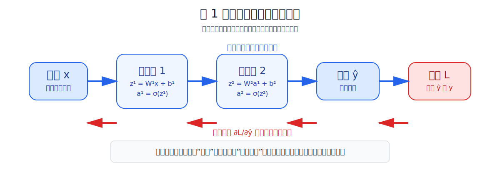

## 反向传播的基本想法：它到底在做什么
反向传播的核心思路是：利用链式法则沿计算图反向递推，而不是对每个参数各自从头求导。前向计算中的中间量因此可以被系统复用，从而避免在不同参数之间重复展开同一段路径。

设整个网络是一个复合函数

$$
L = f^{(L)}(f^{(L-1)}(\cdots f^{(1)}(x)))
$$

如果对每个参数单独展开导数，通常会出现大量重复计算，因为不同参数通往输出的路径会共享大量中间子表达式。反向传播的做法是把这些共享部分集中复用：每个节点只需要结合两类信息，一类是该节点对应操作的局部导数，另一类是从后续节点传回来的上游梯度。两者相乘后继续向前传递，就能把全局损失对局部变量和参数的影响逐步展开。

因此，反向传播更准确的表述不是“误差往回传”，而是“损失敏感度沿图反向累积”。它回答的问题也不是“模型错了多少”，而是“如果这个节点或参数发生微小变化，最终损失会怎样变化”。这正是梯度在优化中的含义。

从计算角度看，反向传播主要解决的是效率问题。与数值差分相比，后者在有 $n$ 个参数时通常至少需要 $n+1$ 次前向计算才能近似整梯度；与符号微分相比，后者容易出现表达式膨胀；与前向模式自动微分（Forward Mode Automatic Differentiation，下文简称前向模式 AD）相比，当函数形状是 $f: \mathbb{R}^n \to \mathbb{R}$ 且 $n$ 很大时，前向模式 AD 往往要按输入维度重复传播。而神经网络训练通常正是“参数很多、输出通常是一个标量损失”的场景，因此反向模式 AD 在这类问题上更合适。自动微分文献通常将这一点表述为：对标量输出问题，反向模式 AD 求整梯度的代价通常只比原函数求值大一个常数倍，而不会随参数个数线性放大。

下面两张图分别对应这一节中最容易混淆的两件事：第一，链式法则怎样沿计算图展开；第二，为什么在 $f: \mathbb{R}^n \to \mathbb{R}$ 这样的训练场景里，反向模式在成本上通常优于数值差分和前向模式。

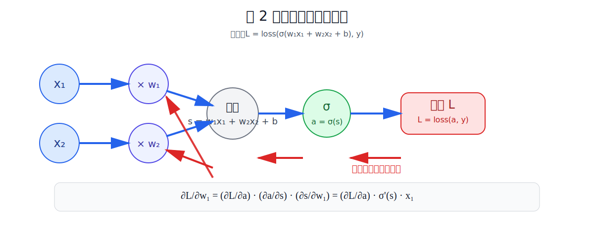

图 2 的关键在于“共享路径”这一概念。损失对某个参数的影响，不是孤立地重新计算一遍，而是沿着它通往输出的路径，把每个节点的局部导数依次相乘。由于多个参数共享大量后续路径，这些中间结果可以复用。

而下面这张图进一步展示了这种共享复用在计算成本上的直接优势。

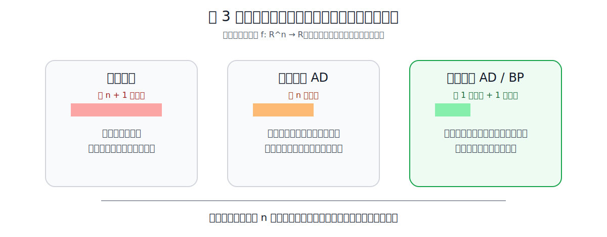

## 数学原理：链式法则、计算图与反向模式自动微分
反向传播的数学基础是链式法则，但在机器学习里，它不是教科书上一行复合函数求导公式，而是把链式法则系统地施加到整张计算图上的算法过程。

### 用计算图表述反向传播
计算图可以看成一个有向无环图，其中每个节点表示一个中间变量或局部算子的输出，每条边表示一个变量被后续操作使用。若把图中的节点记为 $v_1, v_2, \ldots, v_N$，并假设每个非输入节点都由其父节点通过一个局部函数生成，那么可以写成

$$
v_j = f_j(\mathrm{Pa}(j))
$$

其中 $\mathrm{Pa}(j)$ 表示节点 $v_j$ 的父节点集合。前向传播对应的是按拓扑顺序依次计算每个节点的数值；反向传播对应的是在损失节点 $L$ 已知的前提下，反向计算每个节点对最终损失的敏感度。从自动微分的角度看，这样一张图也可以理解为对求值过程的记录，也可以视为一种计算轨迹（computation trace）；在较早的文献里，它也常被称为 Wengert list。从更贴近工程实现的角度看，这样的计算图也可以暂时想成一张“实值电路”（real-valued circuit）：每个局部算子都像一个“门”，前向时负责算出自己的输出，反向时则只需要知道一个局部事实——它的输出对各输入的局部导数是什么。这样一来，反向传播就不必把整张图一次性整体求导，而是变成沿图逆向传递“上游梯度 × 局部梯度”的局部通信过程。

这个抽象记号背后，其实对应着很具体的表达式拆解。例如，对 $e = (a+b)(b+1)$ 这样一个最小例子，只要引入中间变量 $c = a+b$ 与 $d = b+1$，就得到一张很典型的标量计算图：$a,b$ 指向 $c$，$b$ 也指向 $d$，最后 $c,d$ 再共同指向 $e$。前向阶段沿箭头依次算出节点数值；反向阶段则沿相反方向计算“损失对各节点有多敏感”。

Colah 那篇经典文章指出，可以把链式法则拆成三个层次来看：先看每条边上的局部导数，再看单条路径上的局部导数连乘，最后看多条路径的贡献求和。于是，对 $a$ 到 $e$ 这种只有一条路径的关系，梯度就是沿路径连乘；而对 $b$ 到 $e$ 这种同时经过 $c$ 与 $d$ 两条路径的关系，总梯度就必须把两条路径的贡献相加。这样一来，式子里的求和号就不再只是形式上的“多变量链式法则”，而是被计算图直接可视化成了“路径上连乘，多条路径再求和”。

更进一步地说，自动微分关心的不是源代码里理论上可能出现的所有符号分支，而是给定一次具体输入后程序实际执行出来的那条计算轨迹。哪怕原始程序包含条件分支与循环，只要某次执行已经落成一条确定的求值路径，自动微分就可以沿这条实际轨迹记录局部操作并应用链式法则。这也是它区别于纯符号微分的重要地方。

如果顺着这条脉络回看文献，那么 Wengert 在 1964 年给出了自动导数求值程序的早期表述，Linnainmaa 在 1970 年把反向模式自动微分的核心思想系统化，而 Griewank 与 Walther 以及 Baydin 等人的后续综述，则把“计算轨迹—局部导数—反向累积”这套语言整理成了今天更熟悉的自动微分叙述。

虽然本文重点是反向传播，但把自动微分放回完整背景里看，还应顺手提一句前向模式 AD。它的一种经典实现工具是对偶数（dual numbers）：若写成 $a + b\epsilon$，并满足 $\epsilon^2 = 0$，那么由泰勒展开可得 $f(a + b\epsilon) = f(a) + b f'(a)\epsilon$。也就是说，在对偶数上执行一次前向计算，就可以同时得到函数值与某个输入方向上的导数信息。只是当输入维度很大、目标又是标量损失时，前向模式往往需要按输入方向重复传播，因此神经网络训练通常仍更偏向反向模式 AD。

在自动微分里，常把

$$
\bar v_i = \frac{\partial L}{\partial v_i}
$$

称为节点 $v_i$ 的伴随量（adjoint）或敏感度（sensitivity），也可以更直观地理解为损失对该节点的敏感度。对输出节点本身，有边界条件

$$
\bar L = \frac{\partial L}{\partial L} = 1
$$

#### 先从标量计算图开始
如果暂时把所有节点都看成标量，那么每条边上的局部导数也是标量。若某个节点 $v_i$ 会被多个后继节点同时使用，那么它对最终损失的影响需要把所有下游路径的贡献加总起来。因此，反向传播在一般标量计算图上的递推公式可以写成

$$
\bar v_i = \sum_{j \in \mathrm{Ch}(i)} \bar v_j \frac{\partial v_j}{\partial v_i}
$$

其中 $\mathrm{Ch}(i)$ 表示把 $v_i$ 当作输入的子节点集合。这个公式很关键，因为它说明反向传播本质上是“先按链式法则展开，再按共享子路径做动态规划”。每个节点只需要汇总其所有直接后继的贡献，而不必为每一条完整路径单独计算一遍。换句话说，反向传播并不是先把所有从 $v_i$ 到 $L$ 的完整路径全部枚举出来，再在终点统一求和；它更高效的做法，是在共享节点处先把已经出现的后缀贡献累积起来，然后继续向前递推。

一个最小的标量例子是：先令 $q=x+y$，再令 $s=qz$，最后令 $L=\ell(s)$。反向阶段从 $\bar s = \partial L / \partial s$ 开始，有

$$
\bar q = \bar s \cdot z, \qquad
\bar z = \bar s \cdot q
$$

而由于 $q=x+y$，于是又有

$$
\bar x = \bar q, \qquad
\bar y = \bar q
$$

这个例子说明了两件事。第一，标量情形中的反向传播就是链式法则的递推实现。第二，一旦某个中间量如 $\bar q$ 已经算出，它就可以被多个下游梯度公式复用，而不必重复展开全部路径。再往前走一步，还可以看到几种在更复杂计算图里反复出现的局部模式：加法门会把上游梯度原样分发给各输入，因此更像梯度的“分发器”；取最大值门只会把梯度路由到前向阶段取得最大值的那条分支，因此更像“路由器”；乘法门则会把梯度乘上另一个输入的当前数值，因此更像一种“交换缩放器”。这第三种情形尤其值得注意：若两个输入尺度悬殊，那么较小的那个输入可能收到较大的梯度，而较大的那个输入反而只收到较小的梯度。也正因为如此，输入缩放、归一化等预处理并不只是数值整洁问题，它们会直接影响训练时梯度的尺度。

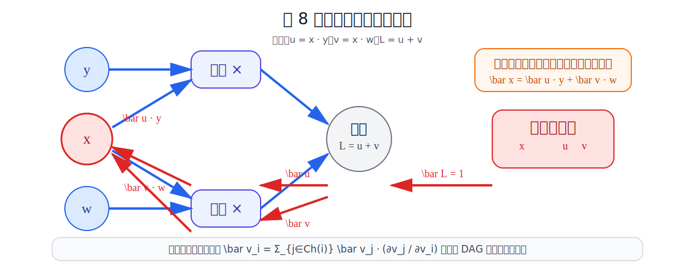

如果把“共享路径”这件事再往前推一步，那么更典型的图形其实是共享节点本身。图 8 画的是同一个输入 $x$ 同时流向两条下游分支的情形。前向阶段看上去只是同一个值被重复使用；反向阶段则必须把两条分支返回的贡献相加，才能得到 $x$ 的总敏感度。这正是一般递推公式里求和号的来源，也是很多自动微分实现里梯度更新要写成累加而不是覆盖的根本原因。

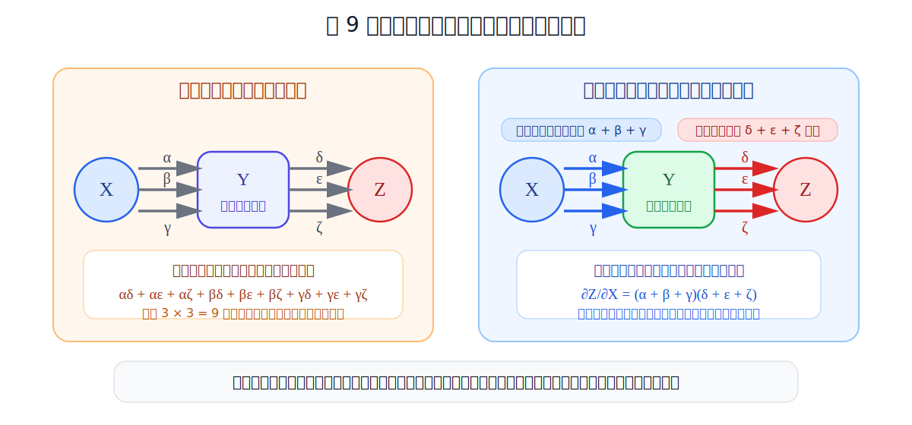

如果再把图做大一点，就会看到为什么反向传播必须这样组织计算。图 9 左侧表示“若把所有完整路径都逐条展开”，项数会随着前缀与后缀选择数相乘而迅速膨胀；右侧则表示反向传播真正做的事：不是沿每条完整路径各算一遍，而是在共享节点处先把可复用的局部贡献累积起来，再继续向前传递。也正因为如此，反向传播常被说成是在计算图上做动态规划：它复用的不是某一条完整路径，而是许多路径共享的中间子问题。

#### 从标量图到向量图与矩阵图
神经网络中的节点通常不是标量，而是向量、矩阵或更高阶张量。此时，局部导数不再是单个数，而是一个局部线性映射。若把局部算子写成 $y = f(x)$，那么它的一阶导数可以用局部 Jacobian 表示：

$$
J_f(x) = \frac{\partial \, \mathrm{vec}(y)}{\partial \, \mathrm{vec}(x)}
$$

这里用 $\mathrm{vec}(\cdot)$ 只是为了把张量统一看成长向量，从而把 Jacobian 写成标准矩阵形式。按照常见约定，这个矩阵的行对应输出分量，列对应输入分量。直观地说，$J_f(x)$ 描述的是：输入 $x$ 的微小变化，会如何线性地影响输出 $y$ 的微小变化。还需要注意，$J_f(x)$ 一般本身就是 $x$ 的函数，而不是预先固定的常数矩阵；只有在线性算子等特殊情形下，它才与当前输入无关。

若采用列向量形式来写梯度，那么从上游梯度 $\bar y = \partial L / \partial y$ 回传到输入侧时，可以写成

$$
\bar x = J_f(x)^T \bar y
$$

若采用行向量记号，也可以等价地写成 $\bar x^T = \bar y^T J_f(x)$。这一步就是反向模式自动微分中的向量-Jacobian 乘积（vector-Jacobian product，VJP）。与之对应，如果从输入侧传播一个方向向量 $r$，得到 $J_f(x) r$，那就是 Jacobian-向量乘积（Jacobian-vector product，JVP）。需要注意的是，现代框架通常并不会显式构造完整的 $J_f(x)$，而是把它当作局部线性算子，直接实现“给定方向向量或上游梯度，返回相应 JVP 或 VJP 结果”的规则；在神经网络训练里，更常用的仍是 VJP。

也可以把这件事理解为 Jacobian 的两种访问方式：前向模式更像按输入方向逐列得到 $J_f(x)$ 的信息，反向模式更像按输出敏感度逐行得到它的转置作用。于是，对 $f: \mathbb{R}^n \to \mathbb{R}^m$ 而言，若更关心全部输入对少量输出的影响，反向模式通常更合算；若更关心少量输入方向对大量输出的影响，前向模式往往更自然。

这一步看上去像是从标量导数跳到了矩阵运算，但规则本身并没有改变。下面这张图展示的，正是这种从局部导数到局部线性映射的过渡：

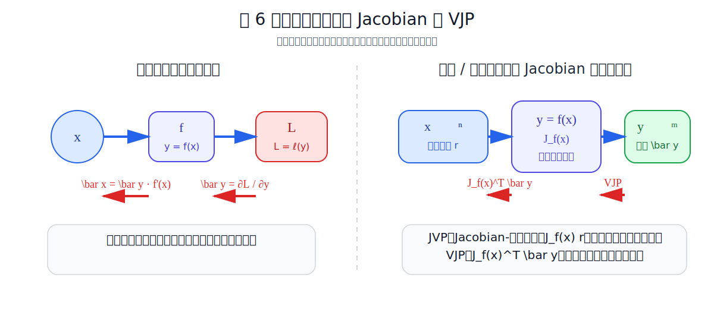

图 10 想强调的不是又多了一套新规则，而是规则本身没有变：标量图里沿边传播的是局部导数，向量图和矩阵图里沿边传播的是局部线性映射。于是，前向模式更像是把一个输入侧方向往前推成 $Jr$，反向模式则是把一个输出侧敏感度往回拉成 $J^T \bar y$。从这个角度看，VJP 只是标量链式法则在线性代数语言里的自然推广。

于是，标量图中的“导数连乘”在矩阵图里就自然推广成了“局部 Jacobian 的链式组合”。若有一串复合映射

$$
x_1 = g_1(x_0), \quad x_2 = g_2(x_1), \quad \ldots, \quad x_K = g_K(x_{K-1})
$$

那么反向阶段满足

$$
\bar x_{k-1} = J_{g_k}(x_{k-1})^T \bar x_k, \qquad k = K, K-1, \ldots, 1
$$

从而有

$$
\bar x_0 = J_{g_1}(x_0)^T J_{g_2}(x_1)^T \cdots J_{g_K}(x_{K-1})^T \bar x_K
$$

这就是“从标量图到矩阵图”的核心过渡：链式法则并没有改变，只是局部因子从标量导数换成了 Jacobian 或其转置作用。如果最终输出是标量损失，那么 $\bar x_K$ 就是损失对最后一个中间量的梯度；若把最后一个节点本身记成 $L$，则仍有 $\bar L = 1$ 这一边界条件。

#### 局部算子、Jacobian 与模块化反传
一旦用计算图来组织推导，就可以把整个网络理解为许多局部算子的组合。在线性层、逐元素激活、广播加法、归一化、损失函数等模块中，前向传播负责计算输出值，反向传播则只需要回答一个局部问题：给定上游梯度，怎样把它通过当前算子的 Jacobian 映射回输入和参数空间。

这里还有一层常被工程实现直接利用的直觉：理论上反向传播可以写成 Jacobian 与上游梯度的乘法，但实际框架几乎从不显式构造这些 Jacobian。原因一方面在于它们往往非常稀疏，显式写出既浪费内存，也会引入大量对零元素的无效计算；另一方面，在许多常见算子里，这个乘法本身可以直接化简成更紧凑的局部 VJP，例如线性层的权重梯度就是上游梯度与输入激活的外积。换句话说，现代实现真正保存和复用的不是“完整 Jacobian”，而是前向传播中的中间量与每个模块的局部反传规则。

以三个常见局部算子为例。对线性层

$$
z = Wa + b
$$

其局部反传可写成

$$
\bar a = W^T \bar z, \qquad
\frac{\partial L}{\partial W} = \bar z a^T, \qquad
\frac{\partial L}{\partial b} = \bar z
$$

若采用小批量记号，这里对 $b$ 的梯度通常还需要沿批次维求和；其原因可以看成下面广播加法的直接特例。对逐元素激活

$$
a = \sigma(z)
$$

则有

$$
\bar z = \bar a \odot \sigma'(z)
$$

这里 $\odot$ 表示逐元素乘积（Hadamard product）。若把例子具体化到 sigmoid，那么有 $\sigma'(z)=\sigma(z)(1-\sigma(z))$，而且它在 $z=0$ 处达到最大值 0.25。这意味着一旦很多层都处在局部导数偏小的区间，梯度在反向连乘时就会迅速衰减；相比之下，ReLU 在激活区间内的局部导数恒为 1，因此通常更有利于把有用梯度传到更前面的层。对广播加法 $y = x + b$，如果 $x \in \mathbb{R}^{B \times d}$、$b \in \mathbb{R}^{d}$，那么前向可以写成

$$
y_{ik} = x_{ik} + b_k, \qquad i=1,\ldots,B,\; k=1,\ldots,d
$$

这时 $b$ 会沿批次维被广播到每个样本上。表面上看像是复制了 $B$ 份偏置，但在计算图里它仍然是同一个参数向量被重复使用。于是反向传播时，对 $x$ 的梯度是逐元素直接传递的，而对每个偏置分量 $b_k$ 的梯度则要把所有样本路径的贡献累加起来：

$$
\frac{\partial L}{\partial b_k} = \sum_{i=1}^{B} \frac{\partial L}{\partial y_{ik}}, \qquad
\frac{\partial L}{\partial b} = \sum_{i=1}^{B} \bar y_{i,:}
$$

因此，在线性层的小批量实现里，偏置梯度之所以常常需要沿批次维求和，并不是额外规定，而只是共享参数在广播场景下应用一般计算图递推公式后的自然结果：同一个节点若被多个后继同时使用，其对损失的总敏感度就必须把这些分支的贡献全部相加。图 11 将这一共享结构单独展开，以便把“参数共享”和“梯度归约”之间的关系看得更直接。虽然不同局部算子的前向形式各不相同，但它们的反向形式都可以统一地理解为局部 Jacobian 的转置作用。

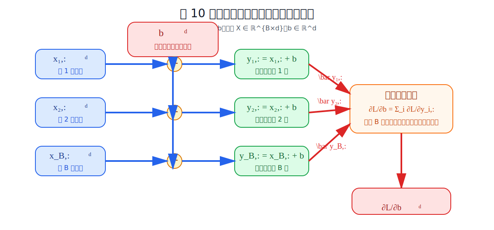

如图 11 所示，前向阶段并不是产生了 $B$ 份彼此独立的偏置，而是同一个参数向量 $b$ 被整批样本共享；反向阶段来自每一行输出的上游梯度都对这同一个参数产生贡献，因此最后必须沿批次维做归约。在线性层里常见的偏置梯度求和，正是这种共享节点结构在小批量张量记号下的直接表现。

这也是所谓模块化反传的含义：复杂网络并不是一次性对整张图写出一个巨大 Jacobian，再整体相乘；更常见的实现是让每个模块各自保存前向所需的中间量，并提供自己的局部反传规则。整张网络的反向传播，就是这些局部规则按照逆拓扑顺序被依次调用的结果。从数学上看，这与显式写出全局 Jacobian 完全等价；从工程上看，这种分解更利于复用、实现和内存管理。

这里还可以补上一条很实用的 staged computation 经验：前向实现时，最好有意识地把复杂表达式拆成若干简单中间量，并把反向所需的量缓存下来。这样做不是书写习惯上的小优化，而是为了让 backward 变成一串机械化的局部规则调用。例如，若把 sigmoid 看成一个局部门，那么它的反向只需复用前向阶段算出的 $\sigma(z)$，再计算 $\sigma(z)(1-\sigma(z))$；若把它继续拆成指数、加法与除法等更细的“门”，本质上也只是沿着一条更长的局部链条逐步回传。换句话说，现代框架里的 cache，不只是为了省一次重复计算，更是在代码层面对链式法则做结构化组织。

如果想把这一节对应到更直接的参考材料，那么 Wengert (1964) 适合用来理解计算轨迹的早期形式，Linnainmaa (1970) 适合用来追溯反向模式自动微分的算法骨架，Griewank 与 Walther (2008) 以及 Baydin 等人 (2018) 则更适合用来把计算图（computation graph）、局部 Jacobian、JVP/VJP 与模块化反传放回同一套现代语言中阅读。

从算法流程上看，计算图视角下的反向传播通常包含四步。第一，按拓扑顺序完成前向计算，并缓存后续求导所需的中间量。第二，在损失节点处初始化 $\bar L = 1$。第三，按逆拓扑顺序遍历计算图，用局部导数或局部 Jacobian 的转置作用更新各节点的伴随量（adjoint）。第四，当某个节点本身就是参数时，它对应的伴随量（adjoint）就是该参数的梯度。

用一个最小例子可以把这件事写得更具体。设单神经元满足

$$
s = w_1 x_1 + w_2 x_2 + b, \quad a = \sigma(s), \quad L = \ell(a, y)
$$

则这张计算图的节点可以写成 $x_1, x_2, w_1, w_2, b, s, a, L$。前向阶段先计算 $s$，再计算激活 $a$，最后得到损失 $L$。反向阶段则按相反方向进行：

$$
\bar L = 1
$$

$$
\bar a = \frac{\partial L}{\partial a}
$$

$$
\bar s = \bar a \cdot \sigma'(s)
$$

$$
\bar w_1 = \bar s \cdot x_1, \quad
\bar w_2 = \bar s \cdot x_2, \quad
\bar b = \bar s
$$

$$
\bar x_1 = \bar s \cdot w_1, \quad
\bar x_2 = \bar s \cdot w_2
$$

这个例子既可以当作标量图的完整演示，也可以看成更大矩阵图中的最小局部模块。它说明了两点。第一，同一个中间量 $\bar s$ 会被多个梯度公式复用，因此无需重复计算。第二，反向传播不仅能求参数梯度，也能求任意中间变量和输入变量的敏感度，这也是现代自动微分框架能够支持更一般可微程序的原因。

### 从通用计算图回到前馈网络的逐层公式
前述计算图、局部 Jacobian 与 VJP 的讨论，为理解反向传播提供了通用框架。接下来把这套框架具体落到神经网络中最常见的形式：多层前馈网络的逐层公式。

对一个典型的前馈网络，第 $l$ 层可以写成

$$
z^{(l)} = W^{(l)} a^{(l-1)} + b^{(l)}, \quad a^{(l)} = \sigma(z^{(l)})
$$

最终损失是 $L(a^{(L)}, y)$。定义误差项

$$
\delta^{(l)} = \frac{\partial L}{\partial z^{(l)}}
$$

则输出层有

$$
\delta^{(L)} = \frac{\partial L}{\partial a^{(L)}} \odot \sigma'(z^{(L)})
$$

而隐藏层满足递推关系

$$
\delta^{(l)} = \left(W^{(l+1)}\right)^T \delta^{(l+1)} \odot \sigma'(z^{(l)})
$$

一旦 $\delta^{(l)}$ 已知，参数梯度可写成

$$
\frac{\partial L}{\partial W^{(l)}} = \delta^{(l)} (a^{(l-1)})^T, \quad
\frac{\partial L}{\partial b^{(l)}} = \delta^{(l)}
$$

这一组公式可以看作上一小节通用计算图公式在“线性算子 + 逐元素非线性”这一类局部模块上的具体化。$\delta^{(l)}$ 本质上就是节点 $z^{(l)}$ 的伴随量（adjoint）；矩阵转置项 $\left(W^{(l+1)}\right)^T$ 对应的是上层敏感度经由局部 Jacobian 转置映射回当前层；而参数梯度公式则对应线性层这一局部算子的反传结果。在实际框架里，开发者通常不会显式构造完整 Jacobian，而是直接实现与之等价的 VJP，或局部反向计算。

如果想把上面的过程压缩到最小可视化例子里，单神经元仍然是合适的入口。它能直接展示一个参数的梯度如何由“损失对输出的敏感度”“激活函数的局部导数”和“该参数对应的输入”三部分相乘得到，同时也能看出更大网络只是把这种局部规则沿图重复组合起来。

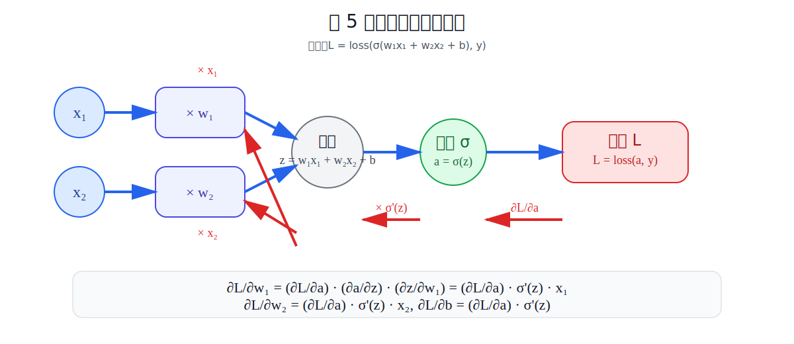

单神经元并不是与多层网络不同的另一套原理，它只是更大计算图的最小局部片段。多层网络所做的事情，本质上就是把这种局部链式法则沿整个图系统化地重复下去。

如果把它提升到更一般的自动微分语言里，反向传播可以看作向量-Jacobian 乘积（vector-Jacobian product，VJP）。对函数 $f: \mathbb{R}^n \to \mathbb{R}^m$，前向模式 AD 更适合计算 Jacobian-向量乘积（Jacobian-vector product，JVP），反向模式 AD 更适合计算 VJP。当 $m$ 很小、尤其 $m=1$ 时，反向模式 AD 一次回传就能得到关于全部输入变量的梯度。这也是深度学习框架普遍以内建反向模式自动微分为核心的主要原因。

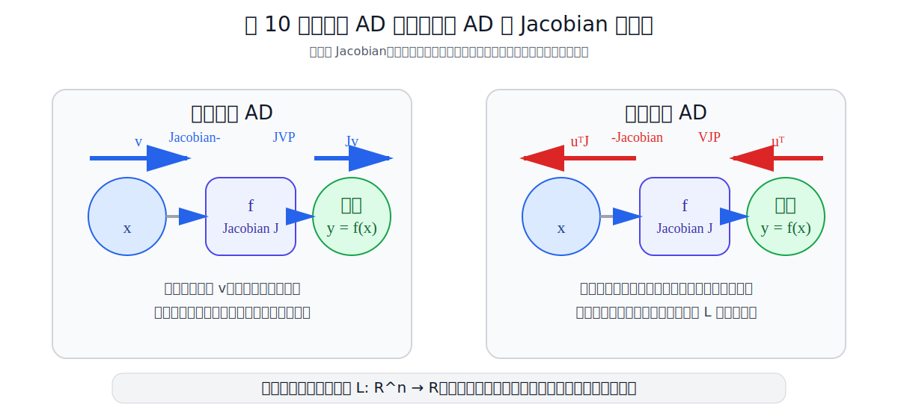

图 7 的核心，是区分“谁在被传播”。前向模式 AD 从输入侧携带一个方向向量 $v$ 往前走，得到的是 $Jv$；反向模式 AD 从输出侧携带一个敏感度向量 $u^T$ 往回走，得到的是 $u^T J$。如果最终只有一个标量损失 $L$，那么这个 $u^T$ 可以看成 1，于是一次反向传播就能得到 $\partial L / \partial \theta$ 对所有参数的梯度。

这里还需要强调一个经常被忽略的点：反向传播的高效不仅来自“使用了链式法则”，还来自它把链式法则组织成了可复用的递推过程。所有共享中间项通常只需算一次、存一次、用多次，因此计算复杂度通常与图中基本操作数同阶，而不会因为参数个数巨大就退化为逐参数重复求导。相应的代价是需要缓存前向过程中的中间激活，因此它在时间上高效，在内存上则需要额外开销。这也是 checkpointing、重计算和内存优化技术的重要背景。

不过，计算上高效并不意味着数值上总是容易。反向传播在深层网络中的典型问题之一是梯度消失：如果多层的局部导数都小于 1，那么这些项在反向过程中不断连乘，越靠前的层接收到的梯度就越弱。早期深层 sigmoid 或 tanh 网络训练困难，与这一机制有直接关系。

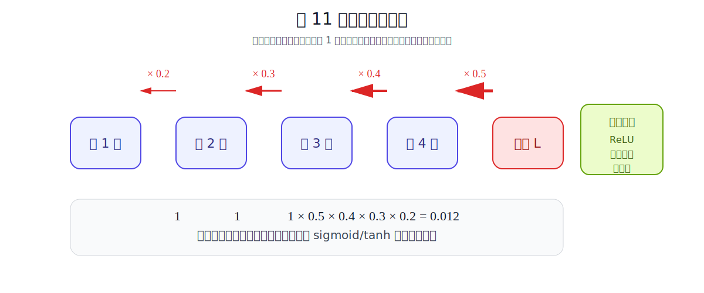

这张图强调的是连乘结构本身。只要链路足够深，而且中间许多导数偏小，梯度就可能呈指数级衰减。后来 ReLU、残差连接、归一化和更合适的初始化之所以重要，很大程度上都与“让有用梯度更稳定地传播到更早层”有关。

如果说图 2 强调的是“沿路径相乘”，那么下面这张图强调的就是“责任如何逐层分解”——这正是信用分配（credit assignment）问题的具体展开：每一层虽然并不知道整个网络的全部细节，但它只要接收上游梯度，再乘上自己的局部导数，就能得到当前层的更新信号。

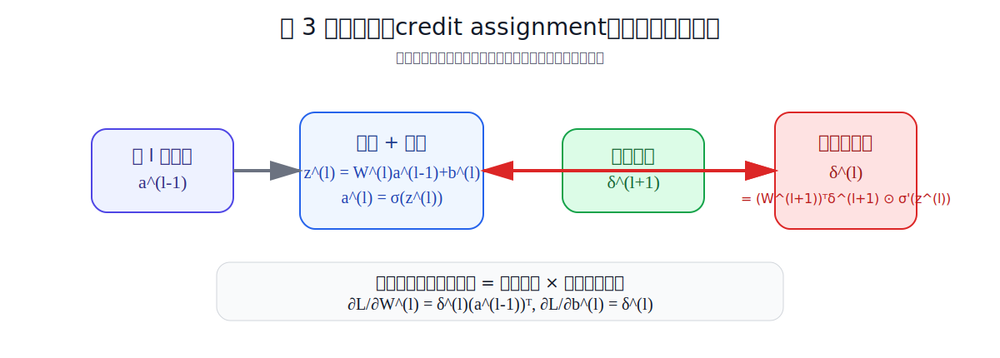

这也是为什么很多教材都把 $\delta^{(l)}$ 视为反向传播中的中心量。它不是一个模糊的“误差信号”，而是“如果当前层预激活发生微小变化，最终损失会如何变化”的定量描述。参数梯度能够立即写成 $\partial L / \partial W^{(l)} = \delta^{(l)} (a^{(l-1)})^T$，正是因为信用分配（credit assignment）已经被压缩进了 $\delta^{(l)}$ 这一量中。

如果把这一逐层写法再向前推进一步，同一个反向传播算法还可以在前馈网络语境下被写成两条互补的正式推导路径：一种从教材里更常见的 $\delta$ 递推公式出发，另一种从伴随量（adjoint）语言出发。

#### 前馈网络中的两种常见而互补的矩阵推导：$\delta$ 递推与伴随递推（adjoint recursion）
如果把上面的公式与更具体的推导材料对照来看，Sudeep Raja 的两篇文章恰好代表了反向传播的两条经典路径。其一更接近神经网络教材常见的“按层写出误差项，再把它矩阵化”的推导；其二则把同一过程放回约束优化、拉格朗日乘子与伴随量（adjoint）的语言中。两条路在数学上给出的是同一个反向传播算法，但它们强调的对象、起点和解释重点并不相同。

##### 推导一：从输出层误差项出发的 $\delta$ 递推
第一种写法的起点是一个具体的多层前馈网络，例如

$$
x_l = f_l(W_l x_{l-1})
$$

并以标量损失（例如平方损失）作为目标。此时最直接的做法，是把每一层预激活对最终损失的导数定义成误差项 $\delta_l$，也就是

$$
\delta_l = \frac{\partial L}{\partial (W_l x_{l-1})}
$$

这样一来，输出层的公式可以直接由损失函数和最后一层非线性得到；若以平方损失为例，就有

$$
\delta_L = (x_L - t) \odot f_L'(W_L x_{L-1})
$$

而隐藏层只需把上层误差通过权重矩阵转置拉回当前层，再乘上当前层激活函数的局部导数，于是得到

$$
\delta_l = W_{l+1}^T \delta_{l+1} \odot f_l'(W_l x_{l-1})
$$

一旦 $\delta_l$ 已知，参数梯度就立即写成

$$
\frac{\partial L}{\partial W_l} = \delta_l x_{l-1}^T
$$

如果显式写入偏置项，那么还会有 $\partial L / \partial b_l = \delta_l$；若存在 batch 维度，则偏置梯度需要再沿广播维求和。这个推导的优点，是它几乎把“神经网络如何逐层回传更新信号”直接摊开在纸面上：输出层先得到误差，隐藏层再按 $W^T$ 与局部导数逐层递推，最后把参数梯度写成“当前层误差乘以前一层激活”的外积。Sudeep Raja 那篇 2016 年文章的价值，在于它用矩阵形式把这一整套推导收拢起来，避免了大量求和号和下标，使人更容易看清：所谓反向传播，并不是又发明了一套新规则，而只是把广义 delta rule 写成了适合整层并行计算的形式。

##### 推导二：从约束优化与伴随量出发的递推
第二种写法的起点不是直接定义 $\delta_l$，而是把前向传播本身看成一组约束。若写成

$$
x_l = f_l(W_l x_{l-1}), \qquad l = 1, \ldots, L
$$

那么训练问题就可以理解为：在这些层间关系成立的前提下，最小化最终损失 $l(x_L, y)$。于是可以引入拉格朗日乘子，也就是各层的伴随量（adjoint）$\lambda_l$，构造

$$
\mathcal{J} = l(x_L, y) + \sum_{l=1}^{L} \lambda_l^T \bigl(f_l(W_l x_{l-1}) - x_l\bigr)
$$

这时，$\lambda_l$ 描述的是“在当前层状态变量 $x_l$ 处，最终目标对它有多敏感”。对 $x_L$ 求导可得边界条件

$$
\lambda_L = \nabla_{x_L} l(x_L, y)
$$

而对中间层状态变量求导，则得到递推关系

$$
\lambda_l = W_{l+1}^T \bigl(\lambda_{l+1} \odot f'_{l+1}(W_{l+1} x_l)\bigr)
$$

再对参数矩阵求导，就得到

$$
\frac{\partial \mathcal{J}}{\partial W_l} = \bigl(\lambda_l \odot f_l'(W_l x_{l-1})\bigr) x_{l-1}^T
$$

如果现在定义

$$
\delta_l = \lambda_l \odot f_l'(W_l x_{l-1})
$$

就会立刻回到上一种写法中的 $\delta$ 递推和参数梯度公式。也就是说，伴随量（adjoint）视角并没有产生另一种不同的反向传播。

它做的是把同一个算法重新解释成“目标函数对中间状态的敏感度如何沿约束系统反向传播”。这样一来，反向传播就不再只是神经网络教材中的一组技巧性公式，而是直接与最优控制（optimal control）、伴随方法（adjoint method）、反向模式 AD 和 VJP 接上了线。

用这一视角再回看前文的计算图递推公式，就更容易理解为什么局部 Jacobian 的转置作用、上游敏感度的回传和参数梯度的生成，本质上都属于同一个伴随递推（adjoint recursion）过程。

把这两种推导并列起来看，会更清楚它们的分工。$\delta$ 递推更贴近神经网络实现和教材讲授，因为它直接给出了每一层该怎样更新；伴随递推（adjoint recursion）则更贴近一般自动微分和约束优化，因为它强调的是状态变量的敏感度（sensitivity）、局部 Jacobian 转置以及 VJP 的结构。前者适合快速掌握“公式怎么写”，后者适合看清“为什么反向传播不仅能训练神经网络，也能成为更一般可微程序和科学计算中的基础算法”。

## 背后的思想：为什么它不只是一个求导算法
如果只把反向传播理解成“梯度计算程序”，容易忽略它在方法论上的几层含义。

第一，它把学习问题表述为敏感度分析问题。模型不再依赖人工枚举规则，而是依赖损失函数对参数和中间表示的导数来决定更新方向。这样一来，统计建模、数值优化和可微模型可以落到同一套数学框架中。

第二，它展示了全局优化如何通过局部计算实现。每一层只需要本地 Jacobian 和上游梯度，而不必掌握整个网络的全部细节；这些局部计算一旦通过计算图串联起来，就构成了对全局目标函数的有效优化。

第三，它使表示学习在多层模型中具备了可训练性。1986 年的工作之所以重要，并不只是因为它给出了求梯度的公式，还因为它说明隐藏层可以在误差驱动下学习中间表征，而不是由人工显式指定。

第四，它打通了“模型”与“程序”的边界。现代自动微分框架并不只处理传统神经网络层，而是把任何由基本可微操作组成的程序片段都视为可训练对象。这也是可微编程、神经微分方程和部分物理仿真优化任务能够与深度学习方法接轨的基础。

## 历史发展：从控制论到深度学习框架
如果把视线从方法论转向历史脉络，反向传播更适合被理解为多个传统逐步汇流的结果，而不是单一人物突然发明出的算法。

在 1960 年代，最优控制（optimal control）和伴随方法（adjoint method）已经在研究如何沿系统轨迹反向传播灵敏度。Wengert 在 1964 年提出了自动微分的早期形式。到了 1970 年，Seppo Linnainmaa 已经给出现代反向模式自动微分的关键算法思想，后来的自动微分综述通常将其视为反向模式 AD 的重要奠基工作。就“算法骨架”而言，反向传播首先属于自动微分史的一部分，而不只是神经网络史的一部分。

Paul Werbos 的贡献更接近于把这一骨架明确连接到神经网络学习。1974 年的博士论文《Beyond Regression》通常被视为较早把反向传播思想用于多层网络训练的重要来源之一。不过在历史细节上，部分学术史材料会强调 Werbos 在 1982 年对这一联系的表述更清楚。因此，更稳妥的说法是：Werbos 是较早把反向模式微分明确引向神经网络学习的人之一。

1986 年 Rumelhart、Hinton 和 Williams 在 *Nature* 发表的《Learning representations by back-propagating errors》，通常被视为反向传播进入现代 AI 核心叙事的重要节点。其意义不主要在于时间上最早，而在于它同时给出了清楚的算法描述、展示了多层网络的可训练性，并强调了隐藏层表征学习的作用。这篇工作推动了 AI 社区重新评估多层网络方法的研究价值。

此后，反向传播经历了一个并不完全平滑的发展过程。1990 年代它在卷积网络等方向持续推进，但更深层模型的训练仍受到算力、数据规模以及梯度消失等因素限制。到 2000 年代中后期，随着更好的初始化方法、ReLU、归一化、残差结构、更强的硬件与更大规模数据集出现，反向传播在深层模型中的实际效果显著改善。今天，无论是在 PyTorch 中调用 `backward()`，还是在 JAX 中调用 `grad()`，其底层仍然可以归结为“先建立计算图，再执行反向模式自动微分”这一基本框架。

## 建议优先阅读的 5 篇论文或文章
如果希望在有限时间内建立较完整的理解，可以把阅读目标分成四类：原始里程碑、历史梳理、数学解释和直觉化材料。下面这 5 篇材料的覆盖面相对均衡。

| 阅读顺序建议 | 文献 | 纳入理由 |
|---|---|---|
| 1 | Rumelhart, Hinton, Williams (1986), *Learning representations by back-propagating errors* | 这篇论文通常被视为反向传播进入现代 AI 核心叙事的重要文献，适合用来理解隐藏层表征学习在当时为何受到重视。 |
| 2 | Paul Werbos (1974), *Beyond Regression: New Tools for Prediction and Analysis in the Behavioral Sciences* | 这篇论文常被引用为较早把反向传播思路连接到神经网络训练的来源之一，有助于理解该方向的早期背景。 |
| 3 | Andreas Griewank, *Who Invented the Reverse Mode of Differentiation?* | 这篇历史综述有助于区分 Linnainmaa、Werbos 与后续神经网络文献之间的关系。 |
| 4 | MIT Vision Book, Chapter 14, *Backpropagation* | 这一章节对计算图、局部导数与模块化求导过程给出了较清晰的数学说明。 |
| 5 | 3Blue1Brown, *What is backpropagation really doing?* | 这份材料更适合建立直觉，再与正式公式对应起来阅读。 |

如果还想补一个“现代框架视角”的入口，可以先看 JAX 或 Dive into Deep Learning 关于自动微分的章节，再配合 George Assaad 于 2025 年写的 *Everything You Need to Know About Backpropagation*。前两者适合建立自动微分接口层面的基本认识，Assaad 的文章则进一步把“不必显式构造 Jacobian”“线性层 VJP 的外积写法”以及 softmax-cross-entropy 梯度的实现视角串到 JAX `custom_vjp` 的代码框架里。

如果你更喜欢课程讲义式的材料，那么 Hinton 在 Coursera 课程中的 *The Ups and Downs of Backpropagation* 也值得顺手读一遍。它的价值不在于提供最新的自动微分语言，而在于用更经典的神经网络教学口吻把信用分配（credit assignment）、Sigmoid 下的 `δ` 递推、学习率与初始化等实践问题串起来，适合作为 1986 年论文与现代框架叙述之间的一座桥。

如果你当前最关心的是本文新增的“计算图”部分，那么更直接的补充顺序可以是：先看 Wengert (1964) 与 Linnainmaa (1970) 了解计算轨迹（computation trace）与反向模式的历史源头，再看 Griewank 与 Walther 以及 Baydin 等人的系统化整理，最后回到现代框架文档，把这些概念和实际自动微分接口对上。

如果你想把“计算图上的链式法则到底怎样可视化”这件事看得更直观，那么 Christopher Olah 的 *Calculus on Computational Graphs: Backpropagation* 也很值得顺手读一遍。它特别适合拿来理解三件事：为什么边上的局部导数会沿路径连乘，为什么多条路径的贡献必须求和，以及为什么共享节点会自然导向反向传播里的局部累积与动态规划。

如果你想把“自动微分本身”作为一个更独立的话题再读一遍，那么 Jingnan Shi 的 *Automatic Differentiation: Forward and Reverse* 也值得作为补充材料。它的价值不在于替代本文已有的反向传播主线，而在于从更程序化的角度把计算轨迹、前向模式 AD、反向模式 AD、对偶数（dual numbers）以及基于 tape 的实现直觉串到一起，尤其适合在读完本文后回头补齐自动微分的整体视角。

如果你更想把正文里的两条推导路径真正对照着看，那么 Sudeep Raja 的两篇文章值得顺着读：2016 年的 *A Derivation of Backpropagation in Matrix Form* 适合把按层 $\delta$ 递推的矩阵写法一口气理顺，2022 年的 *Yet Another Derivation of Backpropagation in Matrix Form (this time using Adjoints)* 则适合把同一算法放回伴随量（adjoint）、拉格朗日乘子与反向模式 AD 的语言中重新理解。两篇放在一起看，几乎正好对应了本文前面补入的两种推导视角。

## Conclusion
反向传播之所以长期处于 AI 核心方法之列，在于它把复杂可微系统中的信用分配、梯度计算与参数优化统一在同一套可扩展框架中。它在数学上依赖链式法则，在算法上依赖对计算图中共享中间量的复用，在更一般的框架中则可以被视为反向模式自动微分在神经网络训练中的具体实现。

如果把全文进一步压缩成三个结论，大致可以概括为：第一，反向传播的本质不是“误差回传”这一口语化表述，而是对损失梯度的高效计算；第二，它的效率来自计算图上的局部导数递推和共享路径复用，而不只是“会求导”；第三，它的重要性不仅体现在训练神经网络，更体现在它为更广泛的可微建模与可微编程提供了统一的计算基础。

## Limitations
关于反向传播的发明归属，学界与技术社区的常见叙述并不完全一致。对 Linnainmaa、Werbos 与 1986 年 *Nature* 论文之间的关系，不同历史综述在措辞上存在差别，因此本文尽量区分“算法骨架的提出”“与神经网络学习的明确连接”“在 AI 社区中的广泛传播”这几个层面。另外，一些中文技术文章在教学表达上很有帮助，但在历史细节上不能替代原始论文与学术史综述，因此本文主要把它们作为辅助理解材料，而不是关键史料依据。

## References
1. [Rumelhart, Hinton, Williams (1986) - Learning representations by back-propagating errors](https://www.nature.com/articles/323533a0)
2. [Paul Werbos (1974) - Beyond Regression: New Tools for Prediction and Analysis in the Behavioral Sciences](https://gwern.net/doc/ai/nn/1974-werbos.pdf)
3. [Andreas Griewank - Who Invented the Reverse Mode of Differentiation?](https://content.ems.press/assets/public/full-texts/books/251/chapters/online-pdf/978-3-98547-540-7-chapter-4949.pdf)
4. [MIT Vision Book - Backpropagation](https://visionbook.mit.edu/backpropagation.html)
5. [3Blue1Brown - What is backpropagation really doing?](https://www.3blue1brown.com/lessons/backpropagation)
6. [JAX Documentation - Forward- and reverse-mode autodiff in JAX](https://docs.jax.dev/en/latest/jacobian-vector-products.html)
7. [Dive into Deep Learning - Automatic Differentiation](https://d2l.ai/chapter_preliminaries/autograd.html)
8. [Hinton - The Ups and Downs of Backpropagation](https://www.cs.toronto.edu/~hinton/coursera/lecture13/lec13.pdf)
9. [Schmidhuber - Who Invented Backpropagation?](https://people.idsia.ch/~juergen/who-invented-backpropagation.html)
10. [Stanford CS231n Lecture 4 Slides](https://cs231n.stanford.edu/slides/2025/lecture_4.pdf)
11. [Stanford CS224n - Computing Neural Network Gradients](https://web.stanford.edu/class/cs224n/readings/gradient-notes.pdf)
12. [Wengert (1964) - A Simple Automatic Derivative Evaluation Program](https://dl.acm.org/doi/10.1145/355586.364791)
13. [Linnainmaa (1970) - The Representation of the Cumulative Rounding Error of an Algorithm as a Taylor Expansion of the Local Rounding Errors](https://people.idsia.ch/~juergen/linnainmaa1970thesis.pdf)
14. [Griewank, Walther (2008) - Evaluating Derivatives: Principles and Techniques of Algorithmic Differentiation](https://epubs.siam.org/doi/book/10.1137/1.9780898717761)
15. [Baydin, Pearlmutter, Radul, Siskind (2018) - Automatic Differentiation in Machine Learning: a Survey](https://jmlr.org/papers/v18/17-468.html)
16. [Sudeep Raja (2016) - A Derivation of Backpropagation in Matrix Form](https://sudeepraja.github.io/Neural/)
17. [Sudeep Raja (2022) - Yet Another Derivation of Backpropagation in Matrix Form (this time using Adjoints)](https://sudeepraja.github.io/BackpropAdjoints/)
18. [George Assaad (2025) - Everything You Need to Know About Backpropagation](https://0xgeorgeassaad.github.io/blog/2025/backprop/)
19. [Jingnan Shi (2022/2023) - Automatic Differentiation: Forward and Reverse](https://jingnanshi.com/blog/autodiff.html)
20. [Christopher Olah (2015) - Calculus on Computational Graphs: Backpropagation](https://colah.github.io/posts/2015-08-Backprop/)
