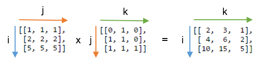
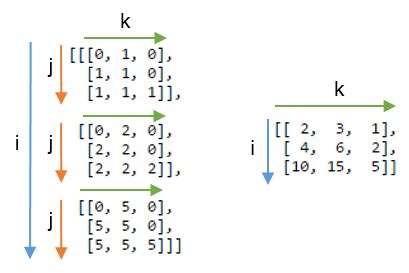

# NumPy `einsum` 基础指南

> 原文：[A basic introduction to NumPy's einsum](https://ajcr.net/Basic-guide-to-einsum/)
> 作者：ajcr
> 发布时间：2015-05-02
> 译文版本：v0.1

## `einsum` 能做什么

`einsum` 函数是 NumPy 的瑰宝之一。得益于它富有表现力的写法和聪明的循环实现，它在速度和内存效率方面往往可以胜过我们熟悉的数组函数。另一方面，理解这套记号可能需要一点时间；面对棘手的问题时，正确应用它有时也需要尝试几次。

Stack Overflow 等网站上有不少关于 `einsum` 的作用和工作方式的问题，因此本文希望作为该函数的基础介绍，帮助你了解如何开始使用它。

使用 `einsum` 函数，我们可以依据[**爱因斯坦求和约定**（Einstein summation convention）](https://en.wikipedia.org/wiki/Einstein_notation)来指定 NumPy 数组上的运算。

假设我们有两个数组 `A` 和 `B`，并且希望：

- 以某种特定方式将 `A` 与 `B` **相乘**，生成一个新的乘积数组，*然后可能还要*
- 沿指定轴对这个新数组**求和**，*和/或*
- 以特定顺序对数组的轴进行**转置**。

那么，`einsum` 很可能可以比 NumPy 的 `multiply`、`sum` 和 `transpose` 函数组合更快、更节省内存地完成这些操作。

作为一个展示该函数能力的小例子，下面有两个数组。我们希望先逐元素相乘，再沿轴 1（数组的行）求和：

```python
A = np.array([0, 1, 2])

B = np.array([[ 0,  1,  2,  3],
              [ 4,  5,  6,  7],
              [ 8,  9, 10, 11]])
```

在 NumPy 中通常怎么做？首先要注意，我们需要重新调整 `A` 的形状，才能让它与 `B` 进行广播（具体来说，`A` 需要变成列向量）。然后，我们将 `0` 与 `B` 的第一行相乘，将 `1` 与第二行相乘，将 `2` 与第三行相乘。这样会得到一个新数组，随后就可以对这三行求和。

合起来写就是：

```python
>>> (A[:, np.newaxis] * B).sum(axis=1)
array([ 0, 22, 76])
```

这当然没问题，但使用 `einsum` 可以做得更好：

```python
>>> np.einsum('i,ij->i', A, B)
array([ 0, 22, 76])
```

为什么更好？简而言之，因为我们完全不需要重新调整 `A` 的形状；更重要的是，相乘过程不会像 `A[:, np.newaxis] * B` 那样创建临时数组。相反，`einsum` 会在处理过程中直接沿各行累加乘积。即使在这个很小的例子中，我测得 `einsum` 也快了大约三倍。

## 如何使用 `einsum`

关键在于：为输入数组的轴，以及我们希望得到的输出数组的轴，选择正确的标记。

这个函数提供了两种方式来完成标记：使用字母组成的字符串，或者使用整数列表。为简单起见，我们只介绍字符串方式（这似乎也是两种方式中更常见的一种）。

矩阵乘法是一个很好的例子，因为它涉及将行与列相乘，再对乘积求和。对于两个二维数组 `A` 和 `B`，可以使用 `np.einsum('ij,jk->ik', A, B)` 完成矩阵乘法。

这个字符串是什么意思？可以把 `'ij,jk->ik'` 沿箭头 `->` 分成两部分。左侧为*输入*数组的轴标记：`'ij'` 标记 `A`，`'jk'` 标记 `B`。字符串右侧则用字母 `'ik'` 标记唯一的*输出*数组的轴。换句话说，我们输入两个二维数组，并希望得到一个新的二维数组。

要相乘的两个数组是：

```python
A = np.array([[1, 1, 1],
              [2, 2, 2],
              [5, 5, 5]])

B = np.array([[0, 1, 0],
              [1, 1, 0],
              [1, 1, 1]])
```

根据这些标记，使用 `np.einsum('ij,jk->ik', A, B)` 完成的矩阵乘法可以表示为：

{: width="90%" }

要理解输出数组是如何计算出来的，请记住下面三条规则：

- **输入数组之间重复出现的字母，表示沿这些轴的值会彼此相乘。乘积会构成输出数组的值。**

  在这个例子中，我们两次使用了字母 `j`：一次用于 `A`，一次用于 `B`。这表示将 `A` 的每一行与 `B` 的每一列相乘。只有当两个数组中由 `j` 标记的轴长度相同（或者其中一个数组的长度为 1）时，这个操作才有效。

- **从输出中省略某个字母，表示沿该轴的值会被求和。**

  这里，`j` 没有出现在输出数组的标记中。省略它就会沿这个轴求和，并且明确地将最终数组的维数减少 1。如果输出签名是 `'ijk'`，我们会得到一个由乘积组成的 `3x3x3` 数组。（如果完全不指定输出标记、只写箭头，我们就会对整个数组求和。）

- **可以按任意顺序返回不参与求和的轴。**

  如果省略箭头 `'->'`，NumPy 会把只出现一次的标记按字母顺序排列（所以实际上 `'ij,jk->ik'` 等价于直接写 `'ij,jk'`）。如果希望控制输出的形状，可以自行选择输出标记的顺序。例如，`'ij,jk->ki'` 会返回矩阵乘法结果的转置（注意输出标记中的 `k` 和 `i` 交换了位置）。

现在应该更容易看出矩阵乘法是如何完成的了。下面这张图展示了：如果我们不对 `j` 轴求和，而是通过写出 `np.einsum('ij,jk->ijk', A, B)` 将它包含在输出中，会得到什么结果；图右侧则展示了对 `j` 轴求和后的结果：

{: width="90%" }

请注意，使用 `np.einsum('ij,jk->ik', A, B)` 时，函数不会先构造一个三维数组再求和，而是直接把和累积到二维数组中。

## 一些简单操作

以上就是开始使用 `einsum` 所需了解的全部内容。掌握如何将不同的轴相乘，再对乘积求和之后，我们就能简洁地表达许多不同的操作。这也让我们可以比较容易地将问题推广到更高维。例如，我们不需要插入新轴或转置数组来让它们正确对齐。

下面有两张表，展示 `einsum` 如何替代各种 NumPy 操作。多动手试试这些写法，有助于熟悉这套记号。

设 `A` 和 `B` 是两个形状兼容的一维数组（也就是说，我们配对的轴长度要么相等，要么其中一个长度为 1）：

| 调用签名 | NumPy 等价写法 | 描述 |
| --- | --- | --- |
| `('i', A)` | `A` | 返回 `A` 的视图 |
| `('i->', A)` | `sum(A)` | 对 `A` 的值求和 |
| `('i,i->i', A, B)` | `A * B` | 对 `A` 和 `B` 逐元素相乘 |
| `('i,i', A, B)` | `inner(A, B)` | `A` 和 `B` 的内积 |
| `('i,j->ij', A, B)` | `outer(A, B)` | `A` 和 `B` 的外积 |

现在设 `A` 和 `B` 是两个形状兼容的二维数组：

| 调用签名 | NumPy 等价写法 | 描述 |
| --- | --- | --- |
| `('ij', A)` | `A` | 返回 `A` 的视图 |
| `('ji', A)` | `A.T` | 返回转置后的视图 |
| `('ii->i', A)` | `diag(A)` | 返回主对角线的视图 |
| `('ii', A)` | `trace(A)` | 对主对角线求和 |
| `('ij->', A)` | `sum(A)` | 对 `A` 的值求和 |
| `('ij->j', A)` | `sum(A, axis=0)` | 沿列向下求和（跨越各行） |
| `('ij->i', A)` | `sum(A, axis=1)` | 沿行水平求和 |
| `('ij,ij->ij', A, B)` | `A * B` | 对 `A` 和 `B` 逐元素相乘 |
| `('ij,ji->ij', A, B)` | `A * B.T` | 对 `A` 和 `B.T` 逐元素相乘 |
| `('ij,jk', A, B)` | `dot(A, B)` | 对 `A` 和 `B` 做矩阵乘法 |
| `('ij,kj->ik', A, B)` | `inner(A, B)` | `A` 和 `B` 的内积 |
| `('ij,kj->ikj', A, B)` | `A[:, None] * B` | 将 `A` 的每一行与 `B` 相乘 |
| `('ij,kl->ijkl', A, B)` | `A[:, :, None, None] * B` | 将 `A` 的每个值与 `B` 相乘 |

处理更多维度时，要记住 `einsum` 支持省略号语法 `'...'`。这提供了一种方便的方式，用来标记那些我们并不特别关心的轴。例如，`np.einsum('...ij,ji->...', a, b)` 会只将 `a` 的最后两个轴与二维数组 `b` 相乘。文档中还有更多例子。

## 需要注意的一些细节

下面是使用这个函数时需要留意的几点。

`einsum` [在求和时不会提升数据类型](http://stackoverflow.com/a/18366008/3923281)。如果使用的是取值范围比较有限的数据类型，可能会得到意料之外的结果：

```python
>>> a = np.ones(300, dtype=np.int8)
>>> np.sum(a) # 正确结果
300
>>> np.einsum('i->', a) # 产生错误结果
44
```

此外，`einsum` [可能不会按预期顺序排列轴](http://stackoverflow.com/a/28233465/3923281)。文档强调可以使用 `np.einsum('ji', M)` 来转置二维数组。对于三维数组，如果看到 `np.einsum('kij', M)`，你可能会理所当然地认为它会把最后一个轴移到第一位，并将前两个轴依次后移。实际上，`einsum` 会通过按字母顺序重新排列标记来创建自己的输出标记。因此，`'kij'` 会变成 `'kij->ijk'`，结果更像是执行了一个逆置换。

最后，`einsum` 并不总是 NumPy 中最快的选择。`dot` 和 `inner` 等函数通常会链接到速度极快的 BLAS 例程，这些例程可能胜过 `einsum`，因此绝对不应该忘记它们。`tensordot` 函数也值得拿来比较速度。如果仔细搜索，你会找到一些文章，专门展示 `einsum` 速度似乎较慢的情况，尤其是在同时处理多个输入数组时（例如[这个 GitHub issue](https://github.com/numpy/numpy/issues/5366)）。

## 历史说明与链接

`einsum` 函数由 [Mark Wiebe](https://github.com/mwiebe) 编写。这里有一封 NumPy 邮件列表中的[讨论串](https://mail.python.org/pipermail/numpy-discussion/2011-January/054586.html)，它宣布了该函数的诞生，随后还讨论了将它引入这个库的动机。2011 年，该函数作为 NumPy 1.6.0 的一部分加入 NumPy。

下面是三个可能对你有帮助的链接：

- [`einsum` 官方文档](http://docs.scipy.org/doc/numpy-1.10.0/reference/generated/numpy.einsum.html)
- GitHub 上的 [`einsum` 源码](https://github.com/numpy/numpy/blob/master/numpy/core/src/multiarray/einsum.c.src)
- Stack Overflow 上的 [`einsum`](http://stackoverflow.com/questions/tagged/numpy-einsum)
