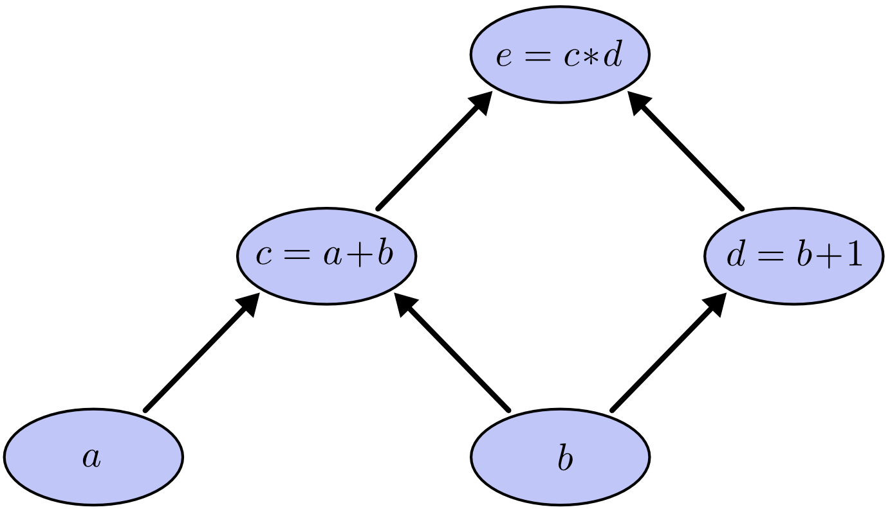
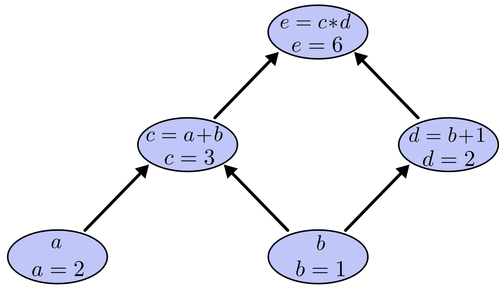
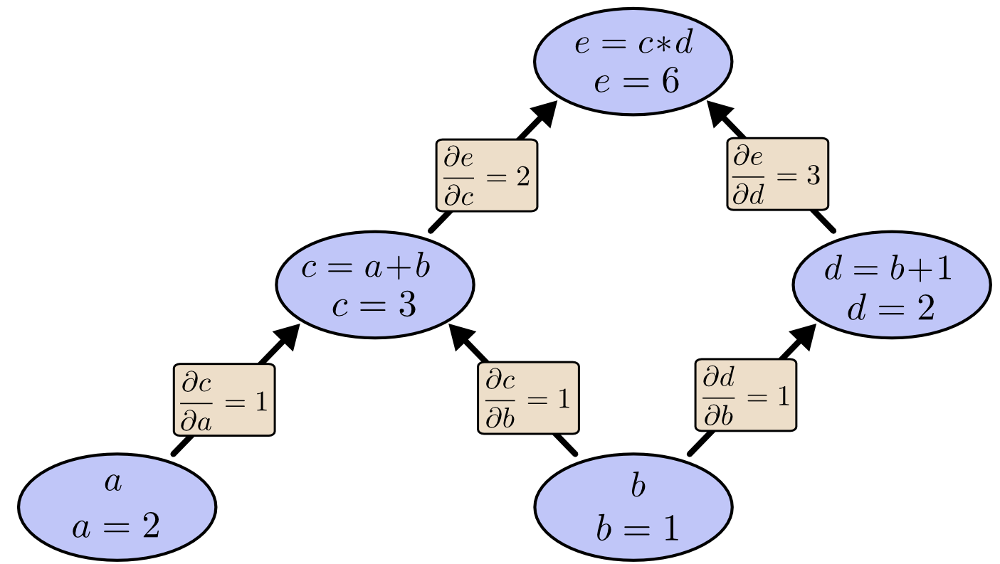
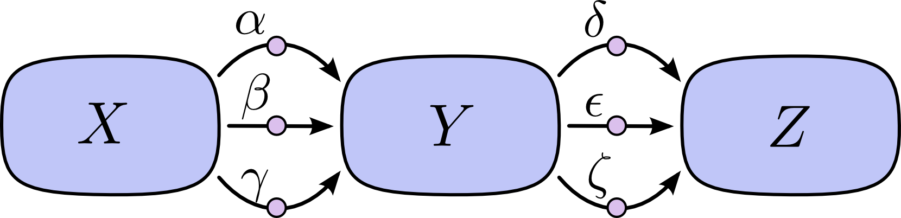
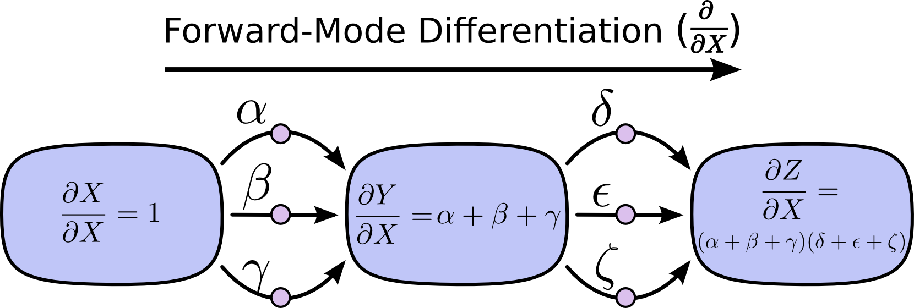
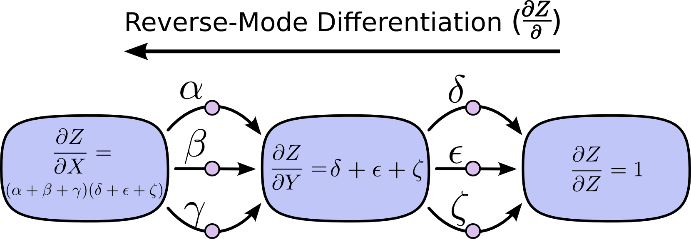
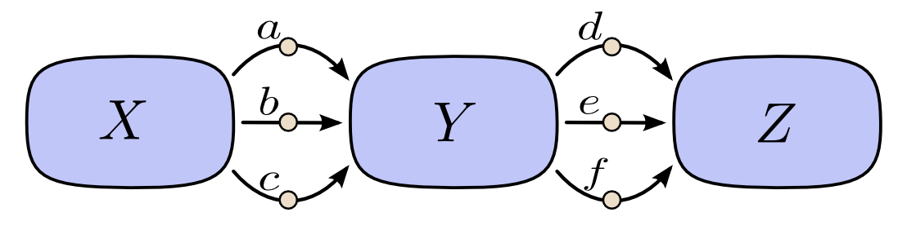
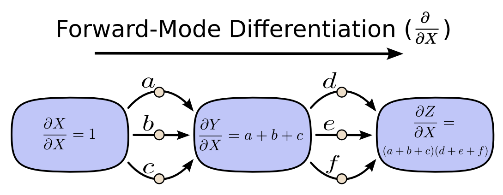
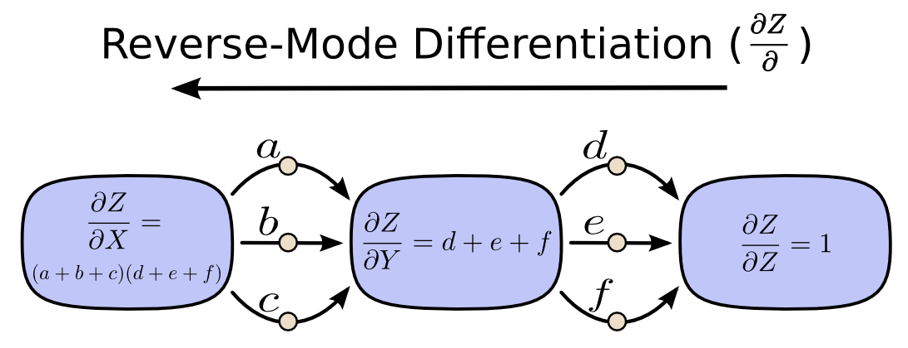
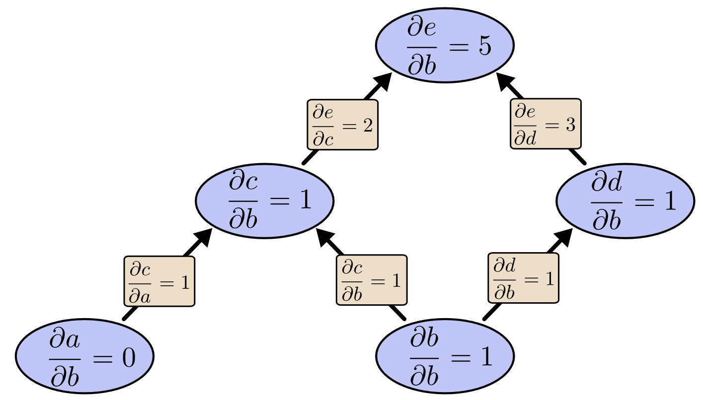

# 计算图上的微积分：反向传播

原文标题：Calculus on Computational Graphs: Backpropagation  
原文作者：Christopher Olah  
原文链接：https://colah.github.io/posts/2015-08-Backprop/  
说明：本文为非官方中文整理版，面向学习与研究使用。若用于公开发布，建议保留完整出处，并进一步确认转载与翻译许可。

## Executive Summary

反向传播是让现代深度学习训练在计算上真正可行的关键算法。它的本质并不神秘：它是一种在计算图上高效计算导数的方法，更一般地说，它属于反向模式自动微分。与朴素地枚举所有路径相比，反向传播通过对路径求和进行因式分解，只需沿图中的每条边访问一次，就能把“一个输出对所有输入”的导数高效算出来。

这篇文章的价值在于，它不从神经网络的公式堆砌切入，而是先从一个极小的标量计算图出发，让读者真正看清楚链式法则是如何在图中流动的。只要理解了这层直觉，后面的神经网络反向传播、自动微分框架和梯度计算，本质上都只是同一件事的不同规模版本。

## Background

在很多教材里，反向传播常常被直接写成一套层与层之间的矩阵递推公式，于是它容易显得像某种专门为神经网络发明的技巧。Christopher Olah 这篇文章的可贵之处在于，它把问题还原成一个更一般的视角：如果一个函数可以表示成一张计算图，那么导数就可以理解为影响如何沿图传播，而反向传播就是对这种影响进行高效汇总的一种方法。

从这个角度看，反向传播不只是深度学习的一个技巧，而是数值计算、控制、优化和自动微分中的通用思想。对正在维护 AI 工程内容站点的读者来说，这样的写法也比单纯罗列训练公式更适合作为一篇“原理型经典文章”收录。

## 引言

反向传播是使深度模型训练在计算上变得可行的关键算法。对于现代神经网络来说，相比一种朴素实现，它可以让基于梯度下降的训练速度提升高达一千万倍。这意味着训练一个模型，可能从需要一周，变成需要二十万年，两者的差别就是这么大。

除了在深度学习中的用途之外，反向传播在很多其他领域也是一种非常强大的计算工具，从天气预报到数值稳定性分析，都能见到它的身影——只是它们使用的是不同的名字。事实上，这个算法已经在不同学科中被重新发明了至少几十次（参见 Griewank, 2010）。更通用、也与具体应用无关的名字是“反向模式微分”（reverse-mode differentiation）。

从根本上说，这是一种快速计算导数的技术。它不仅是深度学习中的一项核心技巧，在各种数值计算场景里也都非常值得掌握。

## 计算图

计算图是理解数学表达式的一种很好的方式。举个例子，考虑下面这个表达式：

$e=(a+b)*(b+1)$

这里有三个运算：两个加法和一个乘法。为了便于讨论，我们引入两个中间变量 $c$ 和 $d$，让每个函数输出都对应一个变量。于是我们得到：

$c=a+b$

$d=b+1$

$e=c*d$

为了构造计算图，我们把这些运算以及输入变量都看作节点。当一个节点的值作为另一个节点的输入时，就在它们之间连一条箭头。

{ width="58%" }

这类图在计算机科学中非常常见，尤其是在讨论函数式程序时。它们与依赖图、调用图这些概念都很接近。它们也是深度学习框架 Theano 背后的核心抽象之一。

我们可以通过给输入变量赋值，并沿着图向前计算节点值，来对表达式求值。比如，设 $a=2$、$b=1$：

{ width="58%" }

此时，这个表达式的结果是 $6$。

## 计算图上的导数

如果你想理解计算图中的导数，关键是先理解边上的导数。如果 $a$ 会直接影响 $c$，那么我们就想知道它是如何影响 $c$ 的。也就是说，如果 $a$ 发生一点点变化，那么 $c$ 会怎样变化？我们把这称为 $c$ 对 $a$ 的偏导数。

为了计算这个图里的偏导数，我们需要用到求和法则和乘积法则：

$$
\begin{gathered}
\frac{\partial}{\partial a}(a+b)=\frac{\partial a}{\partial a}+\frac{\partial b}{\partial a}=1 \\
\frac{\partial}{\partial u}(uv)=u\frac{\partial v}{\partial u}+v\frac{\partial u}{\partial u}=v
\end{gathered}
$$

下面这张图给每条边都标出了对应的导数。

{ width="62%" }

如果我们想理解那些并不直接相连的节点之间是如何相互影响的，该怎么办？比如，考虑 $a$ 是怎样影响 $e$ 的。如果我们让 $a$ 以速度 1 变化，那么 $c$ 也会以速度 1 变化。而 $c$ 以速度 1 变化，又会让 $e$ 以速度 2 变化。因此，$e$ 关于 $a$ 的变化率就是 $1*2$。

更一般地说，规则是：从一个节点到另一个节点的所有可能路径都要考虑进去，对每条路径，把路径上各边的导数相乘，然后再把所有路径结果相加。比如，要求 $e$ 对 $b$ 的导数，我们得到：

$$
\frac{\partial e}{\partial b}=1*2+1*3
$$

这里之所以有两项，是因为 $b$ 一方面通过 $c$ 影响 $e$，另一方面也通过 $d$ 影响 $e$。

这种一般性的“按路径求和”的规则，其实只是多元链式法则的另一种表达方式。

## 路径因式分解

直接“沿所有路径求和”的问题在于：可能路径的数量非常容易发生组合爆炸。

在下面这张图里，从 $X$ 到 $Y$ 有三条路径，而从 $Y$ 到 $Z$ 又有三条路径。如果我们要通过枚举所有路径来计算 $\frac{\partial Z}{\partial X}$，就必须对 $3*3=9$ 条路径求和：

{ width="66%" }

$$
\frac{\partial Z}{\partial X}=\alpha\delta+\alpha\epsilon+\alpha\zeta+\beta\delta+\beta\epsilon+\beta\zeta+\gamma\delta+\gamma\epsilon+\gamma\zeta
$$

虽然这里只是九条路径，但图一旦变得更复杂，路径数就很容易指数增长。

与其这么朴素地把所有路径都加起来，不如把它们做因式分解：

$$
\frac{\partial Z}{\partial X}=(\alpha+\beta+\gamma)(\delta+\epsilon+\zeta)
$$

这正是“前向模式微分”和“反向模式微分”登场的地方。它们就是通过对路径进行因式分解，来高效计算这一求和的算法。它们不会显式枚举每一条路径，而是在每个节点处把路径重新合并，用更高效的方式计算同样的结果。事实上，这两种算法都只会访问每条边一次。

前向模式微分从图的输入端开始，一直向末端推进。在每个节点处，它把所有流入该节点的路径加起来。每一条路径都代表输入影响该节点的一种方式；把它们加总起来，我们就得到该节点受这个输入影响的总体方式，也就是它的导数。

{ width="66%" }

虽然你可能从来没把它理解成图上的算法，但如果你学过微积分入门，前向模式微分其实和你平时“顺着往下求导”的方式非常相似。

反向模式微分则恰恰相反，它从图的输出端开始，向图的起点回推。在每个节点处，它会把所有从该节点出发的路径重新合并起来。

{ width="66%" }

用去掉希腊字母的版本看，同一个思想会更直观一些。

{ width="66%" }

{ width="66%" }

{ width="66%" }

前向模式微分跟踪的是“一个输入如何影响每个节点”；反向模式微分跟踪的是“每个节点如何影响一个输出”。也就是说，前向模式微分相当于把算子 $\frac{\partial}{\partial X}$ 应用到每个节点上，而反向模式微分相当于把算子 $\frac{\partial Z}{\partial}$ 应用到每个节点上。这里看起来有点像动态规划；事实上，它本来就是。

## 计算上的胜利

到这里，你可能会问：为什么会有人关心反向模式微分？它看起来只是用一种奇怪的方式做了和前向模式一样的事。它真的有什么优势吗？

让我们重新考虑最开始的例子：

{ width="62%" }

我们可以从 $b$ 开始做前向模式微分。这会得到图中每个节点相对于 $b$ 的导数。

{ width="62%" }

这样我们就算出了 $\frac{\partial e}{\partial b}$，也就是输出对某一个输入的导数。

那么，如果我们从 $e$ 开始往回做反向模式微分呢？这样会得到 $e$ 对每个节点的导数：

{ width="62%" }

当我说反向模式微分会给出 $e$ 对每个节点的导数时，我的意思真的是“每个节点”。我们既可以得到 $\frac{\partial e}{\partial a}$，也可以得到 $\frac{\partial e}{\partial b}$，也就是输出 $e$ 对两个输入的导数。前向模式微分只能给出“输出对某一个输入”的导数，而反向模式微分一次就能把所有这些导数都算出来。

在这个小图里，这不过只是两倍的提速。但设想一下，如果一个函数有一百万个输入、一个输出，会怎样？前向模式微分要想得到所有导数，就必须把整张图走一百万遍。反向模式微分却能一次性全都算出来。一百万倍的加速，已经相当惊人了。

在训练神经网络时，我们会把代价，也就是描述神经网络表现有多差的一个值，看作参数的函数，而参数就是那些决定网络行为的数字。为了进行梯度下降，我们需要计算代价对所有参数的导数。可现实中，一个神经网络往往有数百万、甚至上千万个参数。因此，反向模式微分——在神经网络语境下我们把它称为反向传播——会带来极其巨大的加速。

那么，有没有前向模式微分更合适的场景？当然有。反向模式给出的是“一个输出对所有输入的导数”，而前向模式给出的是“所有输出对一个输入的导数”。如果你的函数拥有大量输出，那么前向模式微分可能会快得多、快得多、快得多。

## 这难道不是显而易见的吗？

当我第一次真正理解反向传播是什么的时候，我的反应是：“哦，这不就是链式法则吗！我们怎么花了这么久才想出来？”有这种反应的人并不只有我一个。从某种意义上说，如果你问“有没有一种聪明的方法可以计算前馈神经网络中的导数”，答案确实并不算太难。

但我认为，这件事其实比表面看起来困难得多。你要知道，在反向传播被发明的那个年代，人们并没有把注意力集中在我们今天研究的这种前馈神经网络上。同时，也并不显然应该用导数来训练这些网络。而“应该用导数来训练”这件事，只有当你意识到导数可以被快速计算时才显得自然。这里存在一个循环依赖。

更糟的是，只要稍微随便想一想，你就很容易把这条循环依赖中的任何一环都判定为“不可能”。用导数来训练神经网络？你肯定会卡在局部最优里吧。计算这么多导数？显然会很贵吧。恰恰因为我们今天已经知道这条路是可行的，所以我们才不会第一时间列出一大堆理由来说明它为什么看起来不可行。

这就是后见之明的好处。一旦你把问题框定清楚，最困难的工作往往已经完成了。

## Conclusion

导数比你想象得便宜。这是我希望你从这篇文章里带走的最核心的一点。事实上，它们便宜得有点反直觉，以至于我们这些傻乎乎的人类不得不一遍又一遍地重新发现这个事实。在深度学习里，理解这一点非常重要；在其他很多领域里，知道这一点也同样极其有用，甚至在这些领域尚未形成共识时更是如此。

还有别的启示吗？我想是有的。

反向传播也是一个很有用的视角，可以帮助我们理解导数是如何在模型中流动的。对于分析为什么某些模型难以优化，这会非常有帮助。一个经典例子就是循环神经网络中的梯度消失问题。

最后，我想说，这些技术还带来了一条更广泛的算法层面的启示。反向传播和前向模式微分使用了一对非常有力的技巧——线性化和动态规划——让导数的计算比人们直觉中更高效。如果你真正理解了这些技巧，你就可以利用它们来高效计算若干其他和导数有关的有趣表达式。我们会在后续的博客文章中继续讨论这一点。

这篇文章对反向传播的处理是相当抽象的。我强烈推荐你去读 Michael Nielsen 在他的书里关于反向传播的那一章；那是一次极其精彩的讨论，而且会更具体地聚焦于神经网络本身。

推荐阅读：https://neuralnetworksanddeeplearning.com/chap2.html

## Acknowledgments

感谢 Greg Corrado、Jon Shlens、Samy Bengio 和 Anelia Angelova 花时间为这篇文章做校对。

也感谢 Dario Amodei、Michael Nielsen 和 Yoshua Bengio 与我讨论如何解释反向传播这个问题。还要感谢所有那些容忍我在演讲和研讨会系列中不断练习讲解反向传播的人。

## 延伸阅读

- [理解卷积](https://colah.github.io/posts/2014-07-Understanding-Convolutions/)
- [理解 LSTM 网络](https://colah.github.io/posts/2015-08-Understanding-LSTMs/)
- [可视化 MNIST：一次关于降维的探索](https://colah.github.io/posts/2014-10-Visualizing-MNIST/)
- [卷积网络：一种模块化视角](https://colah.github.io/posts/2014-07-Conv-Nets-Modular/)

## References

1. [Christopher Olah - Calculus on Computational Graphs: Backpropagation](https://colah.github.io/posts/2015-08-Backprop/)
2. [Michael Nielsen - How the Backpropagation Algorithm Works](https://neuralnetworksanddeeplearning.com/chap2.html)
3. [Christopher Olah - Understanding Convolutions](https://colah.github.io/posts/2014-07-Understanding-Convolutions/)
4. [Christopher Olah - Understanding LSTM Networks](https://colah.github.io/posts/2015-08-Understanding-LSTMs/)
5. [Christopher Olah - Visualizing MNIST: An Exploration of Dimensionality Reduction](https://colah.github.io/posts/2014-10-Visualizing-MNIST/)
6. [Christopher Olah - Conv Nets: A Modular Perspective](https://colah.github.io/posts/2014-07-Conv-Nets-Modular/)
