# TPU 与 GPU 集群内部：集合通信剖析

> 原文：[Inside TPU and GPU Clusters: The Anatomy of Collective Communication](https://www.aleksagordic.com/blog/collective-operations)  
> 作者：Aleksa Gordić · 发布时间：2026-07-14

译文版本：v0.1

## 译文说明

本文为 Aleksa Gordić 博文《Inside TPU and GPU Clusters: The Anatomy of Collective Communication》的中文翻译版。原文深度剖析 TPU 与 GPU 集群中的集合通信操作（All-Gather、Reduce-Scatter、All-Reduce、All-to-All），涵盖硬件拓扑、环/树形算法、SHARP 网内归约以及分层通信策略。术语遵循项目统一术语表，链接保留原文地址。

---

在这篇文章中，我将深入剖析 TPU 与 GPU 集群拓扑，并梳理 Transformer 训练与推理过程中涉及的核心集合通信（collective operation）操作。

为什么值得我们关心？

进入 2026 年，训练与部署 Transformer 模型已经成为一个大规模分布式系统问题。

要将模型分片部署到整个集群，我们需要依赖**数据并行（data parallelism）**、**张量/模型并行（tensor/model parallelism）**、**FSDP** 以及**专家并行（expert parallelism）**等技术。而在这些技术的底层，它们都是建立在少数几个核心集合通信原语之上的：

1.  数据并行训练在反向传播过程中需要同步梯度，这通常通过**全归约（All-Reduce）**实现。稍后我们会看到，All-Reduce 本身可以分解为**归约散布（Reduce-Scatter）**加上**全收集（All-Gather）**。
2.  张量并行和 FSDP 在前向与反向传播中极度依赖 **All-Gather** 和 **Reduce-Scatter**。
3.  MoE（混合专家）模型中的专家并行，则依赖**全互换（All-to-All）**原语。

这只是几个重要的例子，但已足够说明理解集合通信为什么有用——如果你想推理现代 Transformer 系统的性能，最终你必须推理数据如何在集群中流动。

我们将从硬件出发，先看 TPU 和 GPU 集群的拓扑结构。理解集群的物理布局，能让集合通信算法更有实感，也更易于思考。

然后我们将深入探讨核心集合操作最常见的一些实现方式。

我会主要聚焦于环形算法（ring algorithm），因为它们是处理大消息通信的自然起点。

对于较小的数据块，延迟会开始主导，此时树形算法（tree algorithm）可能更适合（因为它们仅需 $\log_2$ 步）。

本文共分七个部分：

1.  [TPU 集群拓扑](#cpt1)：超级 Pod、切片、DCN、PCIe、ICI
2.  [All-Gather 内部](#cpt2)：一维/二维环与链
3.  [Reduce-Scatter（以及 All-Reduce）](#cpt3)：All-Gather 的对偶
4.  [All-to-All](#cpt4)：分片转置
5.  [NVIDIA GPU 集群拓扑](#cpt5)：节点、可扩展单元、胖树
6.  [GPU 节点内集合通信](#cpt6)：环、树与 SHARP
7.  [GPU 跨节点集合通信](#cpt7)：基于 InfiniBand 的分层算法

## TPU 集群拓扑

我先从 TPU 开始讲，因为它们的拓扑结构更加规整，因此可以说比 GPU 集群拓扑更容易理解。

TPU 集群与 GPU 集群之间的关键区别在于**近邻（nearest-neighbor）连接性**。TPU 芯片与相邻 TPU 芯片直接连接，每个芯片根据 TPU 代际的不同，拥有 **4 个或 6 个近邻**：

1.  TPU `v2`、`v3`、`v5e` 和 `v6e` 使用二维环面（2D torus）拓扑，拥有 4 个近邻。
2.  TPU `v4p`、`v5p`、`TPU7x`（Ironwood）以及 `8t` 使用三维环面（3D torus）拓扑，拥有 6 个近邻。

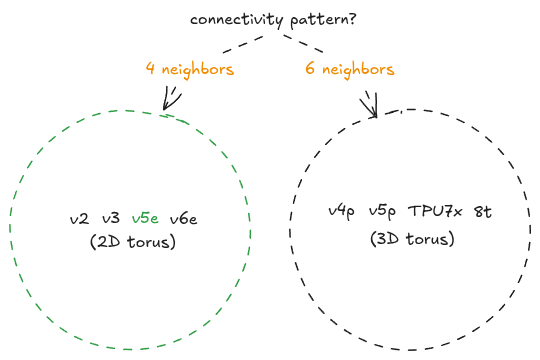

图 1：TPU 连接类型。

!!! tip "Boardfly 拓扑"
    值得一提的是，谷歌的[新一代推理 TPU 芯片](https://cloud.google.com/blog/products/compute/tpu-8t-and-tpu-8i-technical-deep-dive)[[1]](#ref-1) `8i` 并未采用 2D/3D 环面，而是使用了 boardfly——一种分层高基数拓扑。本文中我将忽略它。

以下是一种建立 4 近邻 2D 环面直觉的方式。2D 环面可以表示为一个具有环绕/周期边界的网格（mesh）：向左移出边界会从右边回到网格（反之亦然），向上移出边界会从下方回到网格（反之亦然）。请记住 TPU 环面是一个离散网格，可以想象它覆盖在这个甜甜圈上。该图示仅用于直觉辅助：

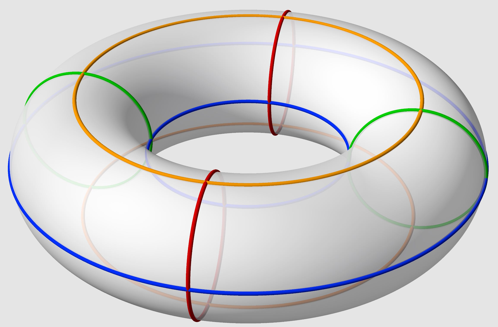

图 2：2D 环面直觉：带环绕边界的网格。

类似地，以下是 6 近邻 3D 环面的连接模式：

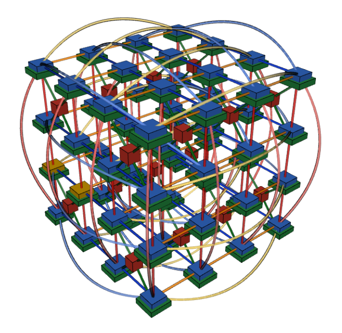

图 3：3D 环面连接。

这个图看起来有点乱，但原理很简单——每个芯片沿 ±x、±y 和 ±z 方向都有相邻芯片，并且边界在三个维度上都发生环绕。

!!! tip "交互式可视化工具"
    这里有一个我用来生成上图的实用[可视化小工具](https://tpu-visualizer.uc.r.appspot.com/)[[2]](#ref-2)，你可以用它来交互探索这些更复杂的拓扑结构。

本文将以 `v5e` 作为贯穿示例，因为 2D 连接更容易可视化。

TPU 芯片通过 **ICI**（芯片间互联，inter-chip interconnect）与其近邻通信。

最大规模的 ICI 连接 TPU 芯片岛称为一个 **TPU Pod**。你有时也会听到人们称之为**"超级 Pod"（superpod）**；本文中我将这两个术语互换使用。

例如，一个 `v4` Pod 包含 16 × 16 × 16 个芯片，总计 4096 个 TPU。一个 `v5p` Pod 包含 16 × 20 × 28 个芯片，即 8960 个 TPU！

!!! tip "GPU 的纵向扩展域"
    对比 GPU，其纵向扩展（scale-up）域历来要小得多：通常单个 NVLink 域内包含 8 个 GPU，而最近 NVIDIA GB200 NVL72 的 NVLink 域则达到 72 个 GPU。我们稍后将更深入地分析 GPU。

对于拥有 6 个近邻的 TPU Pod 而言，最小的完整 3D 环面是 4×4×4 立方体。如果你请求一个更小的拓扑，例如 2×2×2，你会失去环绕链路，此时切片（slice）不再是环面，而是变成了一个网格。

!!! tip "术语说明"
    TPU 切片是单个 TPU Pod 内部通过 ICI 连接的一组芯片（一个"ICI 岛"）。对于 `v5e`，切片可以是：2×2、2×4、8×8 等。最大的这种切片就是（超级）Pod 本身。

这会使沿该轴的环形集合操作时间大致翻倍，稍后我们会看到。所以这一点需要注意——如果你的应用对通信密集，你可能需要请求能保持环面结构的切片形状，例如 4×4×8。

另一方面，`v5e` 拥有 16×16 的 2D 环面 Pod。环绕特性在大小为 16 时才成立，因此如果你取一个较小的切片，例如 8×16，你会在较短的那条轴上失去环绕（同样，沿该轴的集合操作会受到大约 2 倍的惩罚）。

要扩展到单个 Pod 之外，TPU 使用 **DCN**（数据中心网络，data center networking）。DCN 的吞吐量远低于 ICI，因此你必须小心：如果太多通信跨越 Pod 边界，它很容易成为训练的瓶颈。

综合以上所有信息，我们来可视化一个 16×16 `v5e` Pod 的拓扑结构。花些时间分析一下（必要时可放大查看）：

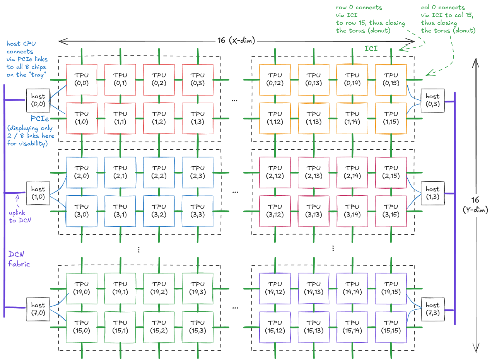

图 4：v5e TPU 16×16 超级 Pod 的拓扑结构。

我们可以通过共享的 DCN 架构将多个 Pod 连接成一个更大的计算集群（也许这才是我们应该称之为超级 Pod 的东西，嘿）：

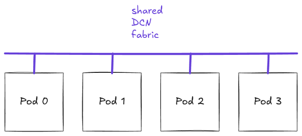

图 5：通过 DCN 主干连接的多个 Pod。

还有几个细节值得了解。

如上图所示，在 Pod 内部，第 0 行连接回第 15 行，第 0 列连接回第 15 列。这正是使拓扑成为环面/甜甜圈而非普通网格的原因。环面几何结构约束了路径长度，因为数据通常需要经过中间 TPU 才能从源芯片到达目标芯片。

例如，如果 TPU `(15, 15)` 想发送数据到 TPU `(2, 15)`，最短路径会经过环绕链路：

`(15, 15)` → `(0, 15)` → `(1, 15)` → `(2, 15)`

而不是走远路经过 `(14, 15)`、`(13, 15)` 等。

!!! tip "补充信息"
    TPU 还支持"扭曲环面"（twisted torus）配置，它改变了环绕连接方式以减少全互换（All-to-All）等通信模式的跳数。这是一种提高效率的实现细节，但本文不需要用到它。

每块 TPU 芯片还通过 **PCIe** 连接到一个"专属"CPU 主机。以 `v5e` 为例，一个主机连接到一个 2×4 的 TPU 芯片块，主机与这 8 块芯片之间有 8 条 PCIe 连接。

需要注意的是，要到达 DCN 主干网，数据必须先通过 PCIe，这意味着 DCN 通信甚至比 PCIe 还慢。

具体来说，跨 Pod 的数据流从源 TPU 芯片的 HBM 出发，经 PCIe 到达源主机，然后通过 DCN 架构出站，进入目标主机，最后再经 PCIe 进入目标 TPU 芯片的 HBM。

这就形成了一个自然的**带宽层级（bandwidth hierarchy）**。我们越靠近 TPU 芯片上的计算裸片，数据移动越快；越往集群外围移动，速度越慢。

让我们把 `v5e` 集群的相关带宽放在一张图里：

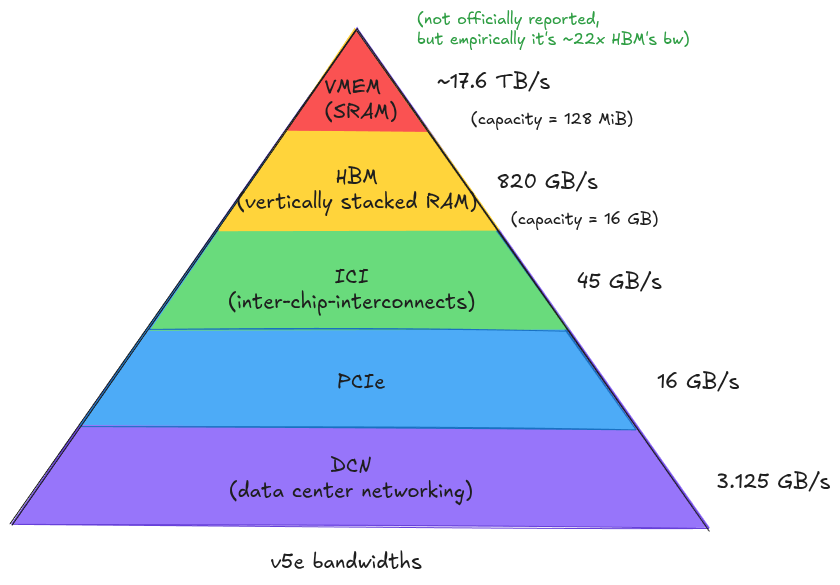

图 6：v5e TPU 集群中的带宽层级。

现在我们已经对拓扑和带宽层级有了概念，来看几个具体的例子，了解数据如何在实际的 TPU 切片中流动。

!!! tip "书籍推荐"
    本博客中的一些例子，以及写作本文的更广泛动机，都受到了优秀的 Scaling Book [[3]](#ref-3) 的启发，我强烈推荐。

假设我们从 GCP 请求一个 4×4 的 `v5e` 切片。由于两条轴都小于 16，我们得不到任何环绕链路。因此这个切片不是环面，而是一个普通的 2D 网格，某些芯片之间的路径比有环绕链路时要长。

我们提出如下问题：将一个 `(2048, 2048)` `bf16` 矩阵从 TPU 芯片 `(3, 3)` 移动到 TPU 芯片 `(0, 0)` 需要多长时间？

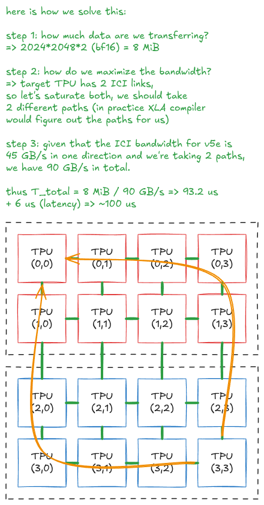

图 7：使用两条 ICI 路径在 4×4 v5e 网格上移动一个 8 MiB 的 bf16 矩阵。

注意上面的计算我们忽略了链路延迟。实际上，ICI 链路每跳大约有 1 μs 的延迟。

在我们的例子中，每条路径长 6 跳。由于两条路径并行运行，这会额外增加约 6 μs 的传输延迟，在此处可以忽略不计，但对于较小的消息则未必可以忽略。

这就是为什么理解我们处于**延迟受限（latency-bound）**还是**吞吐受限（throughput-bound）**状态很重要。

一个简单的估算方法是问：假设我们饱和了 45 GB/s 的单向 ICI 带宽，1 μs 内能流过一条链路多少数据？

答案是：

$$45\,\text{GB/s} \times 1\,\mu\text{s} = 45\,\text{KB}$$

因此，如果我们的消息块大致在这个大小范围内，延迟就非常重要。忽略每跳 1 μs 的延迟可能导致估算结果偏差很大，此时仅靠带宽的简化近似便不再有效。

让我们再做一个例子，这次同时涉及 PCIe、ICI 以及 HBM → VMEM 链路。

!!! tip "VMEM 是什么？"
    VMEM 是片上快速 SRAM，大致相当于 GPU 上由程序员管理的共享内存。它直接馈入矩阵乘法单元——在 TPU 芯片的情况下，即脉动阵列（systolic array）。

    TPU 芯片的具体细节对理解本文主题并不重要，因此我们不会在 VMEM 上花更多时间。

假设我们有一个 (`128 * 1024`, `128 * 1024`) 的 bf16 矩阵，分片在 4 × 4 的 TPU 切片上。因此每块芯片拥有一个 (`32 * 1024`, `32 * 1024`) 的子矩阵（128/4=32）。

再假设这些子矩阵已卸载到主机 DRAM 上。

将所有这些数据移动到 TPU `(0, 0)` 并执行一个与 (`128 * 1024`, `128`) bf16 矩阵的矩阵乘法需要多长时间？

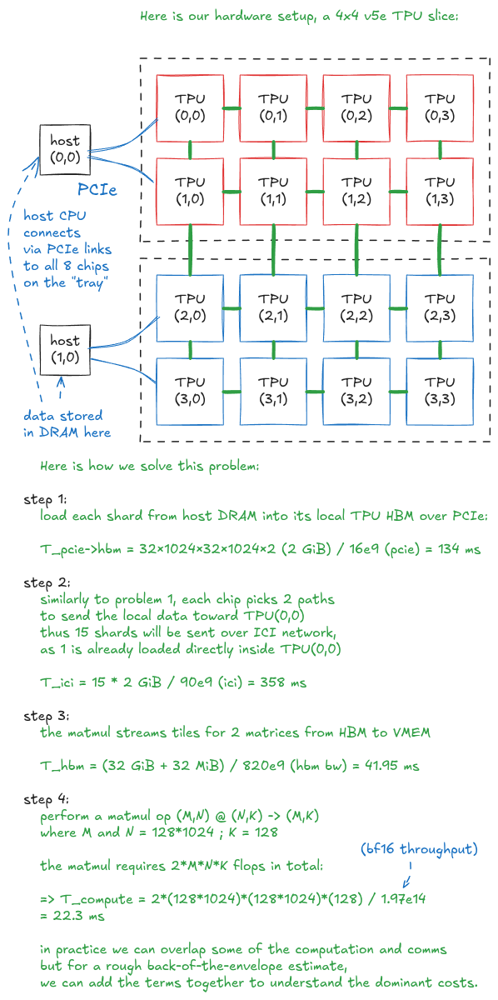

图 8：将分片矩阵收集到 TPU(0,0) 用于矩阵乘法。

了解了 TPU 拓扑和带宽层级，我们现在可以开始进入集合操作了。

让我们从全收集（All-Gather）开始。

## All-Gather 内部：一维/二维环与链

先从一个动机示例开始。

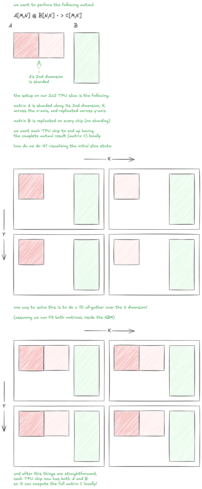

图 9：All-Gather 动机：收集 A 的分片，使每个芯片都能在本地运行矩阵乘法。

那么如何高效实现 All-Gather 呢？

一种常见方法是使用环形算法。在看算法本身之前，让我们先理解这个"环"从何而来：

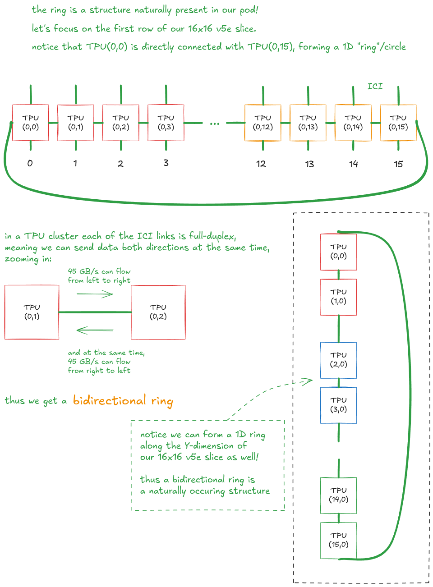

图 10：1D 双向环自然地出现在 16×16 v5e 环面的两条轴上。

为便于可视化，我们使用更小的 8 块 TPU 芯片组成的环。在实际的 `v5e` Pod 中，环绕在大小为 16 时才发生，但在接下来的几张图中，我们假设 8 芯片行也具有环绕特性：

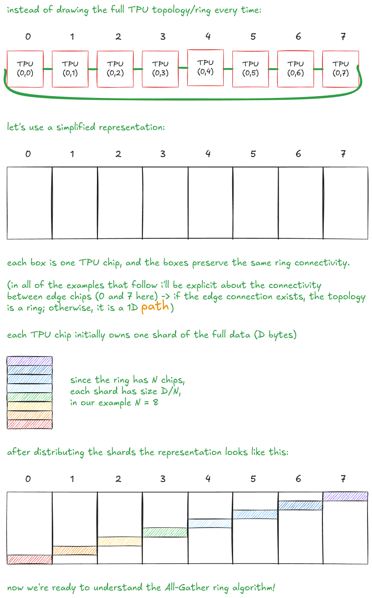

图 11：8 芯片环的简化表示。

以下是在双向 1D 环上的 All-Gather 操作。这张图值得花些时间仔细看，放大后跟踪一个分片在环上的移动：

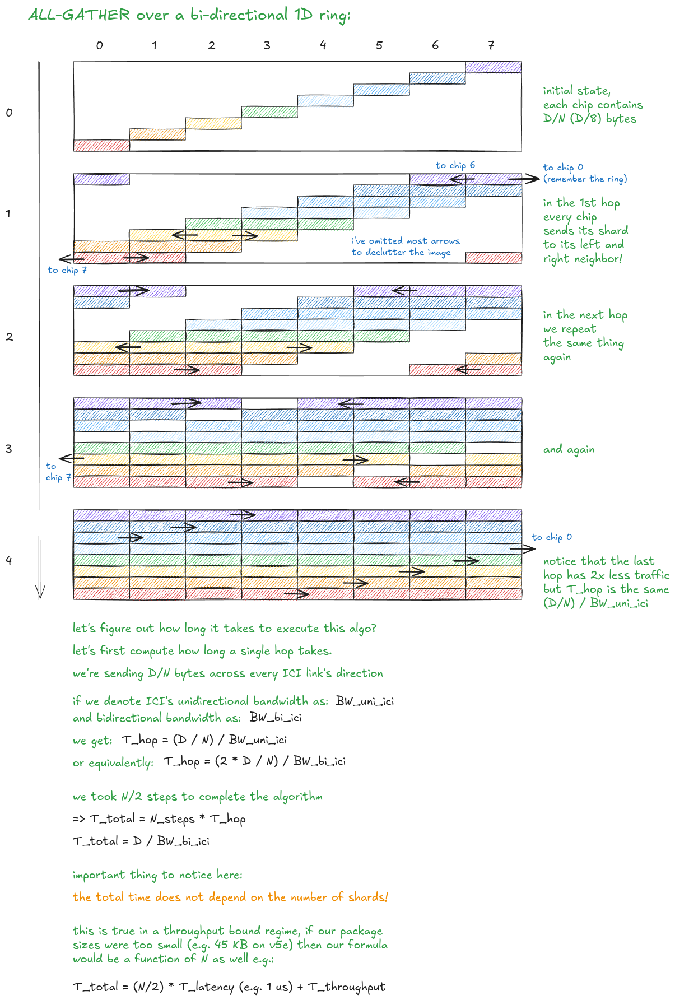

图 12：双向 1D 环上的 All-Gather。

作为练习，如果 ICI 链路不是全双工的，算法会是什么样？

在这种情况下，我们可以在单向环上运行 All-Gather。为了保持图不大，我们使用一个假设的大小 $N = 4$ 的环，因此算法仅需 $N - 1 = 3$ 步完成：

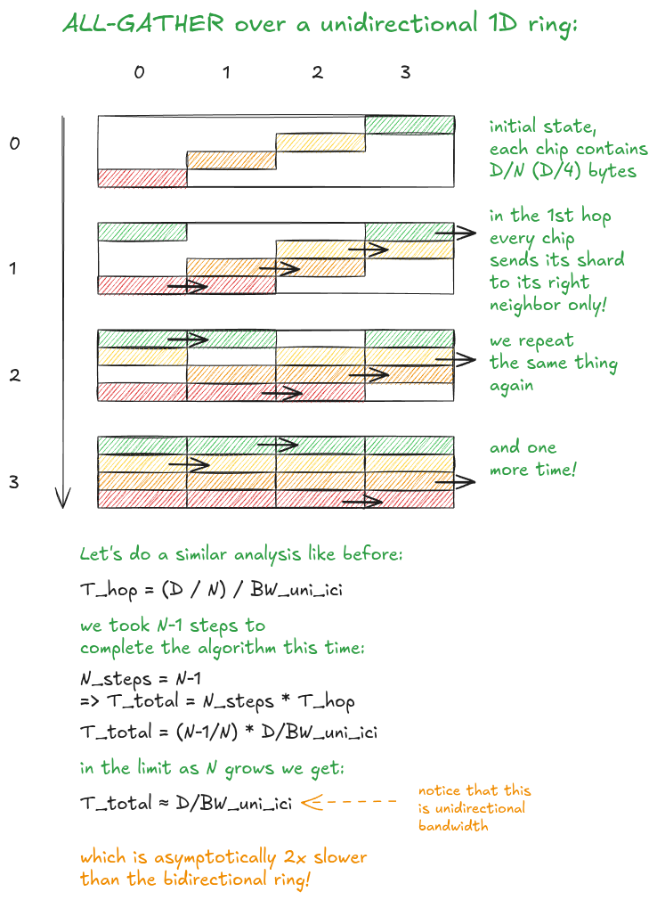

图 13：单向 1D 环上的 All-Gather。

更现实的情况是，如果我们取一个没有环绕链路的 TPU 切片——例如 4 × 4 的 `v5e` 切片——那么沿该轴就不再是环。此时拓扑变成一条 1D 路径（path），因此我们回退到路径（或链）上的 All-Gather：

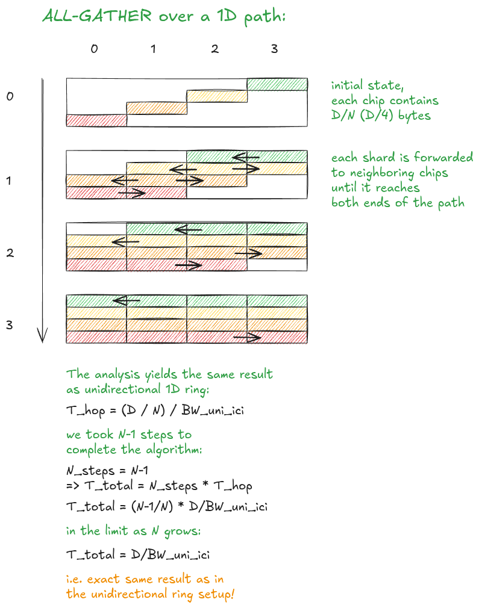

图 14：All-Gather——链/路径。

最后，有时我们会遇到数组同时沿 TPU 切片的两条轴分片的情况，我们需要执行 2D All-Gather。

在这种情况下，我们可以同时使用全部 4 条相邻 ICI 链路，相比仅使用单条轴可获得 2 倍加速！

让我们建立直觉理解为什么。假设一个 4 × 4 的切片，两条轴上都有环绕链路，因此行和列都形成环：

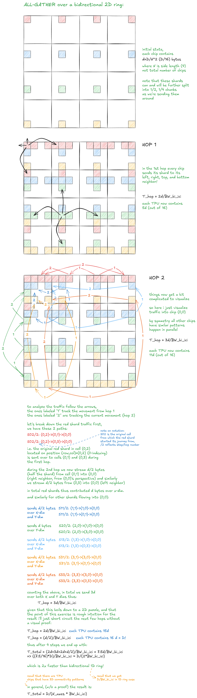

图 15：双向 2D 环上的 All-Gather。

All-Gather 到此结束。

接下来，让我们看看它的对偶操作归约散布（Reduce-Scatter），然后利用它构建全归约（All-Reduce）。

## Reduce-Scatter（以及 All-Reduce）：All-Gather 的对偶

同样，先从一个动机示例开始：

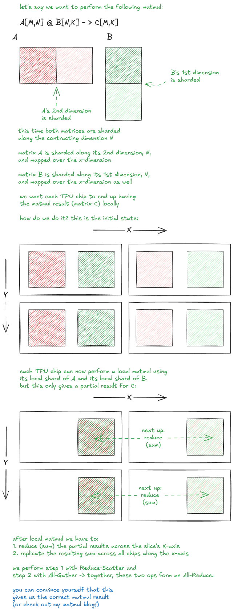

图 16：Reduce-Scatter 动机。

那么如何高效实现 Reduce-Scatter 呢？

它与 All-Gather 非常相似。事实上，你可以把它看作 All-Gather 的对偶（dual）：通信调度很相似，但当分片移动时，我们不是复制它们，而是归约（reduce）它们。

由于通信模式几乎完全相同，吞吐受限条件下的时间复杂度也是一样的：

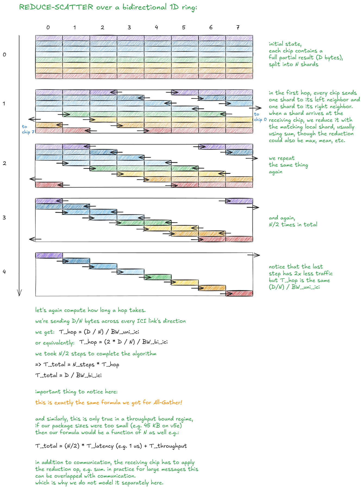

图 17：双向 1D 环上的 Reduce-Scatter。

!!! tip "附注：All-Gather/Reduce-Scatter 对偶性"
    All-Gather 和 Reduce-Scatter 之间存在一种有用的对偶关系。对于许多分片模式，如果前向传播使用 All-Gather，则反向传播使用 Reduce-Scatter。反之，如果前向传播使用 Reduce-Scatter，反向传播使用 All-Gather。这一点值得注意，但由于本文的重点是集合操作的机制，我不在此展开。

继续上面的动机示例，我们现在可以看到如何通过 Reduce-Scatter 加上 All-Gather 来构建 All-Reduce：

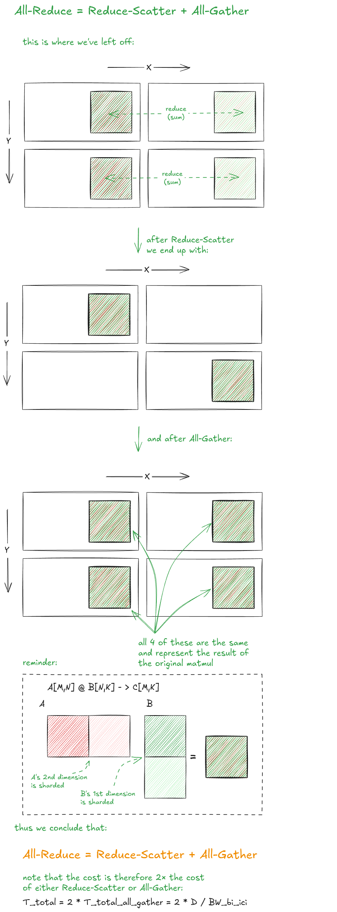

图 18：双向 1D 环上的 All-Reduce。

为了一致性，我们也展示在假设的单向 1D 环上的 Reduce-Scatter（之所以是假设，是因为我们需要 16 个 TPU 而非 4 个才能在 `v5e` 上形成环）：

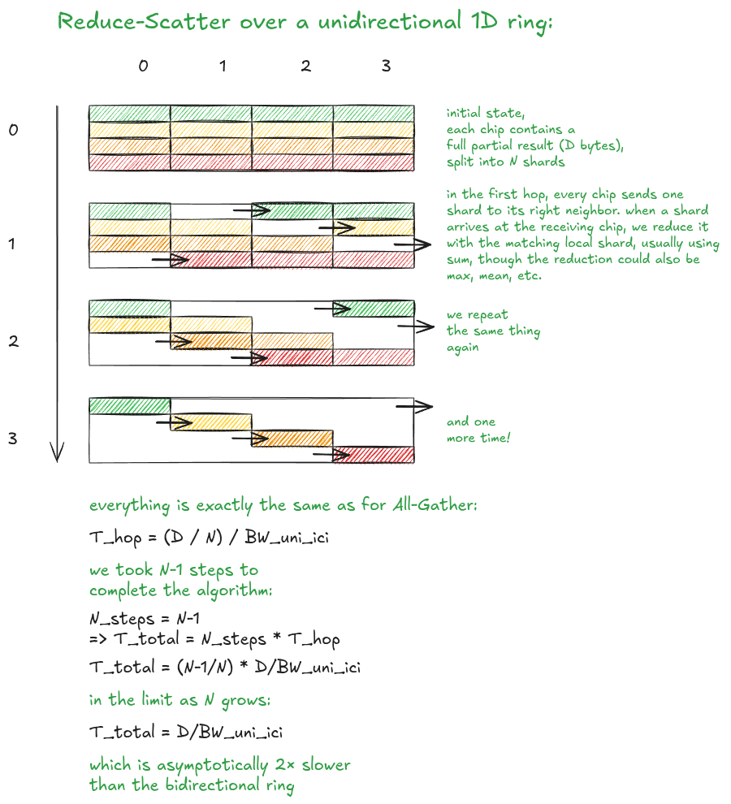

图 19：单向 1D 环上的 Reduce-Scatter。

最后，如果我们取一个没有环绕链路的 TPU 切片，例如 4 × 4 的 `v5e` 切片，那么沿该轴就没有环结构。在这种情况下，我们回退到 1D 路径/链上的 Reduce-Scatter：

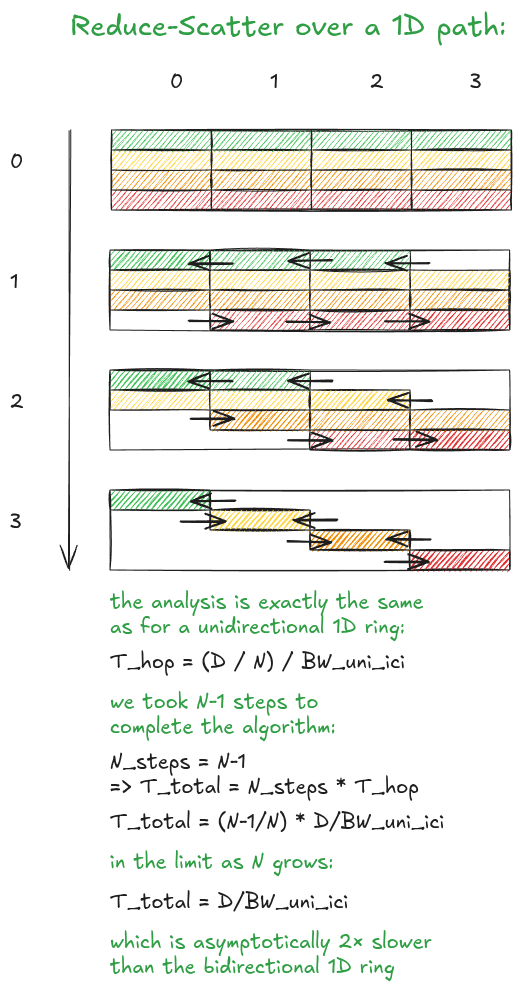

图 20：Reduce-Scatter——链/路径。

与 All-Gather 一样，如果数据跨多条拓扑轴分片，我们可以并行使用更多 ICI 链路。在吞吐受限条件下，总时间大致与所用拓扑轴的数量成反比。

Reduce-Scatter 和 All-Reduce 到此结束！

## All-to-All：分片转置

现在来看最后一个原语：**All-to-All**。

All-to-All 出现的一个典型场景是 MoE（混合专家）模型。

!!! tip "MoE 简化版"
    为简单起见，假设采用 top-1 路由，每个芯片一个专家。

在 MoE 层中，每个 token 被路由器分配给一个专家。你可以把路由器理解为给每个 token 附加一个目标专家 ID。

假设 Expert 0 位于 TPU 0，Expert 1 位于 TPU 1，依此类推。那么专家 ID 告诉我们需要将 token 发送到哪块 TPU 芯片。

因此，每个芯片一开始持有一个本地的 token 批次，但这些 token 可能指向多个不同芯片上的不同专家。

All-to-All 就是执行这种交换的集合操作：每个芯片将属于 Expert 0 的 token 发送到 TPU 0，将属于 Expert 1 的 token 发送到 TPU 1，依此类推。

换句话说，All-to-All 是一种分布式转置：我们开始时按源芯片分组，集合操作完成后按目标专家分组。

对于下面的图示，我们假设一种完美均衡的路由模式：每个芯片发往其他每个芯片的数据量相同。实际的 MoE 路由可能不均衡，但均衡情形能为我们理解 All-to-All 原语提供最清晰的思维模型。

以下是在双向 1D 环上的 All-to-All：

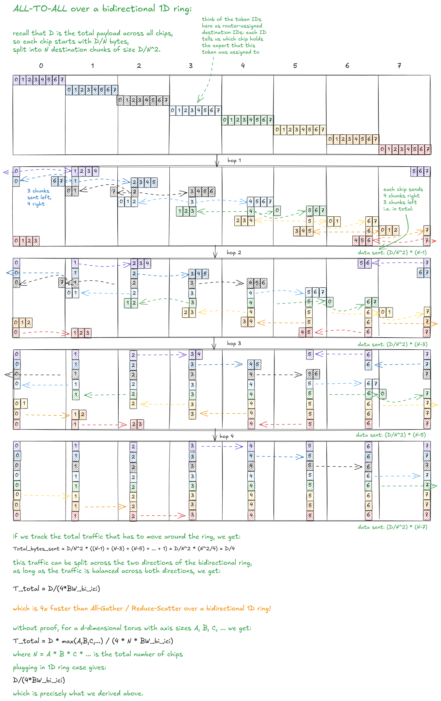

图 21：双向 1D 环上的 All-to-All。

以下是在单向 1D 环上的 All-to-All：

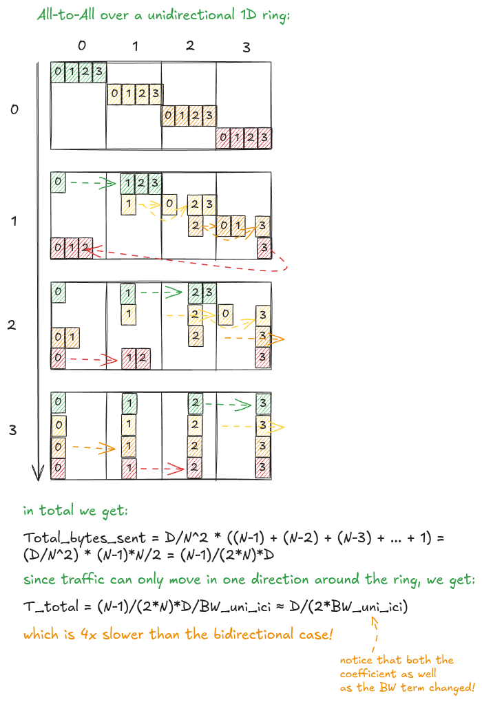

图 22：单向 1D 环上的 All-to-All。

与之前一样：没有环绕链路时，环变成路径。因此在 4 × 4 `v5e` 切片上，All-to-All 回退到 1D 路径/链算法：

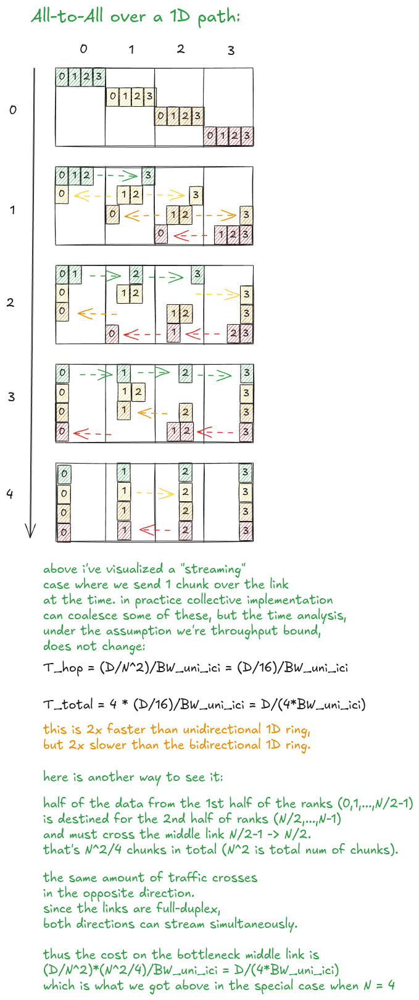

图 23：All-to-All——链/路径。

为结束博客的 TPU 部分，让我们总结一下吞吐受限条件下的通信时间结果：

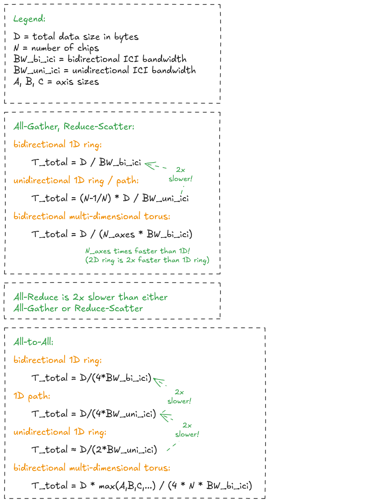

图 24：TPU 集合通信成本总结。

接下来，NVIDIA GPU！

## NVIDIA GPU 集群拓扑：节点、可扩展单元、胖树

与使用近邻环面连接的 TPU 集群不同，GPU 集群通常组织为**分层交换网络（hierarchical switching network）**。

在本文中，我将聚焦于 NVIDIA DGX H100 SuperPod **参考架构**——一个组织为"胖树（fat tree）"的 1024 GPU 集群。我稍后会解释"胖树"的含义。

我将仅关注计算架构（compute fabric）：即分布式训练期间用于 GPU 间通信的网络。我将忽略用于检查点、权重、日志和数据集的存储架构（storage fabric）；用于 InfiniBand 监控/管理的 UFM；以及用于集群运维的带内/带外管理架构。即构成一个功能性 NVIDIA 集群的其他子系统。

以下是基础知识。

第一个组织单元是**节点（node）**。在本节中，我用"节点"指代本地 NVLink / NVSwitch **纵向扩展（scale-up）域**。例如，一个 DGX H100 节点通过 NVLink 架构连接了 8 个 H100 GPU（而例如 GB200 NVL72 则拥有 72 个 GPU）。

!!! tip "术语说明"
    NVSwitch / NVLink 架构只是 NVIDIA 用来称呼连接 GPU 的高带宽交换机/互联的术语。

在节点内部，GPU 通过 NVSwitch 架构实际上是全互联（all-to-all）的：每个 GPU 只需一跳 NVSwitch 即可到达任何其他 GPU。

然后，节点通过 InfiniBand (IB) 相互连接，形成**横向扩展（scale-out）**网络。在 DGX H100 SuperPod 参考架构中，32 个节点组成一个**可扩展单元（Scalable Unit，SU）**，通过 InfiniBand **叶子交换机（leaf switch）**连接。多个 SU 又通过更高级的**脊交换机（spine switch）**连接在一起。

这种层次结构构成了一棵胖树。

这种架构之所以称为"胖树"，是因为树越靠近根部越"胖"：上层拥有更大的聚合带宽，使得来自大量节点的流量不会坍缩到一个狭窄的瓶颈中。

**完全胖树（full fat tree）**是这种思想的无超额订阅/特殊版本。在每个层级，上行链路带宽与下行注入带宽（injection bandwidth）匹配（这将在下图中变得更加清晰）。

!!! tip "术语说明"
    超额订阅（oversubscription）意味着下游设备可以注入的流量超过上游链路能够承载的量。例如，如果一组节点可以向叶子层注入 12.8 TB/s，但叶子交换机通往脊层的上行链路带宽只有 6.4 TB/s，那么该架构就是 2:1 超额订阅的。完全胖树是无超额订阅的：在每个层级，上行带宽匹配下行注入带宽。

拥有完全胖树的关键结果是**完全二分带宽（full bisection bandwidth）**。

**二分带宽**是将集群均等切分后跨分区可用的带宽。因此，如果我们将一个 128 节点的集群分成两组各 64 节点，每方可以以其*全部*聚合注入带宽与对方通信！

更一般地，对于任何分区，跨分区带宽受限于切分中较小一侧的节点数量。

例如，每个 DGX H100 节点有 8 条 50 GB/s 链路接入 IB 计算架构，因此其单向注入带宽为 400 GB/s。在完全胖树中，任何由 N 个节点组成的组可以以 N × 400 GB/s 的单向带宽进行跨分区通信（假设 N 是切分中较小的一侧）。

在节点内部，同样的思想适用于本地 NVLink/NVSwitch 架构。如果我们将 8 个 GPU 分成两组各 4 个，一侧可以以如下带宽向另一侧发送：

$4 \times 450\,\text{GB/s} = 1.8\,\text{TB/s}$（即这 4 个 GPU 的最大带宽！）

由于架构是全双工的，双向二分带宽为：

$2 \times 1.8\,\text{TB/s} = 3.6\,\text{TB/s}$

在可扩展单元层面，我们有 32 个节点。对于真正均等的切分，我们将 SU 分成两组各 16 个节点。一侧可以以如下带宽向另一侧发送：

$16 \times 400\,\text{GB/s} = 6.4\,\text{TB/s}$（双向二分带宽 → 12.8 TB/s）

最后，如果我们将集群分成 64 节点和 64 节点，一侧可以以如下带宽向另一侧发送：

$64 \times 400\,\text{GB/s} = 25.6\,\text{TB/s}$（双向二分带宽 → 51.2 TB/s）

对于不均衡的分区，假设一侧 88 节点，另一侧 40 节点，跨分区带宽受限于较小的一侧：

$40 \times 400\,\text{GB/s} = 16\,\text{TB/s}$

有了这个思维模型，让我们更详细地分析 DGX H100 参考架构。可以放大查看：

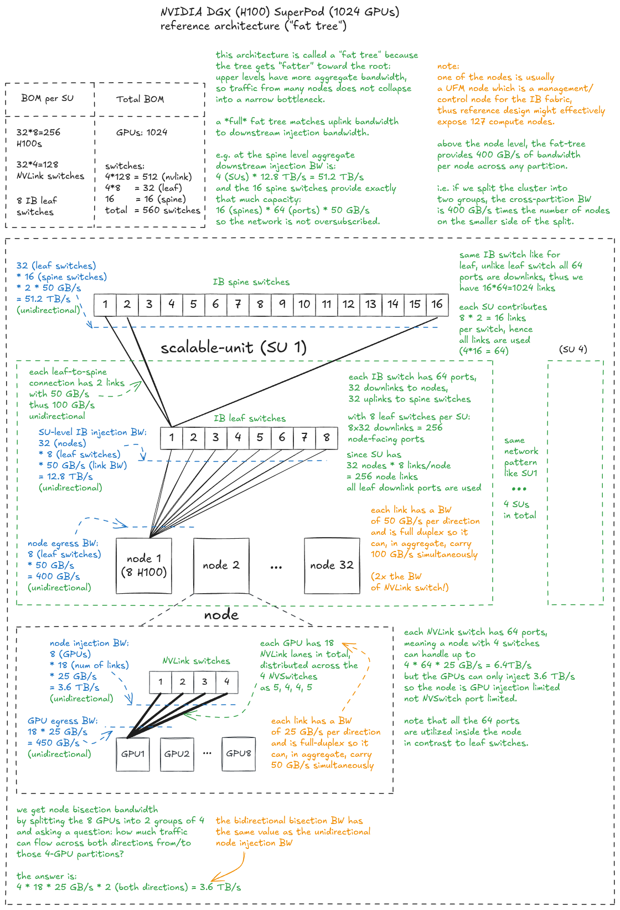

图 25：NVIDIA DGX (H100) SuperPod（1024 GPU）参考架构。

了解了 GPU 集群拓扑，我们现在可以将注意力转向集合操作了。

## GPU 节点内集合通信：环、树与 SHARP

在节点内部（即单个 GPU 节点内），集合算法看起来与 TPU 的情况相似，因为它们都运行在一个抽象的环结构上，但底层的物理拓扑是不同的。

在 TPU 上，环是通过近邻 ICI 链路的物理路径。在 GPU 上，环是在 NVSwitch 架构上选择的逻辑排序。

NVSwitch 架构在 GPU 之间提供了有效的全互联连接，而集合算法在此连接模式之上选择一个环。

让我们分解一下：

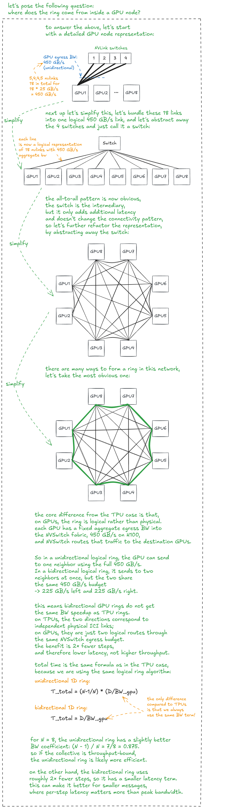

图 26：在 GPU 节点内部构建逻辑环。

我们已经知道，All-Reduce 可以实现为 Reduce-Scatter 加上 All-Gather，因此在没有特殊硬件支持的情况下，其通信成本大约是任一单个原语的两倍。

NVIDIA GPU 交换机（包括 NVSwitch 和 IB 交换机）有一个重要的优化，称为 **SHARP**——一种网内归约（in-network reduction）计算单元。通常，交换机只是在 GPU 之间路由数据。有了 SHARP，交换机本身也可以执行归约操作。例如，不再由 GPU 交换部分和并在本地归约，而是由 GPU 将它们的部分值发送到交换机，交换机对它们求和，然后把归约后的结果发送回去。

因此，不同于花费 SM 周期和 HBM 带宽在一个主要受内存带宽限制的 All-Reduce 上，网络在传输过程中执行归约，让 GPU 腾出来进行有用的计算。

!!! tip "SHARP 的 FLOP/s"
    作为参考，NVLink 4 NVSwitch（搭载于 H100 节点中）SHARP 具有 400 GFLOP/s 的 FP32 归约吞吐量 [[4]](#ref-4)。

SHARP 理论上可以使 All-Reduce 接近 2 倍加速！在节点内 GPU 数量 $N$ 很大的极限情况下，提升接近 2 倍；对于 8 GPU 节点，理想的提升接近 1.75 倍。

那么 SHARP 是如何工作的？

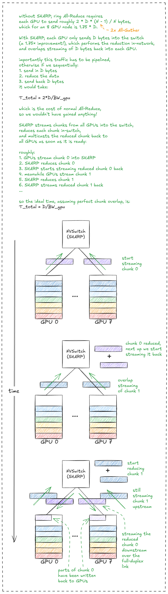

图 27：SHARP——网内归约计算单元。

!!! tip "理论与实践的差距"
    经验上，GPU 上的 All-Reduce 可能需要非常大的消息才能接近峰值带宽。在 8×H100 节点上[较早的 NCCL 测量](https://jax-ml.github.io/scaling-book/gpus/#intra-node-collectives)[[5]](#ref-5) 中，即使消息大小达到数个 GB 级别，性能仍在攀升，而当消息大小降到约 100 MB 以下时，带宽明显下降。这是与 TPU 的一个实际差异，后者往往在更小的消息大小（约 10 MB）下就能达到近峰值集合带宽。

即使 SHARP 已为 All-Reduce 启用，我们仍应考虑开销：归约 + 组播（multicast）的流水线在实际中不会完美重叠。实践中 SHARP 带来的加速**仅约 30%** [[5]](#ref-5)[[6]](#ref-6)！请务必在你具体的集群配置上运行微基准测试。

!!! tip "SHARP 补充背景"
    NVLink SHARP 并不局限于归约，它还通过硬件组播加速 All-Gather 阶段。一块内存区域可注册为一组 GPU 的组播目标。之后，对组播地址的一次普通 CUDA 存储操作会被 NVSwitch 架构复制到组内的每个 GPU——kernel 本身不需要特殊的组播指令。

    一个低效之处在于，组播也包括源 GPU，即使它已经有该数据！（在 H100 节点中浪费 1/8 的带宽。）

在 NVSwitch 节点内，均衡的全互换（All-to-All）所需的通信时间可能比双向 1D 环面环要少大约一半（假设带宽相等），因为每个 GPU 可以直接向每个目标 GPU 发送数据：

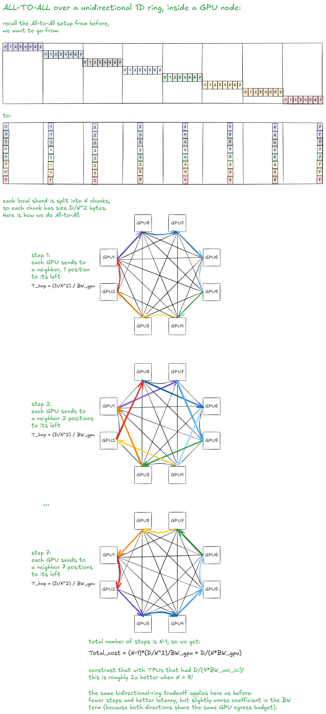

图 28：8 GPU 节点内逻辑单向环上的密集 All-to-All。

!!! tip "NVL72 上的 All-to-All"
    密集、均衡的 All-to-All 模型对 8 GPU H100 节点是一个合理的简化，但在 GB200 NVL72 这样的系统上就不那么有代表性了。在具有 72 个 GPU、每个 token 仅选择八个专家的 MoE 推理工作负载中，每个 token 只需要到达大约 8/72≈11% 的 GPU。因此通信变得稀疏且不规则（ragged），而非统一的全互换：路由器首先确定每个 token 的目标专家，然后系统只将该 token 发送到托管这些专家的 GPU。

在进入跨节点集合操作之前，我想简要介绍树形集合操作的核心思想。

核心思想是将 GPU 逐轮配对，每轮后每个 GPU 持有的数据量翻倍。这使我们只需 $\log_2(N)$ 步通信，而非 $N - 1$ 步。

以下是基于递归倍增（recursive doubling）实现的树形 All-Gather：

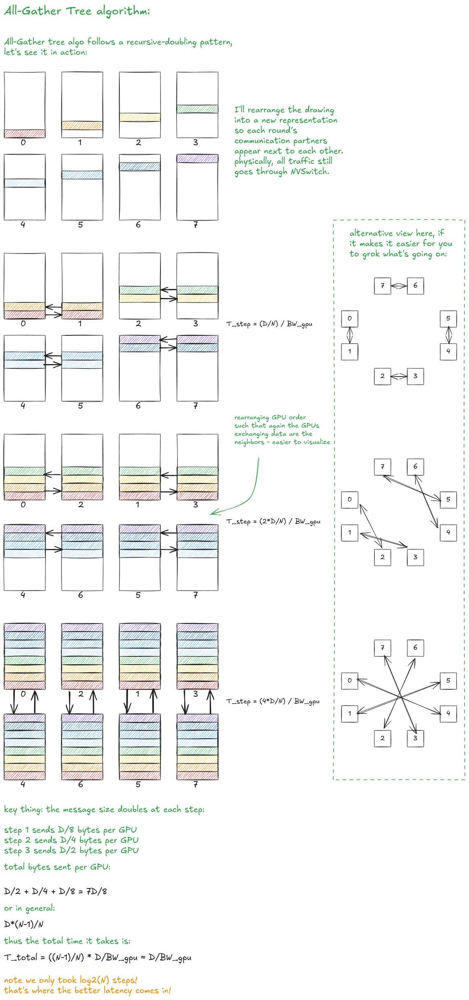

图 29：树形 All-Gather。

关于树形与环形算法的几点说明。

环算法和树算法都有步骤依赖，但环通常更容易流水线化。在一个环中，许多数据块可以持续地在环上流水传送，保持链路忙碌。递归倍增可以有更低的延迟复杂度，但对于大消息，由于其流水线友好性较差，可能达到比环更低的有效带宽。

在理想的带宽模型中，字节成本是相同的（如上图所示），但树形算法将通信轮次从 $N - 1$ 减少到 $\log_2(N)$。在实践中，对于大批量张量，环通常达到更高的有效带宽，因此像 NCCL 这样的库会根据消息大小和拓扑在环、树和混合算法之间做出选择。

为完整性考虑，以下是通过递归折半（recursive halving）实现的 Reduce-Scatter：

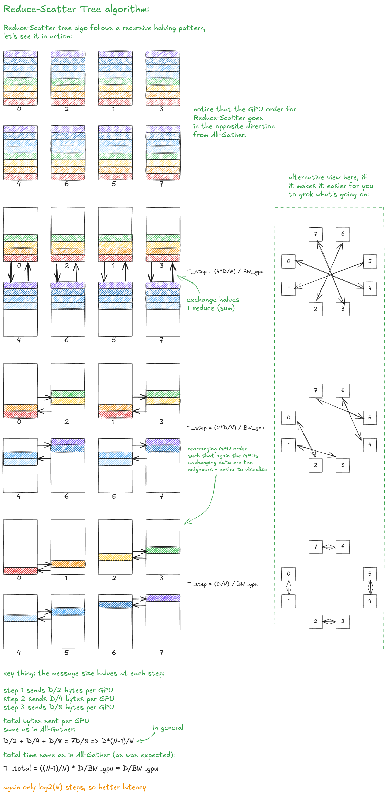

图 30：树形 Reduce-Scatter。

接下来，让我们看看当我们走出单个 GPU 节点进入跨节点场景时会发生什么变化。

## GPU 跨节点集合通信：基于 InfiniBand 的分层算法

由于需要在多个层级（节点级、SU 级、脊级）进行流水线化，算法的底层细节变得更加复杂。

一个好的思维模型是，想象在集群中的每个节点上运行一个跨节点环（多亏了无超额订阅/完全胖树，我们能够这样做）。

对于大消息，All-Gather 或 Reduce-Scatter 的一个良好一阶近似因此是（其中 $D$ 是以字节为单位的张量大小）：

$$T_{\text{total}} \approx D / \text{BW}_{\text{node}} = D / 4 \times 10^{11}$$

一个稍微更精确的模型还考虑了节点内阶段。在分层集合通信（hierarchical collectives）中，我们通常既有通过 IB 的横向扩展流量，也有通过 NVLink/NVSwitch 的本地流量，而这些阶段通常可以流水线化。因此总时间更接近两项中较慢的那个：

$$T_{\text{total}} \approx \max(D / \text{BW}_{\text{gpu}}, D / \text{BW}_{\text{node}})$$

让我们从第一个跨节点集合操作——All-Gather 开始：

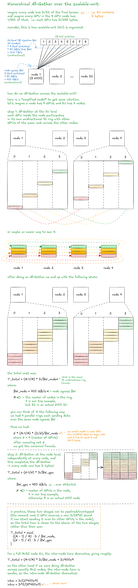

图 31：可扩展单元上的分层 All-Gather。

!!! tip "为什么没有脊交换机？"
    在这些示例中，我只展示在单个 SU 内的通信。加入脊架构并不会从质上改变算法，我们仍然会运行同样的分层集合操作（只是跨多一个拓扑级别）。但它确实会使可视化变复杂，因此我跳过脊级集合操作。

!!! tip "关于轨道优化（rail optimization）的说明"
    一个节点的聚合跨节点带宽并不总是可以在所有 GPU 之间完全互换（就像我上面分享的简化模型那样）。GPU 集群通常被组织为并行的网络轨道（rail），特定 GPU 拥有进入网络的首选路径。要达到完整的节点级带宽，因此需要轨道感知的 rank 放置以及跨这些路径的均衡流量。

接下来，让我们看分层 All-Reduce（我将跳过分层 Reduce-Scatter，因为其结构与分层 All-Gather 高度相似）：

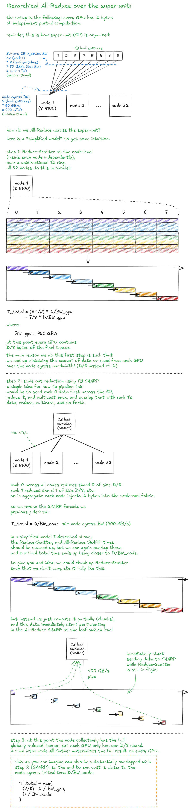

图 32：可扩展单元上的分层 All-Reduce。

有一个微妙之处：被 All-Reduce 的张量本身可能沿着另一条并行轴进行了分片。

例如，在 Megatron 风格的训练（张量/模型并行）中，一个权重矩阵可能沿张量并行轴 $Y$ 分片，而它的梯度则沿数据并行轴 $X$ 进行 All-Reduce。

All-Reduce 不会跨张量并行的 rank 执行。这些 rank 拥有不同的分片，因此它们之间没有可逐元素归约的内容。

相反，对于每个固定的张量并行分片，我们在对应的数据并行副本之间执行 AllReduce。

让我们通过一个具体示例来推演：

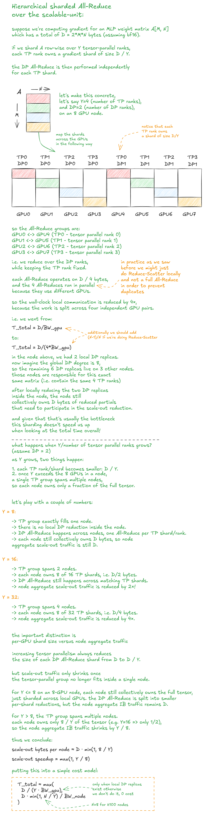

图 33：可扩展单元上的分层分片 All-Reduce。

最后，让我们看 SU 上的分层 All-to-All。

与 All-Reduce 不同，All-to-All 无法通过先进行本地归约来压缩（每个数据块都有特定的目的地）：

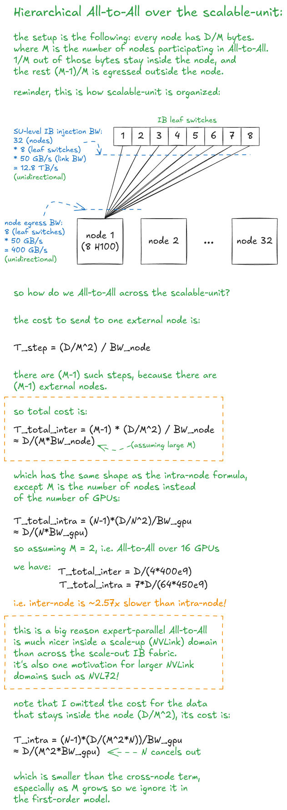

图 34：可扩展单元上的分层 All-to-All。

正如我们在 TPU 部分所做的，让我们把 GPU 成本模型汇总在一起：

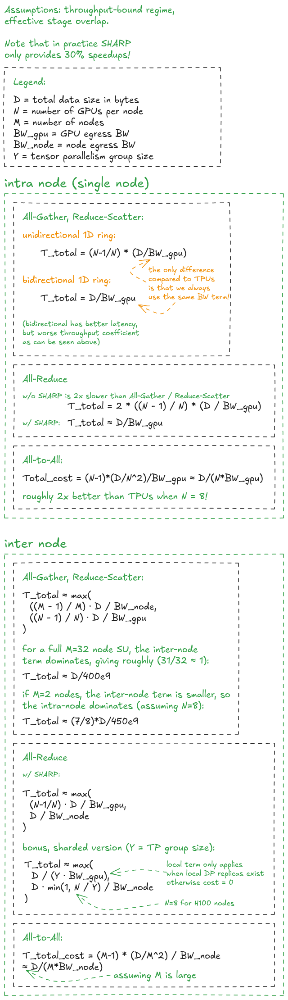

图 35：GPU 节点内和跨节点集合通信成本总结。

## 尾声

呜呼，这篇写得真长！

最初的想法是"让我做个四张图，分别覆盖 All-Gather、Reduce-Scatter、All-Reduce 和 All-to-All，应该一天就能搞定吧——对吧，对吧"，不知怎么变成了现在这个结果。

在这个过程中我意识到，只有当你理解了底层硬件拓扑时，集合算法才真正讲得通。TPU 相对容易理解一些，但我不能跳过 GPU——我太爱它们了。环很酷，但我也想理解树形算法。还有 SHARP，还有胖树，还有分层集合通信。:'）

于是范围一点一点地扩大，就这样，这篇博文逐渐成形——一段支线任务而已。

希望你读得开心！ :)

!!! tip "联系作者"
    如果你在文中发现任何错误，请直接私信我——欢迎通过 [X](https://x.com/gordic_aleksa) 或 [LinkedIn](https://www.linkedin.com/in/aleksagordic/) 或[匿名反馈](https://docs.google.com/forms/d/1z1fEirrN2xtGxAsJvptpM7yV4ByT5SF25S-XiMPrXNA/edit)给我留言。

## 致谢

感谢我的朋友们 [Aroun Demeure](https://github.com/ademeure)（Magic 前 GPU & AI 工程师，Apple 与 Imagination 前 GPU 架构师）、[Axel Feldmann](https://x.com/axel_s_feldmann)（Jane Street ML 性能工程师）和 [Pranjal Shankhdhar](https://x.com/pranjalssh)（xAI 前 GPU kernel 工程师）在本文预发布阶段阅读并提供了反馈！

Arun 将 GPU 讨论从均衡 All-to-All 扩展到更广泛的场景，强调了 NVL72 的任意到任意（any-to-any）拓扑、稀疏和不均衡的 MoE 路由，以及 NVLink SHARP 基于内存式组播/归约的模型和实际权衡。

Axel 通过强调轨道优化和 SHARP 带来的 SM/HBM 卸载优势，进一步完善了 GPU 部分，然后用 H100 实测数据落地了性能讨论：实际 SHARP 加速约 1.3×，集合带宽大约在 1 GB 附近达到饱和。

Pranjal 独立地再次强调了轨道优化、以及 SHARP 理论 2 倍加速与实践中通常观察到的约 30% 提升之间的差距。

有新文章发布时收到通知。

subscribe

## 参考文献

1. "TPU 8t and TPU 8i 技术深度解析"，[https://cloud.google.com/blog/products/compute/tpu-8t-and-tpu-8i-technical-deep-dive](https://cloud.google.com/blog/products/compute/tpu-8t-and-tpu-8i-technical-deep-dive)
2. "TPU 拓扑可视化工具"，[https://tpu-visualizer.uc.r.appspot.com/](https://tpu-visualizer.uc.r.appspot.com/)
3. "How to Scale Your Model"，[https://jax-ml.github.io/scaling-book/](https://jax-ml.github.io/scaling-book/)
4. "NVSwitch Hot Chips 2022"，[https://hc34.hotchips.org/assets/program/conference/day2/Network%20and%20Switches/NVSwitch%20HotChips%202022%20r5.pdf](https://hc34.hotchips.org/assets/program/conference/day2/Network%20and%20Switches/NVSwitch%20HotChips%202022%20r5.pdf)
5. "How to Scale Your Model: GPUs / intra-node collectives"，[https://jax-ml.github.io/scaling-book/gpus/#intra-node-collectives](https://jax-ml.github.io/scaling-book/gpus/#intra-node-collectives)
6. Axel 独立地在 32 GPU H100 InfiniBand 设置上使用 NCCL 2.29.7 重新运行了基准测试，印证了报告结果：他同样在 4 GB 的 All-Reduce 上仅观测到约 1.3× 加速。Pranjal 也报告了同样的结果。Arun 表示这更多是 NCCL 的问题而非 SHARP 的问题。
