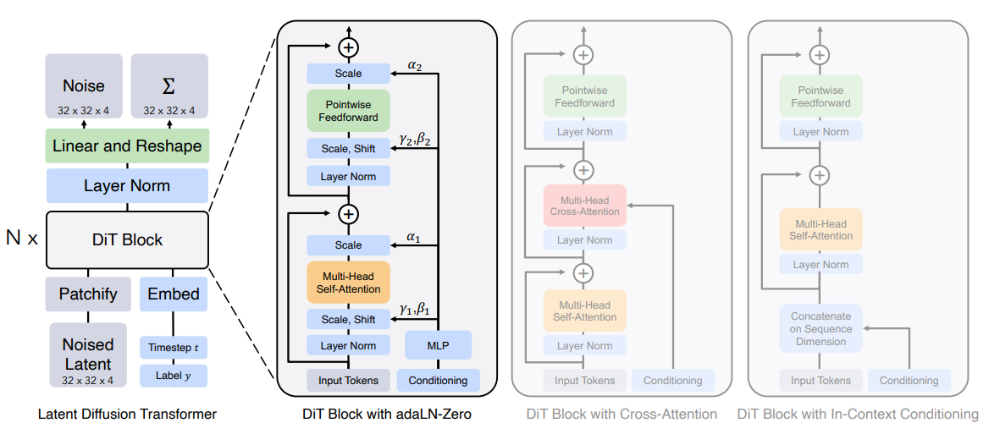
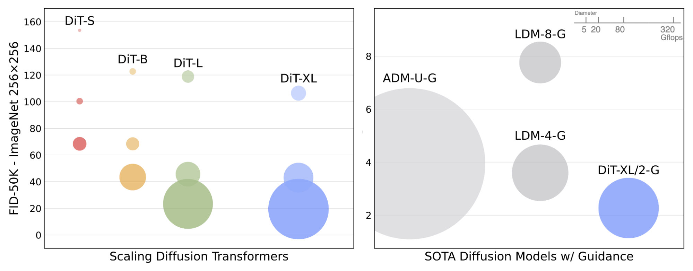

# Diffusion Transformer（DiT）模型：初学者指南

原文标题：Diffusion Transformer (DiT) Models: A Beginner's Guide  
原文作者：Akruti Acharya  
原文链接：https://encord.com/blog/diffusion-models-with-transformers/  
访问日期：2026-05-08  
原文发布日期：2024-03-18  
译文版本：v0.1

## 引言

Diffusion Transformer（DiT）是一类建立在 Transformer 架构之上的扩散模型。它由 UC Berkeley 的 William Peebles 与 NYU 的 Saining Xie 提出，核心目标是把扩散模型里常见的 U-Net 主干替换为 Transformer，以提升模型性能。

## 扩散模型简介

扩散模型（diffusion models）是一类生成模型。它们通过模拟一条马尔可夫链（Markov chain），把一个简单先验分布逐步变换成目标数据分布。这个过程有点像粒子进行布朗运动（Brownian motion）：每一步都只是一次小的随机游走，因此才被称为“扩散”模型。

扩散模型已经被用于多种任务，例如去噪（denoising）、超分辨率（super-resolution）和图像修复（inpainting）。它们最重要的优势之一，是能够生成高质量样本，因此在图像合成这类任务里尤其有用。

### 卷积式 U-Net 架构

[U-Net](https://arxiv.org/abs/1505.04597) 是一种卷积神经网络（Convolutional Neural Network, CNN），最初为生物医学图像分割提出。它的整体形状类似字母 U，因此得名。架构由两部分组成：一条用于提取上下文信息的收缩路径（encoder），以及一条用于精确定位的对称扩张路径（decoder）。

U-Net 的一个关键特征，是把下采样路径中的特征图，与上采样路径中的对应特征图进行拼接。这样网络就能同时利用上下文信息与定位信息，从而做出更准确的预测。

### 视觉 Transformer

视觉 Transformer（Vision Transformer, ViT）是计算机视觉中的一类较新方法。它将原本为自然语言处理任务设计的 Transformer 应用于图像分类任务上。与传统 CNN 按层级方式处理图像不同，ViT 把图像视为一串 patch 序列，并建模这些 patch 之间的全局依赖关系。

这种机制使 ViT 能够捕捉长距离、像素级别的交互。ViT 的一个重要优势在于可扩展性（scalability）：它可以在大规模数据集上训练，也能够从更大的输入图像分辨率中获益。如果你想补充背景，可以参考 Encord 的 [Introduction to Vision Transformers (ViT)](https://encord.com/blog/vision-transformers/)。

### 无分类器引导

无分类器引导（classifier-free guidance）指的是：在不依赖显式分类器的前提下，引导模型的学习过程。它可以通过多种方式实现，例如自监督学习（self-supervision），让模型从数据的一部分预测另一部分；或者通过强化学习（reinforcement learning），让模型学习执行能最大化奖励信号的动作。

这种方法在标注数据稀缺或获取成本高昂时尤其有价值，因为它允许模型直接从数据本身学习有用表示，而不必依赖明确标签。

## 理解潜变量扩散模型（LDM）

潜变量扩散模型（Latent Diffusion Models, LDMs）也是一类生成模型。它们把数据生成过程建模为扩散过程：从一个简单先验开始，例如高斯噪声，再经过一系列小步逐渐逼近目标分布。每一步都由一个神经网络引导，该网络被训练来反转扩散过程。LDM 已经在图像、文本和音频等领域生成出高质量样本。对应论文可见 [High-Resolution Image Synthesis with Latent Diffusion Models](https://arxiv.org/abs/2112.10752)。

### 卷积式 U-Net 主干的不足

卷积式 U-Net 长期以来一直是许多视觉任务的主力架构，因为它擅长捕捉局部特征，同时保留空间分辨率。但它也有明显限制。首先，它往往不擅长建模输入中的长距离依赖和全局上下文，因为卷积层的感受野天然是局部且有限的；如果想扩大感受野，就需要更深的网络和更大的卷积核，而这又会带来新的训练和计算挑战。

另外，U-Net 中的卷积操作具有平移不变性（translation invariance），也就是说，不管某个特征出现在图像的什么位置，它都会被以相同方式处理。这在很多任务里是优点，但在“绝对位置”本身很重要的场景下，反而会成为劣势。

### 向 Transformer 主干迁移

Transformer 最初是为自然语言处理任务设计的，但后来也在视觉任务中展现出很大潜力。与卷积网络不同，Transformer 不需要依赖更深网络或更大卷积核，就可以建模长距离依赖，因为它采用了自注意力机制（self-attention）：输入中的每个元素都可以直接与所有其他元素交互，而不受距离限制。

此外，Transformer 并不具备卷积那种平移不变性，因此它有能力建模特征的绝对位置。通常这是通过位置编码（positional encodings）实现的，位置编码会显式告诉模型每个元素在输入中的位置。

### 潜在 patch 的演化

“潜在 patch”这一概念的出现，源于让 Transformer 能够在高分辨率图像上计算可行的需求。直接把 Transformer 作用在原始高分辨率像素上，计算成本会非常高，因为自注意力的复杂度会随着元素数量二次增长。

为了解决这个问题，图像会切分为许多小 patch，然后 Transformer 作用在这些 patch 上。这样可以显著减少元素数量，从而降低计算复杂度。与此同时，Transformer 仍然能够在 patch 内部建模局部特征，也能在 patch 之间建模全局上下文。

### Diffusion Transformer（DiT）与 Vision Transformer（ViT）的区别

DiT 与 ViT 都以 Transformer 为主干，也都工作在潜在 patch 之上，但它们在图像生成方式和具体架构细节上并不相同。

#### Diffusion Transformer（DiT）

DiT 把 Transformer 用在潜变量扩散过程中：一个简单先验，例如高斯噪声，会被逐步变换为目标图像。这个过程通过一个 Transformer 网络来反转扩散步骤完成。

DiT 中一个重要概念是扩散时间步（diffusion timesteps）。这些时间步表示扩散过程所处的阶段，而 Transformer 网络会在每个阶段都对当前时间步进行条件化。这样，模型就能在不同扩散阶段生成不同类型的特征。DiT 还可以进一步对类别标签（class labels）做条件化，从而生成特定类别的图像。

#### Vision Transformer（ViT）

ViT 则是以更自回归（autoregressive）的方式直接生成图像：一个个 patch 依次被生成，每个 patch 都依赖于之前已经生成的 patch。

ViT 的一个关键组件是自适应层归一化（adaptive layer norm, adaLN）。这类层会根据当前 batch 的统计特征，自适应地缩放与平移中间特征，从而帮助稳定训练并提升模型表现。

两种方法各有优势和局限，但它们都代表了把 Transformer 用到图像生成中的两条重要路线。到底选 DiT 还是 ViT，要看具体任务的需求。

例如，如果任务需要生成某些特定类别的图像，那么 DiT 往往更合适，因为它能够直接对类别标签做条件化。另一方面，如果任务更关注高分辨率图像生成，那么 ViT 可能更适合，因为它使用的 adaLN 层有助于稳定大模型训练。

## 可扩展的 Transformer 扩散模型

可扩展的 Transformer 扩散模型（Scalable Diffusion Models with Transformers, DiT）利用 Transformer 来处理大规模数据上的复杂任务。它们的可扩展性体现在：当输入规模增大时，模型仍能维持甚至提升性能。因此，它们很适合处理自然语言处理、图像识别，以及其他输入规模波动很大的任务。

下面是几项典型特征。

### Gflops：前向计算量度量

Gflops 是 gigaflops 的缩写，用来衡量计算机进行浮点运算的能力。在机器学习和神经网络的语境里，前向传播的 Gflops 估计非常重要，因为它近似描述了完成一次前向传播所需的计算资源。

当网络规模很大，或者输入数据本身就很大时，这个指标尤其关键，因为计算效率会直接影响训练的可行性和速度。较低的 Gflops 通常意味着在计算资源上更高效，这在资源受限环境或实时应用中尤为重要。

### 网络复杂度与样本质量

神经网络的复杂度通常与它生成样本的质量直接相关。更复杂的网络，例如层数更多、每层神经元更多的网络，往往能生成更高质量的样本。但复杂度提升总是有代价的：它需要更多显存和算力，训练耗时也更长。

相对地，更简单的网络在计算上更高效、训练更快，但它们对数据细节的刻画能力可能不足，从而导致生成质量下降。如何在网络复杂度与样本质量之间找到合理平衡，是设计高效神经网络时的核心问题之一。

### 变分自编码器（VAE）的潜空间

在变分自编码器（Variational Autoencoder, VAE）中，潜空间（latent space）是一个比输入空间更低维的表示空间，输入数据会先被编码到这里。这其实是一种降维过程：高维输入被压缩成低维表示。

潜空间需要尽量保留数据的核心特征，而新样本也是从这个潜空间中经解码过程生成出来的。VAE 输出质量在很大程度上取决于潜空间是否足够好地捕捉了输入数据的底层结构。如果潜空间太小，或者结构不好，那么 VAE 往往难以生成高质量样本；如果潜空间大小合适且组织良好，那么它就可以生成能真实反映数据特征的高质量样本。

### DiT 的可扩展性

可扩展性是 Diffusion Transformer 的一个重要特征。随着输入数据规模增大，模型应当尽可能维持甚至提升性能。这既要求对计算资源的高效利用，也要求生成样本质量能够保持稳定。

例如在自然语言处理任务中，输入数据也就是文本的长度，可能会有很大波动。一个真正可扩展的 DiT 模型，应当能够处理这种长度变化，而不会出现显著性能退化。并且，随着可用数据规模持续增长，DiT 是否能够有效扩展，只会变得越来越重要。对应论文为 [Scalable Diffusion Models with Transformers](https://arxiv.org/abs/2212.09748)。

## DiT 的扩展方法

DiT 的扩展方式可以归纳为两种：扩展模型大小，以及扩展 token 数量。

### 扩展模型大小

扩展模型大小，指的是提升模型复杂度，常见方式包括增加层数，或者增加每层神经元数量。这通常会提升模型捕捉复杂模式的能力，因此也可能带来更好的性能。

但与此同时，它也会增加训练和推理所需的计算资源。因此，模型大小与计算效率之间仍然需要权衡。

### 扩展 token 数量

扩展 token 数量，指的是让模型能够处理更大的输入规模。这一点在自然语言处理等任务中尤其重要，因为输入文本长度往往波动很大。

通过扩展 token 数，DiT 可以在面对更长输入时仍保持较好性能。但与扩展模型大小类似，这同样会增加计算成本，因此也需要平衡。

## Diffusion Transformer 的一般化架构

### 空间表示

模型首先通过网络层接收空间表示（spatial representations），并把空间输入转换成一串 token 序列。这样一来，模型就能处理图像数据中的空间信息。这一步非常关键，因为它把原始输入变换成了 Transformer 可以高效处理的形式。

### 位置嵌入

位置嵌入（positional embeddings）是 Transformer 架构中的关键组成部分。它为模型提供每个 token 在序列中的位置信息。

在 DiT 中，基于 Vision Transformer 的标准位置嵌入会被加到所有输入 token 上。这个过程帮助模型理解图像不同部分之间的相对位置和关系。

### DiT Block 设计

这张结构图对应论文中的 DiT 架构示意，可参考 [Diffusion Transformer Architecture](https://arxiv.org/pdf/2212.09748.pdf)。

在典型扩散模型中，通常由 U-Net 卷积神经网络来学习估计图像中需要去除的噪声。而在 DiT 中，这个 U-Net 被 Transformer 取代。这说明扩散模型的性能并不一定依赖 U-Net 自带的归纳偏置（inductive bias）。

DiT block 在处理条件信息时可以采用几种不同方式：

- `In-context Conditioning`：通过自适应层归一化（adaLN）把条件信息注入模型。
- `Cross-attention Block`：通过交叉注意力（cross-attention）连接扩散网络与图像编码器，使模型同时捕捉局部与全局信息。
- `Conditioning via Adaptive Layer Norm`：使用 adaLN 对文本表示进行条件化，从而以较高参数效率适配扩散网络。
- `Conditioning via Cross-attention`：通过交叉注意力，让注意力层在不同去噪阶段动态调整行为。
- `Conditioning via Extra Input Tokens`：这一方式在文中着墨不多，但给出的经验事实是：当 DiT 通过增加 Transformer 深度、宽度或输入 token 数获得更高 Gflops 时，FID 往往会稳定下降。

### 模型规模

DiT 模型范围大约在 3300 万到 6.75 亿参数之间，对应 0.4 到 119 Gflops。其缩放策略借鉴了 ViT 领域的经验：同时增加深度和宽度，通常效果较好。

### Transformer 解码器

这一小节以 `Transformer Decoder` 为题，核心意思是：用 Vision Transformer 取代原先的 U-Net，并再次强调扩散模型性能并不一定依赖 U-Net 的归纳偏置。

### 训练与推理

训练时，扩散模型接收三个主要输入：一张已经加入噪声的图像、一个描述性嵌入（descriptive embedding），以及当前时间步的嵌入。系统学习如何在连续时间步中利用描述性嵌入逐步去噪。

推理时，模型从纯噪声和描述性嵌入开始，按照该条件信息迭代地去除噪声，最终生成图像。

### 评估指标

DiT 的输出质量主要通过 Fréchet Inception Distance（FID）评估。它衡量的是生成图像分布与真实图像分布之间的差异，数值越低越好。

作为一组说明可扩展性的例子：在 256×256 的 ImageNet 图像上，一个仅有 6 Gflops 的小型 DiT 模型可以达到 68.4 FID；80.7 Gflops 的大型 DiT 可以达到 23.3 FID；最大的 119 Gflops 模型则达到 9.62 FID。作为对照，一个使用 U-Net 的 latent diffusion model，在 104 Gflops 下达到 10.56 FID。

## DiT-XL/2：已训练模型版本

DiT-XL/2 是 Meta 公开的一组生成模型。它们在 ImageNet 数据集上训练。名称中的 `XL/2` 指的是模型训练时对应的分辨率设置，这里主要提到两个版本：512×512 和 256×256。

### ImageNet 上的 512×512 版本

在 512×512 分辨率下训练的 DiT-XL/2，使用的 classifier-free guidance scale 为 6.0，训练过程持续了 300 万步。这个高分辨率版本主要面向细节更复杂的图像。

### ImageNet 上的 256×256 版本

在 256×256 分辨率下训练的 DiT-XL/2，使用的 classifier-free guidance scale 为 4.0，训练过程持续了 700 万步。这个版本针对标准分辨率图像进行了更高效的优化。

### 两种分辨率下的 FID 对比

256×256 版本的 DiT-XL/2 在当时超过了所有先前扩散模型，达到 2.27 的 SOTA FID-50K，而此前最优的 LDM（256×256）为 3.60。

在计算效率方面，这里给出的数字是：DiT-XL/2 需要 119 Gflops，LDM-4 为 103 Gflops，ADM-U 为 742 Gflops。严格来说，更准确的表述是：DiT-XL/2 在接近的计算预算下达到了更好的 FID，而相对于 ADM-U 则明显更省算力。

这张缩放对比图同样来自 [Scalable Diffusion Models with Transformers](https://arxiv.org/pdf/2212.09748.pdf)。

在 512×512 分辨率下，DiT-XL/2 同样超过了此前所有扩散模型：它把 ADM-U 的最佳 FID 从 3.85 提升到 3.04，同时只需要 525 Gflops，而 ADM-U 则需要 2813 Gflops。

模型体验与代码入口分别是 [GitHub](https://github.com/facebookresearch/DiT)、[HuggingFace Space](https://huggingface.co/spaces/wpeebles/DiT) 和 [Colab Notebook](https://colab.research.google.com/github/facebookresearch/DiT/blob/main/run_DiT.ipynb)。

## Diffusion Transformer 的应用

DiT 最显著的应用之一是图像生成，但它也提到一些更泛化的使用方向，例如文本摘要、聊天机器人、推荐系统、机器翻译和知识库等。下面是原文举出的几个采用 diffusion transformer 架构的代表模型。

### OpenAI 的 SORA

OpenAI 的 SORA 是一个能够根据文本指令生成逼真且富有想象力场景的 AI 模型。它本质上是一个扩散模型：先从类似静态噪声的视频开始，再通过多步逐渐去噪，把它变成符合提示词的视频。

SORA 最长可以生成接近 1 分钟的视频，同时保持较高视觉质量和对提示的遵循度。它既可以一次性生成完整视频，也可以对已生成视频做续写，延长其长度。相关资料可见 OpenAI 的 [Video generation models as world simulators](https://openai.com/research/video-generation-models-as-world-simulators)，以及 Encord 的 [OpenAI Releases New Text-to-Video Model, Sora](https://encord.com/blog/open-ai-sora/)。

### Stable Diffusion 3

Stable Diffusion 3（SD3）是 Stability AI 推出的高级文生图模型。它把 diffusion transformer 架构与 flow matching 结合起来，从文本描述生成高质量图像。

在人类偏好评测中，SD3 在排版能力（typography）与提示词遵循度（prompt adherence）方面超过了当时的一些主流系统，例如 DALL·E 3、Midjourney v6 和 Ideogram v1。进一步可参考 [Scaling Rectified Flow Transformers for High-Resolution Image Synthesis](https://stabilityai-public-packages.s3.us-west-2.amazonaws.com/Stable+Diffusion+3+Paper.pdf) 与 Encord 的 [Stable Diffusion 3: Multimodal Diffusion Transformer Model Explained](https://encord.com/blog/stable-diffusion-3-text-to-image-model/)。

### PixArt-α

PixArt-α 是一个基于 Transformer 的文生图（Text-to-Image, T2I）扩散模型。按照文中的表述，它的图像生成质量已经可以与当时最先进的生成器，例如 Imagen、SDXL，甚至 Midjourney 相竞争，并接近商业可用水平。

PixArt-α 支持最高 1024px 分辨率的图像合成，而且训练成本较低；它在图像质量、艺术性和语义控制方面表现突出。对应论文为 [PixArt-α: Fast Training of Diffusion Transformer for Photorealistic Text-to-Image Synthesis](https://arxiv.org/abs/2310.00426)。

## 关键结论

- `扩散模型新范式`：Diffusion Transformer（DiT）是一类把 Transformer 作为主干的扩散模型。
- `核心改动`：DiT 的关键思路，是把传统扩散模型里常见的 U-Net backbone 替换成 Transformer。
- `可扩展性突出`：随着 Gflops 提升，DiT 往往能持续获得更低的 FID，表现出很强的缩放特性。
- `应用范围广`：DiT 已经出现在文本到视频、文本到图像等多类生成模型中，例如 SORA、Stable Diffusion 3 和 PixArt-α。
