# 从零实现浮点运算：困难模式

Julia Desmazes

我得先坦白一件事：浮点运算让我害怕。

大约五年前，我决定要亲手实现一些浮点运算。当时这看起来还算轻松——毕竟浮点无处不在，能有多难呢？在那之前我的经验一直是：只要肯花足够的时间和脑力死磕一个问题，我大体上都能搞明白。

正是抱着这种心态，我遭遇了此生最彻底的一次技术溃败。从这场彻底的摧毁之中，诞生了我如今对浮点的恐惧。

五年之后，我决定是时候复仇了，是时候直面我的恶龙！

但这一次，我不会只满足于浮于表面的理解，这一次我要真正吃透浮点数的表示方式。

当我踏上这场征途时，曾坚信世上只有三类人真正懂浮点：

1. 写规范（spec）的人
2. 研究浮点表示的数学博士们
3. 造浮点硬件的人

**欢迎来到第二回合！**

推荐阅读配乐：[微分音数学摇滚（microtonal math rock）](https://www.youtube.com/watch?v=0Ssi-9wS1so)。

# 第一章：坠入疯狂

回过头看，我过去惨败的一个主因，是我把"会用浮点"误当成了"理解浮点"的标志。这让我免除了投入时间钻研浮点的必要，仿佛我会在过程中顺手就学会了似的。

所以现在，是时候把电脑放到一边，与纸张为伴十天了。（你记得的，那种白色的东西。）

## 浮点运算是如何工作的

我假定读者已经对浮点是什么有了一些表面层面的了解，所以基础入门我就略过了。

让我先定几个定义。在本文的讨论语境中，**规格化（normal）** 浮点数定义为：

$$(-1)^{S} \times 2^{E-b} \times (1 + T \cdot 2^{1-p})$$

其中 $S$、$E$、$T$ 三个字段的值，就是存放在浮点各个字段里的东西：

- $S$：符号位（sign bit）
- $E$：带偏移的指数（biased exponent）
- $T$：尾数的有效数部分（trailing significand field）

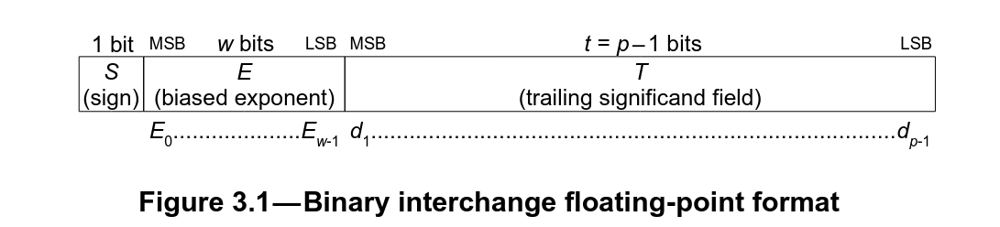

*IEEE 754-2019 第 3 节的浮点布局*

这些字段的大小，以及 $b$（指数偏移，exponent bias）和 $p$（精度，precision）的取值，都取决于具体的浮点格式。

例如，对于 IEEE 754 单精度（`float32_t`），我们有：

- $b = 127$
- $p = 24$

于是得到：

$$(-1)^{S} \times 2^{E-127} \times (1 + T \cdot 2^{-23})$$

在本文中，我们称：

- sign（符号）：即 $S$ 符号位
- exponent（指数）：存放在带偏移指数字段 $E$ 中的值
- significand / mantissa（有效数 / 尾数）：存放在 $T$ 字段中的值

**有效数（Significand）与尾数（Mantissa）**

严格来说，"mantissa（尾数）"这个词并不严谨，因为这并非对数表示法，它本应被称为 **significand（有效数）**。但台下的程序员同行们会理解：既然符号位已经占用了我们单字母命名体系里的 $s$，我们别无选择，只能让步，把它叫做 $m$（mantissa，尾数）。在本文中，我会交替使用 mantissa 和 significand 这两个词。

## 你绝不想知道的事

我们其实并不关心抽象的浮点，而是关心程序里通常所说的 "float"。

在所有可能的浮点类型构成的世界里，这些就是"香草味"的基础款——只不过在这个世界里，所有人都还一直想要香草味！

这种 float 格式被 IEEE 在 IEEE 754 规范中标准化了。在这本"圣杯"里，预期行为被事无巨细地规定下来，使得用户可以在不同平台上期待相同的浮点操作行为——这正是让 float 可移植的基石。

而且，地狱也正是从这里开始的！

### +0 / -0

让我们慢慢开始下沉。

最敏锐的读者大概已经从（值得掌声的）表示格式里注意到了：我们有一个货真价实的符号位。这意味着我们实际上有两种零的表示：$+0.0$ 和 $-0.0$。

有趣的地方在于，关于该用哪个零，我们是有规则的。例如，考虑如何判断两个浮点数是否相等，比如 `X == Y`？

做这个比较时，我们通常会复用加法器，计算 `X - Y`，然后检查结果的所有位是否都为 0。但问题在于，$-0.0$ 的符号位是 1。

所以我们才有关于结果该用 $+0.0$ 还是 $-0.0$ 的规则，而"两个相等的浮点数相减"正是这种规则的一个例子：

$$X - X = +0.0$$

### NaN

`NaN` 即 Not a Number（非数）。

如果你以为我们在讨论的是"数"，那么此刻你开始明白"数"与"表示格式"之间的区别了。

先说好玩的部分：NaN 其实有不同类型：

- **安静的 NaN（quiet NaN，qNaN）**：你糟糕的数学运算通常会撞上的那种。
- **会发信号的 NaN（signaling NaN，sNaN）**：糟糕的数学并不会产生它，而且只要它作为操作数出现，就会通过触发"无效操作"异常（invalid operation exception）对你大喊大叫。大多数人碰不到它们。

那么，我所说的"qNaN 用于表示某个算术操作的结果无法被表示"是什么意思？

下面举几个例子澄清：

- $\sqrt{-1.0}$ 会得到 qNaN，因为 $\sqrt{-1.0} = i$，而 $i$ 是虚数，没有复数表示就无法表达。
- $\frac{0.0}{0.0}$ 也会得到 qNaN，因为：你到底在干什么？
- $+\infty - \infty$ 同样会得到 qNaN，因为 $\pm\infty$ 其实是极限，不是数。而从一个极限减去另一个极限 $+\infty - \infty$ 根本讲不通。

想知道关于 qNaN 的另一个趣闻吗？

它们会"传染"。

以 qNaN 作为操作数的算术运算，结果还是 qNaN。

想想看：一个结果根本无法被表示的操作，你该给它什么结果？

在内存中，NaN 的指数位全部置 1，并且有效数位至少有一位被置 1。然后你可以根据哪些有效数位被置 1 来区分不同的 NaN——至于具体怎么编码，则由实现者自行决定。

### 无穷大（Infinity）

我们在讲 NaN 时已经顺带引入了它们，但浮点表示里还容纳了两种无穷记法：一个是 $+\infty$，另一个是它的镜像 $-\infty$。它们不是数，无穷不是数，它是极限！

依据 IEEE，某些特定的无穷可以用于算术运算、可以作为布尔运算的输入、也可以作为计算的结果产生。

在内存中，无穷的指数位全部为 1，而为了和 NaN 区分开，它们的有效数位全部为 0。

### 非正规数（Denormal）

先把无穷和 NaN 搁在一边，重新只谈"数"。

在导言里，我把规格化浮点数定义为：

$$(-1)^{S} \times 2^{E-b} \times (1 + T \cdot 2^{1-p})$$

一种更常见的写法是：

$$(-1)^{S} \times 2^{e} \times m$$

其中 $m$ 是一个形如 $d_0 . d_1 d_2 ... d_{p-1}$ 的数串，长度为 $p$（$p$ 即精度，或者说有效数位加 1）。

例如，$1.5$ 写作：

$$(-1)^0 \times 2^{0} \times 1.1000_2$$

而 $3$ 则是 $2 \times 1.5$：

$$(-1)^0 \times 2^{1} \times 1.1000_2$$

在我们的规格化浮点表示里，$(1 + T \cdot 2^{1-p})$ 中的 $d_0$ 始终被置为 $d_0 = 1$。

现在有趣的事来了：我们的有效数其实只有 $p-1$ 位，而 $d_0$ 其实是一个推断出来的位，我们称之为 **隐藏位（hidden bit）**。

看起来够简单了？浮点里终于能有点简单的东西了？！

别高兴得太早：浮点可不会这样放过你，因为我们还有另一类数！

它们的隐含隐藏位被置为 $d_0 = 0$，被称为 **次正规数（subnormal numbers，也叫 denormal numbers）**。耶 🥳

它们用来编码可表示的最小浮点数，并且是 [IEEE 754 规范在制定过程中最具争议的部分](https://people.eecs.berkeley.edu/~wkahan/ieee754status/754story.html)。

它们实现起来也极其麻烦，以至于很多早期 FPU 会对次正规数触发陷阱（trap），转由软件处理……慢得要命……

那么，除了不想浪费一些比特位之外，我们为什么要忍受它们？

罪魁祸首：**渐进下溢（gradual underflow）**。

#### 渐进下溢

渐进下溢的思路，是在超过最小可表示规格化数 $2^{-(b+1)-p+1}$ 之后，延缓精度的丢失，而不是让它戛然而止。这有助于数值稳定性。

为了说明我的意思，假设我们没有次正规数，设 $x$ 和 $y$ 是两个不相等的浮点数（$x \neq y$）。如果 $x - y$ 落在 $0.0$ 与最小可表示浮点数之间，由于该区间内没有任何可表示的数，它就会下溢到 $0.0$。

例如，使用不带次正规数的 float16：

```
0.000091552734375 - 0.0000762939453125 = 0.0
```

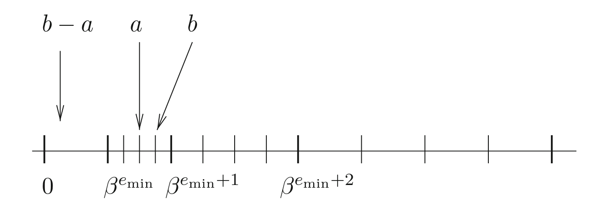

*Credit: Handbook of Floating-Point Arithmetic, Second Edition*

而当我们加入次正规数，实际上就填上了这个空隙。

例如，使用带次正规数的 float16：

```
0.000091552734375 - 0.0000762939453125 = 0.0000152587890625
```

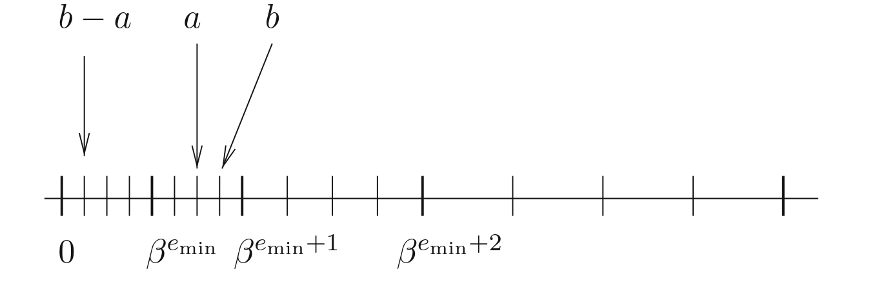

*Credit: Handbook of Floating-Point Arithmetic, Second Edition*

有了次正规数，我们的系统就继承了下面这个有趣的性质：对于任意 $x \neq y$ 的浮点数 $x$ 和 $y$，$x - y$ 必然非零。

额外好处：我们还多了一层对"除零"的防护：

```C++
if ( x != y ) z = 1.0 / ( x - y );

```

### 舍入模式（Rounding modes）

什么能表示、什么不能表示，其范围因类型而异：比特越多，可表示值的空间越大；反之，类型越小，可能的取值越少。

以 IEEE 16 位半精度 `float16_t` 为例，它有 5 位指数和 10 位有效数——猜怎么着：它没法表示 `15359`！

那么当我们试图把它设为 `15359` 时会发生什么？

```C++
float16_t e = 15359.0;
cout << e << endl;

```

答案是 42。

严肃点说，这取决于：我们用的是哪种舍入模式？

IEEE 规范定义了合规硬件应当支持的 5 种舍入模式：

- `RD`：向 $-\infty$ 舍入（round downward towards $-\infty$）：结果是小于等于精确结果的最大可表示浮点数
- `RU`：向 $+\infty$ 舍入（round towards $+\infty$）：结果是大于等于精确结果的最小可表示浮点数
- `RZ`：向 $0.0$ 舍入（round towards $0.0$），任何情况都如此
- `RN_even / RN_away`：就近舍入（round to nearest）：结果是最近的可能值，当数字恰好落在两数正中间时用 tie-breaking 规则打破平局：
  - `even`（向偶数舍入，round ties to even）：选择有效数最低有效位（尾数）为 0 的那个数。
  - `away`（向远离零舍入，round ties to away）：选择下一个相邻的浮点数。

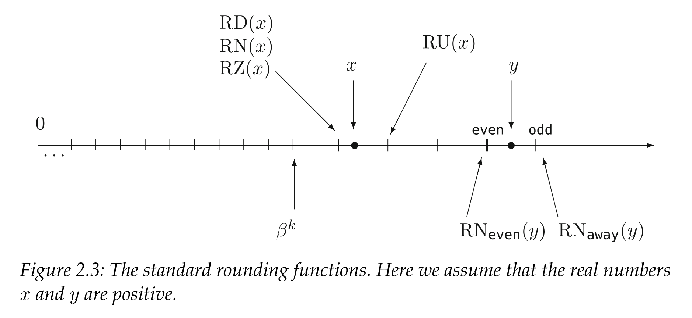

*Credit : Chapter 2 of Handbook of Floating-Point Arithmetic, Second Edition*

回到我们的例子，`15359` 不是 `float16_t` 可表示的数，最接近的两个数是 `15352` 和 `15360`。

所以根据我们使用的舍入模式，会得到：

| 舍入模式 | 结果 |
| --- | --- |
| RD | 15352 |
| RZ | 15352 |
| RU | 15360 |
| RN (even) | 15360 |

`RN_even` 是现代系统上 IEEE 默认的舍入模式行为，也正是 C++ 的 [`FE_TONEAREST`](https://en.cppreference.com/w/cpp/numeric/fenv/FE_round.html) 舍入模式所规定的。

### 舍入模式的边界行为

回想一下，我在描述舍入模式的行为时，并没有系统地用"数"来称呼舍入结果？这是因为有些舍入模式会让结果舍入进 $\pm\infty$。

例如，在 `float16_t` 上使用 `RU` 舍入：

```C++
float16_t x, y, z;
x = 65504;
y = 1;
fesetround(FE_UPWARD);
z = x + y;
cout << x << " + " << y << " = " << z << endl;

```

会得到：

```text
65504 + 1 = inf
```

类似地：

```C++
float16_t x, y, z;
x = -65504;
y = 1;
fesetround(FE_DOWNWARD);
z = x - y;
cout << x << " - " << y << " = " << z << endl;

```

会向下舍入到 $-\infty$：

```text
-65504 - 1 = -inf
```

结合起来，这些定义意味着：使用 `RU` 的运算永远不会抵达 $-\infty$，而使用 `RD` 的运算永远不会抵达 $+\infty$。

```C++
float16_t x, y, zsub, zadd;
x = 65504;
y = 1;
fesetround(FE_UPWARD);
zsub = -x - y;
cout << -x << " - " << y << " = " << zsub << endl;
fesetround(FE_DOWNWARD);
zadd = x + y;
cout << x << " + " << y << " = " << zadd << endl;

```

结果：

```text
-65504 - 1 = -65504
65504 + 1 = 65504
```

现在好玩的地方来了——`RZ`。因为它对正数表现得像 `RD`、对负数表现得像 `RU`，这意味着使用这种舍入模式的运算**永远无法**抵达 $\pm\infty$。

读到这，你可能会觉得我对舍入模式极限行为的突然执念有点莫名其妙。请先坐稳，相信我，本文后面我们会利用这个行为。

### 无序（Unordered）

在我们的代码里比较浮点值是很常见的，基本的布尔比较运算由 IEEE 754 规范规定。两个数之间可以是小于、等于或大于的关系。

但如果比较的一边是 `NaN` 呢？如果 `x` 是 NaN，我们还能比较 `x > y` 吗？如果能，结果是什么？

> 四种互斥的关系皆有可能：小于、等于、大于，以及无序（unordered）；只要至少有一个操作数是 NaN，就会出现无序。每一个 NaN 都应与**一切**比较为无序，包括它自己。
>
> IEEE 754-2019, section 5.11

所以，任何对 `NaN` 的比较都是无序的，这是一个相当有趣的性质，意味着只要涉及 `NaN`，就根本不存在顺序关系。

下面是这个关系在起作用：

```C++
float16_t x, y;
x = NAN;
y = 1.0;
cout << "x =/= x:   " << ((x!=x)  ? "true" : "false") << endl;
cout << "x > x:     " << ((x>x)   ? "true" : "false") << endl;
cout << "x <= x:    " << ((x<=x)  ? "true" : "false") << endl;
cout << "x > y:     " << ((x>y)   ? "true" : "false") << endl;
cout << "x <= y:    " << ((x<=y)  ? "true" : "false") << endl;

```

结果：

```text
x =/= x:   true
x > x:     false
x <= x:    false
x > y:     false
x <= y:    false
```

其副作用是，我们对"比较关系理应如何运作"的一些基本假设开始崩塌，最著名的莫过于：

$$\text{not}(x < y) \Leftrightarrow (x \ge y)$$

[三分律（trichotomy）](https://en.wikipedia.org/wiki/Law_of_trichotomy) 崩塌了，我们再也回不去了！


*Floating point K.O*

## 加法器示例

好，那这到底是怎么工作的？

既然例子胜过千言（虽然本文显然没太遵循这句谚语），那就上代码！

下面是一个用 C 语言展示浮点加法各步骤的示例。这段代码仅用于说明目的，部分边界情况被略去了。

用 `bfloat16` 类型实现的 C 语言浮点加法：

```C

#include <stdint.h>
#include <stddef.h>
#include <stdfloat>
#include <stdbool.h>
#include <stdlib.h>
#include <stdio.h>

/*******
 * Env *
 *******/

/* Assert. */
#define assert(cdt) ({if (!(cdt)) {printf("%s:%s : assert(%s) failed.\n", __FILE__, __LINE__, #cdt); abort();}})

#ifdef DEBUG
#define check(cdt) ({if (!(cdt)) {printf("%s:%s : check(%s) failed.\n", __FILE__, __LINE__, #cdt); abort();}})
#else
#define check(cdt) ({;})
#endif

#define swap(a, b) ({auto _ = b; b = a; a = _;})

typedef bool u1;
typedef uint8_t u8;
typedef uint16_t u16;
typedef uint64_t u64;

typedef std::bfloat16_t bfloat16_t;

/*********
 * Types *
 *********/

typedef struct bf16 bf16;

/**************
 * Structures *
 **************/

/*
 * Bfloat 16.
 */
struct bf16 {
	union {
		struct {
			u16 frc:7;
			u16 exp:8;
			u16 sig:1;
		};
		u16 raw;
	};
};

/*
 * Special values.
 */

/* Special exponent. */
#define BF16_EXP_SPC 0xff

/* Special nummber : infinity frac. */
#define BF16_SPC_FRC_INF 0

/*************
 * Utilities *
 *************/

/*
 * If @val is special, return 1.
 * Otherwise, return 0.
 */
static inline u1 bf16_is_spc(
	bf16 val
)
{
	return val.exp == BF16_EXP_SPC;
}

/*
 * If @val is an infinity, return 1.
 * Otherwise, return 0.
 */
static inline u1 bf16_is_inf(
	bf16 val
)
{
	return bf16_is_spc(val) && (val.frc == BF16_SPC_FRC_INF);
}

/*
 * If @val is a nan, return 1.
 * Otherwise, return 0.
 */
static inline u1 bf16_is_nan(
	bf16 val
)
{
	return bf16_is_spc(val) && (val.frc != BF16_SPC_FRC_INF);
}

/*
 * If @val is negative, return 1.
 * Otherwise, return 0.
 */
static inline u1 bf16_is_neg(
	bf16 val
)
{
	return val.sig;
}

/*
 * If @val is 0 or a subnormal, return 1.
 * Otherwise, return 0.
 */
static inline u1 bf16_is_nul_or_sub(
	bf16 val
)
{
	return val.exp == 0;
}

/*
 * If @val is a subnormal, return 1.
 * Otherwise, return 0.
 */
static inline u1 bf16_is_sub(
	bf16 val
)
{
	return bf16_is_nul_or_sub(val) && val.frc != 0;
}

/*
 * If @val is zero (plus or minus) return 1.
 * Otherwise, return 0.
 */
static inline u1 bf16_is_nul(
	bf16 val
)
{
	return (val.exp == 0) && (val.frc == 0);
}

/*
 * If @val is regular (not inf, not nan, not subnormal), return 1.
 * Otherwise, return 0.
 */
static inline u1 bf16_is_reg(
	bf16 val
)
{
	return (!bf16_is_spc(val)) && (!bf16_is_sub(val));
}

/*
 * Get @val's complete mantissa with bit 1 placed at offset 31.
 */
static inline u64 bf16_frc_to_arr(
	bf16 val
)
{
	check((1 << 7) == 0x80);
	check(bf16_is_reg(val));
	const u64 arr = (1 << 31) | (((u64) val.frc) << 24);
	check(((arr >> 24) & 0x7f) == val.frc);
	check(((arr >> 24) & 0x80) == 0x80);
	check((arr >> 32) == 0);
	check(arr & 0xffffff == 0);
	return arr;
}

/*
 * Return the opposite of @val.
 */
static inline bf16 bf16_opp(
	bf16 val
)
{
	val.sig = val.sig ? 0 : 1;
	return val;
}

/*******
 * API *
 *******/

/*
 * Addition.
 */
static inline bf16 bf16_add(
	bf16 src0,
	bf16 src1
)
{

	/* Check regularity. */
	assert(bf16_is_reg(src0));
	assert(bf16_is_reg(src1));

	/* If both are null, return 0. We have a lookup table for the sign.
	 * If one is null, return the other. */
	{
		const u1 nul0 = bf16_is_nul(src0);
		const u1 nul1 = bf16_is_nul(src1);
		if (nul0 && nul1) {
			return (bf16) {.frc = 0, .exp = 0, .sig = (u16) (src0.sig & src1.sig)};
		} else if (nul0 || nul1) {
			return (nul0) ? src1 : src0;
		}
	}

	/* Ensure that abs(src0) >= abs(src1). */
	const u1 swp = (
		(src1.exp > src0.exp) ||
		((src1.exp == src0.exp) && (src1.frc > src0.frc))
	);
	if (swp) {
		swap(src0, src1);
	}

	/* Ensure src0 is positive. */
	const u1 neg = bf16_is_neg(src0);
	if (neg) {
		src0 = bf16_opp(src0);
		src1 = bf16_opp(src1);
	}
	check(src0.exp >= src1.exp);
	check(src0.sig == 0);

	/* Get exponents. */
	const u16 exp0 = src0.exp;
	const u16 exp1 = src1.exp;
	check(exp0 > 0);
	check(exp1 > 0);
	check(exp0 < 255);
	check(exp1 < 255);

	/* Get the mantissa shift amount. */
	check(exp0 >= exp1);
	const u16 shf = exp0 - exp1;
	check(shf <= 253);

	/* Generate mantissas with the shadow 1 bit placed at offset 31.
	 * Everything on range [32, 63] is null.
	 * Everything on range [0, 23] is null. */
	const u64 mnt0 = bf16_frc_to_arr(src0);
	u64 mnt1 = bf16_frc_to_arr(src1);

	/* Shift @mnt1 to match @src0's exponent.
	 * There are only 32 meaningful bits.
	 * If right shift more (>=) than 32, @src0 is effectively
	 * null. */
	mnt1 = (shf >= 32) ? 0 : (mnt1 >> shf);

	/* After shift, mnt0 shoudl be greater than mnt1. */
	check(mnt0 >= mnt1);

	/* Do the required operation. */
	const u1 sub = (bf16_is_neg(src1));
	const u64 mntr = sub ? mnt0 - mnt1 : mnt0 + mnt1;

	/* Initialize the sign part of the result. */
	bf16 res;
	res.sig = neg;

	/* If there are bits in the [32, 63] range (overflow), right shift and update the exponent. */
	if (mntr >> 32) {

		/* Only a single bit overflow is meaningful. */
		check(!(mntr >> 33));

		/* Only happens after sub. */
		check(!sub);

		/* The exponent of src0 is used. Increment it. */
		check(exp0 < 255);
		u16 expr = exp0 + 1;
		check(expr > exp0);

		/* If infinity, round down. */
		if (expr == 255) {
			res.frc = 0x7f;
			res.exp = 254;
		}

		/* Otherwise, just use this exponent and right shift the mantissa of 1. */
		else {
			res.frc = ((mntr >> 1) >> 24) & 0x7f;
			res.exp = expr;
		}

	}

	/* If there are no bits in the [32, 63] range, left shift and update the exponent. */
	else {

		/* If bit 31 is not set, check that a subtraction was performed. */
		check((mntr & (1 << 31)) || sub);

		/* Determine the index of the first set bit and the shift count.
		 * We shift at most of 31. */
		u64 mnt_shf = 0;
		u8 shf_cnt = 0;
		for (shf_cnt = 0; shf_cnt <= 31; shf_cnt++) {
			const u64 mnt_shf = mntr << shf_cnt;
			if (mnt_shf & (1 << 31)) {
				goto found;
			}
		}

		/* If not found, default to 0. */
		goto zero;
		found:;

		/* If the shift count leaves an exponent > 0,
		 * compute the result. */
		if (exp0 > shf_cnt) {
			check(mnt_shf & (1 << 31));
			res.frc = (mnt_shf >> 24) & 0x7f;
			res.exp = exp0 - shf_cnt;
		}

		/* Zero case.
		 * Hit if set bit not found or if shift count
		 * is greater than the exponent. */
		else {
			zero:;
			res.frc = 0;
			res.exp = 0;
		}

	}

	/* Swap doesn't matter as we're doing a sum.
	 * neg already handled when initializing the sign. */

	/* Complete. */
	return res;

}

int main() {
	bf16 f0 = {.frc = 0, .exp = 1, .sig = 0};
	bf16 r = bf16_add(f0, f0);
	return 0;
}

```

⚠ 这段代码并没有经过充分测试，别用在生产环境里！

# 第二章

我知道你在想什么：所以我们有了个 C 语言实现，它能跑，这文章为什么还这么长？是有个高产评论区吗？

我现在能回家了吗？

你没忘记我们说过要从零实现浮点吧？

**对吧！？**

代码可不够，我们得再往深里钻！

## 打造困难的部分

那么，比 C 代码更"从零"的是什么？

我们可以用汇编来写，并试图用书本上所有最好的汇编位操作技巧来优化它，同时假装没看见 ISA 那头正盯着我们的那些漂亮的 `fadd` 指令。

而且猜怎么着：不仅我们还能钻得更深，而且就算用全世界最精美手工打造的汇编，它的性能依然会比我奶奶电脑上跑的一条专用 `floating point addition` 指令慢上几个数量级！

不，我们要用晶体管自己造出 FPU 硬件，把它优化到极致，然后，我们要把它放进一颗芯片里，流片（tapeout）！

## ASIC 实现规则

下一节是一个简化概述，目的是给不熟悉硬件设计的读者打底，理解硬件设计中所受约束的基础。

如果你已经凝视过深渊，可以跳过这一节。

数字硬件是通过连接一组组预先排布好的晶体管（称为标准单元，cell）构建的。这些单元可能对应基本的逻辑操作。下面是一个例子：一个两输入或门（or），其结果再与另一个输入做与（and）。

这个逻辑可以写成：

```text
X = ((A1 | A2) & B1)
```

或者由下面的原理图表示：


*[sky130_fd_sc_hd__o21a](https://skywater-pdk.readthedocs.io/en/main/contents/libraries/sky130_fd_sc_hd/cells/o21a/README.html) 原理图*

由于这些门是用晶体管搭出来的，它们特定于某个被称为"工艺节点（node）"的制造工艺。下面是这个函数在 Skywater 130nm A 节点上的样子：

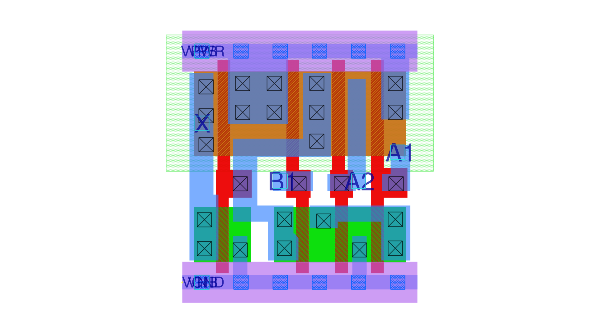

*[sky130_fd_sc_hd__o21a_1](https://skywater-pdk.readthedocs.io/en/main/contents/libraries/sky130_fd_sc_hd/cells/o21a/README.html) 单元版图，每种颜色对应芯片"三明治"中的某一特定层。*

这些单元占据的芯片面积，与构建它们所需的晶体管数量成正比：晶体管越多，面积越大。造芯片时，需要的面积越大，制造的成本就越高。此外，某个功能需要的面积越大，逻辑铺得越开，连线越长，连线延迟就越大，这会影响时序（timing）。

时序是什么？

想象一个电荷载流子像水一样传播的世界：载流子穿过逻辑门和导线需要时间。你路径上的逻辑门越多，需要穿过的导线长度越长，时间就越长。这些载流子的密度指示了你的二进制状态：0 或 1；而为了芯片可预测地运行，你需要留出足够的时间，让你的载流子流完全穿过最长路径。

你留出的时间多少，直接决定了你能把硬件时钟跑多快，从而决定了你能从设计中榨出多少性能。

## 优化

好，我们不只想造个 FPU，我们想造个优化过的版本。

你现在可能纳闷，我为什么还要加上"优化"这个额外约束。因为造出某个东西的优化版本，比只造出能用的东西，需要对它有更细腻的理解。鉴于我们可以优化的维度很多，在这个项目里我把"优化"定义为：在给定功能下，以最低的面积换取最高的频率。这是性价比最高的选择。

总结一下：我们在造硬件，而硬件里一切逻辑都很贵，无论面积还是时序都是，我们要依据这些指标造出最优化版本。

好极了……我到底又把自己卷进了什么？

## 我们需要什么

既然我们加的每条逻辑都有代价，第一步就是退一步，先想清楚我们到底**需要**造什么。

有太多不同的浮点格式，从标准的 IEEE 类型，到你更定制的、应用特定的怪胎——比如皮克斯的 float。

要是我们生活在一个能把它们全丢进竞技场、让它们斗到死的维度里就好了。但可悲的是，抽象概念没法这么斗。所以我们现在被迫坐下来思考……呃

没错你没看错，这不是 AI 幻觉，我说的也不是 2019 年的那部短片。

你知道皮克斯有自己的 24 位浮点类型、并根据其使用场景做了适配吗？皮克斯大概是最被低估的科技公司之一：大多数人根本不知道他们的渲染硬件在过去已经定制到了什么程度。还有，你听过 [Pixar Image Computers](https://en.wikipedia.org/wiki/Pixar_Image_Computer) 吗？

当心，这个兔子洞很深。

一方面，我们有 IEEE 浮点，这些是行业标准浮点。合规（compliance）保证了同一个浮点操作无论跑在什么硬件上行为都一样，这正是你的买家真正想要的。（除非你的硬件有 bug，那样的话你也"努力尝试过合规"。你好啊英特尔 👋：互联网还没忘呢）。但合规意味着要支持次正规数、NaN、$\pm\infty$ 以及 5 种不同的舍入模式。

然后是尺寸问题：你的内存占用有多大，以及你如何把比特分配在指数和有效数字段之间？

一些可选方案：

- `float16`，IEEE 754 半精度：5 位指数，10 位有效数
- `float32`，IEEE 754 单精度：8 位指数，23 位有效数
- `float64`，IEEE 754 双精度：11 位指数，52 位有效数
- 皮克斯的 `PXR24` 格式：8 位指数，15 位有效数
- `tf32`，英伟达的 TensorFloat-32，一个 19 位格式。我说真的，他们怎么会让市场部来命名这个？8 位指数，10 位有效数
- `bfloat16`，谷歌的 brain float 格式：8 位指数，7 位有效数

我们最终选的尺寸取决于工作负载的需要。某些负载需要更高精度，也就需要更多有效数位；另一些则从更小格式中受益，以绕开内存带宽限制。

所以，答案又一次是：看情况！感谢阅读！

严肃点说，让我们澄清到底在造什么，因为这浮点运算将是一个更大项目的一部分，否则就没意思了。但为了最大化乐趣系数，我们需要一个需要大量浮点数学的项目。

幸运的是，我恰好知道适合这任务的加速器架构：矩阵-矩阵乘法的[脉动阵列（systolic array）](https://en.wikipedia.org/wiki/Systolic_array)！这类加速器广泛存在于面向训练和推理任务的机器学习加速器里（当量化对精度损害太大时）。现在，我不是要造 AI 加速器，只是它恰好是个把太多浮点运算塞进我硅片里的便利借口。

妙啊，既然我们找到了借口、知道了目标应用，那就来检查这个负载的约束。

首先，我们不是给带外部客户端的 CPU 造 FPU 单元。我们可以走定制路线，这方便地让我们可以把 IEEE 754 兼容性及其 5 种舍入模式，一脚踢回它们爬出来的地狱里。话虽如此，为了给浮点运算实现生成测试向量，我想选一个没那么机密（confidential）的格式。此外，任何易于与某个广泛支持的 IEEE 类型互相转换的格式，都能加分。这会简化加速器与驱动它的固件之间的互操作。

其次，我的芯片会受 IO 瓶颈限制（一直跟这个博客的读者：没错，又是 🔥），所以我会选一个[迷你浮点（minifloat）](https://en.wikipedia.org/wiki/Minifloat)，这个术语指宽度小于 32 位的浮点。看，我选它不是因为名字可爱，也是有技术原因的。

因为我们瞄准更小格式，就更得刻意权衡指数/有效数的切分。牺牲指数位会缩小格式的范围，但在有效数上抠门则会降低数字的可表示精度。现在，我们也可以从硬件角度切入这个问题：考虑这会影响乘法和加法的实现。

以乘法为例，浮点乘法里最贵的操作就是有效数的乘法。这涉及一个 `<有效数位数> + 1` 宽的无符号乘法，而乘法的硬件代价远非线性增长：一个 8 位 `bfloat16` 有效数乘法的硬件代价，大约只有 11 位 `float16` 有效数乘法的一半。

小有效数开始显得很诱人了。

回到我们应用的需要：AI 工作负载有个有趣的特征，就是对精度损失相对不敏感，量化之所以可行就说明了这点。另一方面，它们从更大的范围（range）中受益。

基于所有这些理由，我现在加冕 bfloat16 为赢家。恭喜，你正式成了我最爱的迷你浮点！🏆

这里总结一下为什么 `bfloat16` 是宇宙史上最好的格式：

- 只有 16 位宽
- 小尾数：7 位
- 广泛铺开的格式：这不是某个定制发明，甚至还有 C++ 标准库支持
- 易于转换到 `float32`：只需砍掉有效数位（有些注意事项，我们后面会讲）
- 不是 IEEE 754 类型

`bfloat16` 的一大好处是它没有规范，所以我们可以想怎么实现就怎么实现！

`bfloat16` 的一大坏处是它没有规范，所以我们想怎么实现就怎么实现！

这个项目很好地给我上了一课：为什么我们需要 IEEE，好把"用免费甜甜圈吸引工程师、再把他们锁进房间直到写出规范"这个古老传统延续下去！

结果就是，当你没有规范、可以想怎么实现就怎么实现时，自然[每个人都做得不一样！](https://xkcd.com/927/)

现在，我们在造一个定制加速器，所以 `bfloat16` 操作的兼容性不是大问题；问题在于，我们现在得自己选想往浮点数学这碗口味里加什么"冰淇淋配料"。

要敲定的第一个问题是舍入模式。

我们至少需要选一种，而为了对照已知测试向量测试，它得是某个 IEEE 模式。在规范的 5 种模式里，向零舍入（round toward zero）在硬件上实现起来最方便也最便宜。不像其他模式，你从不需要向上舍入到下一个浮点值，这让我可以省掉加法末尾那次 16 位加法（它完美地卡在关键路径上，制造最大时序压力）。

但 `RZ`（向零舍入）还有另一个巨大优势，就是它的溢出行为：

`RZ` 不会溢出到 $\pm\infty$，它会**钳位（clamp）**！

这意味着，只要我的加法和乘法操作不把 $\infty$ 作为输入，它们就永远不会产生 $\infty$。所以只要禁止把 $\infty$ 用作输入，我就能完全砍掉对 $\infty$ 的支持，省下硬件。

更好的是：加法和乘法里天然会产生 `NaN` 的唯一操作，就是针对 $\infty$ 的运算。所以如果我同时也禁止把 `NaN` 用作输入值，我还能去掉支持它们所需的硬件代价。

最后还有次正规数支持的问题，这可能是 `bfloat16` 设计里最少争议的问题：那 126 个额外的次正规值根本不值得它们的硬件麻烦，砍掉。

总结一下，我们的"冰淇淋订单"是 🍨：

- `bfloat16`：1 位符号，8 位指数，7 位有效数
- 仅向零舍入（round toward zero）
- 不支持次正规数，所有次正规数都钳位到 $\pm0.0$
- 不支持 $\pm\infty$ 或 `NaN`

## 架构

既然我们已经完成了"决定造什么"这第一个困难部分，就得做第二个困难部分：把它架构出来。

对于我们的矩阵-矩阵运算，我们需要一个加法器和一个乘法器。

由于本文已经相当长，而乘法器一旦你想清楚如何高效设计尾数乘法（剧透：无符号 Booth 基4 乘法器）其实相当好造，所以我现在专注于更复杂精妙的加法器设计。

加法器的朴素做法是单路径（single path）加法器：所有步骤都在同一条路径上完成，类似于那个 `C` 代码示例。虽然概念简单、且因无逻辑复制而面积效率高，但因为这条单路径的深度，这种架构在性能上非常昂贵。

这绝不算坏设计，如果我们完全聚焦面积优化，它或许是个可行候选；但我们背负着面积和性能的双重使命，所以必须做得更好。

回头看加法算法，我们注意到：巨大的相消（cancellation）和尾数移位其实是互斥的。那些我们需要数出尾数差的前导零、并在规格化前从指数里减去超过 1 的相消，只发生在两个操作数的指数差小于 2 **且**我们在做有效减法时。

基于此，并以轻微的职能复制为代价，我们可以把加法器拆成两条路径：

- **近路径（close path）**：指数差 < 2 且为有效减法
- **远路径（far path）**：指数差 < 2 且为有效加法，或指数差 >= 2

这种拆分架构被称为双路径（dual path）架构，自 80 年代以来一直是高性能 FPU 的事实标准加法器架构。

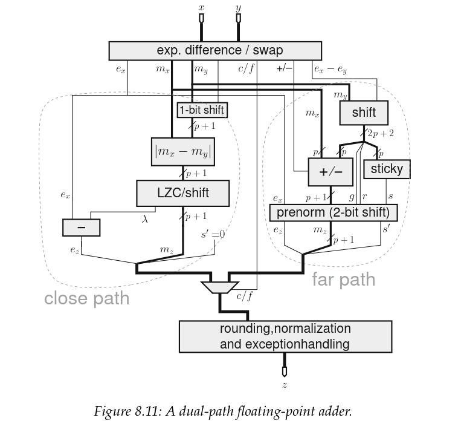

*双路径加法器架构原理图。Credit: Handbook of Floating-Point Arithmetic, Second edition*

现在，这张原理图其实是为 IEEE 合规浮点画的，而我们设计的不是通用情况。那么对我们来说它有何变化？

回想我们只有 `RZ` 舍入？`RZ` 本质上是在涉及舍入时对尾数做钳位，这意味着我们永远不需要向上舍入，从而也意味着我们可以砍掉所有为此服务的逻辑。

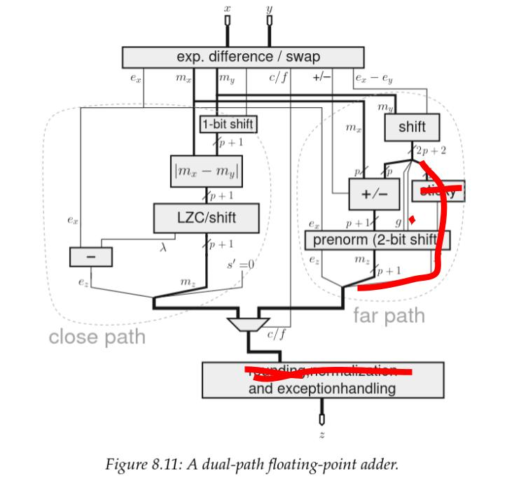

*我用颜色高亮出了"为向上舍入而生"的全部逻辑，我们要把它们全部移除。（🔥 w 🔥）*

接下来，既然我们禁止把 `NaN` 或 $\infty$ 用作操作数，我们就没有触发异常的可能，所以这部分也移除。

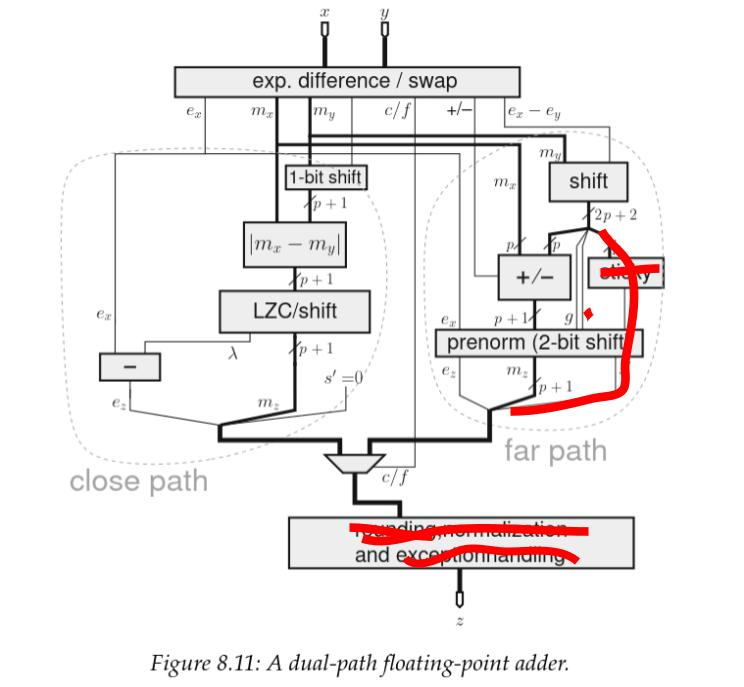

*又 RIP 掉更多东西 🪓*

现在，这张原理图没有展示次正规数如何处理，但我们的实现在那里也省了逻辑。话虽如此，我们仍需要一些逻辑来检测它们何时出现、并钳位到 0。在近路径上，这个功能被卷进了一个我标为"normalize（规格化）"的块里，它位于多位尾数移位和指数减法之后、处在我们的关键路径上。

最终设计大致长这样：

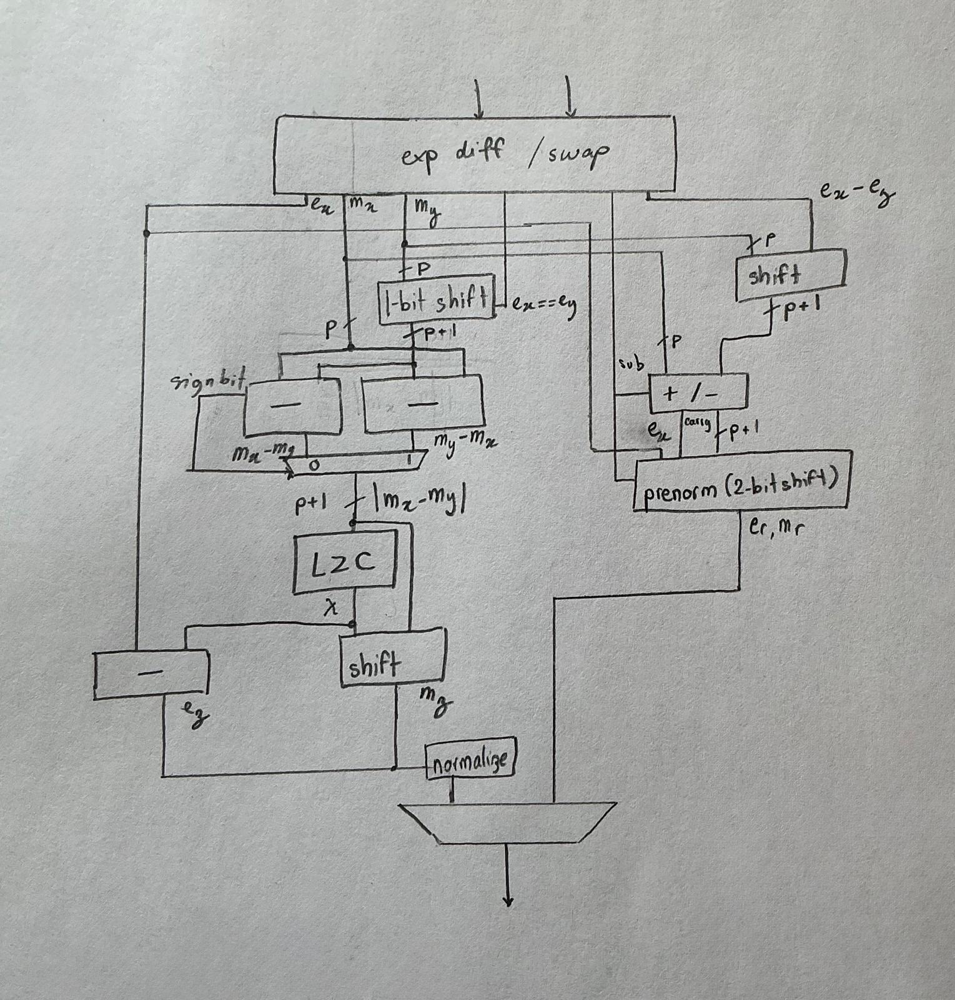

*我正在实现的 bfloat16 加法版本原理图。*

# 第三章：理论遇见现实

## 验证

理论很有趣，但除非它被证明能经得起现实，否则什么都无法证明它为真。所以，没有比把它摔向冷酷现实更能验证自己理解了。

而且，这不只是什么思想实验，我们是真的要把它流片到实际硅片上；如果说我过去的硬件创伤在我脑中刻下了什么教训，那就是：在你证明它能工作之前，它就是坏的！

是时候跑些测试了！

测试浮点运算硬件其实是个有趣的挑战，因为它充满边界情况：你没法只测 100 个随机值就了事。不，你需要对所有这些角落做穷尽覆盖，而其中大多数你根本不知道存在。这非常像"你不知道你不知道"的问题。那么，计划是什么？

这正是我对验证犯罪的地方：定向仿真驱动的测试（directed simulation driven testing）随输入空间的大小而扩展，说白了就是不线性扩展。这就是为什么形式化方法（formal methods）在浮点验证中越来越普及。如果我们想用定向测试来测，就得测全部 $2^{32}$ 种输入组合，听起来就是个糟糕的主意……

……而这也正是我要做的，因为在没有先验知识知道所有角度在哪的情况下，这是穷尽测试所有边界情况的唯一办法。

[这是二阶无知（second order of ignorance）问题。](https://www.5oi.org/the-five-orders-of-ignorance)

这就带来我们的下一个问题：测试时间，测 +40 亿种组合到底要多久？因为[我相信短迭代时间对把事做成至关重要](https://essenceia.github.io/projects/alibaba_cloud_fpga/#4---writing-a-bitstream)，我需要这个测试平台跑得快，所以我需要快速的仿真器和黄金模型（golden model）。

登场的是 [verilator](https://verilator.org/guide/latest/overview.html)，类似于 [Synopsis vcs](https://www.synopsys.com/verification/simulation/vcs.html)，它把你的仿真编译成可在本机原生运行的可执行文件，是镇上最快的开源仿真器。

接下来是黄金模型，恰巧我们活在 2026 年，而 C++23 标准库已经在 `stdfloat` 里引入了 bfloat16 类型。

最后，我们可以用 [DPI-C 接口](https://en.wikipedia.org/wiki/SystemVerilog_DPI)（而不是更慢的 VPI 接口）来调用我们用 C++ 编写、并编译进测试平台的定制黄金模型。

听起来是个完美计划……直到 C++ 背叛了我。

### stdfloat 的 bfloat16 到底是怎么工作的？

但在讲我的黄金模型如何没那么"金"之前，我们需要先理解 stdfloat 的 bfloat16 类型在底层到底怎么运作。

关键是我电脑其实没有原生的 bfloat16 硬件，那它是怎么做数学的？

我们用一个简单的加法来测一下：

```C
#include <stdfloat>

int main(){
	bfloat16_t a,b,c;
	a = 1.0;
	b = 1.0;
	c = a + b;
	return 0;
}
```

看这个测试程序的反汇编，我们可以看到 gcc 是用软浮点 bfloat16 函数替换（`__extendbfsf2`、`__truncsfbf2` + 包装代码）来处理 bfloat16 加法的。

这表明我当前的硬件要么没有 bfloat16 的硬件支持，要么这支持没向编译器"广告"。

```asm
4	int main(){
   0x0000000000001119 <+0>:	push   %rbp
   0x000000000000111a <+1>:	mov    %rsp,%rbp
   0x000000000000111d <+4>:	sub    $0x20,%rsp

5		bfloat16_t a, b, c;
6
7		a = 1.0;
   0x0000000000001121 <+8>:	    movzwl 0xee4(%rip),%eax        # 0x200c
   0x0000000000001128 <+15>:	mov    %ax,-0x6(%rbp)

8		b = 1.0;
   0x000000000000112c <+19>:	movzwl 0xed9(%rip),%eax        # 0x200c
   0x0000000000001133 <+26>:	mov    %ax,-0x4(%rbp)

9		c = a+b;
   0x0000000000001137 <+30>:	pinsrw $0x0,-0x6(%rbp),%xmm0
   0x000000000000113d <+36>:	call   0x1180 <__extendbfsf2>
   0x0000000000001142 <+41>:	movss  %xmm0,-0x14(%rbp)
   0x0000000000001147 <+46>:	pinsrw $0x0,-0x4(%rbp),%xmm0
   0x000000000000114d <+52>:	call   0x1180 <__extendbfsf2>
   0x0000000000001152 <+57>:	movaps %xmm0,%xmm1
   0x0000000000001155 <+60>:	addss  -0x14(%rbp),%xmm1
   0x000000000000115a <+65>:	movd   %xmm1,%eax
   0x000000000000115e <+69>:	movd   %eax,%xmm0
   0x0000000000001162 <+73>:	call   0x1250 <__truncsfbf2>
   0x0000000000001167 <+78>:	movd   %xmm0,%eax
   0x000000000000116b <+82>:	mov    %ax,-0x2(%rbp)

10
11		return 0;
   0x000000000000116f <+86>:	mov    $0x0,%eax

12	}
   0x0000000000001174 <+91>:	leave
   0x0000000000001175 <+92>:	ret
```

基于这段汇编，`bfloat16_t` 的预期行为应当类似于被砍窄（clamped down）的 `float32_t`。

这完全合法，鉴于 bfloat16 的行为没有任何规范完整定义，它就是实现定义（implementation defined）的。🌈

### 探查标准库的软 `bfloat16_t` 实现

既然我对 x86 汇编不是完全流利，我决定写一个[简单的测试程序](https://github.com/Essenceia/BFloat16/blob/main/cpu_test/main.cpp)来探查我的软 `bfloat16_t` 的行为。

从中我了解到它：

- 支持次正规数
- 支持 `NaN`
- 支持 inf

于是天真的我以为，要把它用作硬件的黄金模型，我只需自己把次正规数钳位到 0、并且不驱动 `NaN` 和 $\infty$ 即可。

```C
#define IS_SUBNORMAL(x) ((isnormal(x) | isnan(x) | isinf(x) | (x == 0e0bf16)))
```

### 被 C++ 背叛

于是我把次正规数钳了位，继续愉快地推进。

但当我在 blissfully 地遍历测试所有可能的操作数组合时，灾难降临了。

我引用 C++ 2022 年发布的提案《Extended floating-point types and standard names》：

> 7.2. Supported formats
>
> 我们为以下布局提议别名：
>
> - \[IEEE-754-2008\] binary16 - IEEE 16 位。
> - \[IEEE-754-2008\] binary32 - IEEE 32 位。
> - \[IEEE-754-2008\] binary64 - IEEE 64 位。
> - \[IEEE-754-2008\] binary128 - IEEE 128 位。
> - bfloat16，即截断了 16 位精度的 binary32；见 \[bfloat16\]。 <–
>
> P1467R9 - Extended floating-point types and standard names
>
> [https://www.open-std.org/jtc1/sc22/wg21/docs/papers/2022/p1467r9.html#alias-formats](https://www.open-std.org/jtc1/sc22/wg21/docs/papers/2022/p1467r9.html#alias-formats)

本质上，这意味着 `bfloat16_t` 正如我们从二进制提示中读到的那样：一个被截断的 `float32_t`（在 IEEE 规范里叫 binary32）。

这种方案的**问题**在于，`float32_t` 的内部精度 $p$ 比 `bfloat16_t` 大得多：

- `float32_t` $p = 24$
- `bfloat16_t` $p = 8$

实践中这意味着，如果我想让我的硬件正确匹配由 C++ 标准库规定的黄金模型，我就需要支持 $p=24$，这直接翻译成到处都更宽的有效数路径……而这绝对不是我想要的结果。

#### **在 1 ulp 以内**

鉴于 C++ 标准库对 `bfloat16_t` 的实现是在底层用 `float32_t`，我无法干净地把黄金模型的结果匹配到预期的 RTL 输出。

这是因为 `float32_t` 的内部精度是 $p=24$ 位，而 `bfloat16_t` 只有 8 位，所以给定相同的输入值，如果这些输入之间的指数差落在 $[p_{\text{bfloat16}}; p_{\text{float32}}]$ 区间内，即使我们使用相同的舍入模式和相同的操作数，也会观察到舍入行为的差异。

这个性质的另一个面是：这个差异会被限制在相邻浮点数的一个裕度之内。

为简化下面这节，让我把 $\text{ulp}(x)$ 定义为"最后一位的单位（unit of last place）"，更正式地说：

> $\text{ulp}(x)$ 是最接近 $x$ 的两个浮点数之间的间隙，即使 $x$ 本身就是其中之一。
>
> ~ William Kahan，浮点教父，1960

因此，我的黄金模型 `bfloat16_t` 与我的实现之间的相对误差，最多为 $1 \times \text{ulp}(x)$。

$\text{ulp}(x)$ 定义为：

$$\text{ulp}(x) = 2^{-p+1}$$

对于我的 `bfloat16` 实现（$p=8$），于是有 $\text{ulp}(x) = 2^{-7}$，而我将相对误差计算为：

$$\text{error}(x) = \frac{x_{\text{model}} - x_{\text{hw}}}{x_{\text{model}}}$$

#### **C++ 并无过错**

既然我已经发完牢骚、并让我的黄金模型乖乖就范，我想指出：我承认用 `float32` 模拟 `bfloat16` 对标准库而言是更优的方案。它把大部分计算卸载到 CPU 的 FPU 上，带来的性能比完全用软件实现好上几个数量级。

当然它可能带来不同的结果，但这就是我们开始用 `bfloat16` 时就签下的契约。

## 实现

既然我们有些能跑的 `bfloat16` 算术了，就来到我最爱的部分：用昂贵的晶体半导体把它造出来。

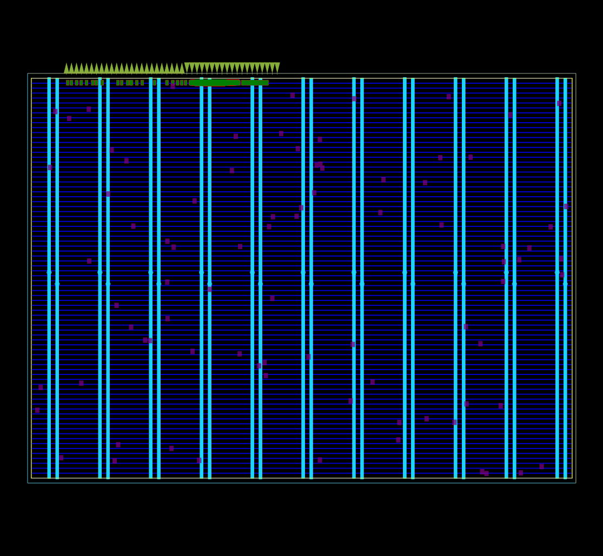

*ASIC 版图所有逻辑单元的初始全局布局进行中。使用 OpenROAD 全局布局的调试模式捕获。*

既然本文聚焦浮点运算，我会克制住把加速器其余部分都讲给你听的欲望，把它锁进 ASIC 的仓库里：

[Essenceia/Systolic\_Array\_with\_DFT\_v2\
\
在 IHP 130nm 上流片的 2x2 bfloat16 矩阵-矩阵乘法，带 DFT 基础设施。在前一代于 GF180 流片的加速器基础上迭代。\
\
Verilog\
\
39\
\
3](https://github.com/Essenceia/Systolic_Array_with_DFT_v2)

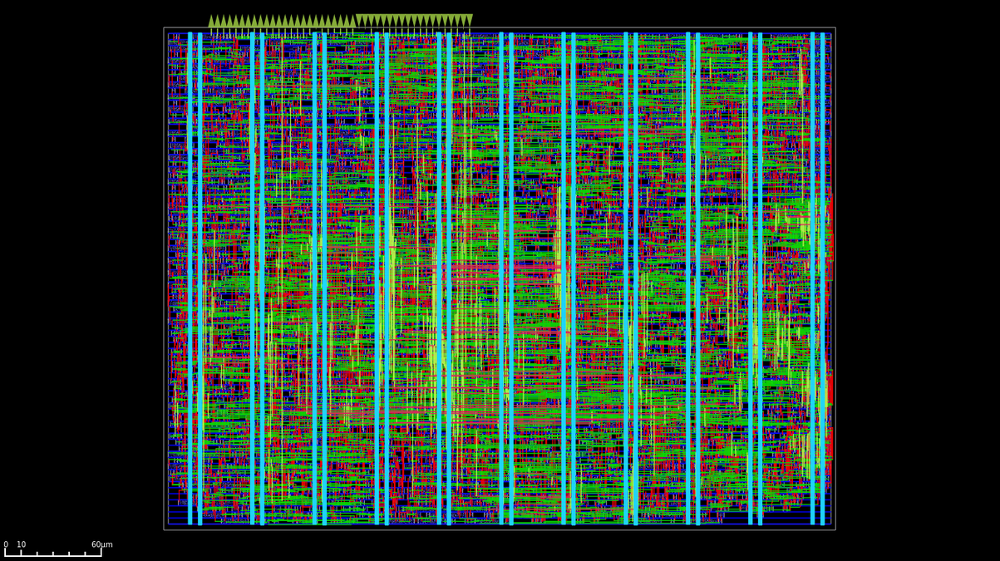

*为 IHP 130nm 节点设计的第二代 Systolic Array 版图，使用 sg13g2 PDK。它占用 126,685 µm² 的裸片面积，目标典型工作电压为 25°C 下 1.2V。该设计有两条时钟树，一条给 MAC，一条给 JTAG TAP。MAC 时钟目标最高工作频率 100 MHz，但当前输出 GPIO 频率实验建议最高 75 MHz，JTAG 为 2 MHz。*

### Tiny Tapeout ihp26a

这次我们会在 IHP 时髦的 130nm `sg13g2` 节点上流片，用 [Tiny Tapeout 的 `ihp26a` 芯片](https://tinytapeout.com/chips/ttihp26a/) 作为我们的 shuttle（班车）。而且完全透明地说，Tiny Tapeout 团队给了我一张优惠券，我拿它换来了这个项目里使用的面积（和一个开发板）。所以严格来说这次流片由 Tiny Tapeout 赞助，这绝对不会让我更少吹捧他们！

谢谢各位！


*Tiny Tapeout shuttle 芯片 `ihp26a` 渲染图。Source: [https://github.com/TinyTapeout/tinytapeout-chip-renders](https://github.com/TinyTapeout/tinytapeout-chip-renders)*

我们这次用的 IHP 130nm 单元库很特别：与其他两个开源 PDK 相比它快如闪电，让我们能达到一些真正惊人的 fmax（最高频率）。（正如我们用姊妹节点 IHP `sg13cmos5l` 做的 [fmax 竞赛](https://essenceia.github.io/projects/floating_dragon/#combo) 所展示的。）

但又一次，我们有 IO 问题：最大 GPIO 稳定工作频率预计输入约 100MHz、输出路径约 75MHz，意味着这个脉动阵列实际上被瓶颈在 75MHz。但是，由于 sg13g2 PDK 如此之快，在 75MHz 收敛时序还不够有挑战性，我决定挑战自己，瞄准 100MHz 的常规频率。哦，而且我还想**在单周期内完成整个 bfloat16 加法和乘法**。

当然，我本可以流水线化这些操作，但那会浪费一个逼自己提升实现性能的机会。

### Yosys 你这外行

让我给你讲一个实现过程中发生的有趣故事。

但在此之前先铺垫一下：关键路径恰好切在你预期的地方——穿过乘法的尾数乘法，再经过加法器的近路径、直抵 LZC（前导零计数，leading zero count）。

在我们这个故事的时间点，我已经掏出了几招比较经典的 RTL 时序优化技巧，舒服地坐在慢角（slow corner）$+0.6\text{ns}$ 裕量、标称角（nominal corner）$+3.9\text{ns}$ 裕量上。我以为我的工作到此为止了，这时一个朋友开始质疑我对 LZC 的设计选择。

这些数字来自我重做整个脉动阵列控制逻辑、并把所有触发器串成 DFT 扫描链之前的时序。

我当初选择实现一个[基于树的 LZC](https://github.com/Essenceia/BFloat16/blob/main/src/lzc.v)，就是文献里常见的那种，虽然这段 verilog 代码可读性之差，值得[它自己的测试平台](https://github.com/Essenceia/BFloat16/blob/main/tb/lzc_tb.sv)，但其底层概念太优雅，不忍放弃。

既然我的时序已经相当好看，我决定把"加一个更优化的前导零预判（leading zero anticipation）"作为后备选项留到以后。

于是我朋友来了，建议我们做点_不一样_的事。忘掉基于树的 LZC，直接写个优先级多路复用器（priority mux），让综合器去处理它。

```verilog
always @(*) begin
        casez (in)
            9'b1????????: shift_amt = 4'd0;
            9'b01???????: shift_amt = 4'd1;
            9'b001??????: shift_amt = 4'd2;
            9'b0001?????: shift_amt = 4'd3;
            9'b00001????: shift_amt = 4'd4;
            9'b000001???: shift_amt = 4'd5;
            9'b0000001??: shift_amt = 4'd6;
            9'b00000001?: shift_amt = 4'd7;
            9'b000000001: shift_amt = 4'd8;
            default:      shift_amt = 4'd0;
        endcase
    end

```

完全透明地说，我**不认为**这会比基于树的 LZC 时序更好。然而，在 RTL 和时序之间隔着 yosys 及其 124 级优化，而且 yosys 是 techmap 感知的。

作为参考，这是原始模块的代码，被隔离到自己的模块里，以便我在实现时保留层次结构、好追踪它：

```verilog

module pmux(
        input wire [8:0] data_i,
        output reg [3:0] zero_cnt
);

always @(*) begin
        casez (data_i)
            9'b1????????: zero_cnt = 4'd0;
            9'b01???????: zero_cnt = 4'd1;
            9'b001??????: zero_cnt = 4'd2;
            9'b0001?????: zero_cnt = 4'd3;
            9'b00001????: zero_cnt = 4'd4;
            9'b000001???: zero_cnt = 4'd5;
            9'b0000001??: zero_cnt = 4'd6;
            9'b00000001?: zero_cnt = 4'd7;
            9'b000000001: zero_cnt = 4'd8;
            default:      zero_cnt = 4'd0;
        endcase
end
endmodule

```

这个模块实现出一个 19 单元的结果，关键路径上只有 **3** 级逻辑深度，带来了更好的时序。

在最终 flattened 版本里，这让慢路径改善了 $+0.05$ ns。一方面，这增益不算大。但另一方面，这段经历逼我认识到工具能有多高性能。

这个 `casez` LZC 设计不仅稍快一点，它最大的优势在于好懂得多，这反过来让它更易维护，直接降低了未来引入 bug 的可能性。

有时，一个好的设计不止关乎性能。

### 连击（Combo）！

等等！还有第二次流片？！

当我开始规划这篇文章时，我的希望是让 bfloat16 算术作为我第二代脉动阵列的一部分，在 IHP 130 nm 上流片。

但在写这篇文章的过程中，Tiny Tapeout 社区得到了在 IHP 130 nm 上做第二次流片的机会，瞄准 IHP 较新的 [sg13cmos5l](https://github.com/IHP-GmbH/ihp-sg13cmos5l) 节点。

就像我们为[第一代脉动阵列](https://essenceia.github.io/projects/two_weeks_until_tapeout/)做了 GF180 流片那样，这是一次私人的实验性 shuttle，让我们兜了一圈回到原点。


*Tiny Tapeout shuttle 芯片 `ihp0p4` 渲染图。Credit: Luis Eduardo Ledoux Pardo*

现在我对我的流片有个略显独特的规矩：我绝不会把同一个设计流片两次。

所以，如果我想提交到 `ihp0p4` shuttle 芯片，就不能直接复用我现有的 IP。不，我需要点新东西。

登场的是**fmax 挑战！**

你还记得我说过 IHP 单元快如闪电、以及我在单周期里做完整个加法和乘法吗？好吧，我有一部分很想知道，如果我们无视 IO 限制、直奔最高频率，能爬多高。

幸运的是，另一位社区成员也在流片[一个可比较的设计](https://github.com/NikLeberg/tt_um_float_synth/tree/ihp-sg13cmos5l)：于是我们赛了起来！

[Essenceia/uselessly\_fast\_bfloat16\_multiplier\
\
在 IHP 130nm 5L 节点标称角上把 bf16 乘法时钟频率推到极限。\
\
Python\
\
13\
\
0](https://github.com/Essenceia/uselessly_fast_bfloat16_multiplier)

为了提高频率，bfloat16 乘法被切成了 2 个周期。正如预期，主要关键路径穿过了尾数乘法。在原版乘法实现里，我用的是综合器实现指令来推断一个无符号 Booth 基4 乘法器。

正如 LZC 经历所示，yosys 在生成优化逻辑时绝非轻量。不幸的是，我们为此牺牲了对网表的控制权，而这次就是无法精确选择在哪里切分乘法。

因此，为了帮助流水线化这条路径，我需要重新实现一个[定制的 8 位无符号 Booth 基4 乘法器](https://github.com/Essenceia/BFloat16/blob/8f3722c266a4051b55c4a79481218bf00c1201aa/src/booth_unsigned_mul_pipelined.v)。

小细节……

哦，还有，我忘了提一件小事：这个 shuttle 从正式宣布、开放到关闭，全程只在 **24 小时** 之内！所以现在想象一下这一切发生在凌晨 3 点。🫠

在这个定制乘法阶段内部，编码阶段之后、压缩阶段中间插入了一个触发器（flop）。我们把前两个部分积（partial product）的初步压缩结果存起来，后三个在下一周期压缩到一起，得到这个尾数乘法的最终结果。

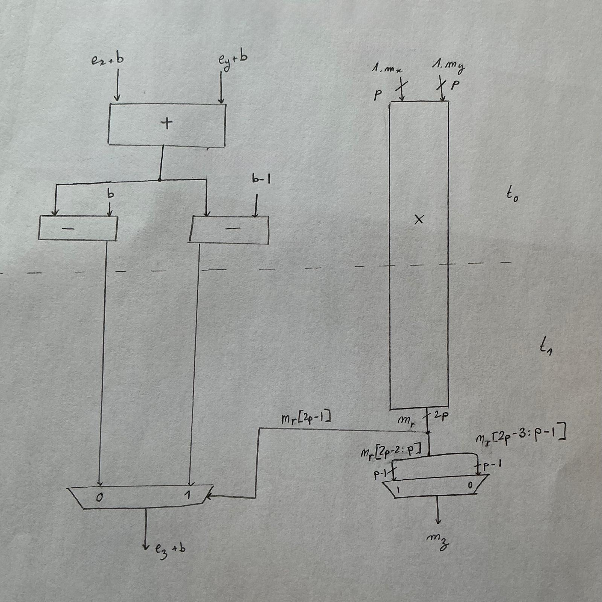

*我正在实现的快速乘法器原理图，分隔线标出了哪些操作发生在 $t_0$、哪些发生在 $t_1$。*

沿途还做了一些额外的此类优化，让这个设计达到了 `454.545` MHz 的最高工作频率。

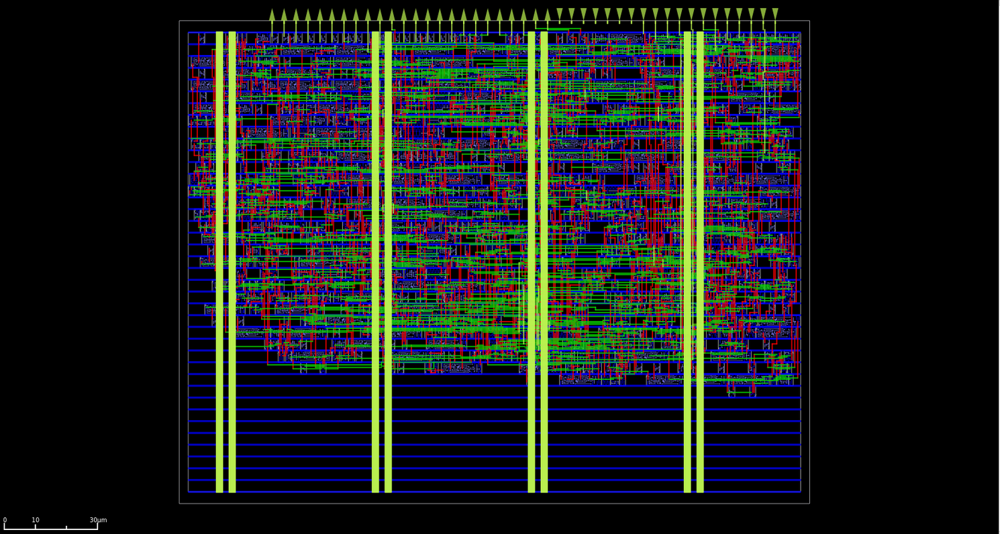

*无用但飞快的乘法器版图渲染。在 25°C、1.20 V 的标称工作角下最高可运行 454.545 MHz，占用单个 tile，面积 202.08x154.98 um。*

## 收尾

过了五年多，我终于屠了我的龙，向浮点数学报了仇！

在从零造了自己的浮点运算之后，我现在相信真正懂浮点的只有：

1. 写 IEEE 754 规范的人
2. 研究浮点表示的数学博士们

在重新实现浮点运算、并两次流片之后，我可以自信地断言：我并没有深度理解浮点运算，但至少现在我知道兔子洞到底有多深，以及如果我想真正掌握它该做什么。

但有了两颗含有我自己浮点 IP 的 130nm 流片，我可以自信地把探索其他迷你浮点、实现更复杂操作的事，留到改天。

因为我现在有更要紧的事要做！

在我们能去睡觉之前、在能写完文档之前，有一条流片后的传统绝不可跳过：


*Waffle House! ❤*

### 后记（P.S）

我强烈推荐这本出色的书 _"Handbook of Floating-Point Arithmetic, Second edition"_，给想要 600 页版"浮点问题"的读者。

特别感谢我的另一半、[yg](https://hackaday.io/whygee)、[Prawnzz](https://www.prawns.dev/) 和 [Erstfeld](https://github.com/EzraWolf) 帮忙审校本文。

意见、抱怨和委屈，可以发到 [julia.desmazes@gmail.com](mailto:julia.desmazes@gmail.com)。我们不提供退款。

---

## 术语对照

| 英文 | 中文 | 备注 |
| --- | --- | --- |
| floating point / float | 浮点 / 浮点数 | 全文交替使用 |
| significand / mantissa | 有效数 / 尾数 | 原文交替使用，本文同义 |
| normal / subnormal (denormal) | 规格化 / 次正规数（非正规数） | subnormal = denormal |
| NaN (Not a Number) | 非数 | quiet NaN / signaling NaN：安静的 NaN / 会发信号的 NaN |
| infinity | 无穷 | $\pm\infty$；硬件中不表示"数"而表示极限 |
| hidden bit | 隐藏位 | 规格化数隐含的 $d_0 = 1$ |
| exponent bias | 指数偏移 | 记为 $b$ |
| precision | 精度 | 记为 $p$，即有效数位 + 1 |
| ulp (unit in the last place) | 最后一位的单位 | 相邻浮点数的间隙 |
| rounding mode | 舍入模式 | RD / RU / RZ / RN（就近，含 RN_even / RN_away） |
| gradual underflow | 渐进下溢 | 由次正规数实现 |
| FPU (floating-point unit) | 浮点运算单元 | |
| ASIC | 专用集成电路 | |
| tapeout | 流片 | |
| systolic array | 脉动阵列 | 矩阵乘法加速器架构 |
| bfloat16 | bfloat16（brain float） | 谷歌格式：1 位符号 / 8 位指数 / 7 位有效数，非 IEEE 754 |
| minifloat | 迷你浮点 | 宽度 < 32 位的浮点 |
| LZC (leading zero count) | 前导零计数 | |
| Booth radix-4 multiplier | Booth 基4 乘法器 | 无符号乘法 |
| PDK (process design kit) | 工艺设计套件 | 如 sky130、sg13g2、sg13cmos5l |
| DFT (design for test) | 可测试性设计 | 含扫描链（scan chain） |
| MAC (multiply-accumulate) | 乘加器 | |
| critical path | 关键路径 | 决定最高频率的时序路径 |
| fmax | 最高频率 | |
| RTL | 寄存器传输级 | |
| golden model | 黄金模型 | 用于验证的参考模型 |

_本文由 Julia Desmazes 撰写，原文发布于 2026-04-03，链接：https://essenceia.github.io/projects/floating_dragon/ _
