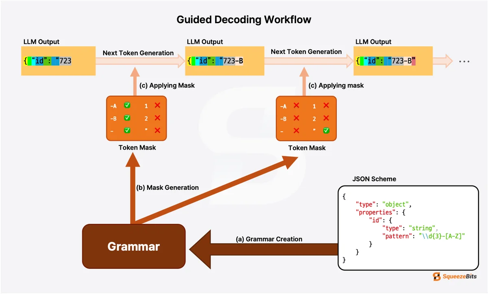
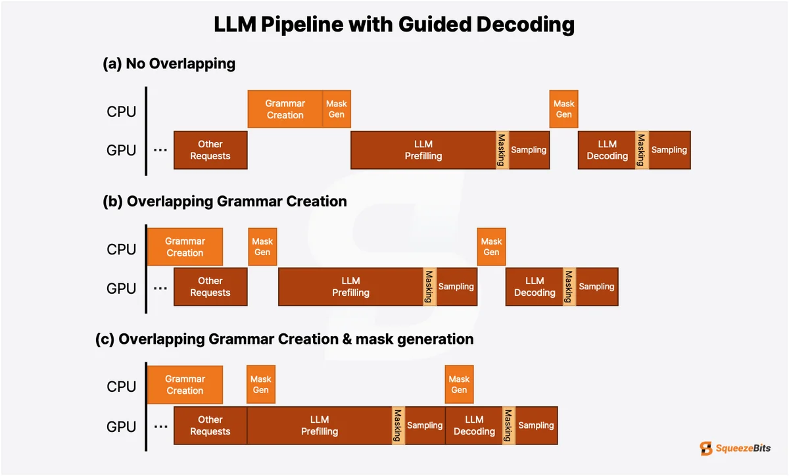
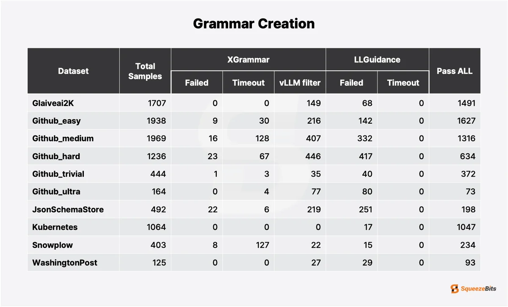
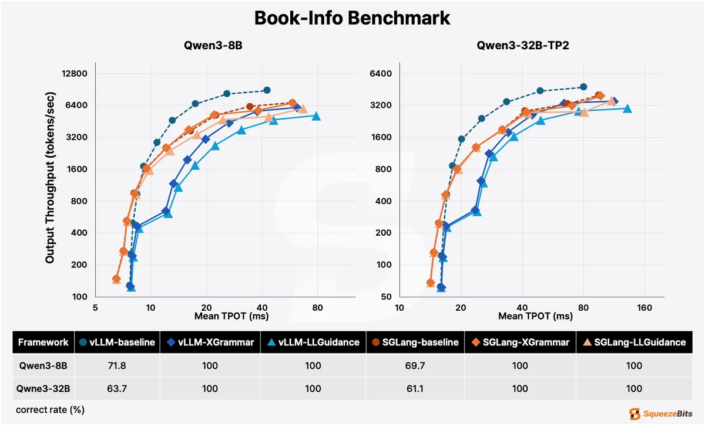
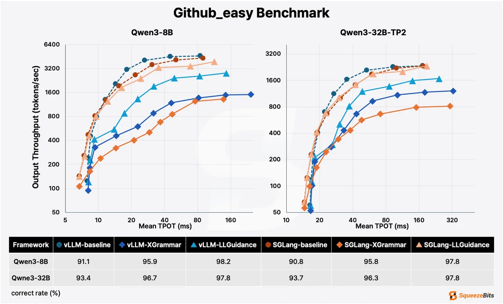
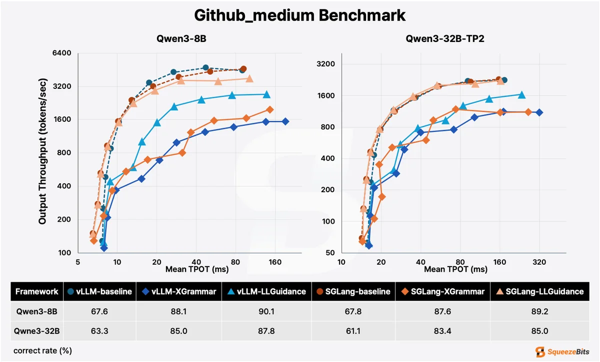
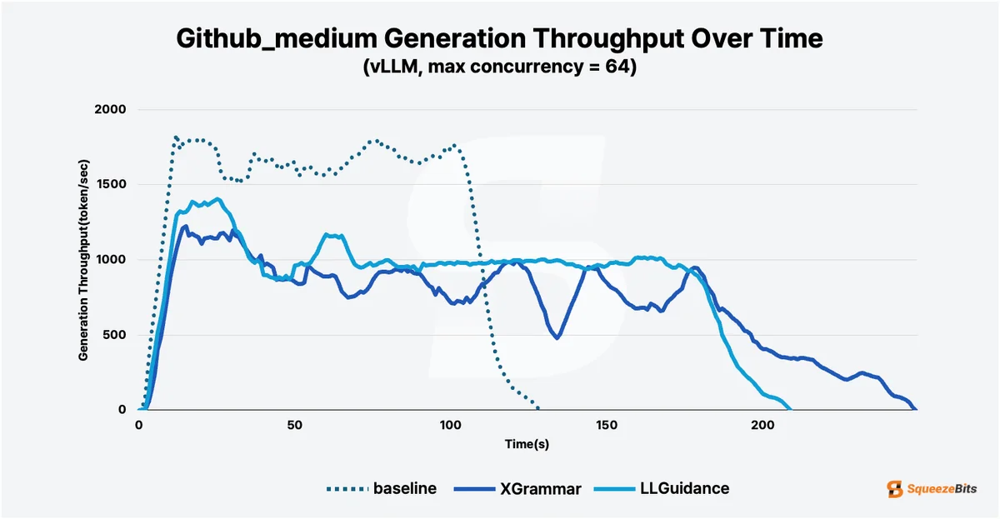

# 引导式解码在 vLLM 与 SGLang 上的性能（Guided Decoding Performance on vLLM and SGLang）

> 原文：[Guided Decoding Performance on vLLM and SGLang](https://blog.squeezebits.com/guided-decoding-performance-vllm-sglang)  
> 副标题：The guide to LLM guided decoding! This deep-dive benchmark compares XGrammar and LLGuidance on vLLM and SGLang to help you find the optimal setup for generating structured output based on your use case.  
> 作者：Eunik Park（SqueezeBits）· 发布时间：2025-09-16

译文版本：v0.1

## 译文说明

本文为 SqueezeBits 技术博客（Eunik Park，2025-09-16）的中文翻译版。原文是一份关于 LLM 引导式解码（guided decoding，即结构化输出）的深度基准测试：在两个最流行的推理服务框架 vLLM 与 SGLang 上，对比两个主流语法后端 XGrammar 与 LLGuidance 的表现，覆盖语法编译健壮性，以及"重复模式"与"动态模式"两类工作负载下的吞吐、时延与正确率。原文配图已本地化到 `docs/assets/images/articles/guided-decoding-performance/`；表 1 原为图片，译文另附据原图转写的 Markdown 表格以便查阅。术语遵循项目统一术语表，链接保留原文地址。

---

## 引言

大语言模型（LLM）生成的回复本质上是概率性的、无结构的文本。这使它们在创意类任务上很强大，但当需要可靠、有格式的输出时就带来挑战，例如确保 API 调用、数据库交互或工具调用的一致性。举例来说，一个被要求根据用户数据生成 JSON 对象的 LLM，可能会在开头加上多余的解释，或偏离预期的模式（schema），从而导致解析错误，让应用变得不可靠。随着 LLM 从单纯的文本生成演进为能自主调用 API 或与外部系统对接的智能体，用户自定义结构化输出的需求对维持稳定性和可预测性变得至关重要。

**引导式解码（guided decoding）**（也称**结构化输出（structured output）**或**受限解码（constrained decoding）**）通过把生成限制在 JSON、XML 或由正则定义的字符串等格式上来解决这个问题。vLLM、SGLang 这类现代服务框架使用强大的语法后端（grammar backend）来强制执行这些规则，其中两个知名的参与者是 **[XGrammar](https://github.com/mlc-ai/xgrammar)** 与 **[LLGuidance](https://github.com/guidance-ai/llguidance)**。

然而，这种控制会带来计算开销。语法后端的选择，以及它所运行的服务框架，对性能与可靠性有重大影响。为帮你选出最优配置，我们在两个最流行的服务框架 **vLLM** 与 **SGLang** 上，对两个领先的语法后端 **XGrammar** 与 **LLGuidance** 做了基准测试。

## 引导式解码如何工作

图 1：引导式解码的工作流程，由 JSON 模式生成的语法在每一步生成 token 掩码，以约束 LLM 的输出。

引导式解码的原理，是把模型下一步可选的 token 限制为在当前上文下语法上合法的那些 token。模型不再从整个词表中自由采样，而是被约束为只能生成符合用户自定义结构的 token。为实现这一点，标准的 LLM 推理流水线被增加了以下步骤：

1. **从模式创建语法（Create Grammar from Schema）**：用户自定义的模式（例如 JSON Schema、正则表达式）被编译成一种语法表示（通常是**确定有限状态自动机（DFA）**），它定义了合法的 token 序列。

2. **生成 token 掩码（Generate Token Mask）**：在每一个生成步，语法根据此前的上文生成一个 token 掩码，过滤掉不合法的候选。

3. **把 token 位掩码应用到 LLM logits**：该掩码被施加到 LLM 输出的 logits 上，迫使模型只从语法正确的 token 集合中采样。

这一过程保证了结构良好的输出，但会因语法构建与逐步的掩码生成引入计算开销。高效地管理这些开销，对避免推理性能下降至关重要。XGrammar 与 LLGuidance 用不同策略应对这一挑战，我们将在下一节评估它们。

### XGrammar

![图 2：XGrammar 的整体工作流程。\[ref\]](../assets/images/articles/guided-decoding-performance/fig2.png)

图 2：XGrammar 的整体工作流程。[\[ref\]](https://blog.mlc.ai/2024/11/22/achieving-efficient-flexible-portable-structured-generation-with-xgrammar)

XGrammar 旨在通过**预计算（pre-computation）**把运行时开销降到最低。如**图 2** 所示，XGrammar 在自动机的每个状态上把 LLM 的词表划分为两组：与上下文无关的 token 和与上下文相关的 token。在语法创建阶段，XGrammar 预先计算与上下文无关 token 的掩码，只把与上下文相关的 token 留到生成时校验。这一设计使得对上下文相关 token 相对较少的简单模式而言，掩码生成很快。此外，通过缓存已创建的语法，它降低了重复模式下的语法创建成本。

然而，预计算步骤本身可能很耗时。另外，对于含大量上下文相关 token 的复杂模式，由于掩码中有很大一部分仍需在生成期间校验，性能可能退化。

### LLGuidance

LLGuidance 采用了另一种思路：在每一个解码步动态生成 token 掩码。为避免完整语法编译的前置成本，它惰性地（lazily）构建自动机。随后，在每一步，它通过遍历 LLM 词表的预构建**前缀树（prefix tree，trie）**来高效生成 token 掩码。这种方式即使首次处理复杂或全新的模式，也能快速生成掩码，因而非常适合那些"灵活性比最小化每种模式的初始化时间更关键"的场景。

### 决定性因素：服务框架集成

图 3：LLM 推理流水线。(a) 不重叠形成串行瓶颈。(b) 重叠初始语法创建。(c) 让语法与掩码生成和 GPU 处理重叠，有效隐藏延迟。

引导式解码的性能不仅取决于语法后端本身，还取决于语法相关流程如何集成到服务流水线中。最直接的实现是顺序执行这些步骤，如**图 3(a)** 所示。

然而，语法相关处理是 CPU 密集型任务，而 LLM 推理是 GPU 密集型任务。这使得并行化成为天然的优化机会。例如，vLLM 把初始语法创建与 GPU 执行其他请求重叠起来（**图 3(b)**）。SGLang 更进一步，把逐步的掩码生成也与 LLM 推理步骤重叠（**图 3(c)**），从而更有效地隐藏语法处理的延迟。

## 实验设置

### 硬件与软件环境

- CPU：Intel(R) Xeon(R) Platinum 8480+
- 内存：480 GiB
- GPU：NVIDIA H100 80GB HBM3
- 模型：Qwen3-8B、Qwen3-32B（TP2）*两个模型都关闭了推理能力（reasoning capabilities）。*
- 框架：vLLM `v0.10.0`、SGLang `0.5.0rc0`、xgrammar `0.1.21`、llguidance `0.7.30`

### 数据集

为评估不同条件下的性能，我们混合使用了基准数据集与自定义数据集：

- **模式多样性与健壮性（Schema Diversity & Robustness）**：我们采用了 [`JSONSchemaBench`](https://github.com/guidance-ai/jsonschemabench)，它包含各式各样的真实世界 JSON 模式。这个数据集让我们能在多样化的模式结构下压力测试语法创建。

- **效率基准（Efficiency Benchmarks）**：我们设计了两个不同场景来覆盖不同的服务条件：

  1. **重复模式场景（Repetitive Schema Scenario）**：一个自定义的 "`Book-Info`" 任务，其中 1,000 个请求根据给定书名生成书籍元数据（作者、出版社、ISBN 等），全部使用同一个简单模式。这一设置凸显语法缓存与模式重复使用带来的影响。

  2. **动态模式场景（Dynamic Schema Scenario）**：使用 `JsonSchemaBench` 的 `Github_easy` 与 `Github_medium` 子集，每个请求使用一个独一无二的模式。这模拟了模式频繁变化的工作负载。

## 实验结果

### 模式多样性与健壮性

为评估语法创建的健壮性与模式覆盖率，我们使用了 `JSONSchemaBench` 数据集。这项实验测量每个框架能成功编译多少模式，并把失败归为三类：编译失败、超时（10 秒）、以及被服务框架拒绝。

表 1：在 JSONSchemaBench 数据集上的语法创建结果。

| Dataset | Total Samples | XGrammar Failed | XGrammar Timeout | XGrammar vLLM filter | LLGuidance Failed | LLGuidance Timeout | Pass ALL |
| --- | ---: | ---: | ---: | ---: | ---: | ---: | ---: |
| Glaiveai2K | 1707 | 0 | 0 | 149 | 68 | 0 | 1491 |
| Github_easy | 1938 | 9 | 30 | 216 | 142 | 0 | 1627 |
| Github_medium | 1969 | 16 | 128 | 407 | 332 | 0 | 1316 |
| Github_hard | 1236 | 23 | 67 | 446 | 417 | 0 | 634 |
| Github_trivial | 444 | 1 | 3 | 35 | 40 | 0 | 372 |
| Github_ultra | 164 | 0 | 4 | 77 | 80 | 0 | 73 |
| JsomSchemaStore | 492 | 22 | 6 | 219 | 251 | 0 | 198 |
| Kubernetes | 1064 | 0 | 0 | 0 | 17 | 0 | 1047 |
| Snowplow | 403 | 8 | 127 | 22 | 15 | 0 | 234 |
| WashingtonPost | 125 | 0 | 0 | 27 | 29 | 0 | 93 |

**表 1** 的结果凸显了健壮性方面的关键权衡。LLGuidance 在速度上表现出色，零超时，但编译失败数更高。反观 XGrammar，虽然初始能处理更多模式，但在复杂模式上会出现超时。此外，如 "vLLM filter" 一列所示，其实际可用性还因被 vLLM 集成过滤器额外拒绝的模式而显著受限。

因此，在后续的性能基准中，我们只考虑 "Pass ALL" 一列中的模式，即两个框架都成功处理的那一批。

### 效率基准

#### 重复模式下的性能

我们首先在使用 `Book-Info` 数据集的简单重复任务上评估性能，其中每个请求共享同一个模式。该实验在三种条件下比较 vLLM 与 SGLang 两个服务框架：不使用引导式解码（标为 "baseline"）、使用 XGrammar、使用 LLGuidance。性能用输出吞吐（tokens/秒）与**单输出 token 平均时间（Mean Time Per Output Token，TPOT）**衡量，同时我们还验证生成的输出是否符合模式（正确率）。

图 4：在 Book-Info 数据集上的性能。坐标轴为对数刻度；最大并发从 1 倍增到 512。

结果凸显引导式解码对正确性不可或缺。如**图 4** 所示，不使用引导式解码时正确率从未超过 72%。相比之下，两个引导式解码后端都达到 100% 正确率。

比较两个后端时，XGrammar 在两个服务框架上的吞吐与 TPOT 上都持续优于 LLGuidance。这是因为简单、重复的模式让 XGrammar 的预计算与缓存策略得以发挥，带来更低开销。这一性能差距随批量增大而更明显。由于 LLGuidance 对每个请求都生成新掩码（无论是否重复），随着并发上升，CPU 瓶颈会越来越严重。

结果也揭示了服务框架之间的关键差异。与自身基线相比，vLLM 在启用引导式解码后出现显著性能下滑，在批大小为 8 或更大时尤为明显。其顺序、不重叠的掩码生成引入了直接损害性能的开销。相比之下，SGLang 的架构通过把掩码生成与 GPU 推理步骤重叠，有效缓解了这一成本。这使它能在几乎不损失性能的情况下获得结构化输出，把引导式解码的表现拉得离基线近得多。

#### 动态模式下的性能

为模拟模式可能随每个请求变化的真实应用，我们在动态模式上做了基准测试。为此我们使用 `Github_easy` 与 `Github_medium` 数据集，其中每个请求都被分配一个独一无二的模式。

**Github_easy 结果**

尽管 Github_easy 中的模式相对简单，但它们的"独一无二"考验了动态条件下的健壮性。

图 5：在 Github_easy 数据集上的性能。坐标轴为对数刻度；最大并发从 1 倍增到 512。

**图 5** 展示了每个语法后端在 vLLM 与 SGLang 上使用 **Github_easy** 数据集的基准结果。结果首先凸显了一个关于正确性的要点。不使用引导式解码时，满足模式约束的输出比例已经很高，在 90–94% 之间。但使用引导式解码带来了稳定的提升，把正确率推到 96% 以上，最高达 98.2%。虽然引导式解码提升了准确率，失败仍可能发生，原因常常是输出退化（output degeneration，例如 `\n`、`\t` 或空格这类不自然的 token 重复）。当我们排除这些退化导致的错误后，生成非法 JSON 格式的比例在 XGrammar 上仅为 2.21%，在 LLGuidance 上更是只有 0.12%。

在性能方面，**LLGuidance 在两个服务框架上都持续优于 XGrammar**。因为每个请求都引入独一无二的模式，XGrammar 的缓存与预计算策略被中和。LLGuidance 的动态方式更适合这一场景，带来更高吞吐与更低 TPOT。

**Github_medium 结果**

接下来我们考察一个更具挑战性也更现实的场景，使用 `Github_medium` 数据集，其中包含独一无二且中等复杂的模式。

图 6：在 Github_medium 数据集上的性能。坐标轴为对数刻度；最大并发从 1 倍增到 512。

**图 6** 显示，在这个更复杂的数据集上，引导式解码的重要性变得更加明显。无约束解码的正确率显著下降，低至 61.1%。引导式解码对正确性有大幅提升，在多数情况下把正确率提高了 20–25 个百分点。

图 7：在 Github_medium 数据集上，Qwen3-32B-TP2 运行于 vLLM、最大并发为 64 时的生成吞吐随时间变化。

性能模式在**图 7** 中分化得更清楚，它绘制了 vLLM 上 Qwen3-32B-TP2 在最大并发 64 时的生成吞吐随时间变化。吞吐最初因预填充（prefilling）而较低，但随着批量转向解码阶段而上升。在这个阶段，无约束解码（"only"）保持最高吞吐。LLGuidance 虽比基线慢，但吞吐稳定。相反，XGrammar 表现出不稳定行为，频繁出现急剧下跌。这些停顿表明，在为新的复杂模式生成掩码时出现了严重的 CPU 瓶颈，间歇性地让整个引擎停摆。

## 结论

我们的分析确认，引导式解码对于让 LLM 产出可靠、准确的结构化输出不可或缺。基线模型常常无法遵守特定格式，而引导式解码大幅提高了结构正确率。然而，这一提升的性能代价差异很大，工具的最优选择完全取决于具体用例。

1. **简单、重复的模式 → XGrammar。** 在工作负载可预测时，XGrammar 的预计算与缓存把运行时开销降到最低，带来最高吞吐。

2. **动态、复杂的模式 → LLGuidance。** 在每个请求都带来新的或复杂模式的环境中，LLGuidance 的动态策略避免了昂贵的预计算，扩展性更好。

3. **服务框架很重要。** 框架集成是决定性的：SGLang 把 CPU 密集的语法任务与 GPU 推理重叠，从而隐藏了大部分引导式解码开销，使它在许多场景下比 vLLM 更强。

取得最优性能，不在于找到某个唯一的"最佳"方案，而在于做出有依据的选择——把你的工作负载匹配到合适的服务框架与语法后端组合。这种策略上的对齐，才是让 AI 驱动系统解锁最大性能与可靠性的关键。

---

## 原文信息

- 发布平台：SqueezeBits Tech Blog（Tech Insight 分类）
- 原文日期：2025-09-16
- 实验环境：Intel(R) Xeon(R) Platinum 8480+ / 480 GiB 内存 / NVIDIA H100 80GB HBM3；模型 Qwen3-8B 与 Qwen3-32B（TP2，均关闭推理能力）
- 软件版本：vLLM `v0.10.0`、SGLang `0.5.0rc0`、xgrammar `0.1.21`、llguidance `0.7.30`
- 涉及资源：`JSONSchemaBench`（含 `Glaiveai2K`、`Github_easy/medium/hard/trivial/ultra`、`JsomSchemaStore`、`Kubernetes`、`Snowplow`、`WashingtonPost` 子集）、自定义 `Book-Info` 数据集

## 译者注

- 表 1 原为图片，上方 Markdown 表格为译者据原图转写；原图第七行的数据集名印作 `JsomSchemaStore`（疑为 `JsonSchemaStore` 的排版缺字），译文表格按原图保留，并保留原图以供核对。转写表格中的 "vLLM filter" 一列表示被 vLLM 集成过滤器额外拒绝的模式数。
- 原文"数据集"一节末尾夹杂一处孤立的 "Grammar Compilation Robustness" 字样，前后文无对应小节，疑为原站排版残留，译文未予保留。
- 原文若干处存在拼写或空格粘连（如 `"h"overing between 90-94%`、`withzero timeouts`、`lowerTPOT`），译文按语义修正。
- 术语首现处附英文对照：引导式解码（guided decoding / structured output / constrained decoding）、语法后端（grammar backend）、token 掩码（token mask）、位掩码（bitmask）、确定有限状态自动机（DFA）、前缀树（trie）、预计算（pre-computation）、预填充（prefill）、单输出 token 平均时间（TPOT）、输出退化（degeneration）。
- 原文正文引用链接（vLLM、SGLang、XGrammar、LLGuidance、`JSONSchemaBench`、XGrammar 技术博客）均保留原始地址。

## 版权与许可

- **原文**：Eunik Park，《Guided Decoding Performance on vLLM and SGLang》，SqueezeBits Tech Blog，2025-09-16 — [原文链接](https://blog.squeezebits.com/guided-decoding-performance-vllm-sglang)
- **原文版权**：© SqueezeBits。原文为保留所有权利的专有内容，**未**采用 CC 等开放许可；文中提及的 vLLM、SGLang、XGrammar、LLGuidance、Qwen、NVIDIA 等名称与项目链接归各自权利人所有
- **本译文**：经权利人授权制作并发布的中译本；译文著作权归译者。如权利人对本译文的传播有异议，请通过本仓库 issue 告知，译者将立即停止传播。
