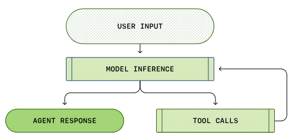
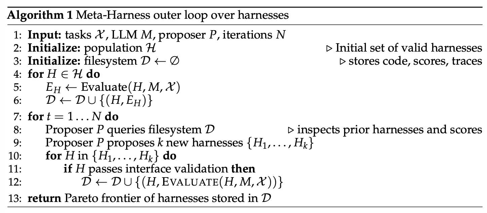
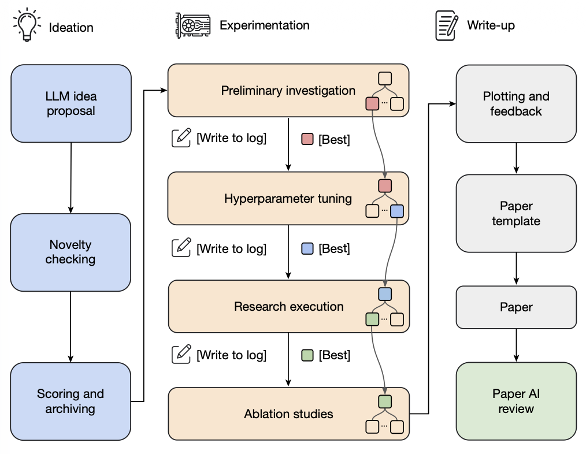
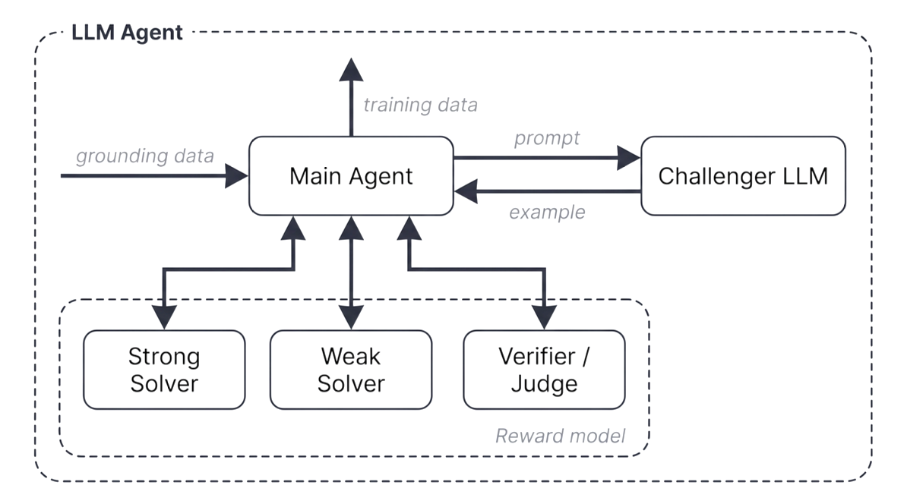

# 面向自我提升的 Harness 工程（Harness Engineering for Self-Improvement）

**递归自我改进（recursive self-improvement，RSI）** 的概念可以追溯到 [I. J. Good (1965)](https://philpapers.org/rec/GOOSCT)，他把“超智能机器”定义为一个在所有智力活动上都能超越人类、并能设计出更好的机器来改进自身的系统。[Yudkowsky (2008)](https://www.lesswrong.com/posts/JBadX7rwdcRFzGuju/recursive-self-improvement) 用“递归自我改进”描述一种特定的反馈回路：AI 利用自己当前的智能，去改进产生其智能的认知机制。

在现代 AI 中，这种反馈回路可能意味着模型直接重写自己的权重，或者更广义地说，模型改进其*训练流水线*和*部署系统*，进而得到一个在具有经济价值任务上表现更好的后继模型。已有研究表明，前沿实验室里 AI 研究发展的速度被大幅加快了（[Anthropic](https://www.anthropic.com/institute/recursive-self-improvement)；[OpenAI](https://openai.com/index/how-agents-are-transforming-work/)）。

我特意提到*“部署系统”*，是因为原始模型与现实世界上下文之间的这一层，似乎与模型本身的原始智能（即预训练刚结束时的那些评测）同样重要。Harness（智能体 harness）是 AI 部署的重要组成部分，Claude Code、Codex 这类成功的编码智能体产品就是例证。所谓 **harness**，就是包裹在基座模型之外、负责编排执行并决定模型如何思考与规划、如何调用工具与行动、如何感知与管理上下文、如何存储产物以及评估结果的系统。

这一篇文章聚焦于围绕 harness 工程的研究，以及它如何为 RSI 做贡献。近期大量关于自动研究（auto-research）、自我改进智能体、进化式程序搜索的工作，都可以围绕这个问题来组织。另一些关于模型自我对弈、合成数据、测试时训练，以及更广义的持续学习主题的工作，同样符合 RSI 的愿景（例如 [Yuan et al. 2024](https://arxiv.org/abs/2401.10020)、[Chen et al. 2024](https://arxiv.org/abs/2401.01335)、[Zhao et al. 2025](https://arxiv.org/abs/2505.03335)、[Choi et al. 2026](https://openreview.net/forum?id=lTbBFAoPSA)），但它们不在本文讨论范围内。

## Harness 设计模式

相比[早期的智能体框架](https://lilianweng.github.io/posts/2023-06-23-agent/)（agent = LLM + 记忆 + 工具 + 规划 + 行动），harness 工程还额外包含*工作流设计（例如循环工程）、评估、权限控制，以及持久化状态管理*。它不再只是 Prompt 模板，而是更接近运行时与软件系统设计：模型如何观察、行动、记忆、自我检查并改进。

设计应当刻意保持简单与通用，以支撑泛化能力，并很可能要参考既有的软件工程实践，从而受益于预训练已有的知识。Harness 与操作系统之间也存在很强的类比：和操作系统一样，harness 应当封装复杂的逻辑，同时保持接口简单。与此同时，配置、工具接口以及其他协议可能会在整个行业里逐渐标准化。

### 模式 1：工作流自动化

定义一个模型可以在其中运行、测试与迭代的工作流，是实现自动化的关键设计。Karpathy 的 autoresearch 仓库（[https://github.com/karpathy/autoresearch](https://github.com/karpathy/autoresearch)）就清晰展示了这类工作流应该如何构建。一种常见的工作流遵循一个目标导向的循环：规划、执行、观察/测试、改进，然后再次执行，*直到*目标达成。这个过程可能会主动向用户发起请求，以澄清任务规格或执行偏好。



（图片来源：[OpenAI codex agent 文章](https://openai.com/index/unrolling-the-codex-agent-loop/)）

这张工作流图还强调：模型要分析自身的轨迹与失败案例，然后通过一个“智能体运行时（agent runtime）”来推进进度，而不是依赖静态的 Prompt 模板。

### 模式 2：文件系统作为持久记忆

在长程（long-horizon）智能体系统中，一个反复出现的模式是对丰富的状态与产物进行简单可控的管理。Harness 不应该把整个工作流和所有日志都塞进上下文，而是应当把持久状态保存在文件里。在长程的智能体展开（rollout）中，实验日志、代码 diff、论文摘要、错误追踪、以及过往的展开轨迹等产物，往往会增长到远超模型训练时所适应的上下文窗口。

学会如何读写和编辑文件系统（通常经由 `bash` 命令）是 LLM 的一项基础能力，因此以简单的文件形式管理持久记忆，天然能从核心模型能力的提升中受益。

### 模式 3：子智能体与后端任务

Harness 可以派生出多个子智能体并行执行，并监控后端任务。当主智能体需要搜索多个假设、并发运行实验，或者把彼此独立的子任务委托出去而不污染主上下文时，这就很有用。于是父智能体需要一个小型的进程管理器：启动任务、检查日志、取消失败的运行，并把结果合并回主智能体线程。

关键的设计选择是让并行*显式且可观察*。如果子智能体的输出只存在于短暂的聊天上下文里，它们很快会变得过时而隐蔽；如果把它们存成文件、日志和状态记录，模型就能在中断后恢复，并基于自己的执行历史进行推理。

### 案例研究：编码智能体 Harness

主流编码智能体的核心接口，在 Claude Code、Codex、OpenCode 以及 Cursor 风格的智能体之间已经趋于稳定。它们普遍使用类似下图的循环：


（并非完整清单，仅作演示。若感兴趣可阅读[这篇文章](https://github.com/yasasbanukaofficial/claude-code)。）

| 分组 | 工具定义 |
| --- | --- |
| 文件系统 | - 文件发现：`glob`、`grep`、`ls`<br>- 文件读取：`read`、`read_many`<br>- 文件修改：`write`（写入整个新文件）；`edit`（基于字符串精确匹配的替换）；`multi_edit`；`apply_patch`（应用结构化的补丁/diff） |
| Shell 执行 | 运行命令：`bash`、`PowerShell` |
| IO | `lsp`，以及 git 类工具如 `git_status`、`git_diff`、`git_commit` |
| 外部上下文 | MCP 工具、Skills |
| 网络搜索 | `web_search`、`web_fetch`、浏览器工具 |
| 产物 | 读取文档、图片；生成 HTML、图片 |
| 后端进程 | 例如：`CronCreate`、`CronDelete`、`CronList` |
| 智能体委派 | 例如：`spawn_agent`、`resume_agent`、`wait_agent`、`list_agents`、`close_agent`、`interrupt_agent` 等 |

## Harness 层 vs 核心智能？

很难预测未来 RSI 会在多大程度上依赖 harness 工程，但 RSI 的近期路径不太可能一开始就是模型直接重写自己的权重。我对一条务实的近期路径的预测是：

1. Harness 工程会朝着“元方法论（meta-methodology）”的方向演进，也就是改进“得到更好答案的机制”，而不只是改进答案本身。Harness 系统本身成为一个优化目标，启发式规则更少，通用机制更多。
2. 反过来，成熟的 harness 又能支撑面向模型自我改进循环的自动研究；而更聪明的模型会阻止 harness 过度工程化（overengineering），让系统保持可持续。

最终，很多 harness 改进有可能被*内化*进核心模型的行为之中，但它与外部上下文和工具的接口应当保留下来。我们在[提示工程（prompt engineering）](https://lilianweng.github.io/posts/2023-03-15-prompt-engineering/)上已经见过这一模式的温和版本：随着指令微调与模型推理能力的提升，人工的 Prompt 技巧变得不再那么核心，但*“需要明确目标、约束、上下文与评估”这件事并没有消失*。

## Harness 优化

Harness 系统中被优化对象的演进大致是：指令 [Prompt](https://lilianweng.github.io/posts/2023-03-15-prompt-engineering/) → 结构化上下文 → 工作流 → harness 代码 → 优化器代码。随着模型变得更聪明、更强大，我们也在朝向更复杂的对象和更通用的方法迈进。

### 上下文工程

随着智能体任务的跨度显著拉长，简单把所有工具响应和模型生成都追加进上下文，会很快失控。上下文管理（context management）是构造更结构化、更精炼的上下文、并管理持久化状态的一层。毫无疑问，长上下文研究会持续进步，但眼下长上下文智能与上下文工程仍时有交织。

**智能体式上下文工程（Agentic Context Engineering，ACE；[Zhang et al. 2025](https://arxiv.org/abs/2510.04618)）** 把上下文当作一个不断进化的 playbook，而不是一条越写越长的 Prompt。它包含三个组件，共同维护一套由要点（bullet point）组成的上下文 playbook，每个要点带一个标识符和一段描述：

1. *Generator（生成器）*：参考这些要点，产出任务轨迹。
2. *Reflector（反思器）*：从成功与失败的轨迹中提炼洞见。
3. *Curator（策展器）*：以增量、逐条的方式更新结构化上下文。


（图片来源：[Zhang et al. 2025](https://arxiv.org/abs/2510.04618)）

为了防止在反复重写中出现上下文坍塌（context collapse）和简洁性偏差（brevity bias），ACE 的一个关键设计选择是：策展器不重写一整块 Prompt，而是输出一组结构化的、逐条的要点，形式为（标识符，描述），这些要点再以确定性逻辑合并进一个结构化的上下文日志本（logbook）中。上下文条目会被周期性地精炼与去重。

ACE 能从展开（rollout）中学习洞见，这帮助我们朝自我管理记忆迈进，但它的更新规则和整体工作流仍是手工设计的。为了迈向更自我改进的循环，**元上下文工程（Meta Context Engineering，MCE；[Ye et al. 2026](https://arxiv.org/abs/2601.21557)）** 把“机制”（如何管理上下文）与“产物内容”（上下文里是什么）分离开来，在元优化层面运行技能演进（skill evolution），在基础层面运行上下文优化。

一个 MCE 技能 $s \in \mathcal{S}$ 定义了一个上下文函数 $c_s = (\rho_s, F_s)$，并将输入 $x$ 映射为上下文 $c = F_s(x; \rho_s)$，其中：

* $\rho_s = \{\rho_1, \dots, \rho_m\}$ 是静态组件（Prompt、知识库、代码库）。
* $F_s = \{F_1, \dots, F_k\}$ 是动态算子（搜索、筛选、过滤、格式化）。

双层优化（bi-level optimization）的目标，是在训练数据上找到给定技能 $s$ 的最佳上下文 $c_s^*$，而外层循环则找到在验证集上表现最佳的技能 $s^*$：

$$
\text{Inner: }c_s^*=\arg\max_{c_s}J_\text{train}(c_s;s)\quad \text{Outer: }s^*=\arg\max_{s\in\mathcal{S}}J_\text{val}(c_s^*)
$$

技能数据库记录着过往技能、上下文函数和评估指标的历史 $\mathcal{H}_{k-1} = \{(s_i, c_i, J_i^{\text{train}}, J_i^{\text{val}})\}_{i=1}^{k-1}$。一个元层面的智能体针对给定任务 $\tau$，对先前的技能执行智能体式[crossover（交叉）](https://en.wikipedia.org/wiki/Crossover_(evolutionary_algorithm))，从而创造新技能：$s_k = \text{crossover}(\tau, \mathcal{H}_{k-1})$。

随后一个基础层面的上下文工程师执行该技能 $s_k$，并基于展开反馈 $\mathcal{R}_k$、在当前技能的指导下学习上下文函数：$c_k = \text{engineer}(\tau, s_k; c_{k-1}^*, \mathcal{R}_k)$。


（图片来源：[Ye et al. 2026](https://arxiv.org/abs/2601.21557)）

MCE 不像 ACE 那样强制规定一套如何组织上下文的启发式规则。它用*自由形式的技能（free-form skills）*来存储任务最重要的知识，并让技能和“技能条件化的上下文”一起迭代地共同演化。在实现上，一个上下文函数 $c$ 被实例化为某个专用目录下的文件集合，既包含静态组件（`skill.md`），也包含动态组件（上下文与数据展开）。元层面与基础层面的优化都在具备标准工具集的智能体式编码环境中执行，

$$
\mathcal{T}=\{\texttt{Read},\texttt{Write},\texttt{Edit},\texttt{Bash},\texttt{Glob},\texttt{Grep},\texttt{TodoWrite}\}
$$

**元 harness（Meta-Harness；[Lee et al. 2026](https://arxiv.org/abs/2603.28052)）** 又往深了一层：被优化的对象，是决定并优化“哪些信息应被存储、检索并呈现给模型”的那段*代码*。名字里的“Meta-”意味着，它是一个用来优化 harness 的 harness。



（图片来源：[Lee et al. 2026](https://arxiv.org/abs/2603.28052)）

负责创建新 harness 的提议者（proposer）本身就是一个编码智能体，最终产出的是位于帕累托前沿（Pareto frontier）上的一组 harness 候选：

* 整个执行历史都可以通过文件系统访问，因此编码智能体使用像 `grep` 或 `cat` 这样的命令去通读它，而不是把一切都倒进单个 Prompt 上下文。
* 被提议的 harness 是文件系统里的一个字典，包含它自己的源代码、分数、展开轨迹和状态更新。
* 元 harness 循环不断创建新 harness，只保留合格的那些。


（图片来源：[Lee et al. 2026](https://arxiv.org/abs/2603.28052)）

不过，重要的教训已经很清楚：一旦 harness 设计变成了一个可执行的搜索空间，强大的编码智能体就能利用人类工程师所使用的同一片设计空间。

### 工作流设计

Harness 工程中的工作流设计，可以由领域专家手工完成。以自动研究为例，已经提出并验证过多种框架。**AI Scientist** 系统（[Lu et al. 2026](https://www.nature.com/articles/s41586-026-10265-5)）搭建了一条流水线，用来提出研究想法、写代码、跑实验、分析结果、撰写论文，并进行同行评审。[Meng et al. (2026)](https://arxiv.org/abs/2605.26340) 在 **ScientistOne** 中把“可验证性”作为核心设计约束：每一个主张（引用、数值、方法、结论）都必须能追溯到某个证据来源，并经由 Chain-of-Evidence（证据链）检查来审计。



（图片来源：[Lu et al. 2026](https://www.nature.com/articles/s41586-026-10265-5)）

**Autodata** 智能体（[Kulikov et al. 2026](https://arxiv.org/abs/2606.25996)）被设计成一名数据科学家，用于生成训练与评估数据。主智能体管理一个负责出题的 *challenger（挑战者）*、一个 *weak solver（弱解题器）*、一个 *strong solver（强解题器）*，以及一个 *verifier/judge（验证器/裁判）*，目标是合成出难度“刚刚好”的数据——也就是强解题器能成功、但弱解题器会失败的数据。

在 Autodata 中，challenger 的 Prompt 会根据来自解题器与验证器的反馈不断迭代更新。这里的局限在于：合成出的任务被用来微调弱解题器，而不是强解题器；如果这个循环无法迭代地改进强模型，那它更像是在生成的 Prompt 分布上做间接蒸馏，RSI 的意味也就淡了。



（图片来源：[Kulikov et al. 2026](https://arxiv.org/abs/2606.25996)）

工作流的设计空间*极其庞大*，我们自然可以把工作流设计看作一个搜索问题，因此理应能用算法找到好解，而不只是手工设计。沿着这个方向，**自动设计智能体系统（Automated Design of Agentic Systems，ADAS；[Hu et al. 2025](https://arxiv.org/abs/2408.08435)）** 把智能体设计本身形式化为一个优化问题——“元智能体搜索（meta-agent search）”，由元智能体提出智能体工作流的新设计：

1. 用简单的智能体（如 CoT、self-refine）初始化一个智能体工作流档案（archive）。
2. 让一个元智能体受档案中已有方案的启发，用*代码*编写新的智能体。
    * 元智能体先生成新工作流的高层描述，再用代码实现它。
    * 草稿程序随后经过元智能体的两步 self-refine（即让模型给出反馈，再让同一个模型基于反馈精炼先前生成的输出；[Madaan et al. 2023](https://arxiv.org/abs/2303.17651)），以检查其新颖性。
3. 评估每个新候选，把成功的加回档案。
4. 重复第 2–3 步，直到达到最大迭代次数。


（图片来源：[Hu et al. 2025](https://arxiv.org/abs/2408.08435)）

**AFlow**（[Zhang et al. 2025](https://arxiv.org/abs/2410.10762)）把智能体工作流表示成一张图，其中节点代表调用 LLM 的动作，边用代码实现逻辑操作。工作流优化依赖 [MCTS](https://en.wikipedia.org/wiki/Monte_Carlo_tree_search)（蒙特卡洛树搜索）：

1. 用模板在树中初始化起始工作流 $W_0$。
2. 以“分数与均匀探索的软混合”方式选择一个工作流节点。
3. 让 LLM 基于其评估表现，生成一个被修改后的工作流来扩展它。
4. 执行并评估这个新工作流。
5. 若新工作流在 $N$ 轮预算内表现出改进，则加回树中。
6. 重复第 2–5 步，当 top-$k$ 的平均分数趋于平稳或触达预算时停止。


（图片来源：[Zhang et al. 2025](https://arxiv.org/abs/2410.10762)）

AFlow 在问答、代码、数学任务上的实验显示，它相比手工设计的工作流和 ADAS 都有不错的提升。


（图片来源：[Zhang et al. 2025](https://arxiv.org/abs/2410.10762)）

## 自我改进的 Harness

无论上下文工程还是工作流设计，都只是一个 harness 的一部分。我们需要在整个设计空间里搜索，把上下文管理逻辑、工作流、权限以及许多其他 harness 组件一起优化。正如我们在 Meta-Harness、ADAS、AFlow 等工作中看到的那样，**✨代码✨** 是定义程序和系统的*通用语言*。简而言之，harness 是一段代码，它编排了 Prompt、工具调用、子智能体、控制流、记忆与工作流逻辑如何协同工作。如果一个 LLM 能优化执行智能体的那段代码，它就能触及比手写 Prompt *大得多的设计空间*。

**自学优化器（Self-Taught Optimizer，STOP；[Zelikman et al. 2023](https://arxiv.org/abs/2310.02304)）** 是递归式脚手架改进的早期例子之一。第 $t=0$ 步的种子改进器 $I_0$ 接受一个初始解 $s$、一个效用函数 $u$、以及一个黑盒语言模型 $M$，返回一个改进的解 $s'$，即 $s' = I(u, s; M)$。STOP 的目标并不直接是改进 $s$，而是*改进改进器 $I$ 本身*。

首先，把元效用（meta-utility）定义为给定改进器函数 $I$ 在一组下游任务 $\mathcal{D}$ 上的平均效用：

$$
\hat{u}(I) \triangleq \frac{1}{\vert\mathcal{D}\vert}\mathbb{E}_{(u,s)\sim \mathcal{D}}[u(I(u,s; M))]
$$

由于改进改进器函数本身也是一个优化问题，我们可以基于 $I_{t-1}$ 在元效用上的表现，通过一个自我改进更新递归地得到 $I_t$ 的新版本：

$$
I_t = I_{t-1}(\hat{u},\, I_{t-1}; M)
$$


（图片来源：[Zelikman et al. 2023](https://arxiv.org/abs/2310.02304)）

在 Zelikman et al. (2023) 的实验中，被改进的改进器发现了多种策略，如遗传算法、分解并改进局部、多臂 Prompt 赌博机（multi-armed prompt bandits）、模拟退火、调整温度、以及束/树搜索。这类似于可以把 harness 工作流表示成一个待优化的对象。


（图片来源：[Zelikman et al. 2023](https://arxiv.org/abs/2310.02304)）

他们发现中有一个*值得警惕*的结果：STOP 在 GPT-4 上随迭代提升了下游平均表现，但在 GPT-3.5、Mixtral 这类更弱的模型上反而退化了。仅有递归结构是不够的——基座模型必须*足够 capable*，才能改进这套机制。这意味着 harness 改进能让模型部署得更好，但智能仍是核心。

一项较新的工作，**Self-Harness**（[Zhang et al. 2026](https://arxiv.org/abs/2606.09498)）依靠 LLM 智能体，通过一个“提议—评估—接受”的循环来改进自身的 harness。


（图片来源：[Zhang et al. 2026](https://arxiv.org/abs/2606.09498)）

Self-Harness 中的循环分为三个阶段：

1. *弱点挖掘（Weakness mining）*：把失败聚合成“以验证器为依据的失败模式（verifier-grounded failure patterns）”。
    * 用当前 harness $h_t$ 在任务上做评估，并收集执行轨迹用于分析。
    * 注意：两次运行在错误日志的表面上可能共享同一个验证器结果（如超时、缺失产物），却有着不同的因果机制。因此我们需要一份信息丰富的失败记录，包含终端验证器层面的原因、相关智能体行为的因果状态，以及轨迹所暴露的抽象智能体机制，才能挖出根因。
2. *Harness 提议（Harness proposal）*：基于挖掘出的失败模式，提出受约束的 harness 修改。
    * 在同一个模型 $h_t$ 下以提议者（proposer）身份被调用。
    * 模型会拿到一个受限的提议上下文：（1）当前 harness 的可编辑面；（2）来自评估系统的、以验证器为依据的失败模式；（3）应当保留的、已通过行为的记录；（4）先前尝试过的修改的摘要。
    * Harness 修改应优先选择那些可解决（例如不是任务特定的难度）、且能用窄改动修复的反复出现的错误模式。
    * Harness 修改候选应当彼此不同、具有多样性。
3. *提议验证（Proposal validation）*：验证并合并合格的修改，生成新的 harness $h_{t+1}$。
    * 候选修改在 held-in（内部保留，$D_{\text{in}}$，用于检验弱点是否被解决）与 held-out（外部保留，$D_{\text{out}}$，用于检查是否引入了其他未知问题）两个切分上做回归测试。
    * 只有当候选在 held-in 与 held-out 上都没有回归时，才被接受。
    * 被接受的候选会被合并，把 harness 更新为 $h_{t+1}$；被拒绝的候选会被记录，但不改动当前活动的 harness。

当在 Terminal-Bench-2 上运行 `MiniMax M2.5`、`Qwen3.5-35B-A3B` 与 `GLM-5` 时，Self-Harness 被证明能学习出“针对特定模型弱点”的、模型专属的 harness 指令，并提升 held-out 的通过率。

这类自 harness 工作也引发了我的担忧：如果一个程序被允许编辑操作系统，抽象边界就被打破了。可编辑面需要被妥善设计，权限控制与安全层必须位于这个循环之外。围绕[奖励作弊（reward hacking）](https://lilianweng.github.io/posts/2024-11-28-reward-hacking/)的所有挑战依然存在。

## 进化搜索

进化搜索（evolutionary search）是一种受自然选择启发的优化方法（参见我关于[进化算法](https://lilianweng.github.io/posts/2019-09-05-evolution-strategies/)的旧文）。它通过变异来演化一组解，只保留群体里“适应度（fitness）”高的那些。当（1）搜索空间庞大或形状怪异；（2）难以直接用梯度优化、但评估解却很容易时，进化搜索就派上用场。Harness 搜索看起来正好契合。

进化搜索在过去的研究中已被用于 Prompt 工程。**Promptbreeder**（[Fernando et al. 2023](https://arxiv.org/abs/2309.16797)）通过一组丰富的变异操作来优化任务特定的 Prompt，而且有趣的是，变异 Prompt（即让 LLM 去变异任务 Prompt 的指令）本身也会通过进化被改进。**GEPA**（[Agrawal et al. 2025](https://arxiv.org/abs/2507.19457)）把基于[反思（reflection）](https://lilianweng.github.io/posts/2023-06-23-agent/#self-reflection)的 Prompt 与进化搜索结合起来，利用对试错轨迹的自然语言反思来提出 Prompt 更新。

[Novikov et al. (2025)](https://arxiv.org/abs/2506.13131) 提出的 **AlphaEvolve** 是一个编码智能体式的进化搜索系统，它维护一个候选程序池，并提示（prompt）冻结的 LLM 生成用于改进的 diff。随着系统反复评估子程序、保留成功的那些，它会随时间发现更好的解。


（图片来源：[Novikov et al. 2025](https://arxiv.org/abs/2506.13131)）

AlphaEvolve 的设计中有几个关键细节：

* Prompt 包含父程序、结果、指令，有时还有元信息。
* 编码智能体能访问整个仓库，但待改进的代码区域会用 `# EVOLVE-BLOCK-START` 和 `# EVOLVE-BLOCK-END` 显式标出。
* 元 Prompt（meta-prompt）随指令与上下文一同演化（由 LLM 提议），方式与我们演化解程序相似。

消融实验展示了进化流程、Prompt 中的上下文、元 Prompt、整文件演化以及使用更强 LLM 各自的价值。


（图片来源：[Novikov et al. 2025](https://arxiv.org/abs/2506.13131)）

近期的变体如 **ThetaEvolve**（[Wang et al. 2025](https://arxiv.org/abs/2511.23473)）把进化搜索与 RL、上下文学习结合起来；另一方面，**ShinkaEvolve**（[Lange et al. 2025](https://arxiv.org/abs/2509.19349)）引入了三个新组件来提升 LLM 的采样效率：

* 通过设计父代采样来平衡“性能排名”与“子代数量”，实现更省样本的探索。
* 基于嵌入的余弦相似度，丢弃与现有群体过于相似的候选，做“代码新颖性拒绝采样（code-novelty rejection sampling）”。
* 在元便签本（meta-scratchpad）中识别成功解里的好模式，以指导未来的变异。

与上述聚焦于“解改进”的方法不同，**达尔文·哥德尔机（Darwin Gödel Machine，DGM；[Zhang et al. 2025](https://arxiv.org/abs/2505.22954)）** 显式地以“可编辑的 harness 代码库”为演化目标，并由基于 LLM 的编码智能体来执行。确切地说，这个智能体被允许修改它自己的 harness。后续工作 Hyperagents（[Zhang et al. 2026](https://arxiv.org/abs/2603.19461)）引入了元智能体，来控制如何修改现有任务智能体以创造新的智能体：

1. 从池中的一个编码智能体开始。
2. 每一轮，以“与其表现成正比、与其子代数量成反比”的概率选一个父代，对其修改并分叉出新的智能体。
3. 被选中的父代智能体审视自己的基准评估日志，然后针对自己的 harness 代码库提出改进，生成新版本的编码智能体。代码编辑用两个基础工具实现：（1）bash（参数：`<bash_command>`）；（2）editor（参数：`view/create/edit <file_path>`）。
4. 对新编码智能体做评估，只有表现足够高的才被加回池中。
5. 重复第 2–4 步，直到命中某个停止准则。

DGM 是在固定模型下的 harness 演化。在 `Claude 3.5 Sonnet` 作为基座 LLM、初始 harness 配置很简单的情况下，DGM 发现的智能体在 SWE-bench Verified（20% → 50%）和 Polyglot（14.2% → 30.7%）上与手工设计的智能体相当或更优。

这类方法在“候选解可自动评估、候选适应度易量化”时表现良好，例如矩阵乘法、GPU 核优化、算法竞赛、数据中心调度。它们在“评估慢、模糊，或主要依赖启发式”的领域里则会吃力。进化的计算效率与有效性也是隐患。

## 与模型权重的联合优化

Harness 演化改变的是模型周围的非参数系统。为了实现完整的自我改进，完全可以同时允许模型更新自己的权重。权重的更新可以通过改进模型训练流水线，或在测试时做持续学习来实现。持续学习这个话题值得未来单独写一篇。

**SIA**（[Hebbar et al. 2026](https://arxiv.org/abs/2605.27276)）是较早尝试把 harness 改进与模型参数更新放进同一个优化循环的工作，其设计包含三个组件：

* *Meta-Agent（元智能体）*：提出初始 harness。
* *Task-Specific Agent（任务专属智能体）*：执行任务。
* *Feedback-Agent（反馈智能体）*：根据近期轨迹，选择是更新 harness 还是更新模型权重。


（图片来源：[Hebbar et al. 2026](https://arxiv.org/abs/2605.27276)）

SIA 的实验中有些混杂变量，使结果难以解读。例如，任务专属智能体比用于 Meta-Agent 和 Feedback-Agent 的模型弱得多（`gpt-oss-120b` vs `Claude Sonnet 4.6`），而基线又太弱，难以与相关方法做干净的对照。我认为这个方向有意思，但证据还只是初步的。不过训练稳定性、古德哈特定律效应（Goodhart effect）等诸多挑战仍然开放。

## 未来挑战

AI Scientist 这一系列工作有力地证明：一个专家设计的 harness 能够协调自动研究循环的大部分环节，并以撰写研究论文的形式被实验。但“产出论文”并不等于“科学发现”。一个系统可以写出看似可信的稿件，却仍可能存在捏造的引用、实现漂移（implementation drift），或薄弱的实验结果。

[Trehan & Chopra (2026)](https://arxiv.org/abs/2601.03315) 测试了 LLM 能否在极少脚手架和基础工具（即 `read_file`、`write_file`、`llm_search`、`list_files`）下，从一个研究想法走到一篇论文。每个想法都有独立的工作区，智能体可以在其中生成和读取文档作为上下文的一部分。他们在三个领域（世界模型、多智能体 RL、AI 安全与对齐）做了实验，每个领域包含 45–50 篇高质量种子文档来激发新想法。只有 4 个想法被人类专家选中走完整条流水线，且仅 1 个被完整执行成论文。他们在实验中观察到了六种反复出现的失败模式：

* *偏向训练数据默认值（Bias toward training-data defaults）*：使用过时的库、陈旧的命令、标准格式，或并非基于实际仓库/数据集的假设。
* *执行压力下的实现漂移（Implementation drift under execution pressure）*：当实现变得技术上很复杂时，模型可能退向一个常见的更简单解法，而不是所提出的方法。
* *记忆与上下文退化（Memory and context degradation）*：长程项目会丢失关键细节，除非日志被写成持久产物。
* *过度乐观（Over-optimism）*：尽管实验有噪声或已失败，模型仍宣告成功；类似地，[Bubeck et al. (2025)](https://arxiv.org/abs/2511.16072) 观察到“p-hacking 与 eureka-ing”模式，模型会在信号仍是噪声时引入“数值胶带（numerical duct tape）”并宣告胜利。
* *领域智能不足（Insufficient domain intelligence）*：模型缺乏默会的手艺知识，例如预测实现复杂度、判断实验结果是否合理、或知道哪些基线重要。
* *科学品味薄弱（Weak scientific taste）*：实验也许能执行，却没有回答正确的问题。

迈向完整的 RSI，研究者已经取得了切实进展，但仍有若干瓶颈。

**1. 薄弱而模糊的评估器。** 许多研究主张并没有快速而精确的验证器，很多现实任务也是如此。当前的自我改进循环，在评估指标可度量、客观的任务上效果最好，正如 [RL 的工作方式](https://lilianweng.github.io/posts/2018-02-19-rl-overview/) 一样。

研究的品味、新颖性、长期科学价值要难测得多。例如，研究品味常常混杂了问题构建、实验设计，以及对“哪些意外结果值得追、哪些失败案例值得重试”的判断。

**2. 上下文与记忆的生命周期。** 随着 AI 智能体变得更自主、更独立，记忆也在增长。一个有价值的 harness 需要管理上下文与记忆，以补足长上下文生成现有的局限，同时最大化长程任务的成功率。既然人类能在一生中维持记忆，我在这里看到一个类比：[上下文工程](https://lilianweng.github.io/posts/2026-07-04-harness/#context-engineering)将会、也应当成为智能的核心部分，而不是停留在软件系统层。

**3. 负面结果。** 研究者有动力发表成功的结果，因此文献偏向成功。在海量数据（至少目前主要还是人类创造的，lol）上训练的 LLM，可能不擅长决定何时放弃一个假设、报告一个负面结果，甚至承认失败——因为数据中成功与失败样本的不平衡。一个研究 harness 应当让失败尝试易于保留，因为从失败中学习是缩减任务搜索空间的最佳方式。

**4. 多样性坍塌（Diversity collapse）。** 进化与 RL 循环倾向于利用已知的高奖励模式。我们需要[机制](https://lilianweng.github.io/posts/2020-06-07-exploration-drl/)来防止群体坍缩成同一解的各种变体。这对开放式研究尤其关键，因为最佳路径在当前评估器下起初可能看起来更差。

**5. [奖励作弊（reward hacking）](https://lilianweng.github.io/posts/2024-11-28-reward-hacking/)。** 一个自我改进循环会优化它拿到的任何信号。如果奖励来自单元测试，智能体可能过拟合测试；如果来自裁判模型，它可能学会针对该裁判的奖励作弊技巧；如果来自基准分数，它可能利用基准的缺陷（artifact）。

评估器与权限控制应当位于“演化 harness 的那个循环”之外，配合 held-out 测试、轨迹审计，以及在关键决策点上的人工评审——究竟能把多少监督规模化、自动化，仍是一个开放的研究领域。

**6. 长期成功。** 一个外在的优化循环，作用在个体展开（rollout）之外、我们能在训练沙箱里模拟的奖励上。

以编码智能体为例。编码智能体已经提升了软件工程的日常生产力，但许多优化目标仍过于短期。它常常能完成手头的任务，却不太明确该如何保护一个由成百上千工程师共同维护的仓库的长期健康。基于沙箱的标准 RLVR 式训练，很少能捕捉可维护性、归属边界、迁移成本、向后兼容性，或未来的调试负担。

**7. 人类的角色。** 人类应当向上栈移动，而不是被移出循环——也就是说，人类要在正确的时间、正确的抽象层级上提供监督；我们的系统设计应当考虑何时、如何设置这样的接触点。

上面列出的许多挑战都需要人类的反馈与引导。毕竟，我们是在为人类的更好未来构建技术，而不是相反。

## 引用

请引用如下：

> Weng, Lilian. “Harness Engineering for Self-Improvement”. Lil’Log (Jul 2026). https://lilianweng.github.io/posts/2026-07-04-harness/

或使用 BibTeX：

```bibtex
@article{weng2026harness,
  title = {Harness Engineering for Self-Improvement},
  author = {Weng, Lilian},
  journal = {lilianweng.github.io},
  year = {2026},
  month = {July},
  url = "https://lilianweng.github.io/posts/2026-07-04-harness/"
}
```

## 附录：一些有用的基准

* **[PaperBench](https://arxiv.org/abs/2504.01848)**：从零复现 20 篇 ICML 2024 的 Spotlight 与 Oral 论文，包括理解论文贡献、开发代码库、成功执行实验。
    * 每个复现任务被拆成更小的、可单独评分的任务。
    * 共 8,316 条评分细则（rubric），与论文作者共同制定。
    * 当时最好的模型（`Claude 3.5 Sonnet`，约 21%）并未超过 ML 博士。
    * 包含 PaperBench、PaperBench Code-Dev（轻量版），以及 JudgeEval。
* **[CORE-Bench](https://arxiv.org/abs/2409.11363)**：评估已发表研究的计算可复现性。
    * 基于 90 篇科学论文（覆盖计算机科学、社会科学、医学）的 270 个任务。
    * 任务涉及用提供的代码与数据复现结果。
    * 包含多个难度层级，以及纯语言与视觉-语言两类任务。
    * 当时报告的最佳智能体（`GPT-4o` 与 `GPT-4o-mini`）在最难任务上仅取得 21% 准确率。
* **[ScienceAgentBench](https://arxiv.org/abs/2410.05080)**：评估面向数据驱动科学发现的 LLM 智能体。
    * 从 44 篇同行评审论文（数学、化学、生物、地理四学科）中抽取 102 个任务。
    * 覆盖这些领域的基础数据科学任务：数据处理、模型开发、数据分析、信息可视化。
* **[RE-Bench](https://arxiv.org/abs/2411.15114)**：在贴近现实的 ML 研究工程环境中，让前沿 AI 智能体与人类专家对比。
    * 7 个有挑战、开放式的 ML 研究工程环境。
    * 每个环境 =（评分函数，起始解，参考解）；每个都可在 8 张或更少 H100 GPU 上运行。
    * 示例：优化一个核、跑一次 scaling-law 实验、修复一个 embedding、为 QA 微调 GPT-2 等。
    * 包含 61 位不同人类专家的 71 次八小时尝试的数据。
    * 人类专家在 82% 的八小时尝试中取得非零分；24% 匹配或超过了强参考解。
    * 最佳 AI 智能体在 2 小时预算下得分比人类高 4 倍，但人类在更长预算下回报更好，并在 8 小时与 32 小时设定下超过智能体。
* **[MLE-bench](https://arxiv.org/abs/2410.07095)**：在离线 Kaggle 竞赛上评估 ML 工程智能体。
    * 包含从 Kaggle 精选的 75 个 ML 工程竞赛。
    * 测试训练模型、准备数据集、运行实验、向评分脚本提交预测。
    * 以 Kaggle 公开排行榜作为人类基线。
    * 论文中最佳配置（`o1-preview` + AIDE 脚手架）在 16.9% 的竞赛中至少达到 Kaggle 铜牌水平。
    * 包含资源缩放与污染分析。
* **[KernelBench](https://arxiv.org/abs/2502.10517)**：评估生成的 GPU 核的正确性与速度。
    * 250 个 PyTorch 任务，评估 LLM 能否写出又快又正确的核。
    * 评估指标 $\text{fast\_p}$ = 既正确又快于基线的生成核所占百分比。

## 参考文献

[1] Good, I. J. [“Speculations Concerning the First Ultraintelligent Machine.”](https://philpapers.org/rec/GOOSCT) *Advances in Computers*, 6:31–88, 1965.

[2] Yudkowsky, Eliezer. [“Recursive Self-Improvement.”](https://www.lesswrong.com/posts/JBadX7rwdcRFzGuju/recursive-self-improvement) LessWrong, 2008.

[3] Choi, et al. [“Anchored Self-Play for Code Repair.”](https://openreview.net/forum?id=lTbBFAoPSA) ICML 2026.

[4] Zhao, et al. [“Absolute Zero: Reinforced Self-play Reasoning with Zero Data.”](https://arxiv.org/abs/2505.03335) arXiv preprint arXiv:2505.03335, 2025.

[5] Yuan, et al. [“Self-Rewarding Language Models.”](https://arxiv.org/abs/2401.10020) arXiv preprint arXiv:2401.10020, 2024.

[6] Chen, et al. [“Self-Play Fine-Tuning Converts Weak Language Models to Strong Language Models.”](https://arxiv.org/abs/2401.01335) ICML 2024.

[7] Zhang, et al. [“Agentic Context Engineering: Evolving Contexts for Self-Improving Language Models.”](https://arxiv.org/abs/2510.04618) ICLR 2026.

[8] Ye, et al. [“Meta Context Engineering via Agentic Skill Evolution.”](https://arxiv.org/abs/2601.21557) arXiv preprint arXiv:2601.21557, 2026.

[9] Lee, et al. [“Meta-Harness: End-to-End Optimization of Model Harnesses.”](https://arxiv.org/abs/2603.28052) arXiv preprint arXiv:2603.28052, 2026.

[10] Lu, et al. [“Towards end-to-end automation of AI research.”](https://www.nature.com/articles/s41586-026-10265-5) *Nature*, 651:914–919, 2026.

[11] Meng, et al. [“ScientistOne: Towards Human-Level Autonomous Research via Chain-of-Evidence.”](https://arxiv.org/abs/2605.26340) arXiv preprint arXiv:2605.26340, 2026.

[12] Kulikov, et al. [“Autodata: An agentic data scientist to create high quality synthetic data.”](https://arxiv.org/abs/2606.25996) arXiv preprint arXiv:2606.25996, 2026.

[13] Hu, Lu, and Clune. [“Automated Design of Agentic Systems.”](https://arxiv.org/abs/2408.08435) ICLR 2025.

[14] Madaan, et al. [“Self-Refine: Iterative Refinement with Self-Feedback.”](https://arxiv.org/abs/2303.17651) NeurIPS 2023.

[15] Zhang, et al. [“AFlow: Automating Agentic Workflow Generation.”](https://arxiv.org/abs/2410.10762) ICLR 2025.

[16] Zelikman, et al. [“Self-Taught Optimizer (STOP): Recursively Self-Improving Code Generation.”](https://arxiv.org/abs/2310.02304) COLM 2024.

[17] Zhang, et al. [“Self-Harness: Harnesses That Improve Themselves.”](https://arxiv.org/abs/2606.09498) arXiv preprint arXiv:2606.09498, 2026.

[18] Fernando, et al. [“Promptbreeder: Self-Referential Self-Improvement Via Prompt Evolution.”](https://arxiv.org/abs/2309.16797) arXiv preprint arXiv:2309.16797, 2023.

[19] Agrawal, A. et al. [“GEPA: Reflective Prompt Evolution Can Outperform Reinforcement Learning.”](https://arxiv.org/abs/2507.19457) arXiv preprint arXiv:2507.19457, 2025.

[20] Novikov, et al. [“AlphaEvolve: A coding agent for scientific and algorithmic discovery.”](https://arxiv.org/abs/2506.13131) arXiv preprint arXiv:2506.13131, 2025.

[21] Lange, Imajuku, and Cetin. [“ShinkaEvolve: Towards Open-Ended And Sample-Efficient Program Evolution.”](https://arxiv.org/abs/2509.19349) arXiv preprint arXiv:2509.19349, 2025.

[22] Wang, et al. [“ThetaEvolve: Test-time Learning on Open Problems.”](https://arxiv.org/abs/2511.23473) arXiv preprint arXiv:2511.23473, 2025.

[23] Zhang, et al. [“Darwin Gödel Machine: Open-Ended Evolution of Self-Improving Agents.”](https://arxiv.org/abs/2505.22954) arXiv preprint arXiv:2505.22954, 2025.

[24] Zhang, et al. [“Hyperagents.”](https://arxiv.org/abs/2603.19461) arXiv preprint arXiv:2603.19461, 2026.

[25] Yuksekgonul, et al. [“Learning to Discover at Test Time.”](https://arxiv.org/abs/2601.16175) arXiv preprint arXiv:2601.16175, 2026.

[26] Riaz, et al. [“Epistemic Uncertainty for Test-Time Discovery.”](https://arxiv.org/abs/2605.11328) arXiv preprint arXiv:2605.11328, 2026.

[27] Hebbar, et al. [“SIA: Self Improving AI with Harness & Weight Updates.”](https://arxiv.org/abs/2605.27276) arXiv preprint arXiv:2605.27276, 2026.

[28] Trehan and Chopra. [“Why LLMs Aren’t Scientists Yet: Lessons from Four Autonomous Research Attempts.”](https://arxiv.org/abs/2601.03315) arXiv preprint arXiv:2601.03315, 2026.

[29] Bubeck, et al. [“Early science acceleration experiments with GPT-5.”](https://arxiv.org/abs/2511.16072) arXiv preprint arXiv:2511.16072, 2025.

[30] Starace, et al. [“PaperBench: Evaluating AI’s Ability to Replicate AI Research.”](https://arxiv.org/abs/2504.01848) ICML 2025.

[31] Wijk, et al. [“RE-Bench: Evaluating frontier AI R&D capabilities of language model agents against human experts.”](https://arxiv.org/abs/2411.15114) ICML 2025.

[32] Chan, et al. [“MLE-bench: Evaluating Machine Learning Agents on Machine Learning Engineering.”](https://arxiv.org/abs/2410.07095) arXiv preprint arXiv:2410.07095, 2024.

[33] Chen, et al. [“ScienceAgentBench: Toward Rigorous Assessment of Language Agents for Data-Driven Scientific Discovery.”](https://arxiv.org/abs/2410.05080) ICLR 2025.

[34] Siegel, et al. [“CORE-Bench: Fostering the Credibility of Published Research Through a Computational Reproducibility Agent Benchmark.”](https://arxiv.org/abs/2409.11363) TMLR 2024.

[35] Ouyang, et al. [“KernelBench: Can LLMs Write Efficient GPU Kernels?”](https://arxiv.org/abs/2502.10517) arXiv preprint arXiv:2502.10517, 2025.

## 术语对照

| 英文 | 中文 |
| --- | --- |
| harness | 智能体 harness（保留英文） |
| recursive self-improvement (RSI) | 递归自我改进（RSI） |
| context engineering | 上下文工程 |
| Agentic Context Engineering (ACE) | 智能体式上下文工程（ACE） |
| Meta Context Engineering (MCE) | 元上下文工程（MCE） |
| Meta-Harness | 元 harness（Meta-Harness） |
| persistent memory | 持久记忆 |
| self-improving harness | 自我改进 harness |
| Self-Taught Optimizer (STOP) | 自学优化器（STOP） |
| reward hacking | 奖励作弊（reward hacking） |
| evolutionary search | 进化搜索 |
| verifier | 验证器 |
| AlphaEvolve / AFlow / ADAS / DGM / SIA | 保留英文 |
