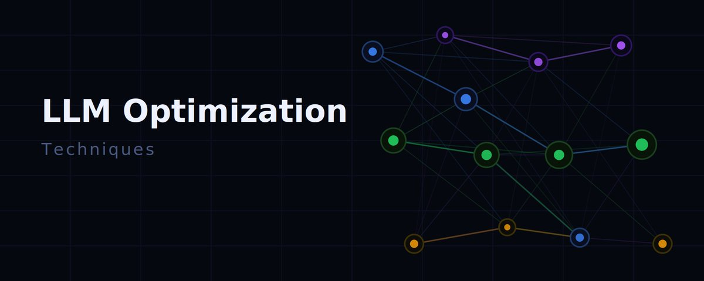

# LLM 优化面试笔记：训练与推理

原文标题：LLM Optimization Interview Notes: Training and Inference  
原文作者：Gauri Gupta  
原文链接：https://x.com/gauri__gupta/status/2051882947758993815  
访问日期：2026-05-07  
原文发布日期：2026-05-06  
译文版本：v0.1

## 译文说明

本文根据 Gauri Gupta 发布在 X 状态中的 X Article 内容翻译整理。原始状态本身主要是文章入口，以下正文对应其内嵌长文《LLM Optimization Interview Notes: Training and Inference》。



## 引言

这是我在准备几家头部 AI 实验室面试、同时重新梳理大规模模型高效训练核心思想时整理的一组个人笔记。它一半是面试准备，一半是给自己的复习提纲，我觉得也许也值得分享给更多人。

如何高效训练和部署大语言模型，已经成为现代 AI 中最关键的问题之一。随着模型规模进入数十亿参数级别，许多传统做法会迅速失效。本文梳理的这些技术，概括了构建和部署大模型时逐渐成为业界标准的一些核心优化策略。

这些笔记并不追求面面俱到，也不是一篇结构严整的系统教程，而是对技术讨论中反复出现、并真正构成大规模模型开发基础的一组概念和方法的总结。它也不会对每个主题展开特别深入的细节，而是尽量从高层次给出一份简明概览，归纳高效训练与推理里最常见的实践与思路。如果你正想进一步深入这些优化技术，或者在准备类似的技术面试，希望它能提供一个清晰的框架。

## 1. 内存优化技术（Memory Optimization Techniques）

内存往往是 LLM 训练与推理中的最大瓶颈。随着模型规模增至数十亿参数，传统的内存管理方式很快就会不够用。本节关注的是如何在尽量保持模型质量的前提下压缩内存占用，从而让我们能在既有硬件上训练和部署更大的模型。

### 1.1 Flash Attention

注意力机制在序列长度上具有二次时间复杂度和二次内存复杂度，因此在长序列场景下会带来明显的运行时与显存压力。Flash Attention 通过分块（tiling）和重计算（recomputation）两类技巧，降低了注意力的内存复杂度。它不再一次性处理完整的注意力矩阵，而是按块执行注意力计算，并保存归一化因子，而不是完整的注意力矩阵。具体来说，tiling 会依据共享内存大小拆解输入；recomputation 则保存与序列长度线性相关的 softmax 归一化因子，而不是与序列长度二次相关的 softmax 结果。

`Tiling Technique`：根据共享内存大小拆解输入，一次只计算一个 tile 的 softmax。也就是说，不再一次性处理完整的 query、key、value 张量，而是分多轮计算，并在后续步骤中合并结果。

`Recomputation Technique`：保存 softmax 的归一化因子，而不是 softmax 的完整输出，再利用这些因子重算注意力分数。这会降低内存需求，也会减少全局内存和共享内存之间的 I/O 流量。

补充资料：

- [矩阵乘法 tiling](https://docs.nvidia.com/deeplearning/performance/dl-performance-matrix-multiplication/index.html)
- [Online softmax 与 tiling](https://www.youtube.com/watch?v=LKwyHWYEIMQ&t=14s)

### 1.2 Multi-Query 与 Grouped Query Attention

- `MQA (Multi-Query Attention)`：通过在多个注意力头之间共享 key 和 value，降低内存占用。
- `GQA (Grouped Query Attention)`：把 query 按组处理，在效率与模型质量之间取得平衡。

### 1.3 Activation Checkpointing

当你用较长序列或较大的 micro-batch 训练 LLM 时，输入激活值很容易吃满设备内存。只 checkpoint 少量激活，并在反向传播时重算剩余部分，可以显著降低设备内存需求。

## 2. 计算优化技术（Compute Optimization Techniques）

这一类方法的目标，是通过更聪明的数据组织方式和模型结构设计，提高 GPU 利用率，并减少额外计算开销。

### 2.1 Sequence Packing

这是一种训练技巧：把多条训练序列拼接成一条更长的序列。这样可以消除 padding，让每个 micro-batch 能容纳更多 token，从而同时提高 GPU 的算力利用率与显存利用率。

### 2.2 Efficient Transformers

随着序列长度和数据集规模不断增长，标准 Transformer 因为在序列长度上的二次时间与内存复杂度而变得越来越昂贵。为了解决这个问题，人们提出了各种高效 Transformer 方案，通过降低计算和内存需求，使模型能够处理更长的序列和更大的数据集。

- `BigBird`：结合局部注意力、随机注意力和全局注意力，把复杂度降到 `O(n)`。
- `Longformer`：使用滑动窗口式的局部注意力，并配合全局注意力提升效率。
- `Low-Rank Approximations`：把 key 和 value 矩阵投影到更低维空间。
- `LongNet`：在较低层让 token 主要关注邻近 token，随着层数加深逐步增大 dilation factor，让 token 能看到更远的位置；其复杂度随序列长度线性扩展，可写作 `O(Nd)`。

补充资料：

- [Scaling Transformers with LongNet](https://www.youtube.com/watch?v=nC2nU9j9DVQ)

## 3. 推理优化技术（Inference Optimization Techniques）

生产环境中的大部分成本都发生在推理阶段。这些技术的目标，是在尽量不牺牲质量的前提下显著提升生成速度。

### 3.1 KV Caching

KV cache 的做法，是在模型生成序列时，把每个 token 对应的 key 和 value 张量缓存起来。在自回归生成中，每次生成新 token 时，模型只需要为这个新 token 计算注意力；此前 token 的 key 和 value 可以直接从缓存中复用，而不必对整条序列重新计算。这会显著减少计算量和内存开销，因为注意力层可以直接复用此前所有 token 的 key-value 对。

进阶 KV cache 优化：

- `Grouped Multi Query Attention`：让多组 query 共享同一组 key 和 value，进一步降低 KV cache 占用。
- `Multi-head Latent Attention`：先把 `K`、`V`、`Q` 投影到更低维的潜空间里，在潜空间中计算注意力，再投影回原空间。
- `Cross Layer KV-sharing`：在相邻注意力层之间共享 KV cache。
- `Interleaving Local and Global Attention`：每隔 4 到 6 层引入一次全局注意力。

补充资料：

- [KV Caching 视频讲解](https://www.youtube.com/watch?v=Mn_9W1nCFLo&t=3869s)
- [带 KV cache 的 FLOPs 计算效率说明](https://docs.google.com/presentation/d/14hK7SmkUNfSEIRGyptFD2bGO7K9sJOTnwjAVg3vgg6g/edit?slide=id.g286de50af37_0_933#slide=id.g286de50af37_0_933)

### 3.2 Stateful Caching

Stateful caching 使用 rolling hash 存储对话历史，以便复用重叠前缀。比如，假设缓存中已经有 `"Hello, how are you?"`，当新前缀变成 `"Hello, how are you doing today?"` 时，前面重叠的部分就可以直接复用。这个缓存通常按树结构组织，并配合 LRU（least recently used，最近最少使用）淘汰策略来管理内存。处理新请求时，先计算所有前缀的 rolling hash，找到最长的已缓存匹配；然后直接加载对应的 KV 张量，只对新增 token 继续计算。如果内存满了，就可以按 LRU 策略把较旧的上下文丢掉。

### 3.3 Speculative Decoding

Speculative decoding 会先让一个更小的 draft model 起草候选输出，再让目标模型去校验这些结果，从而把推理速度提升到原来的 2 到 3 倍。要让这项技术真正有效，draft model 不仅要足够快，还要和目标模型保持较好的对齐程度。

### 3.4 Quantization Techniques

量化，就是不再用标准 `fp32`（32 位浮点数）来表示模型的权重和激活值，而是用更少的比特位完成表示和计算，从而压缩模型。

量化类型：

- `Min/Max`：实现简单，但对离群值很敏感。
- `MSE`：直接最小化量化前后数值之间的均方误差。
- `Cross-entropy`：更关注 softmax 之后分布的保真度，尽量保留最大值的相对顺序。

`Post-Training Quantization (PTQ)`：在模型完整训练结束后，直接把权重转换到更低精度，比如 `int8` 或 `float16`，而不再继续训练。PTQ 的实现成本通常低于重训，但当模型扩大到数十亿参数后，Transformer 层里会出现幅值很大的激活离群值，导致朴素的低比特量化效果不佳。为了解决这个问题，通常会挂上量化观察器（observers）来收集输入数据的统计量，比如均值和标准差，再用这些统计量确定量化参数。

`Mixed-Precision Quantization`：并不是把全部权重和激活值都量化到同一比特宽度，而是给模型不同部分分配不同精度。例如，对更敏感的层或激活值使用更高精度，比如 8 位或 16 位，而把不那么敏感的部分压到更低精度。这样可以在内存节省和模型精度之间取得平衡，尤其适合大模型，因为统一的低比特量化往往会明显伤害性能。混合精度量化也可以分别应用在权重和激活值上，从而同时兼顾效率和质量。

`Quantization-Aware Training (QAT)`：在预训练阶段或后续微调阶段就把量化纳入训练流程。在前向传播中显式模拟量化与反量化，把量化误差当作一种正则化，从而让模型对这种误差更鲁棒。反向传播时，由于量化本身不可导，通常会用直通估计器（Straight-Through Estimator, STE）来近似梯度：在量化区间 `alpha` 到 `beta` 内令梯度近似为 1，在区间外令梯度为 0。

补充资料：

- [Quantization 视频讲解](https://www.youtube.com/watch?v=0VdNflU08yA)
- [Lilian Weng: Inference Optimization](https://lilianweng.github.io/posts/2023-01-10-inference-optimization/)

## 4. 训练优化（Training Optimization）

训练大模型离不开复杂的并行化策略。理解这些方法及其权衡，是大规模训练工程的基础。

### 4.1 Mixed Precision Training

混合精度训练会利用更低精度的数字格式，最典型的是 `bfloat16`，来减少显存占用并提升训练速度。`bfloat16` 与标准 32 位浮点数 `fp32` 具有相同的指数范围，但尾数位更少，因此既能表示非常大的数，也能表示非常小的数，从而保住深度学习所需的动态范围。不过，由于 `bfloat16` 和 `fp16` 的精度都更低，梯度在反向传播时可能发生上溢或下溢，进而造成训练不稳定。常见做法是使用 `loss scaling`：先把损失乘上一个较大的常数再做反向传播，之后再把梯度缩回去，以防较小梯度因为精度有限而直接消失。想真正发挥混合精度训练的收益，就必须认真处理好 loss scaling 和数值稳定性。

### 4.2 Data Parallelism

`DataParallel`：一种单进程、多线程的方案，适用于模型能放进单张 GPU 的场景。每张 GPU 都保留一份模型副本，分别处理不同的 micro-batch，然后对梯度做平均。它的主要瓶颈在于：通信发生在单进程多线程框架下，GPU 间通信效率不高，而且还会受到 CPU 开销影响；在 Python 语境里，它还会受到 GIL 竞争影响。

同步方式：每个 minibatch 结束后，worker 需要同步梯度或权重，避免模型参数变得过时。常见同步方式有两类：

- `Bulk Synchronous Parallel (BSP)`：每个 minibatch 结束后同步。它能避免权重陈旧问题，统计学习效率较好，但每台机器都必须停下来等待其他机器发送梯度。
- `Asynchronous Parallel (ASP)`：每个 GPU worker 都异步处理数据，不需要等待其他 worker。但它很容易使用到陈旧权重，降低统计学习效率。即便计算过程更繁忙，也不一定能缩短真正收敛所需的总训练时间。

`Distributed Data Parallel (DDP)`：每张 GPU 都有自己的独立进程，并且可以跨多台机器运行。它使用 Ring All-Reduce 避免中心瓶颈，因此相对于 `DataParallel` 有更低的通信开销。

`ZeRO (Zero Redundancy Optimizer)`：不仅模型参数和梯度要占显存，优化器状态，比如 Adam 的动量和方差，也会吃掉很多内存。ZeRO-DP 主要有三个优化阶段：

- `Optimizer State Partitioning`：可带来 4 倍内存缩减，通信量与普通 DP 相同。梯度计算可以在每张 GPU 上独立完成；对于不在当前 GPU 上的参数，会发生额外通信，但这和 DP 里的梯度平均本质相同，因此这通常是应当优先启用的 ZeRO Stage-1。
- `Gradient Partitioning`：可带来 8 倍内存缩减，通信量仍与普通 DP 相同。它在实践中和优化器状态切分类似，因为优化器状态本来就是按参数计算的，所以不会引入明显额外成本。
- `Parameter Partitioning`：内存缩减与 DP 并行度近似线性相关。比如分到 64 张 GPU，就可能得到 64 倍的内存缩减，代价是通信量大约增加 50%。它之所以可行，是因为前向和反向的任一时刻，真正需要参与计算的通常只是一层参数的一个子集，所以理论上最优情况只需要接近单层大小的显存。模型参数可以按不同方式切分；和 tensor parallelism、pipeline parallelism 的区别在于，每张 GPU 依然使用完整张量参与计算，只是这些参数不再全部常驻于同一张 GPU。

通信原语：

- `All-Reduce`：每个进程起始时持有自己的数据，结束时拿到所有进程数据的和，或其他归约结果；常用于同步梯度。它通常可以拆成 `reduce-scatter` 加 `all-gather`。
- `Ring All-Reduce`：各 GPU 按环拓扑互相发送和接收数据，以降低带宽瓶颈。其通信开销可写作 `2 × (N-1) × X / N` 字节，其中 `N` 是 GPU 数量，`X` 是数据大小。
- `Reduce-Scatter`：对数据按块做归约后，每个进程只保留属于自己的那一块；它常作为优化版 all-reduce 的第一步。
- `All-Gather`：每个进程收集其他所有进程的数据块，最终每个进程都得到完整数据；它常作为优化版 all-reduce 的第二步。
- `Broadcast`：一个进程把数据发送给其他所有进程，比如初始化时分发模型权重。
- `Reduce`：把所有进程的数据归约后发送给单个进程。
- `Scatter`：由一个进程把数据拆块发送给多个进程。
- `Gather`：多个进程把数据汇总到一个进程。

这些原语是分布式训练的基础构件，用来高效同步参数、梯度和优化器状态。简写起来就是：`all-reduce = reduce-scatter + all-gather`，而 ring-reduce 的通信开销是 `2 × (N-1) × X / N` 字节。

补充资料：

- [Scaling ML Models](https://www.youtube.com/watch?v=hc0u4avAkuM)
- [Training Optimization](https://www.youtube.com/watch?v=toUSzwR0EV8)
- [Understanding data parallelism, ZeRO, FSDP](https://www.youtube.com/watch?v=UVX7SYGCKkA)
- [Communication overhead slides](https://docs.google.com/presentation/d/14SxjHdkvIw80FCAu5c1NGvFKDVF5DgvD2MJ1OwQ-5Gs/edit?slide=id.g24fe79ce068_0_154#slide=id.g24fe79ce068_0_154)

### 4.3 Pipeline Parallelism

`Naive Model Parallel`：按层切分模型，并把不同分区放到不同 GPU 上。它被称作“naive”的主要原因是，在任意时刻往往只有一张 GPU 真正在工作，其余 GPU 都处于空闲状态。

`GPipe`：pipeline parallelism 把模型并行和数据并行结合起来，用来减少流水线中的低效“气泡”。核心思路是把一个 mini-batch 切成多个 micro-batch，让每个 stage 的 worker 能同时处理不同 micro-batch。若有 `m` 个均匀切分的 micro-batch，以及 `d` 个分区，那么 bubble 比例可写作 `(d-1)/(m+d-1)`。

`Activation Re-computation`：只保存分区边界处的激活，并在 worker 之间通信这些边界激活。分区内部各层的中间激活在反向传播时仍然需要，所以会在 backward 期间重新计算。采用 activation re-computation 后，训练的内存成本可写作 `M(l) = O(l/d) + O(d) = O(sqrt(l))`。

`PipeDream`：它让每个 worker 交替执行 forward 和 backward。PipeDream 不会在每个 batch 结束时做一次全局梯度同步；如果直接采用朴素的 `1F1B`，很容易让同一个 micro-batch 的 forward 和 backward 使用到不同版本的模型权重，从而降低学习效率。为了解决这个问题，PipeDream 提出了几种设计：

- `Weight Stashing`：每个 worker 追踪多个模型版本，并保证同一批数据在 forward 和 backward 中使用同一版本权重。
- `Vertical Sync`：模型权重版本会和激活值、梯度一起沿 stage 之间流动，各 worker 使用从上游传播来的对应权重版本，从而保持跨 worker 的一致性。
- `PipeDream-flush`：周期性地执行一次全局同步的 pipeline flush，方式与 GPipe 类似。
- `PipeDream-2BW`：只维护两个模型版本，`2BW` 即 `double-buffered weights`。它每隔 `k` 个 micro-batch 产生一个新版本，并要求 `k` 大于 pipeline 深度 `d`。由于某些滞后的 backward 仍依赖旧版本，所以新版本不能立刻完全替换旧版本；但总体上只保存两个版本即可，内存开销因此显著下降。

高级 pipeline 技术：

- `Breadth First Pipeline Parallelism`：基于 GPipe 原则的 looped pipeline 更像广度优先搜索，而基于 `1F1B` 原则的 looped pipeline 更像深度优先搜索。
- `Zero Bubble Pipeline Parallelism`：把 backward 拆成两部分，分别是对输入的 backward 和对权重的 backward。前者必须优先完成，后者可以稍后执行。`ZB-H1` 的核心是让 `B` 相比 `1F1B` 更早在各 worker 上启动，并用更晚启动的 `W` 填补尾部气泡；`ZB-H2` 则在 warm-up 阶段插入更多 `F`，填补初始 `B` 之前的气泡，并重新排列尾部的 `W`，把原本的梯形布局改成平行四边形，从而进一步消除流水线气泡。
- `Bypassing optimizer synchronization`：用 post-validation 策略替代优化器同步。
- `LLaMA-3`：现有 pipeline parallelism 实现通常受 batch size 限制，也容易出现 embedding 层和 warm-up micro-batch 带来的显存不均衡，以及输出层与 loss 计算造成的最后一个 stage 延迟瓶颈。LLaMA-3 的做法，是修改 pipeline 调度，使每个 batch 能处理任意数量的 micro-batch；同时为平衡流水线，把第一和最后一个 stage 各减少一层 Transformer。于是，第一段模型只保留 embedding，最后一段模型只保留输出投影和 loss 计算。
- `DeepSeek-V3`：`DualPipe` 的关键思想，是在一对 forward/backward chunk 内同时重叠计算与通信。它采用双向 pipeline 调度，从流水线两端同时送入 micro-batch，使相当一部分通信可以被完全隐藏在计算之后。

补充资料：

- [GPipe Paper](https://arxiv.org/abs/1811.06965)
- [PipeDream Paper](https://arxiv.org/abs/1806.03377)
- [Zero Bubble Pipeline](https://arxiv.org/abs/2011.06448)

### 4.4 Tensor Parallelism

Tensor Parallelism 会把大规模矩阵乘法拆到多个设备上执行，从而让模型尺寸能够继续扩展。最常见的两种做法是列并行和行并行。

#### (1) 列并行（Column-wise Parallelism）

权重矩阵按列切分。每个设备持有其中一部分列，并计算自己对应的输出片段。

- 如果输入是 `X`，权重是 `A = [A1, A2, ..., An]`，那么输出就是 `O = [X @ A1, X @ A2, ..., X @ An]`；每个设备只负责自己那部分列对应的矩阵乘法。

```text
Input X
  |
  |         ┌─────┬─────┬─────┐
  |         │ A₁  │ A₂  │ A₃  │   (A split column-wise)
  |         └─────┴─────┴─────┘
  |           |     |     |
  |           v     v     v
  |        Device 1 2 ... n
  |           |     |     |
  |         [X@A₁] [X@A₂] [X@A₃]
  |___________|_____|_____|
              |
           Concatenate
              |
            Output O
```

- 每个设备计算完自己的部分输出 `X @ Ai` 后，需要把这些结果收集并拼接起来，通常通过 `all-gather` 完成。这一步的通信开销与输出大小以及设备数量成正比。

#### (2) 行并行（Row-wise Parallelism）

在行并行里，输入 `X` 按列切分，而权重矩阵 `A` 按行切分。每个设备拿到一段输入切片，以及与之对应的权重行块。各设备都会算出一个与最终输出同形状的部分结果，最后再把这些部分结果求和，得到完整输出。

- 如果输入切分为 `X = [X1, X2, ..., Xn]`，权重切分为 `A = [A1; A2; ...; An]`，则每个设备计算 `Oi = Xi @ Ai`，最终输出为 `O = sum(O1, O2, ..., On)`。

```text
Input X split by columns: [X₁ | X₂ | X₃]
  |             |      |      |
  |             v      v      v
  |         Device 1 Device 2 Device 3
  |           |        |        |
  |         ┌─────┐  ┌─────┐  ┌─────┐
  |         │ A₁  │  │ A₂  │  │ A₃  │   (A split row-wise)
  |         └─────┘  └─────┘  └─────┘
  |           |        |        |
  |        [X₁@A₁] [X₂@A₂] [X₃@A₃]
  |_____________|______|______|
                |
             Reduce (sum)
                |
             Output O
```

- 各设备完成局部输出后，需要通过 `all-reduce` 把这些结果相加，得到最终输出。这会引入与输出大小和设备数量成正比的通信开销。

实现上，Megatron-LM 提供了开源的 tensor parallelism 方案。对 Transformer 中的分布式 attention，Megatron 会把 `Q`、`K`、`V` 的线性投影拆到多个设备上，各设备独立计算本地 attention score 和 softmax，再通过 `all-reduce` 等集体通信，把部分 attention 输出合并成最终结果。

补充资料：

- [Megatron-LM Paper](https://arxiv.org/abs/1909.08053)
- [Megatron-LM GitHub](https://github.com/NVIDIA/Megatron-LM)

### 4.5 Context Parallelism

Context Parallelism 关注的是如何把序列长度这一维拆到多张 GPU 上。前向传播时，每张 GPU 负责序列中的一段，只保存必要的 `Key` 和 `Value` 对；反向传播时，再通过 `all-gather`、`reduce-scatter` 等高级通信方式，把这些 KV 对重新组装起来。这些通信还可以进一步改写成环拓扑下的点对点通信。

补充资料：

- [Context Parallelism Paper](https://arxiv.org/abs/2105.03824)
- [Sequence Parallelism](https://arxiv.org/abs/2104.04473)

### 4.6 Expert Parallelism（MoE）

在 expert parallelism 中，并不是让每个 token 都经过同一个稠密网络，而是引入一组专家网络，通常就是 Transformer block 内部的前馈 MLP 子网络。每个 token 会通过一个 gating function 被分配给一个或少数几个专家。专家会被分片到多台设备上，每张 GPU 或 TPU 只承载其中一部分专家，token 再被路由到对应设备上的专家执行。

`Mixture of Experts (MoE)`：它的核心是用一个路由器，通常是 softmax gate，根据不同路由策略，把每个 token 分配给一个或多个专家：

- `Top-1 routing`：例如 Switch Transformer，每个 token 只发给分数最高的那个专家。
- `Top-k routing`：例如 GShard、GLaM，每个 token 发给分数最高的 `k` 个专家，再组合这些专家的输出。

负载均衡挑战：在实践中，专家并行的一个大问题是负载不均。某些专家以及所在 GPU 可能接收过多 token，而其他专家则空闲。这种失衡会在训练和推理中形成新的瓶颈。

- `Device Balance Loss`：在训练目标中加入一个正则项，鼓励 token 在设备间更均匀地分布。
- `Communication Balance Loss`：增加额外损失项，平衡通信模式。
- `Auxiliary Free Load Balancing`：不在 loss 中引入额外惩罚，而是依靠结构或算法技巧自动实现均衡，例如带约束的随机路由、基于容量上限的路由，以及当专家容量已满时按优先级丢弃多余 token。

补充资料：

- [Switch Transformer Paper](https://arxiv.org/abs/2101.03961)
- [GLaM Paper](https://arxiv.org/abs/2112.06905)
