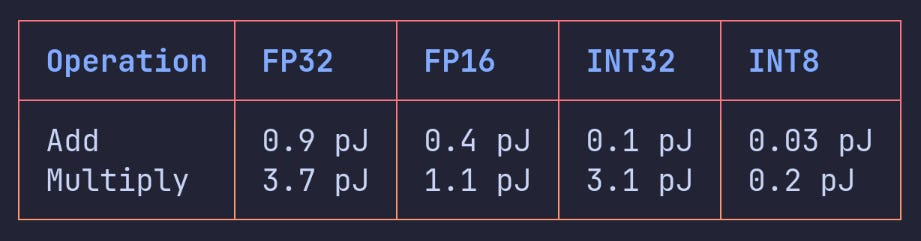
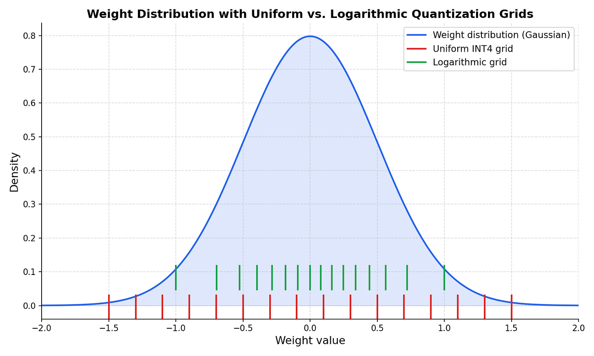
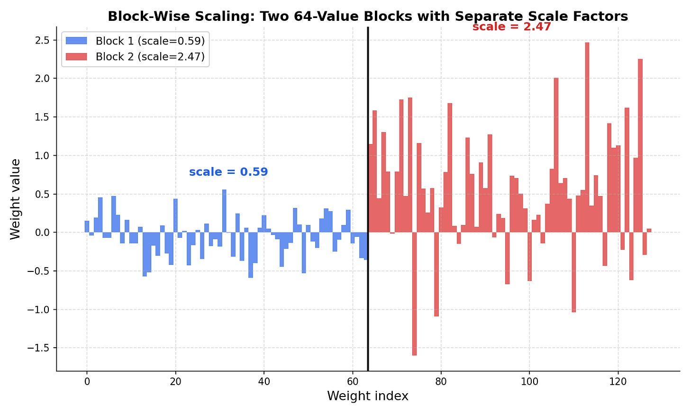
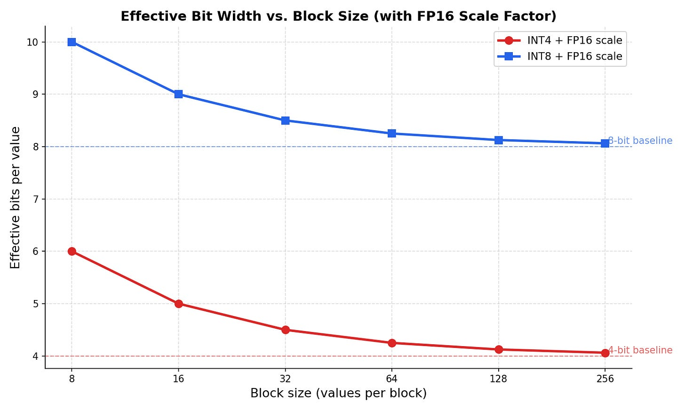
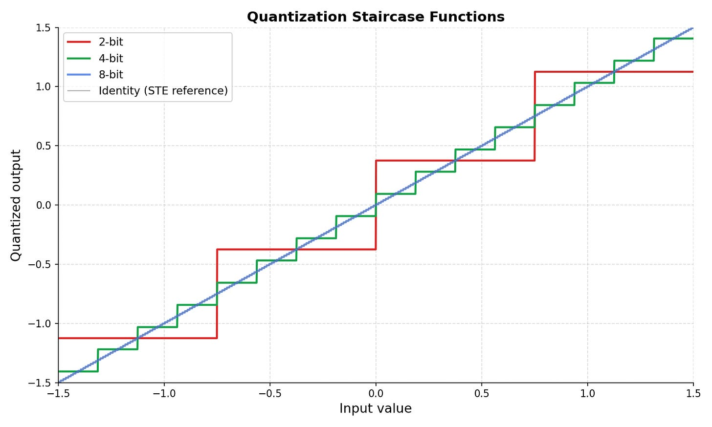
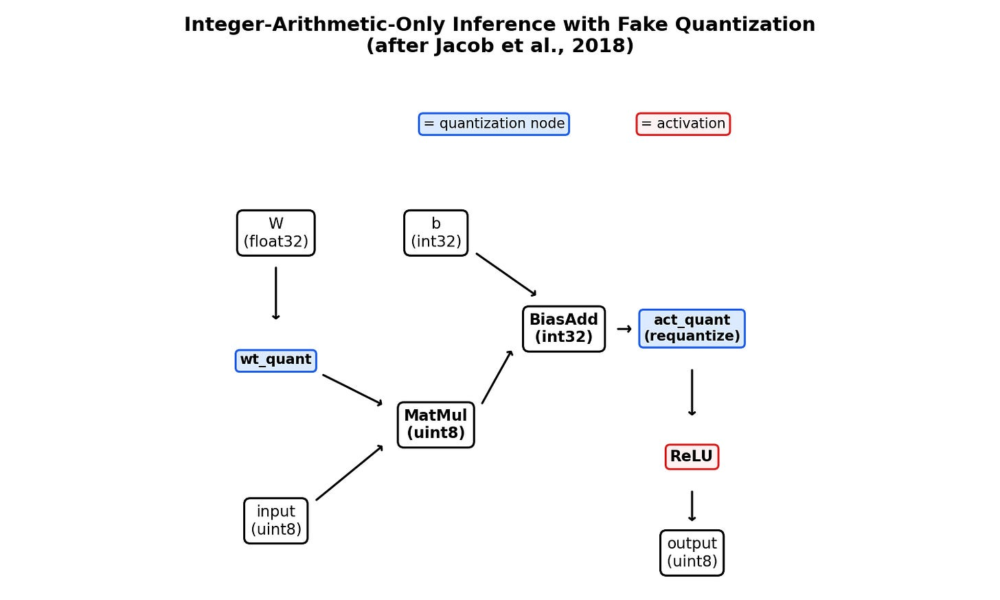

# 量化神经网络：你只需要这一篇指南

原文标题：Quantized Neural Networks: The Only Guide You Need  
原文副标题：Yesterday's, Today's, and Tomorrow's quantization methods for ML models  
原文作者：Mathias Lechner  
原文链接：https://mlechner.substack.com/p/quantized-neural-networks-the-only  
访问日期：2026-04-26  
原文发布日期：2026-04-17  
译文版本：v0.1

## 译文说明

本文为 Mathias Lechner 文章《Quantized Neural Networks: The Only Guide You Need》的中文翻译版。

## 引言

当有人说起“量化（quantization）”时，先问清楚他到底指的是什么。对高性能计算（High-Performance Computing, HPC）研究者来说，它意味着从 FP64 降到 FP32。对移动端工程师来说，它意味着在一块没有浮点单元（floating-point unit）的芯片上，用纯整数算术运行卷积神经网络（Convolutional Neural Network, CNN）。对那个正在 Hugging Face 上下载模型的人来说，它意味着在 GGUF 下拉框里选择 `Q4_K_M` 还是 `Q8_0`。这些其实是不同的技术，具有不同的权衡；而大多数混乱，正是从把它们混为一谈开始的。

我发表过关于“如何确定量化一个神经网络所需的最小比特宽度（bit width）”以及“如何训练可证明鲁棒的量化网络”的学术论文。我曾在没有浮点单元的嵌入式处理器上训练和部署定点网络（fixed-point networks），也曾为让 2 比特下的量化感知训练（Quantization-Aware Training, QAT）收敛而反复挣扎，还把从 2 比特到 16 比特精度的模型部署到真实硬件上。在 Liquid，我们让最先进的大语言模型（Large Language Models, LLMs）以 Q4 精度运行在 Raspberry Pi 上，速度超过每秒 40 个 token。本文就是那张我当年最希望自己一开始就有的地图。把它读一遍，你就能看懂之后遇到的任何量化声明。

高性能计算通常使用 FP64 双精度浮点数（double-precision floats）。这是因为粒子物理、天气模拟或材料模拟这类任务，需要尽可能多的小数位。深度学习（deep learning）很早就表明，对大多数神经网络运算来说，FP32 已经过度了。AlexNet 在消费级 GPU 上用 FP32 训练成功之后，几乎没人再回头看。早期的混合精度训练（mixed-precision training）使用 FP16，但后来我们发现：对机器学习而言，动态范围（dynamic range）往往比尾数精度更重要，因此更新的格式，比如 BF16 与 NVIDIA 的 FP8/FP4，会把更多比特分配给指数，或者共享缩放因子，以牺牲尾数位为代价。如今，大多数训练都运行在 BF16 或更低精度下；它保留了与 FP32 相同的指数范围，因此能表示相同范围的梯度幅值（gradient magnitudes），只是尾数位更少。对训练来说，这种权衡是合理的：指数比最后几位精度更重要。

虽然量化也用于训练，但本文的其余部分主要聚焦推理（inference），并采用我们在 Liquid AI 的思路：“模型只训练一次，但推理次数是没有上限的。”

## 为什么要做量化（Why Quantize at All）

量化能带来两样东西。第一，是算术速度（arithmetic speed）：更低精度的运算需要更少的硅面积，也需要更少的时钟周期。你可以在每平方毫米芯片上塞进更多运算。到底能少多少？Horowitz 在 2014 年测量了 45nm CMOS 工艺节点上各种算术运算的能耗：

一个 INT8 乘法的代价是 0.2 pJ，而 FP32 乘法是 3.7 pJ，能耗大约低 18 倍。一个运行 INT8 乘法和 INT32 累加的量化神经网络，每次运算消耗的能量只是其一小部分。这会直接转化为更高的每瓦运算量（ops per watt）以及更高的每平方毫米硅面积运算量（ops per mm² of silicon）。早在大家还没把它叫作“量化”之前，NVIDIA 的 P100 就已经有了 INT8 tensor path。

第二，是内存缩减（memory reduction）：一个 8 比特模型的大小只有 FP32 的四分之一。你需要从内存加载的字节数减少 4 倍，同时还能把模型塞进原本容量受限、根本装不下它的设备里。

具体到 LLM 推理，这两项收益分别对应两个不同的瓶颈。预填充阶段（prefill，处理 prompt）是计算受限（compute-bound）的，所以更快的低精度算术会直接带来加速。解码阶段（decode，一次生成一个 token）则是内存带宽受限（memory-bandwidth-bound）的，所以更小的权重意味着每个 token 需要搬运的字节更少，从而带来更高吞吐量（throughput）。你可以随便在 `llama.cpp` 里下载一个模型，运行 FP16 版本和 Q4 版本，你会看到这两个阶段都会变快，但它们变快的机制并不相同。

[译者注] 用一句话概括这段：Prefill 主要受益于低精度算术更快，Decode 主要受益于权重更小、每个 token 需要搬运的字节更少。

## 权重 vs. 激活值（Weights vs. Activations）

这是量化中最重要、也最常被忽略的区别。当年我做量化网络形式化验证（formally verifying quantized neural networks）时，我们首先必须钉死的一件事，就是：到底哪些张量（tensor）被量化了，哪些没有。这个问题会彻底改变分析结果。

权重（weights）在训练结束后是静态的。你可以慢慢校准缩放因子（scale factors），尝试不同的舍入策略（rounding schemes），甚至重新训练。它们常驻内存，每次前向传播（forward pass）加载一次。对大语言模型来说，把权重量化到 4 比特，通常只会带来很小的质量损失。

激活值（activations）则是动态的。它们会随着每个输入而变化，而且很容易出现离群值（outliers）：在一个 Transformer 里，某一个通道（channel）的值可能会突然飙到均值的 100 倍。激活值量化（activation quantization）要难得多，必须非常小心地处理这些离群值。过去我在为嵌入式部署训练纯整数网络（integer-only networks）时，激活值量化永远是最需要反复调试的那一部分。

所以，当你读到一篇量化论文或者一张模型卡（model card）时，第一件要检查的事就是：它只量化了权重，还是同时量化了权重和激活值？一个“只做权重量化（weight-only quantization）却取得很高精度”的方法，对“同时量化激活值”的方法几乎没有可比性。

今天 LLM 推理里的标准配方是 W4A16：4 比特权重、16 比特激活值。占参数量绝大多数的 MLP 模块使用 4 比特权重；敏感层（sensitive layers），例如嵌入层（embedding）、层归一化（layer norms）、第一层和最后一层，则保持 FP16；所有激活值仍然维持在 FP16。这种方案之所以有效，是因为解码阶段受限于内存带宽：权重越小，每个 token 需要搬运的字节就越少，因此权重压缩承担了主要优化效果。再往前一步就是 W4A8，它还会把激活值压缩到 8 比特，以换取预填充阶段的速度提升，但这就需要更仔细的校准。

一个重要细节是：在 W4A16 中，权重在存储时是 4 比特，但在矩阵乘法（matrix multiply）之前会先反量化回 FP16。真正的算术运算本身仍然运行在 FP16 上。你节省的是内存和带宽，也就是少加载 4 倍的字节，但计算本身仍然是浮点计算。这就是 `llama.cpp` 以及大多数推理框架的工作方式。与之相对的是“仅整数算术推理（integer-arithmetic-only inference）”（Jacob 等，2018）：在那里，矩阵乘法本身就运行在 INT8 上，累加器（accumulator）是 INT32。这样一来，你不仅拿到了内存收益，还拿到了 Horowitz 表中那种更便宜的算术收益；但代价是你必须把激活值也量化掉。

[译者注] W4A16 主要改变的是“存储路径”；integer-arithmetic-only inference 同时改变“存储路径”和“算术路径”。

经验法则很简单：比较两个方法之前，先问一句“W?A?”。

## 均匀网格 vs. 对数网格（Uniform vs. Logarithmic Grids）

量化网格（quantization grid）的铺设方式，根本上只有两种。

定点量化（fixed-point），也就是均匀量化（uniform quantization），会把数值等距地排列开。0.0 到 0.1 之间的间隔，和 100.0 到 100.1 之间的间隔是一样的。它最大的好处是：加法和乘法都可以退化成纯整数运算，不需要浮点单元。这正是我过去在研究中让网络跑在超小型嵌入式处理器上时所使用的方法，例如实时信号处理里的微控制器（microcontrollers），你会在心率监测器（heart rate monitors）和可穿戴传感器（wearable sensors）里见到它们，而它们压根就没有浮点单元。整数算术在硅面积、功耗和时钟周期上都更便宜，前面 Horowitz 的数字已经说明了这一点。

浮点量化（floating-point quantization），也可以从直觉上理解成对数量化（logarithmic quantization），则会在 0 附近布得更密，在极端值区域布得更稀。这更符合神经网络权重的真实分布。权重衰减（weight decay）和初始化（initialization）都会把权重往 0 附近推，使它们形成一个大致以 0 为中心的高斯分布（Gaussian distribution）。把更细的分辨率放在大多数值所在的位置，把更粗的分辨率留给尾部，是对有限比特更合理的利用。

无论你选择哪种网格，均匀量化的公式都很直接。对称量化（symmetric quantization）的形式是：$q = \mathrm{round}(x / s)$，重构时则是：$\hat{x} = s \cdot q$，其中 $s$ 是缩放因子（scale factor），$q$ 是整数表示。非对称量化（asymmetric quantization）会再加入一个零点偏移（zero-point offset）：$q = \mathrm{round}(x / s) + z$，$\hat{x} = s \cdot (q - z)$。零点（zero-point）允许你移动整个量化网格，以覆盖非对称的数值范围；例如 ReLU 之后的激活值全是非负的。对称量化更简单，也更适合硬件加速；非对称量化则能更充分地利用整数范围。大多数权重量化使用对称量化，大多数激活值量化使用非对称量化。

从历史上看，大多数量化研究都聚焦在定点量化上，因为当时的硬件只支持整数。Google 的 TPU v1，大约 2015 年，只支持 INT8 运算，完全没有浮点。即便是早期 NVIDIA GPU，也是在 V100 带来 FP16 tensor cores 之前，先有了 INT8 路径。如果你想运行一个量化网络，你就得用整数，因为硅就是这么设计的。

后来情况变了。硬件厂商开始把低精度浮点格式直接做进芯片。NVIDIA 的 H100 原生支持 FP8，Blackwell 则进一步加入 FP4。AMD 和其他厂商也在跟进。MX（Microscaling）格式是一个开放标准，由 AMD、ARM、Intel、Meta、Microsoft、NVIDIA 和 Qualcomm 联合提出，并于 2023 年 9 月发布。它把“按块共享指数（block-shared exponent）”的格式标准化，使得同一个量化模型能高效地跨不同厂商运行。

你甚至可以把“对数量化”这个思路推到理论极限：计算针对高斯分布最优的、信息论意义上的 4 比特量化网格。也就是，让 16 个量化等级（quantization levels）按某种方式分布，以最小化服从正态分布权重的期望量化误差（expected quantization error）。得到的网格会在 0 附近非常密，在尾部则更稀，比均匀 INT4 和标准 FP4 都更贴合权重分布。

## 缩放粒度（Scale Granularity）

把缩放粒度（scale granularity）想成一条连续光谱（spectrum）。最左边，是完全不使用缩放：量化后的整数就是数值本身。再往右，是整个张量（tensor）只用一个缩放因子；这样一来，只要某个地方有一个离群值，整个网格就得被迫拉宽，大多数靠近 0 的值就会浪费掉可用精度。在 8 比特下，这还勉强能接受；在 4 比特下，它会直接毁掉精度。

再下一步，是通道级缩放（channel-wise scaling）：对权重矩阵的每个输出通道，或对激活值的每个特征维度，分别使用一个缩放因子；在不同语境下，它有时也会被称作 per-row 或 per-column scaling。这种做法开销很低，因为额外的缩放参数相对于权重本身几乎可以忽略；但它已经能带来很大收益：一个通道里的离群值，不会再污染其他通道。对激活值而言，通道级缩放尤其有用，因为 Transformer 的激活值经常表现出“按通道出现离群值”的结构：少数几个通道会在很多 token 上持续尖峰。

块级缩放（block-wise scaling）则更进一步。你把每个通道分成若干连续的数值块，比如 128、64、32，有时甚至 16 个元素为一块。每个块都使用自己的 FP16 缩放因子，把该块的取值范围映射到量化网格上。这样，一个块里的离群值就不会影响另一个块中的精度。块越小，拟合越紧，但缩放因子的额外开销也越高。

这种代价是真实存在的，但通常很小。一个由 32 个 4 比特数值组成的块，总共占 $32 \times 4 = 128$ 比特。再加上一个 16 比特的 FP16 缩放因子，等效存储就是 $\left(128 + 16\right) / 32 = 4.5$ 比特每个值。这也就是为什么你会在模型卡里看到“4.5 比特”这种说法。公式很简单：$\mathrm{effective\_bits} = \mathrm{base\_bits} + \mathrm{scale\_bits} / \mathrm{block\_size}$。所以当有人说他有一个“4 比特模型”时，记得追问块大小（block size）。它的有效比特数可能其实是 4.5，甚至 5。

典型块大小包括：128，开销最低，但拟合更松；64，速度快，精度稍好；32，大多数框架的默认值；16，用于非常敏感的层，或者极低比特设置。Blackwell 的硬件以及 MX 格式，正在把块级缩放从一种软件技巧，变成一种硬件原语（hardware primitive），从而消除这部分开销。

## 敏感层（Sensitive Layers）

当你看到一个量化模型时，要问：是不是所有层都被量化了，还是只量化了其中一部分？这个问题的重要性，往往比你想象的更大。

并不是所有层对量化的容忍度都一样。归一化层（normalization layers），比如 LayerNorm 和 RMSNorm，尤其敏感；我见过一些例子，甚至连 FP16 都不够，必须保留在 FP32。嵌入层（embedding layers）和最终输出投影层（final output projection）也很脆弱。网络的第一层和最后一层，通常也比中间层更敏感。过去我做 2 比特 QAT 时，归一化层总是最先炸掉的部分。

工程上的应对方式，就是混合精度量化（mixed-precision quantization）：把占参数量绝大多数的 MLP 模块压到 4 比特，而把归一化层、嵌入层、最终输出投影层以及第一层和最后一层保留在 FP16。由于 MLP 模块占据了绝大多数参数，这样既能保住大部分内存收益，又能绕开那些脆弱层。大多数现代量化工具默认都会采用这种混合精度策略。如果一张模型卡没有说明哪些层被排除在量化之外，那它报告出来的质量就值得怀疑。

## 训练后量化：三个层级（Post-Training Quantization: Three Levels）

假设你手里有一个训练好的 FP32 模型。你想在不重新训练的情况下把它量化。这里面有三个层级的复杂度，而理解这三个层级，基本就解释了你在不同量化工具之间看到的大多数差异。

第 1 级：把权重舍入到最近的量化网格点。对每个权重，直接映射到最近的网格点即可。不需要任何数据。它快、简单，而且在 8 比特下通常已经够用；但到了 4 比特，累积的舍入误差（rounding errors）就会开始叠加。

第 2 级：最小化逐层输出误差（layer-wise output error）。这里的关键洞察是：我们真正关心的，不是量化后的权重是否接近原始权重，而是量化后的这一层，是否还能产生和原来差不多的输出。你拿一个小型校准数据集（calibration dataset）跑一遍网络，观察每一层的实际激活值范围，再为每层或每块设置最优的缩放因子，以最小化量化前后输出之间的差异。这会花掉几百次前向传播，但能得到好得多的量化结果，尤其是在激活值量化场景下，因为不同层、不同通道的动态范围变化非常大。

第 3 级：最小化端到端输出误差（end-to-end output error）。即便“逐层输出对齐”也只是一个代理指标（proxy）。我们真正想要的是，最终模型的输出尽量不变。这个层级的方法会利用二阶信息（second-order information），也就是损失函数对每个权重的 Hessian 矩阵，来做舍入决策，以最小化最终输出误差。GPTQ 是这里最常见的方法：它按列（column by column）处理权重，并用 Hessian 逆矩阵来补偿每一次舍入决策。这比第 2 级更昂贵，但也能把给定比特预算的效果压榨到最大。

在实践中，你通常会以“工具”的形式遇到这些方法：GPTQ，基于二阶信息、速度快、支持 GPU 加速；AWQ (Activation-Aware Weight Quantization)，根据激活值幅度保护显著权重通道，对混合精度往往比 GPTQ 更好；GGUF，则是 `llama.cpp` 使用的文件格式，它打包了多种量化变体，便于 CPU/GPU 推理。

对很多场景来说，第 2 级 PTQ 配合 8 比特权重和激活值已经足够好了，你不需要重新训练。但当你把精度压到 4 比特，或者需要更激进地量化激活值时，PTQ 就开始撑不住了。这正是量化感知训练（QAT）出场的地方。

## 量化感知训练（Quantization-Aware Training）

训练后量化（PTQ）把一个训练完成的模型视为固定不变的东西，然后试图找到它最好的离散近似（discrete approximation）。这在 8 比特下通常表现很好；在 4 比特下，对权重来说往往也还能接受。但如果你想进一步压到低于 4 比特，或者你需要把敏感层也量化掉，或者你要在没有浮点单元的硬件上做纯整数推理，因此不得不量化激活值，那么 PTQ 就会撞墙。因为这个模型从来没有为如此严重的精度损失而训练过。

量化感知训练（QAT）通过在训练过程中模拟量化来解决这个问题，让模型学会找到那些对舍入更鲁棒的权重值。难点在于：量化本质上是一个阶梯函数（staircase function），它会把连续输入映射到离散网格点上。阶梯函数的梯度在几乎所有地方都是 0，而在边界上又是未定义的。反向传播（backpropagation）从中拿不到任何有效信号。

直通估计器（Straight-Through Estimator, STE）是经典解法。在前向传播中，你照常做量化，也就是走“阶梯”；在反向传播中，你假装量化这一步不存在，让梯度像恒等函数 $y = x$ 那样直接传过去。从数学上讲，这并不严格；但在实践里，它效果出奇地好。实现起来也只需要几行代码：把量化后的值从计算图（computation graph）里 `detach` 掉，再把未量化路径上的梯度加回来。Jacob 等（2018）展示了它如何在纯整数推理中发挥作用：每一层都插入一个“伪量化（fake quantization）”节点，在训练时模拟舍入，但允许梯度照常流过。

STE 的一个局限是：一个刚好落在某个网格点上方的权重，总会被舍入到同一个离散值。梯度会推动这个权重略微移动，但它又会弹回同一个离散层级。随机舍入（stochastic rounding）则能缓解这个问题：你不再总是舍入到最近点，而是按照离两个候选网格点的距离，以相应概率向上或向下舍入。比如，2.3 这个值会以 0.7 的概率被舍入到 2，以 0.3 的概率被舍入到 3。这样一来，在数学期望上，舍入是无偏的（unbiased），同时也能帮助网络逐步把权重适应到低精度网格上。

在 2 到 4 比特范围内，QAT 几乎总是优于任何训练后方法。到了 8 比特，PTQ 通常就已经足够好，QAT 额外带来的训练成本不太值得。在我训练“可证明鲁棒的量化网络”的经验里，低于 4 比特时 QAT 几乎是必需的，而随机舍入经常决定了训练是能够收敛，还是会彻底失败。

## KV 缓存量化（KV-Cache Quantization）

KV 缓存（KV cache）本质上是激活值量化的一个特殊情形，它因为 LLM 的兴起而逐渐变成一个独立话题。在自回归生成（autoregressive generation）过程中，模型会为每个注意力层的每个历史 token 保存 key 和 value 张量。这些都是激活值：它们在运行时动态计算出来，无法像权重那样离线校准。而且，和普通激活值量化最大的不同在于：KV 值需要在整个上下文长度（context length）内常驻内存，而不是一层层地产生后又丢弃。

这使得 KV 缓存首先成为一个内存问题。它会随着序列长度线性增长；在长上下文（long context）下，它甚至可能比模型权重本身还大。一个 7B 模型配上 128k 上下文，仅 KV 缓存就很容易需要 16GB 以上内存。

由于它们本质上仍然是激活值，所以它们继承了激活值量化的全部困难：动态范围、离群值、无法离线校准。KVQuant（2024）表明，通过逐通道量化（per-channel quantization）和细致的离群值处理，3 比特 KV 缓存量化是可行的，而且困惑度退化（perplexity degradation）小于 0.1。NVIDIA 的 Blackwell 架构已经原生支持面向 KV 缓存的 NVFP4。随着上下文长度继续增长到 100 万 token 以上，KV 缓存压缩的重要性只会继续上升。

## 硬件的发展方向（Where Hardware Is Going）

趋势已经很清楚了。FP8 已经是 H100 和 MI300 上的成熟标准；FP4 正随着 Blackwell 到来。MX 格式则在整个行业内标准化“按块共享指数”的表示方式，使量化模型真正具备跨厂商可移植性。

ARM 正在探索面向移动端超低比特推理的硬件查找表（lookup-table）指令。对于 2 比特或 4 比特量化，一个查找表只需要 4 个或 16 个表项，可以直接放进寄存器文件（register file）里。这会让对数量化，也就是非均匀量化，在没有专用 NPU 的手机上也能跑得很快。过去我在嵌入式工作里也做过类似的查表方法，不过是在软件层实现；而现在，硬件级支持这件事真的让人兴奋。

W4A8 正在成为数据中心（datacenter）的下一个默认配置，这既来自硬件支持，也来自激活值量化方法本身的成熟。块级缩放曾经只是一个软件层的权宜之计，现在正逐渐变成硬件原语。

在研究前沿，1 比特和 1.58 比特量化方案也正在获得关注，作为实验性的量化路线（experimental quants）。BitNet 及其三值变体，权重限制在 $\{-1, 0, 1\}$，表明：如果从头开始训练，带有“近似二值”权重的模型，可以在只消耗一小部分内存的情况下，达到和全精度基线相当的效果；而且它们天然适合定制硅（custom silicon），因为一次“乘法”几乎就退化成了符号翻转（sign flip）或者条件加法（conditional add）。随着专用 kernel 和硬件支持逐渐跟上，这类方法未来只会越来越多。

五年前，任何低于 INT8 的东西都还需要定制 FPGA 或 ASIC 才能跑。今天，你已经可以通过 `llama.cpp` 在一台笔记本 CPU 上运行 4 比特模型了。

## 结论（Conclusion）

“量化（quantization）”其实覆盖了一整族技术：它们横跨不同的比特宽度、不同的量化网格、不同的校准策略，以及不同的硬件目标。混乱来自于人们跨这些维度比较结果时，却不说明自己到底做了什么选择。

下次你再看到一个量化声明时，先过一遍下面这五个问题：

- 量化的是谁，权重、激活值、KV 缓存，还是它们的某种组合？
- 用的是哪种网格，均匀/定点，还是对数/浮点？
- 块大小（block size）是多少，有效比特数又是多少？
- 使用的是哪一级 PTQ，还是用了 QAT？
- 又有哪些层被排除在量化之外？

一旦你知道这五件事，数字才真正具备可比性。不知道这些就去比较，就像是在拿苹果和整数作比较。
