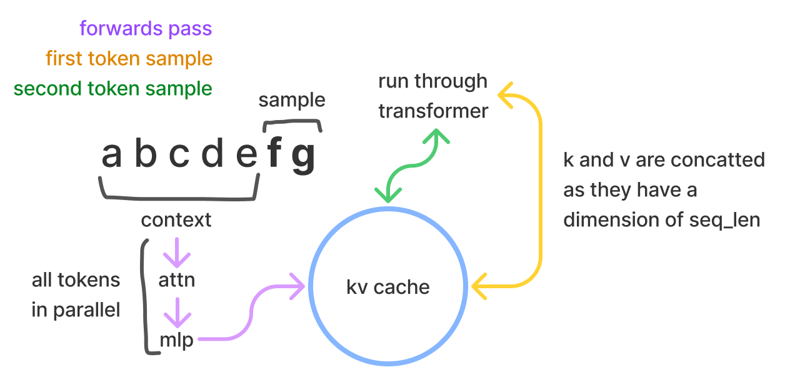
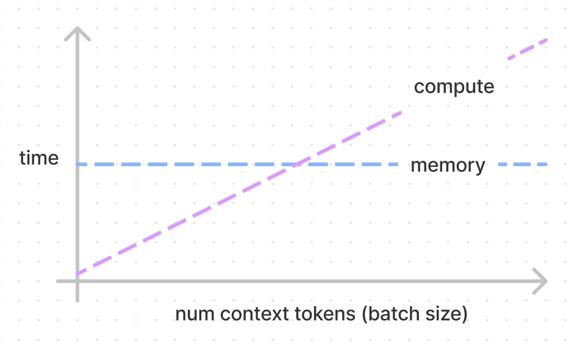
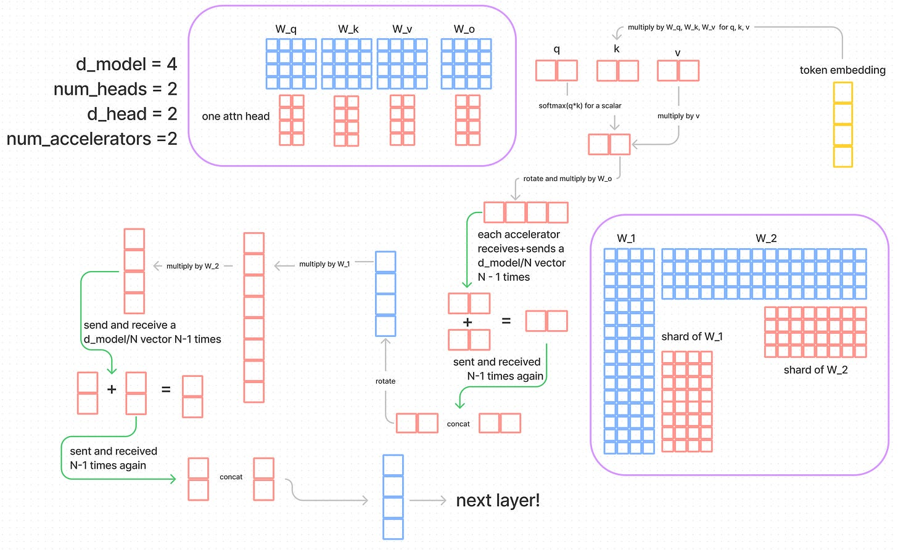
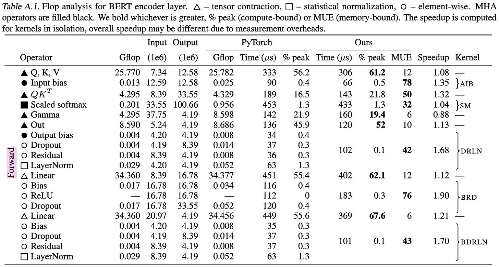

# Transformer 推理算术：用少量公式理解大语言模型推理性能

原文标题：Transformer Inference Arithmetic  
原文作者：kipply  
原文链接：https://kipp.ly/p/transformer-inference-arithmetic  
访问日期：2026-04-27  
原文发布日期：2022-03-30  
译文版本：v0.1

## 译文说明

本文为 kipply 文章《Transformer Inference Arithmetic》的中文翻译版。

原文写于 2022 年，因此文中关于 A100 80GB 与云服务可用性的评论，反映的是当时的时间背景。

另外，原始 Substack HTML 导出时，“大 batch 延迟公式”所在的一行显示公式丢失了。本文根据原文上下文、后续数值示例与作者给出的结果，对这一处公式做了复原，并在对应小节明确标注。

## 引言

这篇文章尝试只用少量、接近第一性原理的推导，来理解大语言模型推理性能，而不依赖实验，也不需要太复杂的数学。事实证明，这种方法能得到的理解既多又实用。一个非常简单的推理延迟模型，居然就已经能和经验结果对得相当不错；它也确实帮助我更准确地预测 Transformer 推理性能，并给出更像样的解释。

本文默认你已经对 Transformer 有一些基础了解。比如，你可能已经看懂了大部分 [The Illustrated Transformer](https://jalammar.github.io/illustrated-transformer/)，但还没有把里面的直觉真正内化。再配合阅读作者同期写的这篇[参数量估算文章](https://kipp.ly/blog/transformer-param-count/)，会更容易跟上后面的推导。

## KV Cache

对采样式生成来说，Transformer 推理可以分成两部分：先处理给定的 prompt/context，这一步可以并行完成；然后再一个 token 一个 token 地往后采样，这才是自回归真正显现出来的地方。

在采样阶段，Transformer 会执行 self-attention，而 self-attention 需要用到当前序列中每个 token 的 `k` 和 `v` 值，不管这些 token 来自原始 prompt/context，还是已经生成出来的输出。这些向量会存放在一个通常叫作 KV cache 的矩阵里，也常被称为 past cache；开源 GPT-2 的实现里，它的名字就叫 `past`。这个 cache 的形状大致是 `[batch, 2, num_heads, seq_len, features]`。

这样做的目的，是避免在每次采样新 token 时都重新计算这些向量。我们用一些存储空间换掉了不少计算量。对每个 token 而言，需要存储的字节数是：

$$
2 \cdot 2 \cdot n_{\text{layers}} \cdot n_{\text{heads}} \cdot d_{\text{head}}
$$

第一个 `2` 表示两组向量，也就是 `k` 和 `v`。每一层都要各存一份，而每份本身又是一个 $n_{\text{heads}} \times d_{\text{head}}$ 的矩阵。再乘上第二个 `2`，是因为本文始终假设使用 16 bit 格式，所以每个值占 2 字节。

与 token embedding 相乘、用来生成这些向量的权重是：

$$
W_{\text{k}}, W_{\text{v}} \in \mathbb{R}^{d_{\text{model}} \times d_{\text{model}}}
$$

而每个 token embedding 则是：

$$
t_{\text{e}} \in \mathbb{R}^{1 \times d_{\text{model}}}
$$

因此，计算所有层的 `k` 和 `v` 一共需要的 FLOPs 是：

$$
2 \cdot 2 \cdot n_{\text{layers}} \cdot d_{\text{model}}^2
$$

因为我们要把 `t_e` 分别乘到 `W_k` 与 `W_v` 上，而一次矩阵向量乘法需要 $2 \cdot d_{\text{model}}^2$ 次浮点运算。再乘上一个 `2`，是因为 `k` 和 `v` 各要算一次；最后再对所有 `n_layers` 层重复。

> **矩阵乘法到底有多少 FLOPs？**
>
> 对于 $A \in \mathbb{R}^{m \times n}$ 与 $b \in \mathbb{R}^n$ 的矩阵向量乘法，计算量是 $2mn$。对于 $A \in \mathbb{R}^{m \times n}$ 与 $B \in \mathbb{R}^{n \times p}$ 的矩阵矩阵乘法，计算量是 $2mnp$。其中 $mn$ 或 $mnp$ 这部分很好理解，而额外的 $2$ 来自乘加运算：一次乘法、一次加法。更细的解释可以看[这份讲义](https://www.stat.cmu.edu/~ryantibs/convexopt-F18/scribes/Lecture_19.pdf)。

把这些数代到一个 52B 参数模型里，比如 Anthropic 论文中那类 $d_{\text{model}} = 8192$、$n_{\text{layers}} = 64$ 的配置，就可以开始估算量级了。

假设我们使用一张 [A100 GPU](https://www.nvidia.com/content/dam/en-zz/Solutions/Data-Center/a100/pdf/nvidia-a100-datasheet-us-nvidia-1758950-r4-web.pdf)，它的理论算力是 `312e12` FLOPs/s，显存带宽是 `1.5e12` bytes/s。那么，对应 `kv` 权重的加载与计算时间可以写成：

$$
\text{memory} = \frac{2 \cdot 2 \cdot n_{\text{layers}} \cdot d_{\text{model}}^2}{1.5\mathrm{e}12}
$$

$$
\text{compute} = \frac{2 \cdot 2 \cdot n_{\text{layers}} \cdot d_{\text{model}}^2}{312\mathrm{e}12}
$$

> **FLOPs 受限 vs. 内存带宽受限**
>
> Transformer 推理里经常要区分“FLOPs 受限”和“内存带宽受限”，而这在深度学习优化里本来就是个高频问题。为了完成计算，我们得先把权重从显存里搬出来，这一步消耗的是内存带宽。通常我们假设系统能在加载权重的同时启动计算，而这也是现代实现里已经优化得相当好的地方。所谓 FLOPs 受限，意思是某个时刻计算单元还在忙，但内存传输已经不是瓶颈；所谓内存受限，意思是算子在等数据、计算单元并没有满负荷工作。NVIDIA 把这个叫作 [math bandwidth](https://docs.nvidia.com/deeplearning/performance/dl-performance-gpu-background/index.html#gpu-arch)，这个叫法还挺贴切。严格说，这个划分发生在 kernel 层面，但也可以抽象到一组操作上去理解。

到了这一步，模型架构的细节已经不重要了。给定这套硬件参数，我们会得到一个明确的比值：`208`。这意味着，计算一个 token 的 `kv`，和同时计算最多 `208` 个 token 的 `kv`，花的时间是一样的。低于这个数时，你受限于内存带宽；高于这个数时，你才开始受限于 FLOPs。

如果我们把模型其余权重也一起算上，对整个 context 做一次完整 forward，结论仍然是 `208`，因为分子和分母都会同时多出一个 `6` 的因子。后面我们会更系统地说明这一点。下图里两条线的交点就在 `208`；当然，现实里内存那条线会有一点点斜率，因为中间激活值本身也要占一些内存带宽，这一点会在最后一节再讨论。

对一个 52B 模型而言，一次完整 forward 的内存时间大约是：

$$
\frac{12 \cdot 2 \cdot n_{\text{layers}} \cdot d_{\text{model}}^2}{1.5\mathrm{e}12} \approx 69\text{ ms}
$$

这对最多 `208` 个 token 都成立。实际里我们大概率会用 4 张 GPU 做并行，所以会更接近 `17ms`，后文会专门讨论。

如果 context 有 `416` 个 token，也就是翻倍，那么时间也会翻倍；如果有 `312` 个 token，那么时间大约就是 `1.5` 倍。

对 KV cache 来说，计算单个 token 的代价恰好只是让这个 token 走完整个模型的 $1/6$。总体上，这类 forward pass，也就是我们在拿 logits、embeddings、训练时做的事情，其实都很便宜，因为它们能利用并行；真正贵的是采样，因为每生成一个 token 都得重新把整套权重读一遍，并且按自回归方式推进。

不过，这并不意味着你就真的省下了 `1/6` 的总时间。假设现在是 FLOPs 受限，那么每一步采样里，我们省掉的是：

$$
\frac{2 \cdot 2 \cdot n_{\text{tokens}} \cdot n_{\text{layers}} \cdot d_{\text{model}}^2}{312\mathrm{e}12}
$$

而解码步骤本身的代价是：

$$
\frac{2 \cdot 12 \cdot n_{\text{layers}} \cdot d_{\text{model}}^2}{312\mathrm{e}12}
$$

因此，你在每一步里节省的是“完整 FLOPs 时间的 $1/6$，再乘上当前序列长度”。而这个序列长度会随着生成不断变大。也正因为如此，如果没有 KV cache，采样的时间复杂度会随着 token 数增加而变成二次增长。

当然，事情还没这么简单，因为存这个 cache 本身也有额外开销和权衡。如果你服务的是小 batch，那么系统很可能受限于内存带宽，而不是 FLOPs；在这种情况下，你甚至未必想用 past cache，反而可能愿意直接重算，把 FLOPs 花掉算了，毕竟采样过程中显存带宽的账你反正也已经在付。

## 容量（Capacity）

到这里，我们已经比较清楚 GPU 里主要存的两样东西是什么了：KV cache 和模型权重。有了这些理解，我们也就可以直接讨论“显存容量”究竟会怎样影响 Transformer 推理性能。

NVIDIA A100 通常是 40GB 显存。当年也已经有 80GB 版本，而且显存带宽更高，是 `2e12` bytes/s 而不是 `1.5e12`；但原文写作时，主流云厂商还拿不到这些卡，所以作者直接把它们当成“约等于不存在”。

给定参数量，我们只要乘上 2 字节，就能得到权重占用。对 52B 模型来说：

$$
52 \times 10^9 \cdot 2 = 104 \times 10^9\text{ bytes} \approx 104\text{ GB}
$$

问题来了：一张 GPU 根本放不下。光把权重装进去，就至少得要 3 张 GPU。这样一来，`120 - 104 = 16GB` 的空间还能留给 KV cache。那够吗？

回到 KV cache 的每 token 内存公式，对同一个 52B 模型，我们有：

$$
2 \cdot n_{\text{layers}} \cdot n_{\text{heads}} \cdot d_{\text{head}} \cdot 2
$$

也就是：

$$
4 \cdot n_{\text{layers}} \cdot n_{\text{heads}} \cdot d_{\text{head}}
= 4 \cdot 64 \cdot 8192
= 2{,}097{,}152\text{ bytes} \approx 0.002\text{ GB}
$$

于是，$16 / 0.002 \approx 8000$，也就是说，在这种 GPU 配置下，KV cache 最多只能容纳大约 8000 个 token。换成更直观的说法，就是最多只能支持 batch size 为 4、每个请求 2048 token 的情形；如果每个请求更短，batch 才能再大一些。

这其实很糟糕，因为我们通常会想要更高的 batch size。batch 越大，处理同样请求所花的 GPU 时间通常越省。可现在我们却被显存容量卡住了。反过来说，在这么低的 batch size 下，系统大概率又是内存带宽受限的，这时你甚至更应该放弃 KV cache，直接吃掉重算的 FLOPs 成本。

如果用 4 张 GPU，那就是总共 160GB，扣掉 104GB 权重后，还剩 `56GB` 给 KV cache，于是 $56 / 0.002 \approx 23000$。这就明显更合理了。我们大概率会更想上 4 张卡，因为既想支持更高 batch size，也不太想把 2 的幂硬拆到 3 张 GPU 上。

而且这还不只是 batch size 的问题。如果业务量很高，我们可能会部署多个模型实例。既然权重无论如何都得常驻在显存里，那么从总体资源利用的角度看，我们就希望每个实例都尽量能跑更大的 batch。

当然，中间计算步骤也会额外吃掉一点显存，不过通常很小，可以先忽略。

## 模型并行（Model Parallelism）

这里我不会从头完整讲一遍 model parallelism 的全部细节，因为这件事已经有很多[现成资料](https://huggingface.co/docs/transformers/parallelism)、[论文](https://arxiv.org/pdf/1909.08053.pdf)、[博客](https://timdettmers.com/2014/11/09/model-parallelism-deep-learning/)和[教程](https://www.deepspeed.ai/tutorials/megatron/)。不过，为了做性能判断和计算通信成本，我们还是需要把其中最关键的部分捋清楚。

模型并行最直接的结果，是把“把权重读过显存的成本”和“对应的 FLOPs 成本”，都按并行度，也就是加速器数量，分摊掉。

这里我们假设使用 tensor parallel，也就是把每一层从中间切开。每张加速器尽可能对自己那份权重分片完成计算，并在需要同步的时候做通信。

另一种更朴素的方式是 pipeline parallel：每张 GPU 只保存一部分层。这确实能把加载权重的成本平均分掉，但显而易见的问题是，除了当前在工作的那一张卡，其他 GPU 都会闲着。在训练里还能通过流水线把多个 batch 串起来，一边让前一个 batch 往后流，一边让新 batch 进入第一张卡；但对单个推理请求来说，这种办法就不太行了，除非你同时服务多个请求。

pipeline parallel 还有一个特点：它吃不满内存带宽。不过如果你本来就是 FLOPs 受限，这倒也未必是坏事。真正让 pipeline parallel 更有优势的地方在于通信。pipeline parallel 每个加速器只需要通信一个 $d_{\text{model}}$ 大小的向量，而 tensor/model parallel 则要在每一层都通信 $N \cdot d_{\text{model}}$ 量级的数据，其中 $N$ 是加速器数量。

现在我们再引入 A100 的最后一个重要常数：通信带宽 `300GB/s`。NVIDIA 文档里有时会写成 `600GB/s`，因为它把“进每张卡的 300GB/s”和“出每张卡的 300GB/s”同时算进去了；但对我们的估算来说，用双向合并后的 `300GB/s` 更直观。

在图里，我们沿着“黄砖路”把 token embedding 从模型底部送进去。紫色框标出了权重在各个加速器之间如何切分。为了把图画得足够直观，作者故意用了一个极小的模型。

大体思路是这样的：如果我们有两个矩阵 $X$ 和 $Y$，可以把它们都切分之后再分别相乘。但这还不足以完成 $X \cdot Y$ 的整个矩阵乘法。一个直观的判断办法是：如果你只是把这些分片结果拼起来，得到的矩阵尺寸会偏大。真正需要做的，是先通信、做一次分片求和，再把求和结果分发回去，最后才能拼出 $X \cdot Y$ 的正确输出。

在 attention 里，并行化的直觉来自“天然就有多个 head”。大部分 attention 层内部的计算都不需要通信，因为这些 head 的结果会先拼起来，再去乘 $W_o$。在乘完 $v$ 之后，我们会再把结果乘到本地那一份 $W_o$ 上，得到 $o_s \in \mathbb{R}^{d \times h/N}$ 的一个分片。然后每张加速器把自己的分片发给其他所有加速器，也接收别人发回来的分片。它的通信成本是 $(N - 1)d_{\text{model}} / N$。每张加速器各自负责一部分加法来得到输出投影，然后再做一次和前面类似的通信，最后由各个主机完成拼接，这一步基本可以视作瞬时完成。

MLP 层本质上也差不多。就像我们用 $W_o$ 把多头 attention 的结果投影回一个 $d_{\text{model}}$ 长度的向量一样，MLP 会用：

$$
W_1 \in \mathbb{R}^{4d_{\text{model}} \times d_{\text{model}}}, \quad
W_2 \in \mathbb{R}^{d_{\text{model}} \times 4d_{\text{model}}}
$$

先把维度放大 4 倍，再投回去。MLP 末尾也会发生两次同样的通信。

因此，最终总通信量大约是：

$$
4 \cdot \frac{(N - 1)d_{\text{model}}}{N}
$$

而 KV cache 则会按照 attention head 在不同 GPU 之间切分。

## 延迟计算（Latency Calculations）

前面我们已经基本讲清了容量问题、模型并行中的通信形态，以及主要的计算结构。现在把这些东西拼起来，就能写出一组估算推理延迟的公式。

这里最核心的还是 FLOPs 受限与内存带宽受限的区分。如果“每个参数要参与的乘法次数”很少，那么你更可能被内存带宽卡住。参数量和 batch size 都会推高 FLOPs，而内存流量主要只随参数量增长。

通信的情况和它不太一样。通信更像是“固定延迟项 + 吞吐项”的叠加，这里的吞吐量就是前面说的 `300GB/s`。麻烦在于，图里并没有直接给通信延迟，所以作者只能猜一个“大概很小”的固定值，也就是参考这篇 [Citadel 论文](https://arxiv.org/pdf/1804.06826.pdf)里给出的每次消息发送大约 `8` 微秒；不过那篇论文讨论的是 V100 上的 NVLink。

由于计算成本的形式不同，单个 token 的 decode 延迟要分两套公式：一套对应小 batch，也就是内存带宽受限；另一套对应大 batch，也就是 FLOPs 受限。对大 batch，我们先忽略通信里的固定延迟项。

对小 batch，比如 batch size 为 1，因此可以省掉批量因子。若 $N$ 是加速器数量，$P$ 是参数量，$b$ 表示“字节”这一单位，那么：

$$
\text{compute} = \frac{2 \cdot P \cdot b}{N \cdot A_{\text{bm}}}
$$

$$
\text{comms} = 4 \cdot n_{\text{layers}} \cdot 8\mu\text{s}
$$

其中 $2 \cdot P$ 的原因是：所有参数都要从显存里读过一遍，而每个参数占 2 字节。$A_{\text{bm}}$ 是加速器的内存带宽，这部分成本会被 $N$ 张卡分摊掉。至于通信，我们在每一层里要做 $4 \cdot n_{\text{layers}}$ 次通信，每次都要付固定延迟。

通常来说，这个通信项会比较小，所以在真正的 compute-bound 情形下，往往可以忽略。通信里当然还有一个吞吐量成本，但在这里也会被舍掉。

还有一个有时不可忽略的因素，是读取 KV cache 的时间。作者暂时没有把它写进公式，因为它取决于 context token 数，而这个数在不同 batch 之间、甚至同一个 batch 内部都可能不一样；你可以把它视为另一笔显存带宽时间。另一个同样没有写进去的显存成本，是每一步采样时读取 unembedding 来算 logits，而这个矩阵的形状是 $\mathbb{R}^{d \times n}$。

前面也提过，显存流量并不是真的对 batch size 完全恒定，因为每个 batch 还会额外产生一些中间激活值。之所以先不写进去，只是因为它太依赖具体软件栈、编译器优化和 kernel 实现，很难直接数清楚。

对大 batch，比如 `512`，若 $B$ 是 batch size：

> **译者注**
>
> 原始 Substack HTML 导出版本在这里丢失了一行显示公式。下面的写法是根据原文上下文、作者后续代入的数值，以及文中 `35 microseconds`、`53 ms` 等结果复原出来的。

$$
\text{compute} = \frac{2 \cdot P \cdot B}{N \cdot A_f}
$$

$$
\text{comms} = \frac{4 \cdot n_{\text{layers}} \cdot d_{\text{model}} \cdot B \cdot b}{A_c}
$$

其中 $A_f$ 是加速器的 FLOPs 吞吐，$A_c$ 是通信带宽。$2 \cdot P \cdot B$ 这个形式来自一个直觉：整个 decode step 本质上是在让这一批 token 依次和全部参数做矩阵乘法。前面已经说过，矩阵向量乘法对 $A \in \mathbb{R}^{m \times n}$ 与 $b \in \mathbb{R}^n$ 的成本是 $2mn$。

通信项则来自模型并行小节里的结论：每一层里有 4 次通信，作者还把 $\frac{N - 1}{N}$ 近似成了 $1$。每次通信的内容是一个 $d_{\text{model}}$ 大小的向量，对 batch size 为 $B$ 的情形要整体一起发，所以再乘上 $B$ 与每个元素 2 字节的开销，最后除以通信带宽。

我们用一个更大的模型来试算：Gopher 规模的 260B 模型，部署在 16 张 GPU 上。对小 batch，每生成一个 token，大约是 `22ms`。而通信的吞吐量成本，也就是用上面大 batch 公式但把 $B = 1$ 代进去，大约只有 `35` 微秒，因此把它忽略掉是安全的。

如果 batch size 是 `512`，那么总时间大约是 `53ms`；注意这是按“一个 batch step”算的，也就是说，这 `53ms` 左右会并行产出 512 个 token。此时如果把通信的固定延迟也算上，还会多出大约 `3ms`。这个数字已经不算特别小了，不过如果我们假设通信和计算可以并行，就还是可以先忽略掉。

最终真正取的是 `compute` 和 `comms` 两者中的较大值，因为我们假设两者可以并行执行。也正因为如此，我们会希望通信成本不要大过计算成本；否则你加再多芯片，延迟也不可能无限下降，因为通信会越来越主导。

当然，这并不保证真实系统里一定能把通信和计算完美重叠，很多系统做不到，至少做不到完全重叠。

这些数字肯定会比真实硬件测出来的结果更乐观。因为这里默认了理想硬件利用率，没有把 softmax 算进去，也忽略了通信固定延迟和许多更小的因素。但即便如此，这套推理依然非常有价值，因为它能让你快速判断优化该往哪里做，以及某个优化大概会带来什么级别的变化。

## Batch Size

batch size 对性能非常关键，尤其当你想理解“某种具体使用场景下到底会发生什么”时更是如此。

前面一节里，我们已经分别写出了内存带宽受限和 FLOPs 受限两种情况下的延迟公式。要判断自己落在哪边，只需要比较它们的大小。

这其实又回到了 KV cache 那一节里已经出现过的同一个比值。对 A100 来说，进入 FLOPs 受限的临界 batch size 大约就是：

$$
\frac{A_{\text{bw}}}{A_f} = 208
$$

这个数字非常好用。如果负载足够高，我们通常更喜欢处在 FLOPs 受限区间，因为这说明计算资源被用得更充分。不过反过来说，一旦已经进入 FLOPs 受限，再继续增大 batch size，也并不会让单步变得更快。

至于什么时候显存占用从“主要是 KV cache”变成“主要是权重”，这个计算当然也很简单。但它不像前面的带宽临界点那样，是一个真正有明显阶段变化的分界线。KV cache 占用超过权重时，并不会突然发生什么特殊变化。通信也是类似：随着 batch size 增大，吞吐量项会逐渐压过固定延迟项，所以我们后来才把固定延迟直接丢掉。不过正如前面看到的，即便 batch size 已经是 `512`，在 52B 模型上，通信成本里固定延迟仍然能占到大约 `11%`。

通信这里还有一个被简化掉的地方：它并不是在某一个地方一次性发生，而是分散在 4 个不同步骤里。所以我们真正希望的不只是“总计算时间大于总通信时间”，而是如果可以把计算和通信并行起来，那最好每个阶段都满足这个条件。为了刻画这件事，我们需要另一个比值：每个通信字节对应多少 FLOPs。

下表给出了各个主要计算块的数量级，这对下面的判断很有帮助：

| 项目 | `q, k, v` | `o` | `w_1` | `w_2` |
| --- | --- | --- | --- | --- |
| FLOPs | $3B d_{\text{model}}^2$ | $B d_{\text{model}}^2$ | $4B d_{\text{model}}^2$ | $4B d_{\text{model}}^2$ |
| 通信字节数 | $B d_{\text{model}}$ | $B d_{\text{model}}$ | $B d_{\text{model}}$ | $B d_{\text{model}}$ |
| FLOPs/byte | $3 d_{\text{model}}$ | $d_{\text{model}}$ | $4 d_{\text{model}}$ | $4 d_{\text{model}}$ |

对 A100 来说，`312e12 / 300e9 = 1040`，这就是硬件本身的“每个通信字节对应多少 FLOPs”。为了让系统保持在 FLOPs 受限区间，我们希望上表最后一行的值大于这个硬件比值。这样一来，只要每张卡分到的 embedding 维度超过 `1024`，基本就安全了；如果只有 `512`，情况就会有点尴尬。

低负载 API 往往会落在较小的 batch size，于是“干脆不要 KV cache”就会变成一个完全合理的工程决策。如果 API 有足够大负载能跑大 batch，那么它往往会更想把 batch size 控制在“刚好进入 FLOPs 受限”的最小值附近，这样既充分利用算力，也能尽量优化单个请求的延迟。

而像 [AlphaCode](https://deepmind.com/blog/article/Competitive-programming-with-AlphaCode) 这种大规模离线推理任务，则可能更愿意塞尽可能多的芯片，然后在容量允许的前提下，把 batch 做到尽量大。作者在原文里反复说“可能”，但紧接着又表示，自己其实觉得这三种场景下的选择几乎是确定的。

## FLOPs 计算

前面有一句话说得比较粗：

> 我们做的是 $2 \cdot P$ 次 FLOPs 操作，直觉上就是把全部参数都拿来做了一遍矩阵乘法。

这个直觉没错，不过我们还是可以把 Transformer 各个步骤逐一拆开，验证最后确实会落到 $2P$。

下面这些计算都按“每层、每 token”来算。我们先写：

$$
W_q, W_k, W_v \in \mathbb{R}^{d_{\text{model}} \times d_{\text{model}}}
$$

更精确一点，其实应该写成：

$$
W_q^i, W_k^i, W_v^i \in \mathbb{R}^{d_{\text{model}} \times d_{\text{head}}}
$$

其中 $i$ 从 $1$ 数到 $n_{\text{heads}}$。不过为了做延迟估算，我们可以把全部 head 合并起来，把 $W_q$、$W_k$、$W_v$ 都看成囊括所有 head 的整体矩阵。

- 计算 `qkv`
  - 把 $t_e \in \mathbb{R}^{1 \times d_{\text{model}}}$ 分别乘到 $W_q$、$W_k$、$W_v \in \mathbb{R}^{d_{\text{model}} \times d_{\text{model}}}$ 上。
  - FLOPs：$2 \cdot 3 \cdot d_{\text{model}}^2$
- 计算 `z`
  - 也就是 $\text{softmax}((q \cdot k)/d_{\text{head}}) \cdot v = z$
  - 这里没有发生真正的大矩阵乘法，因此 FLOPs 只是某个 $d_{\text{model}}$ 量级的项。
- 乘输出投影矩阵
  - 把 $z \in \mathbb{R}^{d_{\text{model}} \times 1}$ 乘到 $W_o \in \mathbb{R}^{d_{\text{model}} \times d_{\text{model}}}$ 上。
  - FLOPs：$2 \cdot d_{\text{model}}^2$
- 前馈层
  - MLP 权重是 $W_1 \in \mathbb{R}^{4d_{\text{model}} \times d_{\text{model}}}$ 与 $W_2 \in \mathbb{R}^{d_{\text{model}} \times 4d_{\text{model}}}$，中间还有一个 ReLU，但那部分很小。
  - FLOPs：$2 \cdot 8 \cdot d_{\text{model}}^2$
- 其他部分
  - attention 后面通常会有 LayerNorm，它的权重只是长度为 $d_{\text{model}}$ 的向量。
  - 顶部还有一层线性层和 softmax，对应输出 embedding，也就是 unembedding / de-embedding / $\text{embedding}^{-1}$。
  - 原始 Transformer 还会有 cosine absolute positional encoding，本质上只是对 token embedding 做加法。

把这些 FLOPs 都加起来之后，再代入 $d_{\text{model}} = 8192$ 的模型，可以得到大约 `100B` FLOPs。更具体地说，$103,079,215,104 / 2 \approx 51.5B$。它比 52B 略小一点，是因为 token embedding 与 unembedding 本身也接近 10 亿参数。

因此，拿 $2 \cdot 12 \cdot n_{\text{layers}} \cdot d_{\text{model}}^2$ 来近似 $2 \cdot P$ 完全说得过去，误差不到 `2%`。

至于前面没有细算的 $z$ 以及其他那些操作，它们都是向量和向量，甚至向量和标量之间的运算，因此增长阶是 $d_{\text{model}}$，而不是 $d_{\text{model}}^2$。就算你每层真有 100 个这样的操作，总共也不过是一亿级别 FLOPs，只占我们前面算出来大矩阵乘法成本的 `0.1%` 左右。

## 中间内存成本（Intermediate Memory Costs）

[Data Movement Is All You Need](https://arxiv.org/pdf/2007.00072.pdf) 这篇论文有一种挺好的操作分类方式，虽然它主要关注的是 Transformer 底层数据移动优化，本身未必是篇最相关的入门材料。按照它的划分，主要有三类操作：

- tensor contractions，也就是我们前面一直盯着看的大矩阵乘法，包括各种线性层；
- statistical normalizations，也就是 softmax 和 layernorm；
- element-wise operators，也就是本文到现在几乎完全忽略的那一类，比如 bias、dropout 和 activation。

那么，这些 matmul 之外的东西应该怎么估算延迟？问题在于，硬件公布的 FLOPs 吞吐通常只针对乘加运算，所以就算你真能把 softmax、layernorm 的 FLOPs 数出来，也不能直接拿它们塞进前面的公式里。更贴切的做法是：把它们看成“主要付显存读写成本”的操作。这也正是前面一直暗示但还没展开的那部分延迟来源。

作者在这里故意“打破一下第一性原理的角色设定”，直接援引了 [Data Movement Is All You Need](https://arxiv.org/pdf/2007.00072.pdf) 里的 Table A.1。里面能看到一个有点让人不安的结果：softmax 的延迟居然比 `qkv` 的计算还稍微高一点，而 `qkv` 明明只是完整前向里大约三分之一的线性层成本。

既然 softmax 是内存带宽受限，那么 `qk` 的乘法、ReLU、dropout 这些操作也一样会显得很贵。

> **GPU Kernel Fusion**
>
> GPU 以“kernel”为单位执行操作。所谓 kernel fusion，就是把原本两个 kernel 合成一个，主要目的是复用已经读入显存的数据，减少重复的 load/store。比如 multiply-add 如果拆成两个 kernel，一个要做 load + add + store，另一个要做 load + multiply + store；而如果把它们融合起来，就可以直接做 load + add + multiply + store，省掉很多内存往返。

我们甚至还能从表里看出，softmax 的融合并不理想。因为理论上它只需要“一次读、一次写”；而现实里标准实现通常要[四次](https://arxiv.org/pdf/1805.02867.pdf)，所以作者半开玩笑地说自己在“故意挑刺”。对于 `qk` 而言，理论上应该是两次读、一次写，而且其中两次读甚至还有机会进一步省掉。

从这个角度看，softmax 和 `qk` 大概是 `3:1` 的关系，这说明 softmax 仍然经历了比最优情况更多的内存 pass。这也恰好提醒我们：这里的成本其实高度依赖软件实现，最终还得靠实验测；理论上，这部分成本甚至可以继续被压得接近零。

还有一个值得注意的点是：模型越大，这些中间操作所占的时间比例会下降得很快。因为它们的内存规模大体按 $d_{\text{model}}$ 增长，而主 FLOPs 成本按 $d_{\text{model}}^2$ 增长，而且还是逐层累积。论文里的例子只是一个 336M 参数模型，对应 $d_{\text{model}} = 1024$、$n_{\text{layers}} = 24$。

作者把论文里 “Ours” 一列中所有内存带宽受限的项，包括 element-wise operators，都加了一遍，得到这些中间步骤总共会占到 `43%` 的时间。但在 52B 模型里，$d_{\text{model}}$ 大了 8 倍，于是这些操作的重要性就会迅速下降。

更具体地说，这些内存带宽受限的中间操作，因为处理的是 $d_{\text{model}}$ 长度的向量，所以时间大约只会放大 8 倍；可与此同时，主矩阵乘法的 FLOPs 时间会放大 64 倍。因此如果沿用那篇论文里的优化思路，那么在 52B 模型推理里，前面没有算进延迟公式的这些中间操作，大约只会占总延迟的 `5%` 左右。

## 与真实基准对比（Comparing Against Real Benchmarks）

作者在一家做语言模型的公司工作，手里其实有自家的基础设施和 benchmark，但受限于知识产权，没法直接公开。公开可查的模型并行推理 benchmark 又非常少，基本上只有 [NVIDIA FasterTransformer](https://github.com/NVIDIA/FasterTransformer) 和 [Microsoft DeepSpeed](https://www.microsoft.com/en-us/research/blog/deepspeed-accelerating-large-scale-model-inference-and-training-via-system-optimizations-and-compression/) 这类框架，外加零散藏在一些论文里的结果。因此，还是值得把上面的公式和公开 benchmark 对一遍。

因为作者只想用 2 张 GPU，所以他选了一个 13B 参数模型来跑 FasterTransformer。这个模型有 40 层、40 个 attention head，每个 head 的维度是 128，因此 $d_{\text{model}} = 5120$。对应的 profile 截图作者放在[这个 Google Slides](https://docs.google.com/presentation/d/17PMhlxB3hZYBLqf2mych9CL8kyyssIEvJHOscpqTo1k/edit?usp=sharing) 里，其中还藏着不少可能值得单开一篇文章的话题。

先看 `context length = 512`、`batch size = 1`、输出 10 个 token 的情形。根据小 batch 公式，我们预计：

- 在 2 张 GPU 上，每个 token 大约 `8.4ms`，外加约 `1ms` 通信；
- 在 1 张 GPU 上，则是 `16.8ms`，而且没有通信。

这里用到的近似是：

$$
\frac{2 \cdot 40 \cdot 12 \cdot 5120^2}{1.5\mathrm{e}12}
$$

> **作者注**
>
> 抱歉，这里的有效数字被我写得有点乱。我大概应该把显存带宽保留成 `1.555`，而不是直接写成 `1.5`。

1 张 GPU 的实测是 `22.0ms`，也就是说我们的猜测命中了大约 `76%`。不过这部分差距其实大都能解释。首先我们知道，中间激活值会占去一部分时间；其次，我们不可能真的拿到理论上 `100%` 的显存带宽。对这个维度的张量而言，profile 显示实际最多大概只能吃到 `90%` 的满带宽。把这点算进去之后，预期时间就变成 `18.5ms`。再加上从 profile 里统计出来的大约 `2.2ms` 中间激活值成本，就到了 `20.7ms`。剩下那 `1.4ms`，完全可以由一些亚毫秒级的小操作解释，比如 token embedding、`top-k` / `top-p` 采样、实际带宽又没真到 `90%`，甚至单纯就是 kernel launch 的开销。

2 张 GPU 的实测是 `13.5ms`。这次差得更远一点，我们的估算只覆盖了大约 `62%`。如果再看一遍 profile，会发现显存带宽利用率确实比 1 张卡时更差一些，因为张量更小之后，通常更难把带宽吃满。这次不是 `90%`，更接近 `87%`，于是时间变成 `9.5ms`。中间激活值差不多还是 `2ms`，累计到 `11.7ms`。那剩下的 `1.5ms` 基本上就是通信了，而这也和我们前面估计的 `1ms` 通信没有完全和计算重叠的结论是相符的。实际 profile 里，每层通信大约要 `40` 到 `50` 微秒，总共加起来就是 `1.7ms` 左右，和观察相当一致。

作者还提了一句：上面两种情形里，“中间激活值”的统计大概其实还偏高了一点，因为从 profile 里读出的延迟一直都比 benchmark 原始输出略高。benchmark 原始输出是：`180.86 ms (context time: 45.45 ms)` 和 `283.60 ms (context time: 63.17 ms)`。

那 forward pass 呢？作者原本以为，一次 forward 的时间应该大致等于：

$$
\text{decode step time} \times \frac{\text{num tokens}}{\text{flops-to-bw ratio}}
$$

原因是 forward 时必须把所有 token 都发给所有 GPU，每张 GPU 负责自己那部分 attention head，并顺手把 KV 存起来。沿用更新后的有效带宽估计：

$$
\frac{312\mathrm{e}12}{1.5\mathrm{e}12 \times 0.9} = 231
$$

对 1 张 GPU 的设置，decode step 预期是 `22ms`，于是：

$$
22 \cdot \frac{512}{231} = 48\text{ ms}
$$

这离 benchmark 里声称的 `63ms` 还有差距。对 2 张 GPU，得到的是：

$$
13.5 \cdot \frac{512}{231} = 30\text{ ms}
$$

差得就更远了。

对 1 张 GPU 来说，缺掉的一部分时间应该来自 KV 存储本身。看 profile，大约每层 `18` 微秒，总共 `0.7ms`。另外还有大概 `0.2ms` 的 memset。

再看 FLOPs 受限下的单个 MLP 矩阵乘法：

$$
\frac{512 \cdot 4 \cdot 5120^2 \cdot 2}{312\mathrm{e}12} = 344\mu\text{s}
$$

但 profile 里最低也要 `476` 微秒，也就是说只能跑到预期 FLOPs 的 `72%`。再看 attention 里的那个输出投影：

$$
\frac{512 \cdot 5120^2 \cdot 2}{312\mathrm{e}12} = 86\mu\text{s}
$$

可实际最低是 `159` 微秒，也就是只有 `54%`。作者一度被这个结果吓了一跳，但后来意识到，这好像也只是现实中的常态。比如 [这篇论文](https://arxiv.org/pdf/2104.05158.pdf) 的 Figure 14 就显示，$512 \times 4000 \times 4000$ 的矩阵乘法吞吐也会低于 `150 TFLOPs/s`。

## 练习（Exercises）

1. 给定 batch size、context length 和 `next_n`，该如何计算使用 KV cache 带来的收益？
2. KV cache 会额外增加哪些内存时间开销？
3. 有没有可能 forward pass 是内存受限，而每一步采样却是 FLOPs 受限？
4. 如果使用的 GPU 数量超过了容量所必需的最低值，比如让 52B 模型跑在 8 或 16 张 GPU 上而不是 4 张，我们该考虑哪些权衡与计算？
5. 我们已经写出了“预测一个 token 需要多久”的公式，那么要如何进一步算出“完整采样一次”需要多久，也就是从对 context 做 forward，到把要求的 token 全部生成出来？
6. 在容量小节里，我说中间计算步骤消耗的显存可以忽略；那它到底有多小？
7. 在 batch size 小节里，我们有点岔题，谈到了“通信每字节对应多少 FLOPs”。如果每张卡的 embedding 维度只有 512，会发生什么权衡？
8. 这里默认所有 GPU 都挂在同一台主机上，但训练里我们也会跨主机通信 GPU。[AWS 有 400Gb/s](https://aws.amazon.com/ec2/instance-types/p4/)，这会带来什么变化？
9. 在模型并行小节里，现实中我们也可以先把所有分片都通信完，再让每张加速器各自做完整求和，而不是每张卡只做一部分加法。这样做的延迟含义是什么？
10. 试着计算一下：52B 模型跑在 4 张 GPU 上、batch size 为 256 时的大 batch 速度。计算项应该大约是 `21ms`，通信项应该大约是 `4ms`。
11. 再考虑最后一层输出向量乘上 unembedding、写出 logits，然后做 `top-k` 或 `top-p` 采样，其中还包含排序。这一步对 52B 模型来说应该花多久？我们又能并行化哪些部分？
12. token embedding 该如何切分？输入 embedding 和 unembedding 的切分方式会一样吗？LayerNorm 呢？这些决定分别会引入什么额外通信？

## 致谢（Acknowledgements）

感谢所有以不同方式帮助过这篇文章的人： [James](https://scholar.google.com/citations?user=GprA5UsAAAAJ&hl=en) [Bradbury](https://twitter.com/jekbradbury)、[Eric Zhang](https://www.ekzhang.com)、[Taylor Rogalski](https://tay.ro/)、[Horace He](https://horace.io/)、[Julian Schrittwieser](https://www.furidamu.org/)、Reiner Pope、Jim Wu、[Mohammad](https://scholar.google.com/citations?user=uMg7CEAAAAAJ&hl=en) [Bavarian](https://bavarian.dev/)、[Tudor Brindus](https://tbrindus.ca/) 和 [Adrien Morisot](https://www.linkedin.com/in/adrien-morisot-045236173/?originalSubdomain=ca)。其中 James 的贡献尤其大。

> 本文中提到的模型架构与延迟数据，都来自公开已知或理论上的模型与 benchmark，并不一定反映我所在公司的模型架构或实际延迟。
