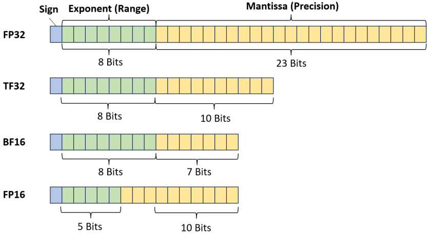
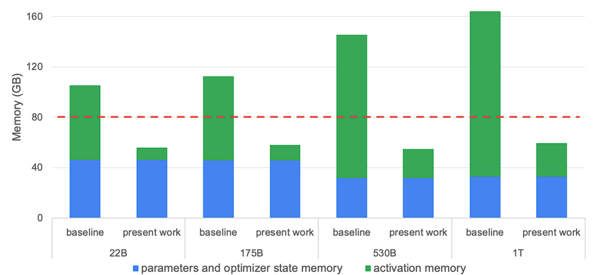
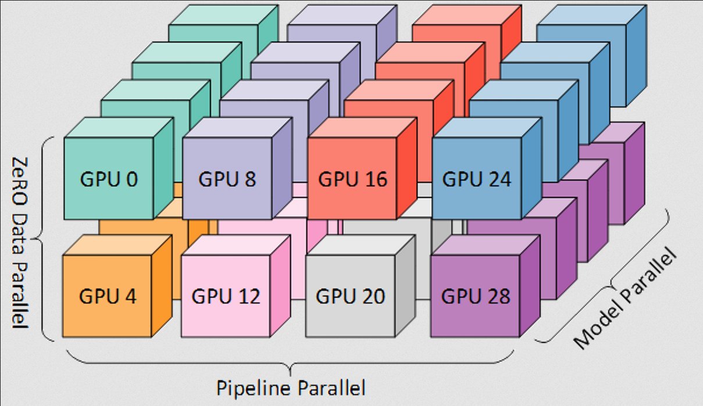

# Transformer Math 101：训练计算量与显存需求速查

原文标题：Transformer Math 101  
原文作者：Quentin Anthony、Stella Biderman、Hailey Schoelkopf  
原文链接：https://blog.eleuther.ai/transformer-math/  
访问日期：2026-04-26  
原文发布日期：2023-04-18  
原文最后更新：2024-10-08  
译文版本：v0.1

## 译文说明

本文为 EleutherAI Blog 文章《Transformer Math 101》的中文翻译版。

原文重点讨论训练成本，尤其是计算量与显存需求估算；推理延迟只在少数位置顺带提及。

## 引言

关于 Transformer 语言模型，有不少基础而重要的信息其实都能用很简单的公式算出来。不幸的是，这些公式在 NLP 社区里并没有被广泛整理和传播。本文的目的，就是把这些公式，以及它们从哪里来、为什么重要的相关背景，一并收集起来。

**注意：** 本文主要关注训练成本，而训练成本里最核心的瓶颈通常是显存（VRAM）。如果你想看对应的“推理成本”讨论，尤其是以延迟为中心的推导，可以参考 Kipply 写的那篇[很好的文章](https://kipp.ly/blog/transformer-inference-arithmetic/)。

## 计算需求

训练一个 Transformer 模型的计算成本，最基础的公式是：

$$
C \approx \tau T = 6PD
$$

其中：

- $C$ 表示训练该 Transformer 所需的总计算量，单位是总浮点运算次数（floating point operations）。
- $C = C_{\text{forward}} + C_{\text{backward}}$
- $C_{\text{forward}} \approx 2PD$
- $C_{\text{backward}} \approx 4PD$
- $\tau$ 表示你的硬件配置的总吞吐量，$\tau = (\text{No. GPUs}) \times (\text{Actual FLOPs}/\text{GPU})$，单位为 FLOPs。
- $T$ 表示训练时间，单位为秒。
- $P$ 表示 Transformer 模型的参数量。
- $D$ 表示数据集大小，单位为 token。

这些公式由 [OpenAI 的 scaling laws 论文](https://arxiv.org/abs/2001.08361) 和 [DeepMind 的 scaling laws 论文](https://arxiv.org/abs/2203.15556) 提出并做了实验验证。更详细的背景请直接参阅原论文。

这里值得单独停一下，讨论一下 $C$ 的单位。$C$ 表示总计算量，但它可以用多种方式来衡量，例如：

- FLOP-seconds，单位是 $\left[\frac{\text{Floating Point Operations}}{\text{Second}}\right] \times [\text{Seconds}]$。
- GPU-hours，单位是 $[\text{No. GPUs}] \times [\text{Hours}]$。
- scaling laws 论文里经常使用 PetaFLOP-days，也就是 $10^{15} \times 24 \times 3600$ 次总浮点运算。

另一个很有用的区分是 $\text{Actual FLOPs}$。GPU 加速卡白皮书通常会标称理论 FLOPs，但在真实训练中，尤其是分布式训练里，几乎不可能达到这个数字。后面“计算成本的工程结论”部分会给出一些分布式训练场景下常见的 $\text{Actual FLOPs}$ 参考值。

另外，本文采用的是“吞吐量 × 时间”的成本写法，和 Dzmitry Bahdanau 那篇[关于 LLM 训练成本的精彩文章](https://medium.com/@dzmitrybahdanau/the-flops-calculus-of-language-model-training-3b19c1f025e4)一致。

### 参数规模与数据集规模的权衡

严格来说，一个 Transformer 想训练多少 token 都可以。但训练 token 的数量会同时显著影响计算成本和最终模型性能，因此，如何在两者之间取得平衡非常重要。

**先说最显眼的问题：“计算最优（compute optimal）”语言模型。** 这个说法通常会被叫作“Chinchilla scaling laws”，因为当前关于参数量应取多大、数据集应取多大的很多看法，都来自那篇论文中的 Chinchilla 模型系列。所谓计算最优，是指模型的**参数量**和**数据集大小**满足近似关系 $D = 20P$。

这里的“最优”只在一个非常具体的意义上成立：如果在你的资源模型里，使用 1000 块 GPU 训练 1 小时，与使用 1 块 GPU 训练 1000 小时的成本完全相同，那么当你的目标是“在尽量降低 GPU 小时成本的同时获得尽可能好的性能”时，就应该使用上面的关系式。

**我们不建议把一个 LLM 训练到低于 200B token。** 虽然对很多模型来说，这在 Chinchilla 意义下是“最优”的，但训练出来的模型通常仍然比较差。对于几乎所有实际应用，更合理的做法是：先确定你的 use case 能接受多高的推理成本，再在这个推理成本约束下，训练尽可能大的模型，并尽可能用更多 token 去训练它。

### 计算成本的工程结论

Transformer 的计算成本通常会以 GPU-hours 或 FLOP-seconds 的形式给出。

- GPT-NeoX 在普通 attention 下可以达到 150 TFLOP/s/A100，在 Flash Attention 下可以达到 180 TFLOP/s/A100。这个水平和其他大规模高度优化的库一致，例如 Megatron-DS 报告的数值大约在 137 到 163 TFLOP/s/A100 之间。
- 作为经验法则，你通常至少应该能跑到大约 120 TFLOP/s/A100。如果你测出来低于 115 TFLOP/s/A100，那大概率是模型本身或者硬件配置出了问题。
- 如果你有 InfiniBand 这类高质量互连，那么沿着数据并行维度扩展时，整体吞吐通常可以接近线性或次线性增长。下图展示的是在 Oak Ridge National Lab 的 Summit 超算上测试 GPT-NeoX 库时得到的结果。注意：横轴是 V100 的数量，而本文其余很多数值示例使用的是 A100。


## 内存需求

Transformer 往往会用“参数量大小”来描述。但当你要判断一个模型能否装进一组给定的算力资源时，你真正需要知道的是：这个模型究竟会占用**多少字节**。这能告诉你，本地 GPU 在推理时最多能装下多大的模型，也能告诉你，在一个给定总加速器显存预算的集群上，最多能训练多大的模型。

### 推理

#### 模型权重



大多数 Transformer 都采用**混合精度**训练，也就是 `fp16 + fp32` 或 `bf16 + fp32`。这样既能减少训练时所需的内存，也能降低推理时的内存需求。实际中，我们常常可以把语言模型从 `fp32` 转成 `fp16`，甚至 `int8`，而不会遭遇非常明显的性能损失。

这里这些数值说的是“单个参数需要多少 bit”。由于 1 Byte 等于 8 bit，所以只要把 bit 数除以 8，就能知道每个参数需要多少 Byte：

- 在 `int8` 下，$\text{memory}_{\text{model}} = (1 \text{ byte}/\text{param}) \cdot (\text{No. params})$。
- 在 `fp16` 和 `bf16` 下，$\text{memory}_{\text{model}} = (2 \text{ bytes}/\text{param}) \cdot (\text{No. params})$。
- 在 `fp32` 下，$\text{memory}_{\text{model}} = (4 \text{ bytes}/\text{param}) \cdot (\text{No. params})$。

此外还会有少量额外开销，但通常对判断“你的 GPU 最多能装下多大的模型”影响不大。按照我们的经验，这部分开销通常不超过 20%。

#### 推理总内存

除了存放模型权重所需的内存，在真正执行前向传播时还会有少量额外开销。按照我们的经验，这部分开销通常也不超过 20%，因此在估算“这个模型能否放进显存里做推理”时，通常不是主导因素。

总的来说，一个相当好用的经验公式是：

$$
\text{Total Memory}_{\text{Inference}} \approx 1.2 \times \text{Model Memory}
$$

本文不会继续展开这些额外开销具体来自哪里，而是把重点放在训练时的内存需求上。如果你想进一步了解推理阶段的内存与算术估算，可以阅读 Kipply 那篇[专门深入讨论推理的文章](https://kipp.ly/blog/transformer-inference-arithmetic/)。下面转到训练。

### 训练

除了模型参数本身，训练还需要在设备内存里保存优化器状态和梯度。这也是为什么一旦你问“我需要多少内存才能放下模型 X”，答案立刻就会变成“这取决于你是在做训练还是推理”。训练所需的内存永远比推理更高，而且往往高很多。

#### 模型参数

首先，模型可以直接用纯 `fp32` 或纯 `fp16` 训练：

- 纯 `fp32`：$\text{memory}_{\text{model}} = (4 \text{ bytes}/\text{param}) \cdot (\text{No. params})$。
- 纯 `fp16`：$\text{memory}_{\text{model}} = (2 \text{ bytes}/\text{param}) \cdot (\text{No. params})$。

除了前面“推理”部分提到的常见权重数据类型，训练还引入了 [AMP](https://developer.nvidia.com/automatic-mixed-precision) 这类**混合精度训练**技术。它的目标是在保持收敛性的同时，尽可能榨干 GPU tensor cores 的吞吐。现代深度学习训练之所以经常使用混合精度，主要是因为：

- `fp32` 训练虽然稳定，但内存开销很大，而且用不上 NVIDIA GPU tensor cores 的优势。
- 纯 `fp16` 训练虽然更省内存，但稳定收敛通常比较困难。

如果你想进一步了解混合精度训练，原文推荐了 tunib-ai 的[这个 notebook](https://nbviewer.org/github/tunib-ai/large-scale-lm-tutorials/blob/main/notebooks/08_zero_redundancy_optimization.ipynb)。需要注意的是，混合精度要求内存里同时保存模型的 `fp16/bf16` 版本和 `fp32` 版本，因此模型参数部分本身需要：

- 混合精度（`fp16/bf16` 与 `fp32`）：$\text{memory}_{\text{model}} = (2 \text{ bytes}/\text{param}) \cdot (\text{No. params})$。

此外，还需要额外再保存一份大小为 $(4 \text{ bytes}/\text{param}) \cdot (\text{No. params})$ 的模型副本，而这部分在本文里会被计入优化器状态。

#### 优化器状态

Adam 很神奇，但它在内存上也出了名地低效。除了需要保存模型参数和梯度参数之外，你还得额外保存三份与梯度相关的拷贝。因此：

- 对标准 `AdamW`，$\text{memory}_{\text{optimizer}} = (12 \text{ bytes}/\text{param}) \cdot (\text{No. params})$。
- 组成项：`fp32` 参数副本 4 bytes/param，Momentum 4 bytes/param，Variance 4 bytes/param。
- 对 [bitsandbytes](https://github.com/TimDettmers/bitsandbytes) 这类 8 位优化器，$\text{memory}_{\text{optimizer}} = (6 \text{ bytes}/\text{param}) \cdot (\text{No. params})$。
- 组成项：`fp32` 参数副本 4 bytes/param，Momentum 1 byte/param，Variance 1 byte/param。
- 对带 momentum 的 SGD 类优化器，$\text{memory}_{\text{optimizer}} = (8 \text{ bytes}/\text{param}) \cdot (\text{No. params})$。
- 组成项：`fp32` 参数副本 4 bytes/param，Momentum 4 bytes/param。

#### 梯度

梯度可以用 `fp32` 或 `fp16` 存储。注意，梯度的数据类型通常会与模型的数据类型匹配，因此在 `fp16` 混合精度训练中，梯度通常也以 `fp16` 存储。于是，梯度对应的内存开销为：

- 在 `fp32` 下，$\text{memory}_{\text{gradients}} = (4 \text{ bytes}/\text{param}) \cdot (\text{No. params})$。
- 在 `fp16` 下，$\text{memory}_{\text{gradients}} = (2 \text{ bytes}/\text{param}) \cdot (\text{No. params})$。

#### 激活值与 Batch Size

对 LLM 训练来说，现代 GPU 通常受限于内存，而不是 FLOPs。因此，激活值重计算（activation recomputation/checkpointing）是一种极其流行的手段：用更多计算，换更低的内存占用。它的做法是，不把某些层的激活值保存在 GPU 内存里，而是在需要时重新计算。能节省多少内存，取决于你清掉哪些层、清得有多激进。下面这张图展示的是 Megatron 的 selective recomputation 策略：



图中的红色虚线表示 A100-80GB GPU 的显存上限，而 “present work” 表示应用 selective activation recomputation 之后的内存需求。更多细节与下面公式的推导，可参考论文 [Reducing Activation Recomputation in Large Transformer Models](https://arxiv.org/abs/2205.05198)。

用于估算 Transformer 模型激活值存储开销的基本公式是：

$$
\text{memory}^{\text{No Recomputation}}_{\text{activations}} = sbhL \left(10 + \frac{24}{t} + 5\frac{a \cdot s}{h \cdot t}\right) \text{ bytes}
$$

$$
\text{memory}^{\text{Selective Recomputation}}_{\text{activations}} = sbhL \left(10 + \frac{24}{t}\right) \text{ bytes}
$$

$$
\text{memory}^{\text{Full Recomputation}}_{\text{activations}} = 2 \cdot sbhL \text{ bytes}
$$

其中：

- $s$ 是序列长度，单位为 token。
- $b$ 是每张 GPU 上的 batch size。
- $h$ 是每个 Transformer 层的 hidden size 维度。
- $L$ 是 Transformer 模型的层数。
- $a$ 是 Transformer 模型中的 attention head 数量。
- $t$ 是张量并行（tensor parallelism）的并行度；如果没有使用，则取 1。
- 这里假设没有使用 sequence parallelism。
- 这里假设激活值以 `fp16` 存储。

重计算带来的额外算力成本，同样取决于采用了多激进的策略；但它的上界不会超过再做一遍完整的 forward pass。因此，forward pass 的计算成本会更新为：

$$
2PD \leq C_{\text{forward}} \leq 4PD
$$

#### 训练总内存

因此，一个相当好用的经验公式是：

$$
\text{Total Memory}_{\text{Training}} = \text{Model Memory} + \text{Optimizer Memory} + \text{Activation Memory} + \text{Gradient Memory}
$$

## 分布式训练

### 分片优化器

优化器状态占用的巨大内存，正是 [ZeRO](https://arxiv.org/abs/1910.02054) 和 [FSDP](https://engineering.fb.com/2021/07/15/open-source/fsdp/) 这类分片优化器出现的主要动机。这些分片策略会把优化器开销按 $\text{No. GPUs}$ 的比例分摊掉，因此同一套模型配置，可能在大规模训练时能放得下，但在小规模训练时反而会 OOM。

如果你想估算“使用分片优化器训练时的内存开销”，就需要把下面这些公式考虑进去。作为示例，下图来自 [ZeRO 论文](https://arxiv.org/abs/1910.02054)，展示了分片优化的几种情形。注意：$P_{os}$、$P_{os+g}$ 和 $P_{os+g+p}$ 通常分别对应 ZeRO-1、ZeRO-2、ZeRO-3；而 ZeRO-0 通常表示“未启用 ZeRO”。


用本文的记号来写，并假设采用混合精度训练和 Adam 优化器，则有：

- 对于 ZeRO-1：

$$
\text{Total Memory}_{\text{Training}} \approx \text{Model Memory} + \frac{\text{Optimizer Memory}}{\text{No. GPUs}} + \text{Activation Memory} + \text{Gradient Memory}
$$

- 对于 ZeRO-2：

$$
\text{Total Memory}_{\text{Training}} \approx \text{Model Memory} + \text{Activation Memory} + \frac{\text{Optimizer Memory} + \text{Gradient Memory}}{\text{No. GPUs}}
$$

- 对于 ZeRO-3：

$$
\text{Total Memory}_{\text{Training}} \approx \text{Activation Memory} + \frac{\text{Model Memory} + \text{Optimizer Memory} + \text{Gradient Memory}}{\text{No. GPUs}} + \text{(ZeRO-3 Live Params)}
$$

其中，$(\text{DP Degree})$ 在没有使用 pipeline parallelism 或 tensor parallelism 时，就等于 $(\text{No. GPUs})$。更多细节可参考这份 [Sharded Optimizers + 3D Parallelism](https://www.notion.so/Sharded-Optimizers-3D-Parallelism-9c476d020d7641a299fb6be6ae82e9f8) 说明。

还要注意，ZeRO-3 会引入一组 live parameters。这是因为 ZeRO-3 有一组配置项，例如 `stage3_max_live_parameters`、`stage3_max_reuse_distance`、`stage3_prefetch_bucket_size`、`stage3_param_persistence_threshold`，用来控制任意时刻 GPU 内保留多少参数。数值越大，占用的内存越多，但通信开销越少。这些参数会显著影响总 GPU 内存。

此外，ZeRO 还可以通过 **ZeRO-R** 在数据并行 rank 之间分片激活值。这会让上面的 $\text{memory}_{\text{activations}}$ 不再只受张量并行度 $t$ 影响。更多信息可以参考对应的 [ZeRO 论文](https://arxiv.org/abs/1910.02054) 与 [DeepSpeed 配置文档](https://www.deepspeed.ai/docs/config-json/#activation-checkpointing)；在 GPT-NeoX 里，对应的是 `partition_activations` 这个开关。如果你训练的是超大模型，并且愿意用额外通信成本去换取更低的内存开销，那么激活值很可能会成为新的瓶颈。作为一个“ZeRO-R + ZeRO-1”的示例，原文给出的估算式是：

$$
\text{Total Memory}_{\text{Training}} \approx \text{Model Memory} + \frac{\text{Optimizer Memory}}{\text{No. GPUs}} + \text{Activation Memory} + \text{Gradient Memory}
$$

> 译者注：此处公式按原文保留；原文没有在这个示例式中显式写出 activation partitioning 对应的额外缩减项。

### 3D 并行

LLM 的并行化主要有 3 种形式：

**数据并行（data parallelism）：** 在模型的多个副本之间切分数据，而这些模型副本本身也可能已经使用了模型并行。

**流水线并行或张量/模型并行（pipeline or tensor/model parallelism）：** 这些并行方案会把模型参数切分到多张 GPU 上。它们虽然需要显著的通信开销，但带来的内存下降大致可以用下面的公式估算：

$$
\text{memory}^{\text{w/ parallelism}}_{\text{model}} \approx \frac{\text{Model Memory}}{(\text{Pipe-Parallel-Size}) \times (\text{Tensor-Parallel-Size})}
$$

$$
\text{memory}^{\text{w/ parallelism}}_{\text{gradients}} \approx \frac{\text{Gradient Memory}}{\text{Pipe-Parallel-Size}}
$$

这里的公式只是近似，原因在于：

- pipeline parallelism 不会降低激活值的内存占用。
- pipeline parallelism 要求所有 GPU 都保存所有 in-flight micro-batch 的激活值，对大模型来说这会变得很明显。
- 各种并行方案还要求 GPU 临时保存额外的通信 buffer。

### 分片优化器 + 3D 并行

当 ZeRO 与 tensor parallelism 和/或 pipeline parallelism 结合时，得到的并行策略会形成下面这样的 mesh：



这里还有一个很重要的旁注：在计算训练的全局 batch size 时，DP degree 非常关键。数据并行度取决于“完整模型副本”的数量：

$$
\text{DP Degree} = \frac{\text{No. GPUs}}{(\text{Pipe-Parallel-Size}) \times (\text{Tensor-Parallel-Size})}
$$

Pipeline parallelism 和 tensor parallelism 与 ZeRO 的各个 stage 都是兼容的。不过，当 pipeline parallelism 和 ZeRO-2/3 的梯度分片一起使用时，要维持高效率会非常困难。原因是：ZeRO-2 会把梯度分片，而 pipeline parallelism 又需要累积梯度。理论上，可以通过精心设计 pipeline schedule，并把通信与计算重叠起来维持效率，但这件事困难到 [DeepSpeed 当前直接禁止这样做](https://github.com/microsoft/DeepSpeed/blob/v0.10.1/deepspeed/runtime/pipe/engine.py#L71)。

另一方面，tensor parallelism 与 ZeRO 的各个 stage 是互补的，因为在每个 rank 上：

- ZeRO-3 会从其他 rank 收集某一层的**完整参数**，然后在本地已经完整的这一层上处理一个**完整输入**，处理完之后再释放为保存远端参数而额外申请的内存。
- Tensor Parallelism 会从其他 rank 收集当前本地输入对应的远端**激活值**，然后使用本地层分片去处理输入的一个**分片**，再把下一层的激活值发送给远端 rank。

在 Eleuther 的大多数训练任务里，他们会把 pipeline parallelism、tensor parallelism 与 ZeRO-1 一起使用。这是因为在大规模场景下，ZeRO-3 对他们的硬件来说通信开销太大；因此，他们更倾向于在节点间使用 pipeline parallelism，在节点内使用 tensor parallelism。

把这些因素综合起来，对于一个带 activation partitioning 的典型 3D-parallel ZeRO-1 训练过程，可以用下面的公式估算：

$$
\text{Total Memory}_{\text{Training}} \approx \frac{\text{Model Memory}}{(\text{Pipe-Parallel-Size}) \times (\text{Tensor-Parallel-Size})} + \frac{\text{Optimizer Memory}}{\text{No. GPUs}} + \frac{\text{Activation Memory}}{\text{Tensor-Parallel-Size}} + \frac{\text{Gradient Memory}}{\text{Pipe-Parallel-Size}}
$$

## 结论

EleutherAI 的工程师经常使用上面这些启发式公式来规划更高效的模型训练，也用它们来排查分布式训练中的问题。希望这篇文章能把这些经常被忽略、但在工程上非常关键的实现细节讲清楚一些。如果你想继续讨论，或者觉得文中遗漏了什么，可以通过 <contact@eleuther.ai> 联系他们。

## 引用格式

如果你需要引用这篇原文，可以使用下面的 BibTeX：

```bibtex
@misc{transformer-math-eleutherai,
  title = {Transformer Math 101},
  author = {Anthony, Quentin and Biderman, Stella and Schoelkopf, Hailey},
  howpublished = \url{blog.eleuther.ai/},
  year = {2023}
}
```
