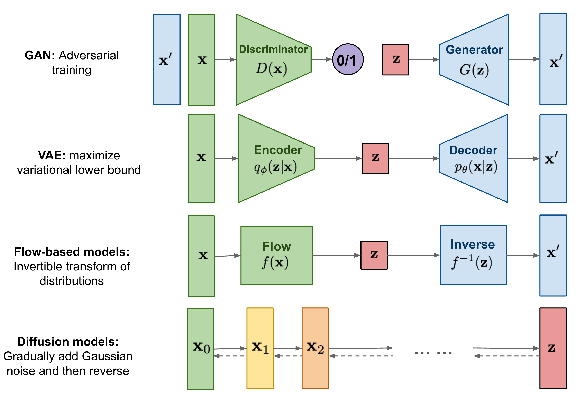
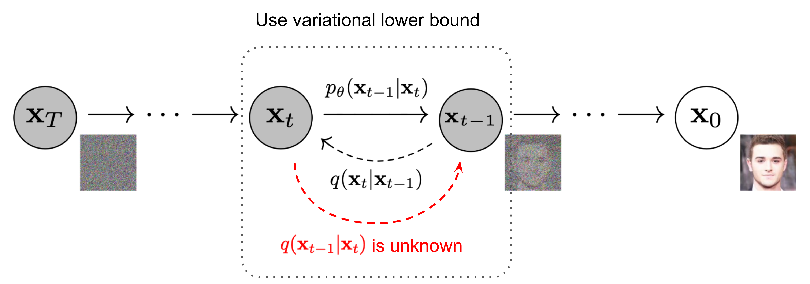
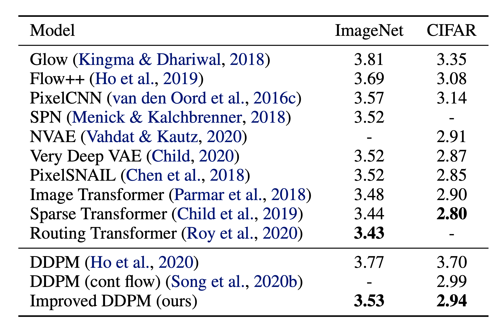
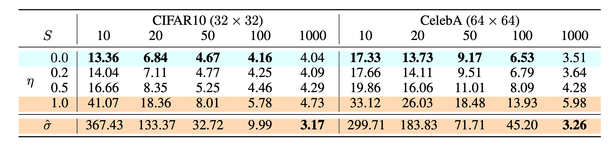
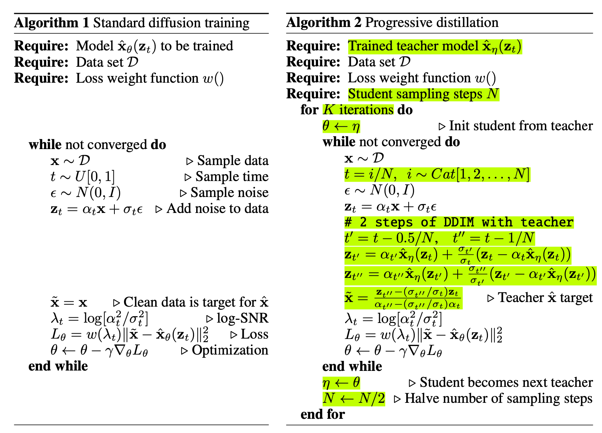
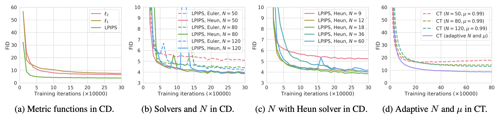
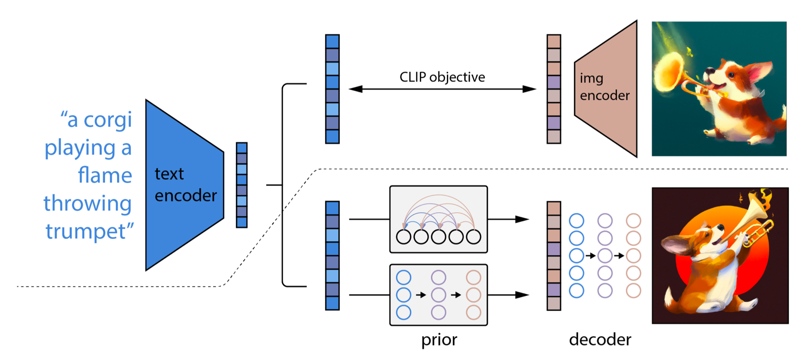
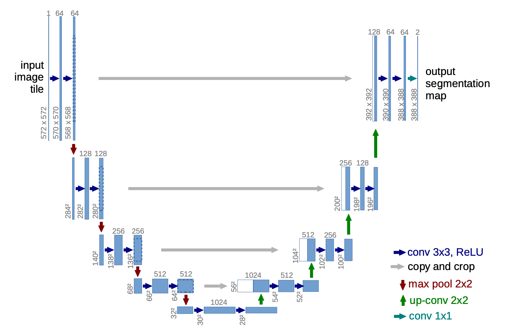

# 什么是扩散模型？

原文标题：What are Diffusion Models?  
原文作者：Lilian Weng  
原文链接：https://lilianweng.github.io/posts/2021-07-11-diffusion-models/  
访问日期：2026-05-07  
原文发布日期：2021-07-11  
原文最后更新：2024-04-13  
译文版本：v0.1

## 译文说明

本文为 Lilian Weng 文章《What are Diffusion Models?》的中文翻译版。

原文在首次发布后又经历了多次补充更新，当前译文对应 2024-04-13 版本。为保证正文可读性，本文未收录站点页眉、目录、标签与分享组件，但保留了正文配图、关键公式与参考文献。

原文更新记录：

- 2021-09-19：补充 score-based generative modeling 相关阅读。
- 2022-08-27：补充 classifier-free guidance、GLIDE、unCLIP 与 Imagen。
- 2022-08-31：补充 latent diffusion model。
- 2024-04-13：补充 progressive distillation、consistency models 与 model architecture。

## 引言

到目前为止，我已经写过三类生成模型：GAN、VAE 和 Flow-based models。它们在生成高质量样本方面都非常成功，但各自也有自己的局限。GAN 因为对抗式训练的性质，训练可能不稳定，生成结果的多样性也可能偏弱；VAE 依赖代理损失（surrogate loss）；Flow 模型则必须使用专门的可逆结构来构造变换。

扩散模型（diffusion models）受到非平衡热力学（non-equilibrium thermodynamics）的启发。它们定义了一条扩散步骤组成的马尔可夫链，先逐步向数据中加入随机噪声，再学习如何反转这一过程，从噪声中构造出目标数据样本。与 VAE 或 Flow 模型不同，扩散模型采用一套固定程序进行学习，而且其潜变量具有与原始数据相同的高维度。



## 什么是扩散模型？

围绕相似核心思想，已经提出了多种扩散式生成模型，包括 diffusion probabilistic models（Sohl-Dickstein 等，2015）、noise-conditioned score network（NCSN；Yang 与 Ermon，2019），以及 denoising diffusion probabilistic models（DDPM；Ho 等，2020）。

### 前向扩散过程

给定一个从真实数据分布中采样得到的数据点 $\mathbf{x}_0 \sim q(\mathbf{x})$，我们定义一个前向扩散过程（forward diffusion process）：在 $T$ 个步骤里向样本逐步加入少量高斯噪声，得到一串带噪样本 $\mathbf{x}_1, \dots, \mathbf{x}_T$。每一步的步长由方差调度 $\{\beta_t \in (0, 1)\}_{t=1}^T$ 控制。

$$
q(\mathbf{x}_t \vert \mathbf{x}_{t-1}) = \mathcal{N}(\mathbf{x}_t; \sqrt{1 - \beta_t} \mathbf{x}_{t-1}, \beta_t\mathbf{I})
\quad
q(\mathbf{x}_{1:T} \vert \mathbf{x}_0) = \prod_{t=1}^T q(\mathbf{x}_t \vert \mathbf{x}_{t-1})
$$

随着步数 $t$ 增大，数据样本 $\mathbf{x}_0$ 中可辨识的结构会逐渐消失。最终当 $T \to \infty$ 时，$\mathbf{x}_T$ 就会等价于一个各向同性高斯分布。



上面这个过程有一个很好的性质：借助重参数化技巧（reparameterization trick），我们可以在任意时间步 $t$ 直接以闭式形式采样 $\mathbf{x}_t$。令 $\alpha_t = 1 - \beta_t$，并记 $\bar{\alpha}_t = \prod_{i=1}^t \alpha_i$，则有：

$$
\begin{aligned}
\mathbf{x}_t
&= \sqrt{\alpha_t}\mathbf{x}_{t-1} + \sqrt{1 - \alpha_t}\boldsymbol{\epsilon}_{t-1}
&& \text{其中 } \boldsymbol{\epsilon}_{t-1}, \boldsymbol{\epsilon}_{t-2}, \dots \sim \mathcal{N}(\mathbf{0}, \mathbf{I}) \\
&= \sqrt{\alpha_t \alpha_{t-1}} \mathbf{x}_{t-2} + \sqrt{1 - \alpha_t \alpha_{t-1}} \bar{\boldsymbol{\epsilon}}_{t-2}
&& \text{其中 } \bar{\boldsymbol{\epsilon}}_{t-2} \text{ 吸收了两个高斯噪声项} \\
&= \dots \\
&= \sqrt{\bar{\alpha}_t}\mathbf{x}_0 + \sqrt{1 - \bar{\alpha}_t}\boldsymbol{\epsilon} \\
q(\mathbf{x}_t \vert \mathbf{x}_0)
&= \mathcal{N}(\mathbf{x}_t; \sqrt{\bar{\alpha}_t} \mathbf{x}_0, (1 - \bar{\alpha}_t)\mathbf{I})
\end{aligned}
$$

这里用到一个简单事实：如果把两个不同方差的高斯分布 $\mathcal{N}(\mathbf{0}, \sigma_1^2\mathbf{I})$ 与 $\mathcal{N}(\mathbf{0}, \sigma_2^2\mathbf{I})$ 相加，得到的新分布仍然是高斯，即 $\mathcal{N}(\mathbf{0}, (\sigma_1^2 + \sigma_2^2)\mathbf{I})$。在这里，合并后的标准差是 $\sqrt{(1 - \alpha_t) + \alpha_t (1-\alpha_{t-1})} = \sqrt{1 - \alpha_t\alpha_{t-1}}$。

通常随着样本越来越噪，我们能承受更大的更新步长，因此往往会设置 $\beta_1 < \beta_2 < \dots < \beta_T$，于是自然有 $\bar{\alpha}_1 > \dots > \bar{\alpha}_T$。

### 与随机梯度朗之万动力学的联系

朗之万动力学（Langevin dynamics）来自物理学，最初用于分子系统的统计建模。把它和随机梯度下降结合起来，就得到随机梯度朗之万动力学（stochastic gradient Langevin dynamics, SGLD；Welling 与 Teh，2011）。它可以仅利用梯度 $\nabla_\mathbf{x} \log p(\mathbf{x})$，在一个马尔可夫链更新过程中，从概率密度 $p(\mathbf{x})$ 中采样：

$$
\mathbf{x}_t = \mathbf{x}_{t-1} + \frac{\delta}{2} \nabla_\mathbf{x} \log p(\mathbf{x}_{t-1}) + \sqrt{\delta} \boldsymbol{\epsilon}_t,
\quad
\text{其中 } \boldsymbol{\epsilon}_t \sim \mathcal{N}(\mathbf{0}, \mathbf{I})
$$

这里 $\delta$ 是步长。当 $T \to \infty$ 且 $\delta \to 0$ 时，$\mathbf{x}_T$ 会收敛到真实概率密度 $p(\mathbf{x})$。

与标准 SGD 相比，SGLD 会在参数更新中显式注入高斯噪声，以避免陷入局部极小值。

### 反向扩散过程

如果我们能把上述过程反过来，并从 $q(\mathbf{x}_{t-1} \vert \mathbf{x}_t)$ 中采样，那么就能从高斯噪声输入 $\mathbf{x}_T \sim \mathcal{N}(\mathbf{0}, \mathbf{I})$ 重新生成真实样本。注意，当 $\beta_t$ 足够小时，$q(\mathbf{x}_{t-1} \vert \mathbf{x}_t)$ 也会是高斯分布。可惜的是，这个条件分布很难直接估计，因为它依赖整个数据集。因此，我们需要学习一个模型 $p_\theta$ 来近似这些条件概率，从而运行反向扩散过程（reverse diffusion process）：

$$
p_\theta(\mathbf{x}_{0:T}) = p(\mathbf{x}_T) \prod_{t=1}^T p_\theta(\mathbf{x}_{t-1} \vert \mathbf{x}_t),
\quad
p_\theta(\mathbf{x}_{t-1} \vert \mathbf{x}_t) = \mathcal{N}(\mathbf{x}_{t-1}; \boldsymbol{\mu}_\theta(\mathbf{x}_t, t), \boldsymbol{\Sigma}_\theta(\mathbf{x}_t, t))
$$


一个重要性质是：如果额外条件化在 $\mathbf{x}_0$ 上，反向条件概率其实是可解析的：

$$
q(\mathbf{x}_{t-1} \vert \mathbf{x}_t, \mathbf{x}_0) =
\mathcal{N}(\mathbf{x}_{t-1}; \tilde{\boldsymbol{\mu}}(\mathbf{x}_t, \mathbf{x}_0), \tilde{\beta}_t \mathbf{I})
$$

利用贝叶斯公式可以得到：

$$
\begin{aligned}
q(\mathbf{x}_{t-1} \vert \mathbf{x}_t, \mathbf{x}_0)
&= q(\mathbf{x}_t \vert \mathbf{x}_{t-1}, \mathbf{x}_0)
\frac{q(\mathbf{x}_{t-1} \vert \mathbf{x}_0)}{q(\mathbf{x}_t \vert \mathbf{x}_0)} \\
&\propto \exp \Big(
-\frac{1}{2}
\Big(
\frac{(\mathbf{x}_t - \sqrt{\alpha_t}\mathbf{x}_{t-1})^2}{\beta_t}
+
\frac{(\mathbf{x}_{t-1} - \sqrt{\bar{\alpha}_{t-1}}\mathbf{x}_0)^2}{1-\bar{\alpha}_{t-1}}
-
\frac{(\mathbf{x}_t - \sqrt{\bar{\alpha}_t}\mathbf{x}_0)^2}{1-\bar{\alpha}_t}
\Big)
\Big) \\
&= \exp \Big(
-\frac{1}{2}
\Big(
\frac{\mathbf{x}_t^2 - 2\sqrt{\alpha_t}\mathbf{x}_t \mathbf{x}_{t-1} + \alpha_t \mathbf{x}_{t-1}^2}{\beta_t}
+
\frac{\mathbf{x}_{t-1}^2 - 2\sqrt{\bar{\alpha}_{t-1}}\mathbf{x}_0 \mathbf{x}_{t-1} + \bar{\alpha}_{t-1}\mathbf{x}_0^2}{1-\bar{\alpha}_{t-1}}
-
\frac{(\mathbf{x}_t - \sqrt{\bar{\alpha}_t}\mathbf{x}_0)^2}{1-\bar{\alpha}_t}
\Big)
\Big) \\
&= \exp \Big(
-\frac{1}{2}
\Big(
\left(\frac{\alpha_t}{\beta_t} + \frac{1}{1-\bar{\alpha}_{t-1}}\right)\mathbf{x}_{t-1}^2
-
\left(
\frac{2\sqrt{\alpha_t}}{\beta_t}\mathbf{x}_t
+
\frac{2\sqrt{\bar{\alpha}_{t-1}}}{1-\bar{\alpha}_{t-1}}\mathbf{x}_0
\right)\mathbf{x}_{t-1}
+
C(\mathbf{x}_t, \mathbf{x}_0)
\Big)
\Big)
\end{aligned}
$$

其中 $C(\mathbf{x}_t, \mathbf{x}_0)$ 表示与 $\mathbf{x}_{t-1}$ 无关的项。按照标准高斯密度的形式整理后，可以得到均值与方差参数化如下。回忆 $\alpha_t = 1 - \beta_t$，且 $\bar{\alpha}_t = \prod_{i=1}^t \alpha_i$：

$$
\begin{aligned}
\tilde{\beta}_t
&=
\frac{1}{\frac{\alpha_t}{\beta_t} + \frac{1}{1-\bar{\alpha}_{t-1}}}
=
\frac{1-\bar{\alpha}_{t-1}}{1-\bar{\alpha}_t}\cdot \beta_t
\\
\tilde{\boldsymbol{\mu}}_t(\mathbf{x}_t, \mathbf{x}_0)
&=
\left(
\frac{\sqrt{\alpha_t}}{\beta_t}\mathbf{x}_t +
\frac{\sqrt{\bar{\alpha}_{t-1}}}{1-\bar{\alpha}_{t-1}}\mathbf{x}_0
\right)
\Big/
\left(
\frac{\alpha_t}{\beta_t} + \frac{1}{1-\bar{\alpha}_{t-1}}
\right)
\\
&=
\frac{\sqrt{\alpha_t}(1-\bar{\alpha}_{t-1})}{1-\bar{\alpha}_t}\mathbf{x}_t
+
\frac{\sqrt{\bar{\alpha}_{t-1}}\beta_t}{1-\bar{\alpha}_t}\mathbf{x}_0
\end{aligned}
$$

进一步利用前面已经得到的闭式表达：

$$
\mathbf{x}_0 = \frac{1}{\sqrt{\bar{\alpha}_t}}
\left(
\mathbf{x}_t - \sqrt{1-\bar{\alpha}_t}\boldsymbol{\epsilon}_t
\right)
$$

就可以把它代回上式，得到：

$$
\begin{aligned}
\tilde{\boldsymbol{\mu}}_t
&=
\frac{\sqrt{\alpha_t}(1-\bar{\alpha}_{t-1})}{1-\bar{\alpha}_t}\mathbf{x}_t
+
\frac{\sqrt{\bar{\alpha}_{t-1}}\beta_t}{1-\bar{\alpha}_t}
\cdot
\frac{1}{\sqrt{\bar{\alpha}_t}}
\left(
\mathbf{x}_t - \sqrt{1-\bar{\alpha}_t}\boldsymbol{\epsilon}_t
\right)
\\
&=
\frac{1}{\sqrt{\alpha_t}}
\left(
\mathbf{x}_t - \frac{1-\alpha_t}{\sqrt{1-\bar{\alpha}_t}}\boldsymbol{\epsilon}_t
\right)
\end{aligned}
$$

如图 2 所示，这种设置与 VAE 很相似，因此我们可以用 variational lower bound 来优化负对数似然。

$$
\begin{aligned}
- \log p_\theta(\mathbf{x}_0)
&\le
- \log p_\theta(\mathbf{x}_0)
+
D_\text{KL}(q(\mathbf{x}_{1:T}\vert\mathbf{x}_0)\parallel p_\theta(\mathbf{x}_{1:T}\vert\mathbf{x}_0))
\\
&=
- \log p_\theta(\mathbf{x}_0)
+
\mathbb{E}_{\mathbf{x}_{1:T}\sim q(\mathbf{x}_{1:T}\vert\mathbf{x}_0)}
\left[
\log
\frac{q(\mathbf{x}_{1:T}\vert\mathbf{x}_0)}{p_\theta(\mathbf{x}_{0:T}) / p_\theta(\mathbf{x}_0)}
\right]
\\
&=
\mathbb{E}_q
\left[
\log \frac{q(\mathbf{x}_{1:T}\vert\mathbf{x}_0)}{p_\theta(\mathbf{x}_{0:T})}
\right]
\end{aligned}
$$

记

$$
L_\text{VLB}
=
\mathbb{E}_{q(\mathbf{x}_{0:T})}
\left[
\log \frac{q(\mathbf{x}_{1:T}\vert\mathbf{x}_0)}{p_\theta(\mathbf{x}_{0:T})}
\right]
\ge
-
\mathbb{E}_{q(\mathbf{x}_0)}\log p_\theta(\mathbf{x}_0)
$$

也可以用 Jensen 不等式推导出同样的结论。假设我们要最小化交叉熵作为学习目标，则：

$$
\begin{aligned}
L_\text{CE}
&=
-
\mathbb{E}_{q(\mathbf{x}_0)} \log p_\theta(\mathbf{x}_0)
\\
&=
-
\mathbb{E}_{q(\mathbf{x}_0)}
\log
\left(
\int p_\theta(\mathbf{x}_{0:T})\,d\mathbf{x}_{1:T}
\right)
\\
&=
-
\mathbb{E}_{q(\mathbf{x}_0)}
\log
\left(
\mathbb{E}_{q(\mathbf{x}_{1:T}\vert\mathbf{x}_0)}
\frac{p_\theta(\mathbf{x}_{0:T})}{q(\mathbf{x}_{1:T}\vert\mathbf{x}_0)}
\right)
\\
&\le
\mathbb{E}_{q(\mathbf{x}_{0:T})}
\left[
\log \frac{q(\mathbf{x}_{1:T}\vert\mathbf{x}_0)}{p_\theta(\mathbf{x}_{0:T})}
\right]
=
L_\text{VLB}
\end{aligned}
$$

为了让这个目标的每一项都能被解析计算，它可以进一步被改写成若干个 KL 散度项和熵项的组合。详细推导可见 Sohl-Dickstein 等（2015）附录 B：

$$
\begin{aligned}
L_\text{VLB}
&=
\mathbb{E}_{q(\mathbf{x}_{0:T})}
\left[
\log \frac{q(\mathbf{x}_{1:T}\vert\mathbf{x}_0)}{p_\theta(\mathbf{x}_{0:T})}
\right]
\\
&=
\mathbb{E}_q
\left[
\log \frac{\prod_{t=1}^T q(\mathbf{x}_t\vert\mathbf{x}_{t-1})}
{p_\theta(\mathbf{x}_T)\prod_{t=1}^T p_\theta(\mathbf{x}_{t-1}\vert\mathbf{x}_t)}
\right]
\\
&=
\mathbb{E}_q
\left[
-\log p_\theta(\mathbf{x}_T)
+
\sum_{t=1}^T
\log \frac{q(\mathbf{x}_t\vert\mathbf{x}_{t-1})}{p_\theta(\mathbf{x}_{t-1}\vert\mathbf{x}_t)}
\right]
\\
&=
\mathbb{E}_q
\left[
\log \frac{q(\mathbf{x}_T\vert\mathbf{x}_0)}{p_\theta(\mathbf{x}_T)}
+
\sum_{t=2}^T
\log \frac{q(\mathbf{x}_{t-1}\vert\mathbf{x}_t,\mathbf{x}_0)}{p_\theta(\mathbf{x}_{t-1}\vert\mathbf{x}_t)}
-
\log p_\theta(\mathbf{x}_0\vert\mathbf{x}_1)
\right]
\\
&=
\mathbb{E}_q
\left[
\underbrace{D_\text{KL}(q(\mathbf{x}_T\vert\mathbf{x}_0)\parallel p_\theta(\mathbf{x}_T))}_{L_T}
+
\sum_{t=2}^T
\underbrace{D_\text{KL}(q(\mathbf{x}_{t-1}\vert\mathbf{x}_t,\mathbf{x}_0)\parallel p_\theta(\mathbf{x}_{t-1}\vert\mathbf{x}_t))}_{L_{t-1}}
+
\underbrace{(-\log p_\theta(\mathbf{x}_0\vert\mathbf{x}_1))}_{L_0}
\right]
\end{aligned}
$$

于是，variational lower bound 的各部分可以写成：

$$
\begin{aligned}
L_\text{VLB}
&=
L_T + L_{T-1} + \dots + L_0
\\
L_T
&=
D_\text{KL}(q(\mathbf{x}_T\vert\mathbf{x}_0)\parallel p_\theta(\mathbf{x}_T))
\\
L_t
&=
D_\text{KL}(q(\mathbf{x}_t\vert\mathbf{x}_{t+1},\mathbf{x}_0)\parallel p_\theta(\mathbf{x}_t\vert\mathbf{x}_{t+1}))
\quad \text{对 } 1 \le t \le T-1
\\
L_0
&=
-\log p_\theta(\mathbf{x}_0\vert\mathbf{x}_1)
\end{aligned}
$$

除了 $L_0$ 以外，$L_\text{VLB}$ 中的每个 KL 项都比较两个高斯分布，因此都可以用闭式形式计算。$L_T$ 是常数，在训练时可以忽略，因为 $q$ 没有可学习参数，而 $\mathbf{x}_T$ 本身就是高斯噪声。Ho 等（2020）则用一个从 $\mathcal{N}(\mathbf{x}_0; \boldsymbol{\mu}_\theta(\mathbf{x}_1, 1), \boldsymbol{\Sigma}_\theta(\mathbf{x}_1, 1))$ 导出的离散 decoder 来建模 $L_0$。

### 训练损失中 $L_t$ 的参数化

回忆一下，我们需要学习一个神经网络，去近似反向扩散过程中的条件概率分布：

$$
p_\theta(\mathbf{x}_{t-1} \vert \mathbf{x}_t)
=
\mathcal{N}(\mathbf{x}_{t-1}; \boldsymbol{\mu}_\theta(\mathbf{x}_t, t), \boldsymbol{\Sigma}_\theta(\mathbf{x}_t, t))
$$

我们希望训练 $\boldsymbol{\mu}_\theta$ 去预测

$$
\tilde{\boldsymbol{\mu}}_t
=
\frac{1}{\sqrt{\alpha_t}}
\left(
\mathbf{x}_t - \frac{1-\alpha_t}{\sqrt{1-\bar{\alpha}_t}}\boldsymbol{\epsilon}_t
\right)
$$

由于训练时 $\mathbf{x}_t$ 是已知输入，我们可以重新参数化其中的高斯噪声项，让模型直接从输入 $\mathbf{x}_t$ 与时间步 $t$ 预测 $\boldsymbol{\epsilon}_t$：

$$
\begin{aligned}
\boldsymbol{\mu}_\theta(\mathbf{x}_t, t)
&=
\frac{1}{\sqrt{\alpha_t}}
\left(
\mathbf{x}_t - \frac{1-\alpha_t}{\sqrt{1-\bar{\alpha}_t}}\boldsymbol{\epsilon}_\theta(\mathbf{x}_t, t)
\right)
\\
\mathbf{x}_{t-1}
&\sim
\mathcal{N}
\left(
\frac{1}{\sqrt{\alpha_t}}
\left(
\mathbf{x}_t - \frac{1-\alpha_t}{\sqrt{1-\bar{\alpha}_t}}\boldsymbol{\epsilon}_\theta(\mathbf{x}_t, t)
\right),
\boldsymbol{\Sigma}_\theta(\mathbf{x}_t, t)
\right)
\end{aligned}
$$

于是，损失项 $L_t$ 可以参数化为最小化它与 $\tilde{\boldsymbol{\mu}}_t$ 的差异：

$$
\begin{aligned}
L_t
&=
\mathbb{E}_{\mathbf{x}_0,\boldsymbol{\epsilon}}
\left[
\frac{1}{2\|\boldsymbol{\Sigma}_\theta(\mathbf{x}_t, t)\|_2^2}
\|
\tilde{\boldsymbol{\mu}}_t(\mathbf{x}_t,\mathbf{x}_0) - \boldsymbol{\mu}_\theta(\mathbf{x}_t, t)
\|^2
\right]
\\
&=
\mathbb{E}_{\mathbf{x}_0,\boldsymbol{\epsilon}}
\left[
\frac{(1-\alpha_t)^2}
{2\alpha_t(1-\bar{\alpha}_t)\|\boldsymbol{\Sigma}_\theta\|_2^2}
\|
\boldsymbol{\epsilon}_t - \boldsymbol{\epsilon}_\theta(\mathbf{x}_t,t)
\|^2
\right]
\\
&=
\mathbb{E}_{\mathbf{x}_0,\boldsymbol{\epsilon}}
\left[
\frac{(1-\alpha_t)^2}
{2\alpha_t(1-\bar{\alpha}_t)\|\boldsymbol{\Sigma}_\theta\|_2^2}
\|
\boldsymbol{\epsilon}_t - \boldsymbol{\epsilon}_\theta(
\sqrt{\bar{\alpha}_t}\mathbf{x}_0 + \sqrt{1-\bar{\alpha}_t}\boldsymbol{\epsilon}_t, t)
\|^2
\right]
\end{aligned}
$$

#### 简化目标

经验上，Ho 等（2020）发现，如果忽略其中的权重项，训练扩散模型反而更稳定，效果也更好。于是他们使用下面这个简化目标：

$$
\begin{aligned}
L_t^\text{simple}
&=
\mathbb{E}_{t \sim [1, T], \mathbf{x}_0, \boldsymbol{\epsilon}_t}
\left[
\|
\boldsymbol{\epsilon}_t - \boldsymbol{\epsilon}_\theta(\mathbf{x}_t, t)
\|^2
\right]
\\
&=
\mathbb{E}_{t \sim [1, T], \mathbf{x}_0, \boldsymbol{\epsilon}_t}
\left[
\|
\boldsymbol{\epsilon}_t - \boldsymbol{\epsilon}_\theta(
\sqrt{\bar{\alpha}_t}\mathbf{x}_0 + \sqrt{1-\bar{\alpha}_t}\boldsymbol{\epsilon}_t, t)
\|^2
\right]
\end{aligned}
$$

最终的简化目标就是：

$$
L_\text{simple} = L_t^\text{simple} + C
$$

其中 $C$ 是一个与 $\theta$ 无关的常数。


#### 与噪声条件 score 网络（NCSN）的联系

Song 与 Ermon（2019）提出了一种基于 score 的生成建模方法：用 score matching 估计数据分布的梯度，再结合朗之万动力学进行采样。某个样本 $\mathbf{x}$ 的 score 定义为其密度对数的梯度 $\nabla_{\mathbf{x}} \log q(\mathbf{x})$。他们训练一个 score 网络 $\mathbf{s}_\theta: \mathbb{R}^D \to \mathbb{R}^D$ 来估计这个量，即 $\mathbf{s}_\theta(\mathbf{x}) \approx \nabla_{\mathbf{x}} \log q(\mathbf{x})$。

为了让它能够扩展到高维数据的深度学习场景，作者提出可以使用 denoising score matching（Vincent，2011）或者 sliced score matching（Song 等，2019，借助随机投影）。其中 denoising score matching 会先向数据加入一个预设的小噪声 $q(\tilde{\mathbf{x}} \vert \mathbf{x})$，再对扰动后分布 $q(\tilde{\mathbf{x}})$ 进行 score matching。

回忆一下，朗之万动力学只依赖 score $\nabla_{\mathbf{x}} \log q(\mathbf{x})$ 就能迭代采样。但按照流形假设（manifold hypothesis），尽管观测数据看起来是高维的，大多数真实数据实际上集中在一个低维流形上。这会给 score 估计带来问题，因为数据点无法覆盖整个空间；在数据密度低的区域，score 估计尤其不可靠。给数据加入小的高斯噪声，使得扰动后的数据分布覆盖整个 $\mathbb{R}^D$ 后，score 网络训练就会稳定得多。Song 与 Ermon（2019）进一步把不同噪声等级都纳入训练，让一个 noise-conditioned score network 同时估计不同噪声级别下的 score。

不断增大的噪声调度，与前向扩散过程很相似。如果沿用扩散过程的记号，那么 score 近似为 $\mathbf{s}_\theta(\mathbf{x}_t, t) \approx \nabla_{\mathbf{x}_t} \log q(\mathbf{x}_t)$。对于高斯分布 $\mathbf{x} \sim \mathcal{N}(\boldsymbol{\mu}, \sigma^2 \mathbf{I})$，其对数密度的梯度为：

$$
\nabla_{\mathbf{x}}\log p(\mathbf{x})
=
\nabla_{\mathbf{x}}
\left(
-\frac{1}{2\sigma^2}(\mathbf{x}-\boldsymbol{\mu})^2
\right)
=
-\frac{\mathbf{x}-\boldsymbol{\mu}}{\sigma^2}
=
-\frac{\boldsymbol{\epsilon}}{\sigma}
$$

其中 $\boldsymbol{\epsilon} \sim \mathcal{N}(\boldsymbol{0}, \mathbf{I})$。又因为前面已经知道

$$
q(\mathbf{x}_t \vert \mathbf{x}_0)
\sim
\mathcal{N}(\sqrt{\bar{\alpha}_t}\mathbf{x}_0, (1-\bar{\alpha}_t)\mathbf{I})
$$

于是有：

$$
\mathbf{s}_\theta(\mathbf{x}_t, t)
\approx
\nabla_{\mathbf{x}_t} \log q(\mathbf{x}_t)
=
\mathbb{E}_{q(\mathbf{x}_0)}
\left[
\nabla_{\mathbf{x}_t} \log q(\mathbf{x}_t \vert \mathbf{x}_0)
\right]
=
-
\frac{\boldsymbol{\epsilon}_\theta(\mathbf{x}_t, t)}{\sqrt{1-\bar{\alpha}_t}}
$$

### $\beta_t$ 的参数化

在 Ho 等（2020）中，前向过程的方差被设为一列线性递增常数，从 $\beta_1 = 10^{-4}$ 一直到 $\beta_T = 0.02$。相对于归一化到 $[-1, 1]$ 的图像像素值来说，这些方差都比较小。这样的扩散模型已经能生成高质量样本，但对数似然仍不如某些其他生成模型。

Nichol 与 Dhariwal（2021）提出了多项改进技巧来降低 NLL，其中一项就是使用基于 cosine 的方差调度。调度函数的具体形式并不唯一，只要它在训练过程的中间阶段近似线性下降，并在 $t=0$ 和 $t=T$ 附近变化更平滑即可。

$$
\beta_t = \text{clip}\left(1-\frac{\bar{\alpha}_t}{\bar{\alpha}_{t-1}}, 0.999\right)
\quad
\bar{\alpha}_t = \frac{f(t)}{f(0)}
\quad
\text{其中 } f(t)=\cos\Big(\frac{t/T+s}{1+s}\cdot\frac{\pi}{2}\Big)^2
$$

这里的小偏移量 $s$ 用来防止在 $t=0$ 附近 $\beta_t$ 变得过小。


### 反向过程方差 $\boldsymbol{\Sigma}_\theta$ 的参数化

Ho 等（2020）选择把 $\beta_t$ 固定为常数，而不是让它可学习，并令 $\boldsymbol{\Sigma}_\theta(\mathbf{x}_t, t) = \sigma_t^2 \mathbf{I}$。这里的 $\sigma_t$ 不学习，而是直接设为 $\beta_t$ 或 $\tilde{\beta}_t = \frac{1 - \bar{\alpha}_{t-1}}{1 - \bar{\alpha}_t}\cdot \beta_t$。原因是他们发现，如果学习对角方差 $\boldsymbol{\Sigma}_\theta$，训练会更不稳定，样本质量也更差。

Nichol 与 Dhariwal（2021）提出让模型预测一个 mixing vector $\mathbf{v}$，把 $\boldsymbol{\Sigma}_\theta(\mathbf{x}_t, t)$ 建模为 $\beta_t$ 与 $\tilde{\beta}_t$ 之间的插值：

$$
\boldsymbol{\Sigma}_\theta(\mathbf{x}_t, t)
=
\exp(\mathbf{v}\log \beta_t + (1-\mathbf{v})\log \tilde{\beta}_t)
$$

然而，简化目标 $L_\text{simple}$ 并不依赖 $\boldsymbol{\Sigma}_\theta$。为了让它参与训练，作者构造了一个混合目标：

$$
L_\text{hybrid} = L_\text{simple} + \lambda L_\text{VLB}
$$

其中 $\lambda = 0.001$ 很小，而且在 $L_\text{VLB}$ 这一项里对 $\boldsymbol{\mu}_\theta$ 停止梯度，使得 $L_\text{VLB}$ 只负责指导 $\boldsymbol{\Sigma}_\theta$ 的学习。经验上，他们观察到 $L_\text{VLB}$ 很难直接优化，原因可能是梯度噪声太大，因此又提出用带重要性采样的、时间平均平滑版本来替代。



## 条件生成（Conditioned Generation）

当我们在带条件信息的数据集上训练生成模型时，例如带 ImageNet 类别标签的图像数据，通常都希望能够按类别标签或一段文本描述来条件生成样本。

### Classifier Guided Diffusion

为了显式地把类别信息引入扩散过程，Dhariwal 与 Nichol（2021）训练了一个分类器 $f_\phi(y \vert \mathbf{x}_t, t)$，它在带噪图像 $\mathbf{x}_t$ 上预测类别，并用其梯度 $\nabla_\mathbf{x} \log f_\phi(y \vert \mathbf{x}_t)$ 去引导扩散采样过程朝着条件信息 $y$（例如目标类别）前进，也就是修正噪声预测。回忆一下：

$$
\nabla_{\mathbf{x}_t}\log q(\mathbf{x}_t)
=
-\frac{1}{\sqrt{1-\bar{\alpha}_t}}
\boldsymbol{\epsilon}_\theta(\mathbf{x}_t, t)
$$

于是联合分布 $q(\mathbf{x}_t, y)$ 的 score 可以写成：

$$
\begin{aligned}
\nabla_{\mathbf{x}_t}\log q(\mathbf{x}_t, y)
&=
\nabla_{\mathbf{x}_t}\log q(\mathbf{x}_t)
+
\nabla_{\mathbf{x}_t}\log q(y \vert \mathbf{x}_t)
\\
&\approx
-
\frac{1}{\sqrt{1-\bar{\alpha}_t}}
\boldsymbol{\epsilon}_\theta(\mathbf{x}_t, t)
+
\nabla_{\mathbf{x}_t}\log f_\phi(y \vert \mathbf{x}_t)
\\
&=
-
\frac{1}{\sqrt{1-\bar{\alpha}_t}}
\left(
\boldsymbol{\epsilon}_\theta(\mathbf{x}_t, t)
-
\sqrt{1-\bar{\alpha}_t}\nabla_{\mathbf{x}_t}\log f_\phi(y \vert \mathbf{x}_t)
\right)
\end{aligned}
$$

因此，一个经过 classifier guidance 修正后的预测器 $\bar{\boldsymbol{\epsilon}}_\theta$ 可写为：

$$
\bar{\boldsymbol{\epsilon}}_\theta(\mathbf{x}_t, t)
=
\boldsymbol{\epsilon}_\theta(\mathbf{x}_t, t)
-
\sqrt{1-\bar{\alpha}_t}\nabla_{\mathbf{x}_t}\log f_\phi(y \vert \mathbf{x}_t)
$$

为了控制引导强度，我们还可以给修正项增加一个权重 $w$：

$$
\bar{\boldsymbol{\epsilon}}_\theta(\mathbf{x}_t, t)
=
\boldsymbol{\epsilon}_\theta(\mathbf{x}_t, t)
-
\sqrt{1-\bar{\alpha}_t}\, w \,\nabla_{\mathbf{x}_t}\log f_\phi(y \vert \mathbf{x}_t)
$$

由此得到的 ablated diffusion model（ADM）以及进一步加上 classifier guidance 的 ADM-G，都能比当时最先进的生成模型（例如 BigGAN）取得更好的结果。


此外，Dhariwal 与 Nichol（2021）还对 U-Net 架构做了一些修改，并展示出扩散模型在图像合成上优于 GAN 的结果。这些改动包括：更大的模型深度与宽度、更多 attention heads、多分辨率 attention、用于上/下采样的 BigGAN residual blocks、按 $1/\sqrt{2}$ 缩放 residual connection，以及 adaptive group normalization（AdaGN）。

### Classifier-Free Guidance

即便没有独立分类器 $f_\phi$，也仍然可以通过条件扩散模型与无条件扩散模型的 score 组合来执行条件扩散步骤（Ho 与 Salimans，2021）。设无条件的 denoising diffusion model $p_\theta(\mathbf{x})$ 通过 score 估计器 $\boldsymbol{\epsilon}_\theta(\mathbf{x}_t, t)$ 参数化；条件模型 $p_\theta(\mathbf{x} \vert y)$ 则通过 $\boldsymbol{\epsilon}_\theta(\mathbf{x}_t, t, y)$ 参数化。这两个模型其实可以由同一个神经网络联合学习。

更具体地说，我们训练一个条件扩散模型 $p_\theta(\mathbf{x} \vert y)$，数据是成对的 $(\mathbf{x}, y)$。训练过程中，条件信息 $y$ 会以一定概率被随机丢弃，这样模型既学会了有条件生成，也学会了无条件生成，即 $\boldsymbol{\epsilon}_\theta(\mathbf{x}_t, t) = \boldsymbol{\epsilon}_\theta(\mathbf{x}_t, t, y=\varnothing)$。

此时，隐式分类器的梯度可以由条件与无条件的 score 估计器之差来表示。把它代入 classifier-guided score 中之后，就不再需要额外的分类器：

$$
\begin{aligned}
\nabla_{\mathbf{x}_t} \log p(y \vert \mathbf{x}_t)
&=
\nabla_{\mathbf{x}_t} \log p(\mathbf{x}_t \vert y)
-
\nabla_{\mathbf{x}_t} \log p(\mathbf{x}_t)
\\
&=
-
\frac{1}{\sqrt{1-\bar{\alpha}_t}}
\left(
\boldsymbol{\epsilon}_\theta(\mathbf{x}_t, t, y)
-
\boldsymbol{\epsilon}_\theta(\mathbf{x}_t, t)
\right)
\\
\bar{\boldsymbol{\epsilon}}_\theta(\mathbf{x}_t, t, y)
&=
\boldsymbol{\epsilon}_\theta(\mathbf{x}_t, t, y)
-
\sqrt{1-\bar{\alpha}_t}\, w \,\nabla_{\mathbf{x}_t}\log p(y \vert \mathbf{x}_t)
\\
&=
(w+1)\boldsymbol{\epsilon}_\theta(\mathbf{x}_t, t, y)
-
w\boldsymbol{\epsilon}_\theta(\mathbf{x}_t, t)
\end{aligned}
$$

实验表明，classifier-free guidance 能在 FID 与 IS 之间取得很好的折中。

GLIDE（Nichol、Dhariwal、Ramesh 等，2022）同时探索了两种引导策略：CLIP guidance 与 classifier-free guidance，最终发现后者更受偏好。作者推测，这可能是因为 CLIP guidance 更容易把模型推向针对 CLIP 的对抗样本，而不是真正与目标文本更匹配的图像。

## 加速扩散模型（Speed up Diffusion Models）

沿着 DDPM 的反向马尔可夫链一步一步采样非常慢，因为 $T$ 可能高达上千步。Song 等（2020）举过一个例子：“在一张 Nvidia 2080 Ti GPU 上，从 DDPM 采样 5 万张大小为 32 × 32 的图像大约需要 20 小时，而 GAN 完成同样工作不到一分钟。”

### 更少的采样步数与蒸馏（Fewer Sampling Steps & Distillation）

一种最直接的做法，是采用跨步采样调度（strided sampling schedule；Nichol 与 Dhariwal，2021），每隔 $\lceil T/S \rceil$ 步执行一次采样更新，把过程从 $T$ 步缩减为 $S$ 步。新的采样步序列记作 $\{\tau_1, \dots, \tau_S\}$，其中 $\tau_1 < \tau_2 < \dots < \tau_S \in [1, T]$ 且 $S < T$。

另一种方式，是把 $q_\sigma(\mathbf{x}_{t-1} \vert \mathbf{x}_t, \mathbf{x}_0)$ 改写成由目标标准差 $\sigma_t$ 参数化的形式。利用前面已经得到的闭式性质，有：

$$
\begin{aligned}
\mathbf{x}_{t-1}
&=
\sqrt{\bar{\alpha}_{t-1}}\mathbf{x}_0 + \sqrt{1-\bar{\alpha}_{t-1}}\boldsymbol{\epsilon}_{t-1}
\\
&=
\sqrt{\bar{\alpha}_{t-1}}\mathbf{x}_0 + \sqrt{1-\bar{\alpha}_{t-1}-\sigma_t^2}\boldsymbol{\epsilon}_t + \sigma_t \boldsymbol{\epsilon}
\\
&=
\sqrt{\bar{\alpha}_{t-1}}
\left(
\frac{\mathbf{x}_t - \sqrt{1-\bar{\alpha}_t}\epsilon_\theta^{(t)}(\mathbf{x}_t)}{\sqrt{\bar{\alpha}_t}}
\right)
+
\sqrt{1-\bar{\alpha}_{t-1}-\sigma_t^2}\epsilon_\theta^{(t)}(\mathbf{x}_t)
+
\sigma_t \boldsymbol{\epsilon}
\\
q_\sigma(\mathbf{x}_{t-1} \vert \mathbf{x}_t, \mathbf{x}_0)
&=
\mathcal{N}
\Big(
\mathbf{x}_{t-1};
\sqrt{\bar{\alpha}_{t-1}}
\left(
\frac{\mathbf{x}_t - \sqrt{1-\bar{\alpha}_t}\epsilon_\theta^{(t)}(\mathbf{x}_t)}{\sqrt{\bar{\alpha}_t}}
\right)
+
\sqrt{1-\bar{\alpha}_{t-1}-\sigma_t^2}\epsilon_\theta^{(t)}(\mathbf{x}_t),
\sigma_t^2 \mathbf{I}
\Big)
\end{aligned}
$$

其中 $\epsilon_\theta^{(t)}(.)$ 表示模型根据 $\mathbf{x}_t$ 预测的 $\epsilon_t$。

又因为原来的

$$
q(\mathbf{x}_{t-1} \vert \mathbf{x}_t, \mathbf{x}_0)
=
\mathcal{N}(\mathbf{x}_{t-1}; \tilde{\boldsymbol{\mu}}(\mathbf{x}_t, \mathbf{x}_0), \tilde{\beta}_t \mathbf{I})
$$

所以有：

$$
\tilde{\beta}_t = \sigma_t^2 = \frac{1 - \bar{\alpha}_{t-1}}{1 - \bar{\alpha}_t}\cdot \beta_t
$$

令 $\sigma_t^2 = \eta \cdot \tilde{\beta}_t$，就可以把 $\eta \in \mathbb{R}^+$ 当作超参数，用来控制采样的随机性。特别地，当 $\eta = 0$ 时，整个采样过程就是确定性的。这种模型被称为 denoising diffusion implicit model（DDIM；Song 等，2020）。DDIM 具有和 DDPM 相同的边际噪声分布，但会以确定性的方式把噪声映射回原始数据样本。

生成时我们也不必严格遵循完整的 $t=1,\dots,T$ 链，而可以只走一个子序列。记 $s < t$ 为这条加速轨迹中的两个步骤，则 DDIM 的更新可写为：

$$
q_{\sigma, s < t}(\mathbf{x}_s \vert \mathbf{x}_t, \mathbf{x}_0)
=
\mathcal{N}
\Big(
\mathbf{x}_s;
\sqrt{\bar{\alpha}_s}
\left(
\frac{\mathbf{x}_t - \sqrt{1-\bar{\alpha}_t}\epsilon_\theta^{(t)}(\mathbf{x}_t)}{\sqrt{\bar{\alpha}_t}}
\right)
+
\sqrt{1-\bar{\alpha}_s-\sigma_t^2}\epsilon_\theta^{(t)}(\mathbf{x}_t),
\sigma_t^2 \mathbf{I}
\Big)
$$

在实验中，所有模型虽然都用 $T=1000$ 个扩散步来训练，但作者观察到：当 $S$ 很小时，DDIM（$\eta = 0$）能够生成质量最好的样本，而 DDPM（$\eta = 1$）在小 $S$ 下表现要差得多。只有当我们能够负担完整的反向马尔可夫链采样（即 $S=T=1000$）时，DDPM 才会重新占优。DDIM 的关键点在于：可以用任意多的前向扩散步训练模型，但在生成时只从其中一部分步数采样。



相比 DDPM，DDIM 的优势包括：

1. 用更少的步数生成更高质量的样本。
2. 由于生成过程是确定性的，它具备“consistency”性质，也就是给定同一个 latent variable，多次生成的样本会保留相似的高层语义特征。
3. 也正因为这种一致性，DDIM 能在 latent variable 上做更有语义意义的插值。

#### Progressive Distillation


Progressive Distillation（Salimans 与 Ho，2022）是一种把已训练好的确定性采样器蒸馏成新模型的方法，每一轮都把采样步数减半。学生模型从教师模型初始化，并学习一个新的去噪目标，使得学生模型的一步 DDIM 更新能够匹配教师模型的两步更新，而不是直接把原始样本 $\mathbf{x}_0$ 当作去噪目标。经过每一轮 progressive distillation，采样步数都可以折半。



#### Consistency Models

Consistency Models（Song 等，2023）学习把扩散采样轨迹上任意一个中间噪声点 $\mathbf{x}_t, t > 0$ 直接映射回它的起点 $\mathbf{x}_0$。之所以叫 consistency model，是因为它具有自一致性（self-consistency）性质：同一条轨迹上的任意点，都会被映射回同一个原点。


给定一条轨迹 $\{\mathbf{x}_t \vert t \in [\epsilon, T]\}$，consistency function $f$ 定义为 $f: (\mathbf{x}_t, t) \mapsto \mathbf{x}_\epsilon$，并且对任意 $t, t' \in [\epsilon, T]$ 都有

$$
f(\mathbf{x}_t, t) = f(\mathbf{x}_{t'}, t') = \mathbf{x}_\epsilon
$$

当 $t = \epsilon$ 时，$f$ 就是恒等映射。模型可以写成如下参数化形式，其中 $c_\text{skip}(t)$ 和 $c_\text{out}(t)$ 被设计成满足 $c_\text{skip}(\epsilon) = 1$、$c_\text{out}(\epsilon)=0$：

$$
f_\theta(\mathbf{x}, t) = c_\text{skip}(t)\mathbf{x} + c_\text{out}(t)F_\theta(\mathbf{x}, t)
$$

Consistency model 可以做到单步采样，同时仍保留通过多步采样换取更好质量的灵活性。

论文提出了两种训练 consistency models 的方式：

1. `Consistency Distillation (CD)`：把一个 diffusion model 蒸馏成 consistency model。做法是最小化同一条轨迹上成对样本输出之间的差异，这样就能显著降低采样评估成本。其损失函数为：

$$
\begin{aligned}
\mathcal{L}^N_\text{CD}(\theta, \theta^-; \phi)
&=
\mathbb{E}
\left[
\lambda(t_n)
d(
f_\theta(\mathbf{x}_{t_{n+1}}, t_{n+1}),
f_{\theta^-}(\hat{\mathbf{x}}^\phi_{t_n}, t_n)
)
\right]
\\
\hat{\mathbf{x}}^\phi_{t_n}
&=
\mathbf{x}_{t_{n+1}} - (t_n - t_{n+1})\Phi(\mathbf{x}_{t_{n+1}}, t_{n+1}; \phi)
\end{aligned}
$$

其中：

- $\Phi(.;\phi)$ 是一步 ODE solver 的更新函数。
- $n \sim \mathcal{U}[1, N-1]$，即在 $1,\dots,N-1$ 上均匀采样。
- $\theta^-$ 是 $\theta$ 的 EMA 版本，这会显著稳定训练，方式类似 DQN 或 momentum contrastive learning。
- $d(.,.)$ 是一个正的距离度量函数，满足 $\forall \mathbf{x}, \mathbf{y}: d(\mathbf{x}, \mathbf{y}) \ge 0$，且当且仅当 $\mathbf{x} = \mathbf{y}$ 时取 0，例如 $\ell_2$、$\ell_1$ 或 LPIPS（learned perceptual image patch similarity）距离。
- $\lambda(.) \in \mathbb{R}^+$ 是一个正权重函数，论文中设定 $\lambda(t_n)=1$。

2. `Consistency Training (CT)`：另一种选择是独立训练 consistency model。注意，在 CD 中，会使用一个已经训练好的 score model $s_\phi(\mathbf{x}, t)$ 来近似真实 score $\nabla \log p_t(\mathbf{x})$；但在 CT 中，需要自己估计这个 score。作者指出，$\nabla \log p_t(\mathbf{x})$ 的一个无偏估计是 $-\frac{\mathbf{x}_t - \mathbf{x}}{t^2}$。对应的 CT 损失为：

$$
\mathcal{L}^N_\text{CT}(\theta, \theta^-; \phi)
=
\mathbb{E}
\left[
\lambda(t_n)
d(
f_\theta(\mathbf{x} + t_{n+1}\mathbf{z}, t_{n+1}),
f_{\theta^-}(\mathbf{x} + t_n\mathbf{z}, t_n)
)
\right],
\quad
\text{其中 } \mathbf{z} \in \mathcal{N}(\mathbf{0}, \mathbf{I})
$$

论文中的实验结果还表明：

- 相比 Euler 一阶求解器，Heun ODE solver 更好，因为在相同 $N$ 下它有更小的估计误差。
- 在距离度量函数 $d(.)$ 的多种选择中，LPIPS 比 $\ell_1$ 和 $\ell_2$ 更有效。
- 更小的 $N$ 收敛更快，但样本更差；更大的 $N$ 收敛更慢，但收敛后样本更好。



### 潜变量空间（Latent Variable Space）

Latent diffusion model（LDM；Rombach、Blattmann 等，2022）并不是在像素空间，而是在 latent space 中运行扩散过程，因此训练成本更低、推理速度更快。它的动机来自这样一个观察：图像的大多数 bit 贡献的是感知细节，而在强压缩之后，图像的语义和概念结构往往仍能保留。于是，LDM 把“感知压缩”和“语义压缩”大致拆成两个阶段：先用 autoencoder 去掉像素级冗余，再在学到的 latent 上运行扩散过程，完成语义层面的操控和生成。


感知压缩过程依赖一个 autoencoder。编码器 $\mathcal{E}$ 把输入图像 $\mathbf{x} \in \mathbb{R}^{H \times W \times 3}$ 压缩成更小的二维 latent 向量 $\mathbf{z} = \mathcal{E}(\mathbf{x}) \in \mathbb{R}^{h \times w \times c}$，其下采样率满足 $f = H/h = W/w = 2^m,\; m \in \mathbb{N}$。随后，解码器 $\mathcal{D}$ 从 latent 向量重建图像 $\tilde{\mathbf{x}} = \mathcal{D}(\mathbf{z})$。论文还探索了两类正则化方式，以避免 latent space 具有任意大的方差：

- `KL-reg`：对学到的 latent 加一个朝标准正态分布靠拢的 KL 惩罚，类似 VAE。
- `VQ-reg`：在 decoder 内使用 vector quantization 层，类似 VQVAE，但量化层被吸收到 decoder 之中。

扩散和去噪都发生在 latent 向量 $\mathbf{z}$ 上。去噪模型是一个带时间条件的 U-Net，并通过 cross-attention 机制处理灵活的条件信息，例如类别标签、语义图、模糊图像变体等。这本质上相当于用 cross-attention 把不同模态的表示融合进模型中。每种条件信息都会配一个领域特定编码器 $\tau_\theta$，把条件输入 $y$ 投影成一个中间表示，再送入 cross-attention 组件，即 $\tau_\theta(y) \in \mathbb{R}^{M \times d_\tau}$：

$$
\begin{aligned}
\text{Attention}(\mathbf{Q}, \mathbf{K}, \mathbf{V})
&=
\text{softmax}\left(\frac{\mathbf{Q}\mathbf{K}^\top}{\sqrt{d}}\right)\mathbf{V}
\\
\text{其中 } \mathbf{Q}
&=
\mathbf{W}^{(i)}_Q \cdot \varphi_i(\mathbf{z}_i),\quad
\mathbf{K}
=
\mathbf{W}^{(i)}_K \cdot \tau_\theta(y),\quad
\mathbf{V}
=
\mathbf{W}^{(i)}_V \cdot \tau_\theta(y)
\\
\mathbf{W}^{(i)}_Q
&\in \mathbb{R}^{d \times d^i_\epsilon},\quad
\mathbf{W}^{(i)}_K,\mathbf{W}^{(i)}_V \in \mathbb{R}^{d \times d_\tau}
\\
\varphi_i(\mathbf{z}_i)
&\in \mathbb{R}^{N \times d^i_\epsilon},\quad
\tau_\theta(y) \in \mathbb{R}^{M \times d_\tau}
\end{aligned}
$$


## 提升生成分辨率与质量（Scale up Generation Resolution and Quality）

为了在高分辨率下生成高质量图像，Ho 等（2021）提出使用多级扩散模型组成的 cascaded pipeline，在逐级升高分辨率的过程中完成生成。不同级联模型之间的 noise conditioning augmentation 对最终图像质量非常关键。具体做法是：对每个 super-resolution model 的条件输入 $\mathbf{z}$ 应用强数据增强。这样可以缓解级联结构中误差逐层累积的问题。对于高分辨率图像生成，U-Net 仍然是扩散建模里很常见的架构选择。


论文发现，最有效的噪声注入方式是在低分辨率阶段使用高斯噪声，而在高分辨率阶段使用高斯模糊。除此之外，他们还研究了两种只需轻微修改训练流程的 conditioning augmentation 方式。需要注意的是，conditioning noise 只在训练时使用，而不会在推理时引入：

- `Truncated conditioning augmentation`：在低分辨率阶段，让扩散过程在 $t > 0$ 时提前停止。
- `Non-truncated conditioning augmentation`：先完整跑完低分辨率的反向过程直到第 0 步，再用 $\mathbf{z}_t \sim q(\mathbf{x}_t \vert \mathbf{x}_0)$ 把结果重新污染，然后把这个带噪的 $\mathbf{z}_t$ 输入到超分辨率模型。

### unCLIP

两阶段扩散模型 unCLIP（Ramesh 等，2022）大量利用 CLIP 文本编码器，以高质量生成文本引导图像。给定一个预训练好的 CLIP 模型 $\mathbf{c}$，以及扩散模型的成对训练数据 $(\mathbf{x}, y)$，其中 $x$ 是图像，$y$ 是对应文本描述，我们可以分别计算 CLIP 的文本嵌入 $\mathbf{c}^t(y)$ 和图像嵌入 $\mathbf{c}^i(\mathbf{x})$。unCLIP 会并行学习两个模型：

- 先验模型 $P(\mathbf{c}^i \vert y)$：给定文本 $y$，输出 CLIP 图像嵌入 $\mathbf{c}^i$。
- 解码器 $P(\mathbf{x} \vert \mathbf{c}^i, [y])$：给定 CLIP 图像嵌入 $\mathbf{c}^i$，并可选地附带原始文本 $y$，生成图像 $\mathbf{x}$。

这两个模型使条件生成成为可能，因为：

$$
\underbrace{P(\mathbf{x} \vert y) = P(\mathbf{x}, \mathbf{c}^i \vert y)}_{\mathbf{c}^i \text{ 在给定 } \mathbf{x} \text{ 时是确定的}}
=
P(\mathbf{x} \vert \mathbf{c}^i, y) P(\mathbf{c}^i \vert y)
$$



unCLIP 的图像生成过程分成两个阶段：

1. 给定文本 $y$，先用 CLIP 生成文本嵌入 $\mathbf{c}^t(y)$。利用 CLIP latent space，可以支持 zero-shot 的文本驱动图像操控。
2. 然后由一个 diffusion 或 autoregressive prior $P(\mathbf{c}^i \vert y)$ 处理这个 CLIP 文本嵌入，构造图像先验，再由 diffusion decoder $P(\mathbf{x} \vert \mathbf{c}^i, [y])$ 在这个先验上进行条件生成。这个 decoder 还可以在给定图像输入时生成图像变体，并保留其风格与语义。

### Imagen

与 unCLIP 不同，Imagen（Saharia 等，2022）不使用 CLIP，而是使用一个预训练的大语言模型，即冻结的 T5-XXL 文本编码器，来编码文本条件。整体趋势是：更大的文本模型往往会带来更好的图像质量与图文对齐能力。作者发现在 MS-COCO 上，T5-XXL 与 CLIP 文本编码器的性能相近，但在人类评测中，T5-XXL 在 DrawBench 上更受偏好。

在使用 classifier-free guidance 时，增大 $w$ 虽然可能让图文对齐更好，但会降低图像保真度。作者认为这是训练-测试不匹配造成的。既然训练数据 $\mathbf{x}$ 的范围在 $[-1, 1]$ 内，那么测试阶段的预测也应该保持在这个范围。为此他们提出了两种 thresholding 策略：

- `Static thresholding`：把 $\mathbf{x}$ 的预测直接裁剪到 $[-1, 1]$。
- `Dynamic thresholding`：在每个采样步里，先计算绝对像素值的某个分位数 $s$；如果 $s > 1$，就把预测裁剪到 $[-s, s]$，再除以 $s$。

Imagen 还对 U-Net 做了一些修改，使其成为更高效的 Efficient U-Net：

- 把更多参数从高分辨率 block 挪到低分辨率 block，通过在低分辨率层增加更多 residual blocks 来实现。
- 把 skip connection 按 $1/\sqrt{2}$ 缩放。
- 调整 downsampling 与 upsampling 的顺序：把 downsampling 移到卷积之前，把 upsampling 移到卷积之后，以提升前向传播速度。

作者发现，noise conditioning augmentation、dynamic thresholding 和 efficient U-Net 都对图像质量很重要，但扩大文本编码器规模比扩大 U-Net 规模更关键。

## 模型架构（Model Architecture）

在扩散模型中，两类最常见的 backbone 架构是 U-Net 与 Transformer。

### U-Net

U-Net（Ronneberger 等，2015）由一个下采样栈和一个上采样栈组成。

- `Downsampling`：每一步都由两个重复的 3x3 卷积组成，每个卷积后接一个 ReLU，然后再接一个 stride 为 2 的 2x2 max pooling。每做一次下采样，特征通道数会翻倍。
- `Upsampling`：每一步都先对特征图做上采样，再接一个 2x2 卷积，并把特征通道数减半。
- `Shortcuts`：shortcut connections 会把上采样栈和下采样栈对应层做拼接，从而把高分辨率细节直接传给上采样过程。



### ControlNet

为了让图像生成能够接收额外图像条件，例如 Canny 边缘、Hough 线、用户涂鸦、人体姿态骨架、分割图、深度图与法线图等，ControlNet（Zhang 等，2023）通过在 U-Net 每一层 encoder 上插入一组“夹心式”的 zero convolution 层，对原始模型做了结构改造。更具体地说，给定一个神经网络块 $\mathcal{F}_\theta(.)$，ControlNet 的做法是：

1. 冻结原始 block 的参数 $\theta$。
2. 克隆出一个带可训练参数 $\theta_c$ 的副本，并额外接收条件向量 $\mathbf{c}$。
3. 使用两个 zero convolution 层，即 $\mathcal{Z}_{\theta_{z1}}(.;.)$ 和 $\mathcal{Z}_{\theta_{z2}}(.;.)$，把两个 block 连接起来。它们是 1x1 卷积层，权重与偏置都初始化为 0。这样的 zero convolution 可以在训练初期阻断随机噪声梯度，对原始 backbone 起到保护作用。
4. 最终输出为：

$$
\mathbf{y}_c
=
\mathcal{F}_\theta(\mathbf{x})
+
\mathcal{Z}_{\theta_{z2}}
\left(
\mathcal{F}_{\theta_c}
\left(
\mathbf{x} + \mathcal{Z}_{\theta_{z1}}(\mathbf{c})
\right)
\right)
$$


### Diffusion Transformer（DiT）

Diffusion Transformer（DiT；Peebles 与 Xie，2023）是在 latent patches 上运行的扩散模型，沿用了 LDM 的设计空间。它的基本设置如下：

1. 先把输入的 latent representation $\mathbf{z}$ 送入 DiT。
2. 把尺寸为 $I \times I \times C$ 的噪声 latent 按 patch 大小 $p$ 切分，变成长度为 $(I/p)^2$ 的 patch 序列。
3. 这一串 token 再送入 Transformer blocks。作者探索了三种把时间步 $t$ 或类别标签 $c$ 之类上下文信息注入模型的方法，其中效果最好的是 adaLN（Adaptive Layer Norm）-Zero，比 in-context conditioning 与 cross-attention block 都好。具体做法是：从 $t$ 和 $c$ 的嵌入向量和中回归出缩放与平移参数 $\gamma$ 和 $\beta$；此外，还会回归按通道缩放参数 $\alpha$，并在 DiT block 内每个 residual connection 之前应用。
4. Transformer decoder 输出噪声预测以及一个对角协方差预测。


Transformer 架构本身就非常容易扩展，这也是 DiT 的最大优势之一。根据论文实验，随着计算量增加，DiT 的性能会继续提升，而且更大的 DiT 模型在计算上反而更高效。

## 快速总结（Quick Summary）

- `优点`：在生成建模中，可解析性（tractability）与灵活性（flexibility）通常是相互冲突的目标。可解析模型容易被分析、训练和评估，例如高斯或拉普拉斯模型，但很难刻画复杂数据集中的细致结构；灵活模型可以拟合任意复杂结构，但其评估、训练或采样通常都很昂贵。扩散模型同时兼具可解析性与灵活性。
- `缺点`：扩散模型依赖很长的扩散马尔可夫链来生成样本，因此时间和算力成本都较高。虽然近年已经提出很多加速方法，但采样速度整体上仍慢于 GAN。

## 引用方式（Citation）

可引用为：

> Weng, Lilian. (Jul 2021). What are diffusion models? Lil’Log. https://lilianweng.github.io/posts/2021-07-11-diffusion-models/.

或：

```bibtex
@article{weng2021diffusion,
  title   = "What are diffusion models?",
  author  = "Weng, Lilian",
  journal = "lilianweng.github.io",
  year    = "2021",
  month   = "Jul",
  url     = "https://lilianweng.github.io/posts/2021-07-11-diffusion-models/"
}
```

## 参考文献

- [1] Jascha Sohl-Dickstein et al. [“Deep Unsupervised Learning using Nonequilibrium Thermodynamics.”](https://arxiv.org/abs/1503.03585) ICML 2015.
- [2] Max Welling & Yee Whye Teh. [“Bayesian learning via stochastic langevin dynamics.”](https://www.stats.ox.ac.uk/~teh/research/compstats/WelTeh2011a.pdf) ICML 2011.
- [3] Yang Song & Stefano Ermon. [“Generative modeling by estimating gradients of the data distribution.”](https://arxiv.org/abs/1907.05600) NeurIPS 2019.
- [4] Yang Song & Stefano Ermon. [“Improved techniques for training score-based generative models.”](https://arxiv.org/abs/2006.09011) NeurIPS 2020.
- [5] Jonathan Ho et al. [“Denoising diffusion probabilistic models.”](https://arxiv.org/abs/2006.11239) arXiv 2020. [[code](https://github.com/hojonathanho/diffusion)]
- [6] Jiaming Song et al. [“Denoising diffusion implicit models.”](https://arxiv.org/abs/2010.02502) arXiv 2020. [[code](https://github.com/ermongroup/ddim)]
- [7] Alex Nichol & Prafulla Dhariwal. [“Improved denoising diffusion probabilistic models.”](https://arxiv.org/abs/2102.09672) arXiv 2021. [[code](https://github.com/openai/improved-diffusion)]
- [8] Prafulla Dhariwal & Alex Nichol. [“Diffusion Models Beat GANs on Image Synthesis.”](https://arxiv.org/abs/2105.05233) arXiv 2021. [[code](https://github.com/openai/guided-diffusion)]
- [9] Jonathan Ho & Tim Salimans. [“Classifier-Free Diffusion Guidance.”](https://arxiv.org/abs/2207.12598) NeurIPS 2021 Workshop on Deep Generative Models and Downstream Applications.
- [10] Yang Song et al. [“Score-Based Generative Modeling through Stochastic Differential Equations.”](https://openreview.net/forum?id=PxTIG12RRHS) ICLR 2021.
- [11] Alex Nichol, Prafulla Dhariwal, Aditya Ramesh et al. [“GLIDE: Towards Photorealistic Image Generation and Editing with Text-Guided Diffusion Models.”](https://arxiv.org/abs/2112.10741) ICML 2022.
- [12] Jonathan Ho et al. [“Cascaded diffusion models for high fidelity image generation.”](https://arxiv.org/abs/2106.15282) JMLR 2022.
- [13] Aditya Ramesh et al. [“Hierarchical Text-Conditional Image Generation with CLIP Latents.”](https://arxiv.org/abs/2204.06125) arXiv 2022.
- [14] Chitwan Saharia, William Chan et al. [“Photorealistic Text-to-Image Diffusion Models with Deep Language Understanding.”](https://arxiv.org/abs/2205.11487) arXiv 2022.
- [15] Robin Rombach, Andreas Blattmann et al. [“High-Resolution Image Synthesis with Latent Diffusion Models.”](https://arxiv.org/abs/2112.10752) CVPR 2022. [[code](https://github.com/CompVis/latent-diffusion)]
- [16] Yang Song et al. [“Consistency Models.”](https://arxiv.org/abs/2303.01469) arXiv 2023.
- [17] Tim Salimans & Jonathan Ho. [“Progressive Distillation for Fast Sampling of Diffusion Models.”](https://arxiv.org/abs/2202.00512) ICLR 2022.
- [18] Olaf Ronneberger et al. [“U-Net: Convolutional Networks for Biomedical Image Segmentation.”](https://arxiv.org/abs/1505.04597) MICCAI 2015.
- [19] William Peebles & Saining Xie. [“Scalable diffusion models with transformers.”](https://arxiv.org/abs/2212.09748) ICCV 2023.
- [20] Lvmin Zhang et al. [“Adding Conditional Control to Text-to-Image Diffusion Models.”](https://arxiv.org/abs/2302.05543) arXiv 2023.
