# 软件工厂为何失败

_or: 光有 harness 工程还不够_

!!! note
    我经营一家公司（[HumanLayer](https://humanlayer.com?utm_source=wsff)），在做人与智能体协作领域的工具，所以下面要说的东西可能带点立场。但即便如此，我还是希望这个话题对你有帮助，或者至少，能让你觉得和我一样有意思。——Dex

## 看来现在大家都开始搞循环了

我们都在争先恐后地把 AI 编码推进生产环境。关于"循环工程（loop engineering）"已经有很多讨论，主流观点是：我们应该多写点循环。[^1]

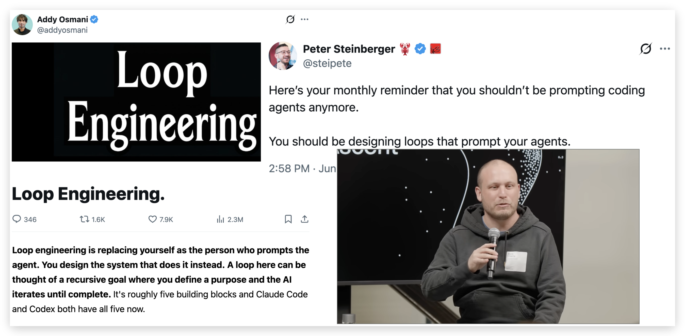{: width="50%" }

[StrongDM 写过他们的"熄灯软件工厂"](https://factory.strongdm.ai)：那里没有人读代码，也没有人写代码。

这个故事大致是这样的：

1. 你是瓶颈。
2. 模型已经足够好了。
3. 代码是免费的。
4. 那就多发布点东西。

OpenAI 的 [Ryan Lopopolo](https://x.com/_lopopolo) [二月在文章里写过这个观点](https://openai.com/index/harness-engineering/)，并且[四月在演讲中介绍了 OpenAI 的软件工厂 Symphony](https://www.youtube.com/watch?v=am_oeAoUhew)。

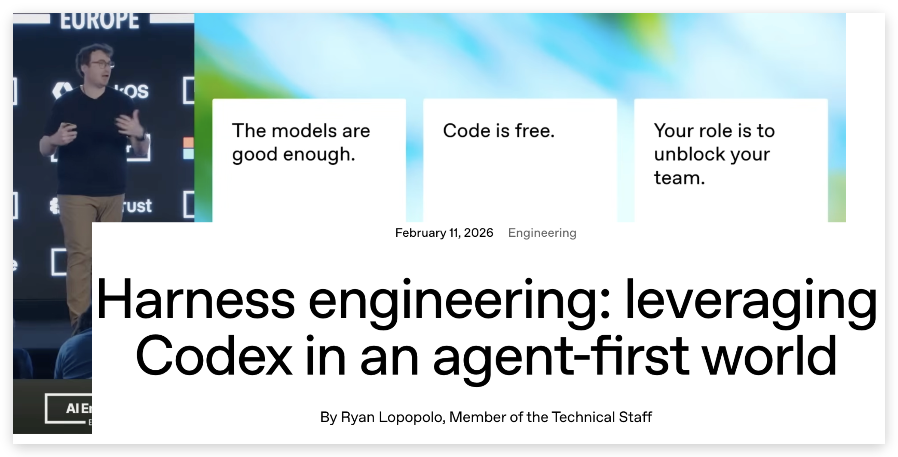{: width="50%" }

这些人确实都聪明得离谱，我非常尊重他们。但最刻薄的说法，是把这又当成了一个往"灌水大炮"里继续注资的借口。

### 进展嘛……就那样

我们的朋友 [Mario](https://x.com/badlogicgames) 在 AI Engineer Europe 大会上站出来[恳求大家慢下来](https://www.youtube.com/watch?v=RjfbvDXpFls)——因为有些本不该因编码智能体出岔子而宕机的公司，正……[因为编码智能体出岔子而宕机](https://www.ft.com/content/00c282de-ed14-4acd-a948-bc8d6bdb339d)。

正如 [Matt Pocock](https://x.com/mattcpocockuk) 所说，[代码库正在以史无前例的速度崩坏](https://www.youtube.com/watch?v=3MP8D-mdheA)。

我一直没能挖到 StrongDM 关于那个"暗黑工厂"到底运行得怎么样有任何定论性的数据或结论。那份[天气报告](https://factory.strongdm.ai/weather-report)在今年的二月到六月之间只有几条零星的更新。**编辑**——[7 月 23 日 Hacker News 上有人和团队聊过](https://news.ycombinator.com/item?id=49026625)——听起来我们可能很快就能看到更正式的更新了！

[Faros AI 的人](https://www.faros.ai/research/ai-acceleration-whiplash)发了一份报告：自从我们[^1b] 大家在一二月用上这些 AI 编码工具以来，Pull Request 的评审质量大幅下滑。

* 评论更多了、评论更长了，而且大量 PR 在没有经过任何评审的情况下就被合并。
* 事故数量大幅上升。
* 每位开发者的 bug 数大幅上升。

| 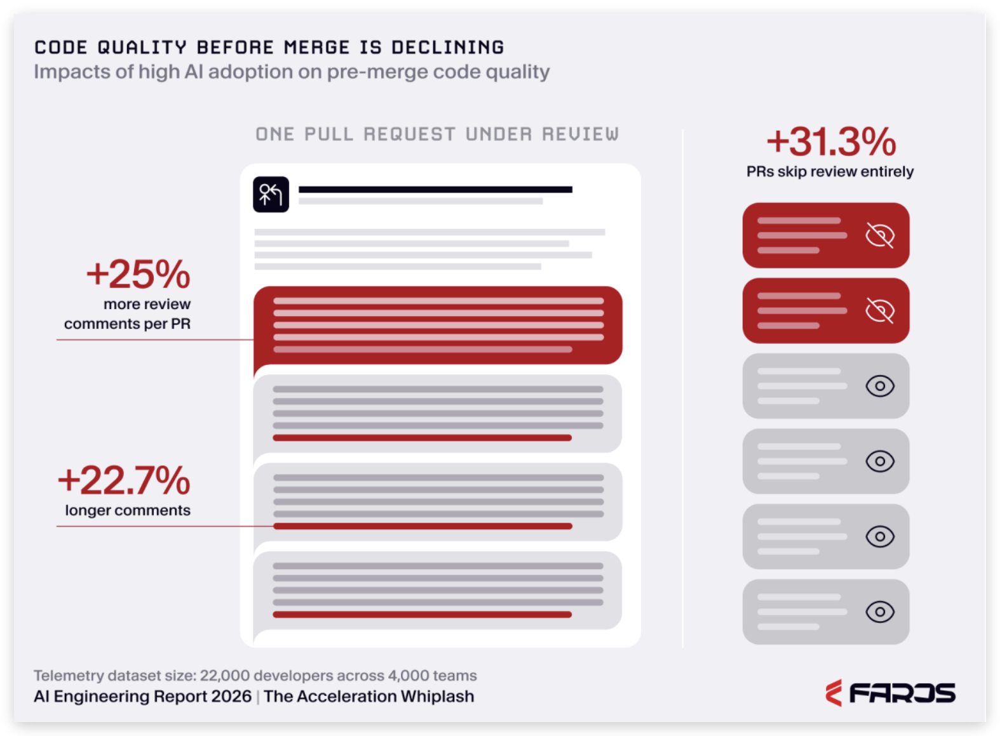 | 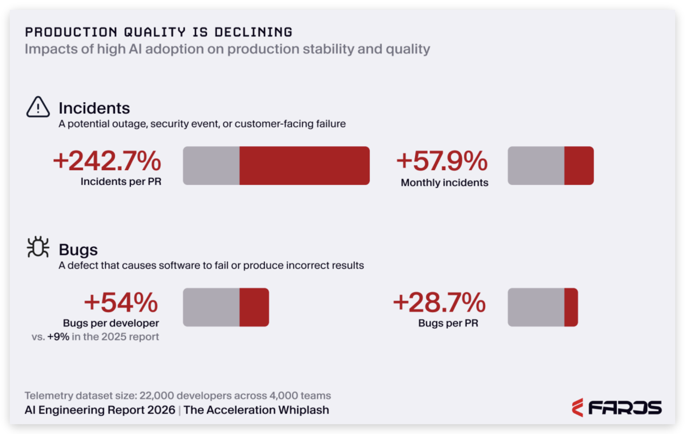 |
|---|---|

这份报告更多是相关性的信号，而非可验证的实锤[^6]；而这篇文章的整个立足点就是要警惕这些"垃圾数据"，但它给我的**感觉**在方向上是对的，这符合我的亲眼所见。

### "是你姿势不对"（其实不是）

很多人会告诉你，这是个"技术问题（skill issue）"——如果你没拿到好结果，那是你自己的锅。

但无论你选择怎么……呃……"握"它，我向你保证，一定会有人告诉你：如果你狂堆 Token（token-maxxing）不奏效，那是你技术不行。你只需要再烧更多 Token，别去读代码就行。如果你觉得自己快上道了，我向你保证这只是成长过程中的一环。[去年夏天我也这么想](https://hlyr.dev/ace)。

不幸的是，出于我的自尊心，我曾就"怎么握得更好"说过的某些蠢话被记录了下来，如今在 YouTube 上累计有了大约一百万的播放量。我在这里绝不是炫耀，我分享这些只是想说明：我**很长一段时间**以来都在深入研究使用编码智能体的最佳方式，并且发现了一些被很多人认为**确实有用**的东西。

| [](https://hlyr.dev/ace) | [](https://hlyr.dev/nva) | [](https://hlyr.dev/qrspi-mlops) |
|---|---|---|
| [面向编码智能体的高级上下文工程](https://hlyr.dev/ace) | [不准靠感觉——在复杂代码库中解决难题](https://hlyr.dev/nva) | [我们关于 RPI 的所有错误认知](https://hlyr.dev/qrspi-mlops) |

总之，我们被迫忍受的网上所有这些"再堆点 Token"的吆喝，其承诺简而言之就是：只要 harness 工程做到位，我们就能两头都占：

- 快 10 到 100 倍，
- 高质量，而且
- 再也没人需要做那个我们都讨厌的东西——代码评审。

我们要做的全部，就是配置更多 linter，再往足够多的 PR 评审机器人上撒一点像"对抗式评审"这样的魔法词，我们的软件就会高高兴兴地自己构建出来，且不会出事故。

## 这根本不是"技术问题"

我想努力说服你的是：无论多少 harness 工程或循环至上（loopsmaxxing），都无法解决一个本质上是模型训练层面的问题。

为了想明白这一点，我不得不深入去了解编码模型到底是怎么训练和评测的——既包括 [RLVR](https://github.com/opendilab/awesome-RLVR)（可验证奖励强化学习）这一侧，也包括基准（benchmark）这一侧。

在这篇文章里，我会依次讲清楚：

1. 软件工厂可以追溯回 1968 年，它是怎么演进的，AI 又如何改变了它
2. 为什么模型能在轻松拿满基准分的同时，吐出成山的垃圾（即便是全新的"前沿"基准）
4. **尽管如此**，你依然可以跑得相当快，而不至于把自己的代码库点着

我想穿过每天冒出来的各种技能插件制造的炒作，以及那场"AI 精神病式狂堆 Token"的建议瘟疫，用概括性的语言谈谈**真正有效的方法**，而不引用任何特定的技能或框架。

**视频版：** 这篇文章基于（并扩展了）[我在 AI Engineer World's Fair 2026 的主题演讲](https://www.youtube.com/watch?v=Ib5GBkD555M)。

_感谢 [@addyosmani](https://x.com/addyosmani)、[@CyrusNewDay](https://x.com/CyrusNewDay)、[@HamelHusain](https://x.com/HamelHusain)、[@zeeg](https://x.com/zeeg)、[@dillon_mulroy](https://x.com/dillon_mulroy)、[@nayshins](https://x.com/nayshins) 和 [@jeffreyhuber](https://x.com/jeffreyhuber) 对本文的反馈。_

## 题外话：这与氛围编程无关

[Addy Osmani](https://x.com/addyosmani/status/2066595308629594363) 把一件事讲得很清楚，值得强调：

> **一个用氛围编程（vibe coding）鼓捣一个最多十几个人会用的边角项目的开发者，和一个为了让一个十年老的企业系统再多撑一个季度而维护它的团队，二者之间几乎没有值得提一嘴的共同约束；而当下流传的大部分建议，不过是这两种人中的一种在教另一种人怎么活。**

如果你喜欢氛围编程，请继续 vibe。我自己也经常 vibe 写很多东西，我只是*也*维护着大量生产级软件（并且通过 HumanLayer，帮上千名其他工程师做同样的事），所以接下来的内容，是面向那些在复杂代码库里解决难题的人。

我经常听到**棕地（brownfield）**这个词来描述这种分野。历史上它指的是某个十年的 Java 老系统，但按我们现在的交付速度，一个由智能体搭建的代码库，似乎在**三到六个月**后就开始吃力——你开始慢下来，而且你添加新东西的方式必须改变。

## 软件工厂简史

我这辈子都在构建和研究软件工厂，但我最近才了解到：这个词最早能追溯到 [1968 年的一场 NATO 会议](http://homepages.cs.ncl.ac.uk/brian.randell/NATO/nato1968.PDF)——也正是那场会议给了我们"软件工程"这个词。

自那以后我觉得最有趣的另一点，是美国国防部写过一份 31 页的 pdf，讲 DoD 需要开始更好地使用 jenkins 之类的东西。

### 2022 年的软件工厂

让我们把"软件工厂"的定义锚定在 2022 年，也就是 AI 之前。在一个典型的软件工厂里：

- **人来决定要构建什么**——工程师、PM、领导层共同推动愿景
- **它进入一个跟踪系统**——Linear、Jira，随便什么：一个记录"需要发生什么"的状态机
- **有人认领一个工单并构建它**——过程中大概会做一些手动/自动测试
- **Pull Request**——自动检查、一个人评审代码，也许有人拉下来测一测
- **有问题？回到"有人构建它"那一步**
- **发布到生产环境**——然后它和用户产生接触
- **加上监控**——有一整个行业专门负责在出问题时凌晨三点呼叫工程师
- **用户抱怨**——提需求、发现 bug、提交功能请求 → 回到团队，加进跟踪系统

而在那之前，我们甚至还没碰到 AI，这张图里就已经有好几个循环了。

### 前置对齐 {#前置对齐}

团队在几十年前就搞明白了一件事：构建要花几个小时或几天，评审也是。

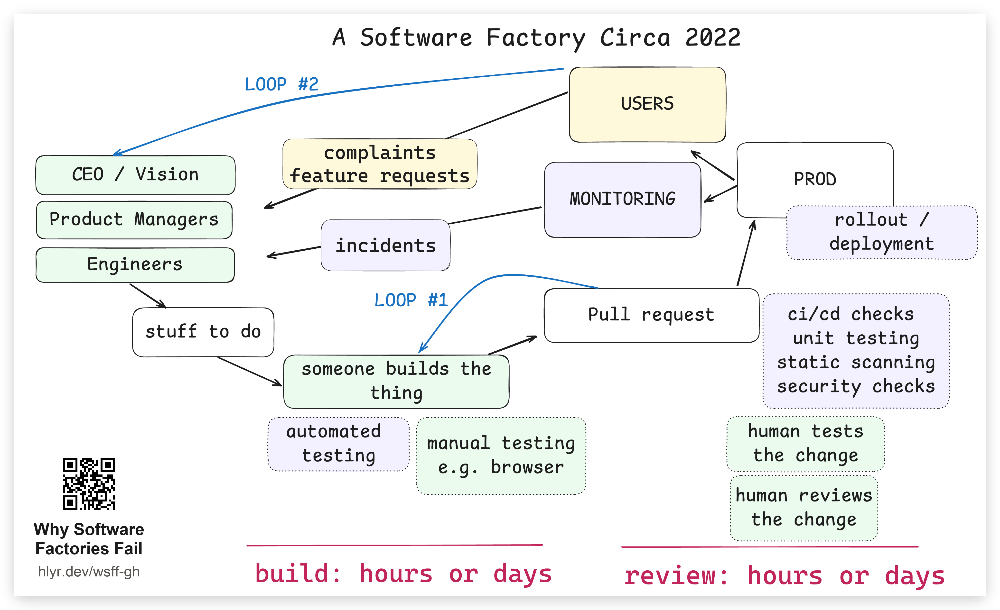{: width="70%" }

所以我们把工作前置——规划、架构提案、迭代规划——作为团队一起完成。这意味着：

- **更少的返工**，因为我们在任何人写代码之前就对齐了
- **更少逐行审查的时间**，如果你读过一份很长但写得很好的 PR，你会知道当代码接近完美时，评审有多快

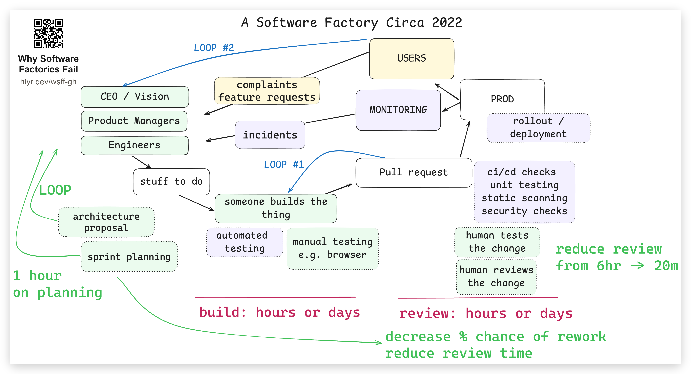{: width="70%" }

我们后面还会回到这一点——先看看当你把智能体式编码引入画面时会发生什么。

### 智能体式软件工厂

现在每家公司——

- [Ramp](https://infoq.com/news/2026/01/ramp-coding-agent-platform/)
- [Stripe](https://stripe.dev/blog/minions-stripes-one-shot-end-to-end-coding-agents)
- [WorkOS](https://workos.com/blog/project-horizon)
- [Brex](https://www.latent.space/p/brex)

——今年大半时间都在解释他们如何搭建了一个能交付约** 75% 代码**的智能体工厂。

智能体式工厂看起来主要就是把**"有人构建它"换成"一个智能体构建它"**——这里还有些别的东西，比如编排（orchestration）、一个 harness、一个沙箱、一个模型、computer use 等等。我不会深入这些细节，因为说真的我读这些已经读吐了，而你肯定也读吐了。

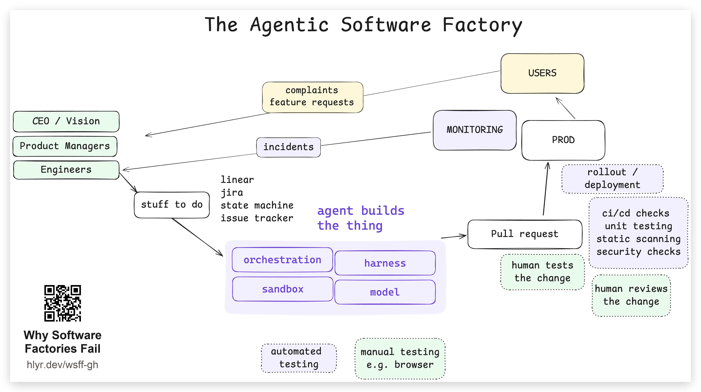{: width="70%" }

当智能体来构建它时：

- 构建从几小时或几天，降到几分钟或几小时。
- 评审仍然要花几小时或几天。还是需要一个人读代码、测试改动。所以现在评审成了瓶颈。

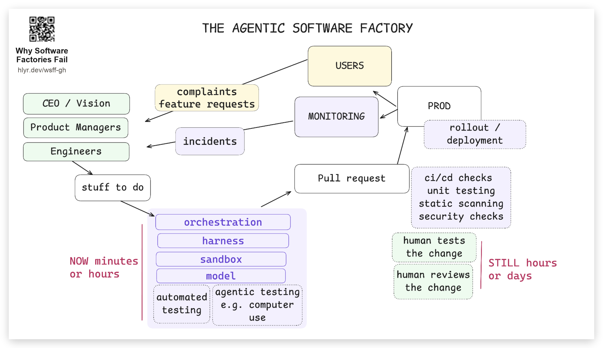{: width="70%" }

于是你也把评审提速：

- 智能体式代码评审，用来抓风格、bug、安全问题。
- 智能体式回归测试，用浏览器和 computer use 从外部去戳它，也许搞定后还给你发一段可爱的小视频。

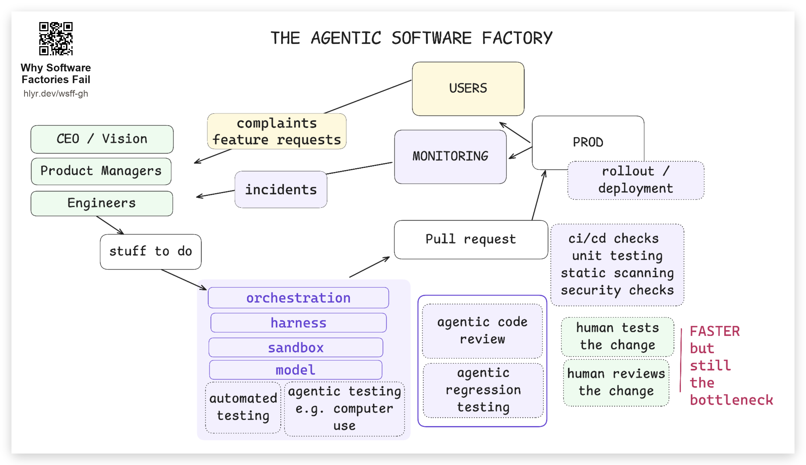{: width="70%" }

评审现在更快了，但它很可能依然是瓶颈。但我们可以加更多循环。

接下来你可能把事故也路由进工厂。与其凌晨三点呼叫某人，不如让他醒来时已经有一个也许已经修好问题的 PR 在等着。

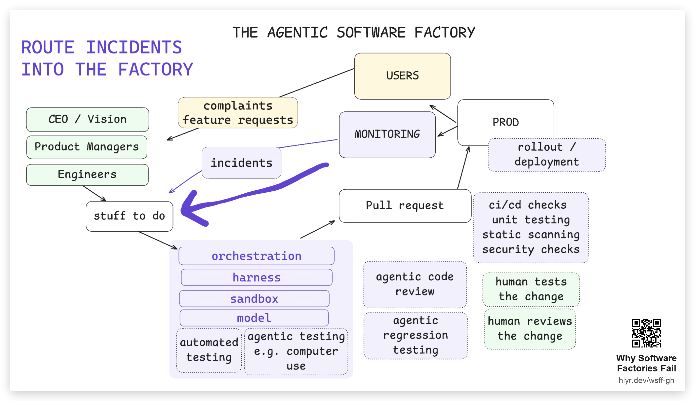{: width="70%" }

我们也可以把用户反馈路由进工厂。人们提需求，它就构建出来。

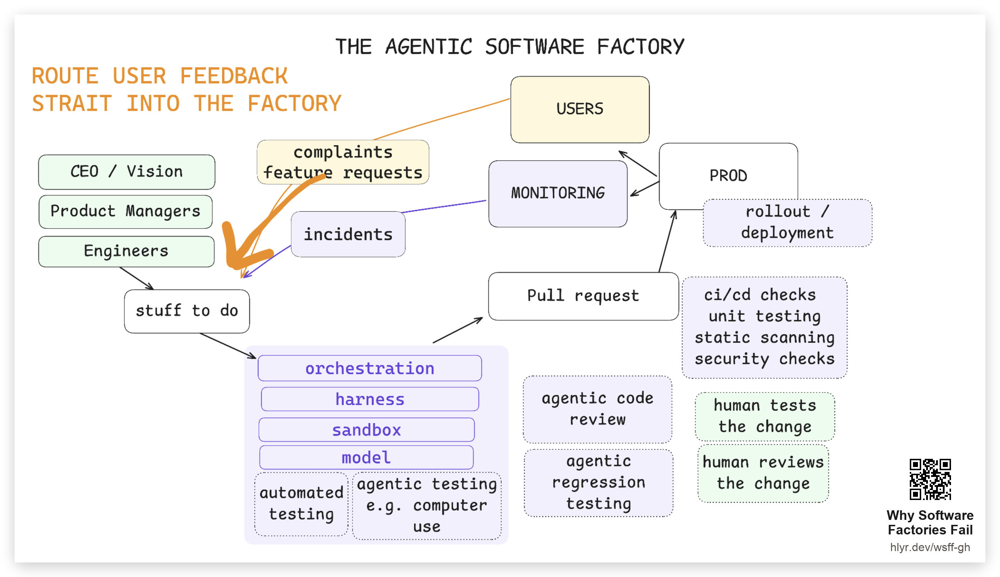{: width="70%" }

到了这一步，工作就剩两个问题：你能往队列里塞多少东西，以及你能多快评审和测试出来的东西？

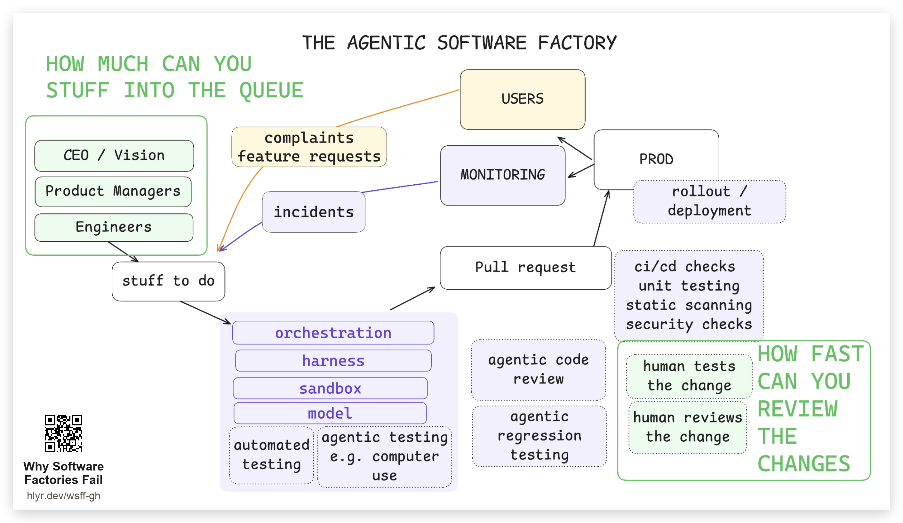{: width="70%" }

这就把我们引到了熄灯软件工厂。

### 熄灯软件工厂

[Dan Shapiro 创造了这个词](https://www.danshapiro.com/blog/2026/01/the-five-levels-from-spicy-autocomplete-to-the-software-factory/)，[Simon Willison 写过 StrongDM 对它的实现](https://simonwillison.net/2026/Feb/7/software-factory/)——在那里我们不再读代码。

你看着你漂亮的软件工厂。它被那个烦人的代码评审步骤给毁了，于是你说：你知道嘛，那个让一个人读每个改动的东西？不要了。

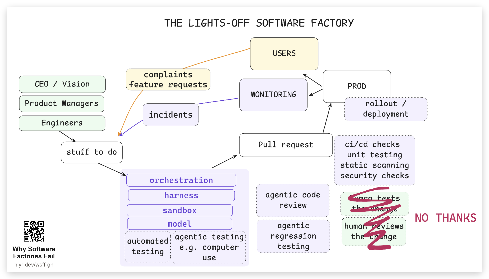{: width="70%" }

于是你把它去掉，把精力投到别处：

- 投资测试，让智能体测试它自己的工作
- 投资沙箱和编排
- 投资自动化评审
- 投资监控
- 投资发布
- 投资从用户那里收集反馈信号

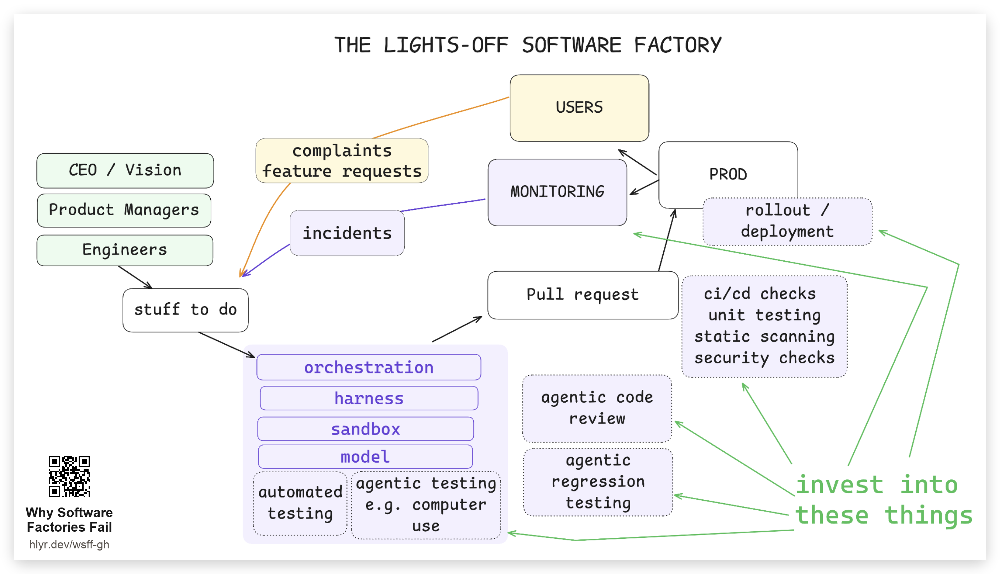{: width="70%" }

现在工作真的只剩一个问题：我们能要求智能体构建多少东西？我们想[煮干多少大海](https://garryslist.org/posts/boil-the-ocean)？

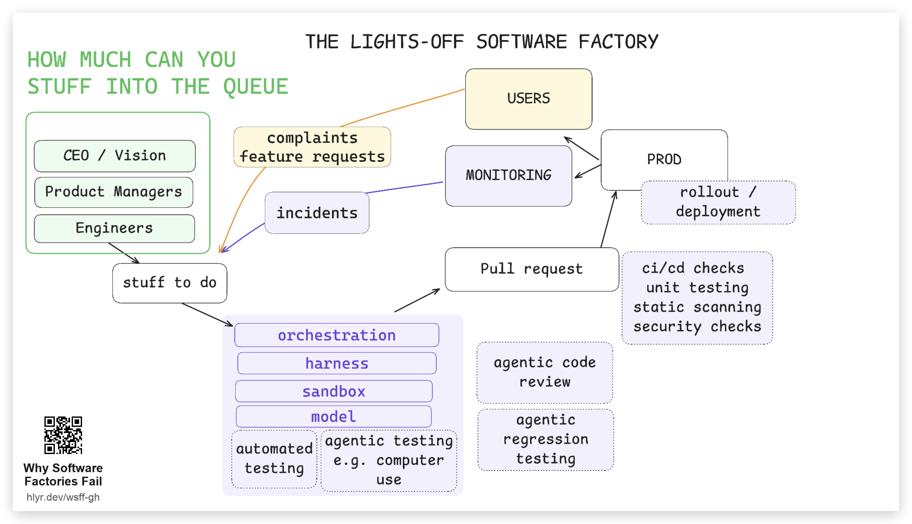{: width="70%" }

## 一切都会很顺利（并没有）

我要提出一个可能有争议的观点：熄灯工厂行不通。

下面来讲讲软件工厂为什么会失败。

## 我们试过了

2025 年 7 月，我们全面转向了熄灯模式。只读规格和工单，所有中小活儿都扔给后台智能体，全套。

如果你认真试过几个月，你已经知道结局了。你会遇到至少一个难搞到智能体解决不了的问题——哪怕用上你最先进的 Prompt 和工作流。

- 你做深度、带上下文的研究，把正确的部分汇总到"智能区"让模型分析
- 你让智能体用 10 种不同的方式尝试复现

最终你不得不认命，去翻三个月前你就不读了的那个代码库，试图搞清楚哪里坏了。

而与此同时：

- 你的站点挂了。
- 你的用户怒了。
- 而你，如果你和我差不多，会很痛苦——读着你放任流进系统的所有垃圾代码。

第一次发生这种事时，我没当回事。尽管我刚花了将近两周在 Claude 的意面代码里刨来刨去，"冒险的下行风险抵得上那点速度"嘛。等到 11 月大概第三次发生时，我们认定与其这样不如重写，我的联合创始人花了**整整两周**在 VS Code 里（连 Cursor 都没用）手动把所有的模式敲了出来。

## 模型会随时间推移拉低代码库质量

我想说清楚的是：模型有一个短板。它们无法随时间维护并提升代码库质量——除非有相当多的人工引导。[^3]

我说"可维护性（maintainability）"，指的是那个具体的东西：当你想改动代码库的某一处，却极难不破坏另一处。这就是 [Martin Fowler 说的"霰弹式修改（shotgun surgery）"](https://refactoring.guru/smells/shotgun-surgery)。

关于可维护性我不会说太多。这方面有很多书你可以去读：

- [John Ousterhout 的《A Philosophy of Software Design》](https://web.stanford.edu/~ouster/cgi-bin/aposd.php)
- [Robert C. Martin 的《Clean Code》](https://www.oreilly.com/library/view/clean-code-a/9780136083238/)
- [Martin Fowler 的《Refactoring》](https://martinfowler.com/books/refactoring.html)

那么，为什么模型*做不到*软件可维护性？

### "但模型从那以后肯定变强了吧"

到这里你大概迫不及待想说：*可是 Dex，模型从七月以来肯定强多了吧*

确实强了——某些方面。另一些方面基本没变。

- 解决一次性问题，或者给新营销页做氛围编程？是的，强太多了。
- 随时间提升代码库质量？据我所知，没强多少。

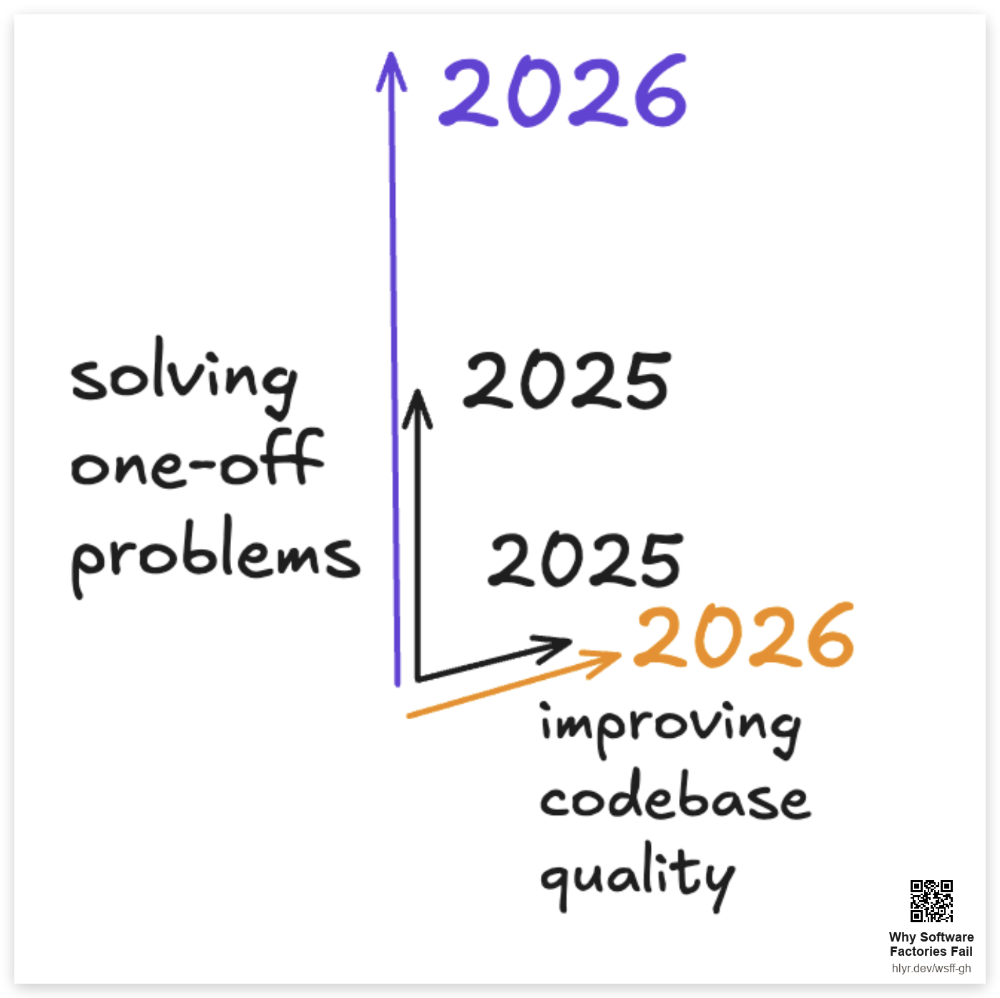{: height="380" }

我没法证明这一点。你也证明不了。目前还没有衡量模型"维护代码库质量"能力的好基准。（关于它在往哪走，后面再说。）

> **目前根本没有衡量模型"维护代码库质量"能力的好基准**

但如果你和编码智能体打过一阵交道——而且很多人正在发帖讲的就是这个——你大概已经有那个感觉了：它们倾向于随着时间把事情搞得更糟，让代码库更难在其中工作。

所以为了搞清*为什么*会这样，我想把镜头拉远，回到第一个伟大的编码智能体。

### Claude Code 之所以胜出，是因为在 harness 内部做了强化学习

Claude Code 在不到一年里，收入从零干到了约 40 亿美元——如今大概有 90 亿美元的量级。

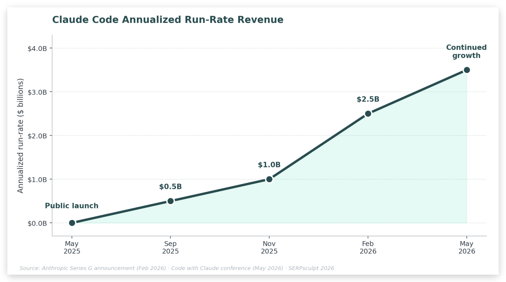{: width="70%" }

这有点疯狂，因为当时已经有很多很好的 CLI 智能体了。[aider](https://aider.chat)、[cline](https://cline.bot)、[codebuff](https://codebuff.com)——都早于 Claude Code，都内置了相当棒的上下文工程，都带着你可能归功于 Claude Code 的那套相同工具集：read、write、edit、grep、bash。我用过它们。它们很好。但工具调用有时候就是会……失败——你会看着它在同一个 edit 上扑腾三次，然后自己把编辑器打开动手做。

[2024 年的 SWE-Agent 论文](https://arxiv.org/abs/2405.15793) 阐述了工具形态上的微小变动会带来明显的差异，比如：在 ReadFile 的结果里带上行号，或者把一个 Edit 工具从"查找/替换"改成"按行范围编辑"。

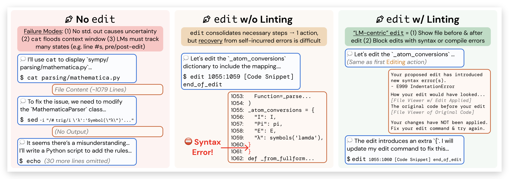{: width="70%" }

然后 Claude Code 发布，并很快直线起飞。你可以把它归结为分发渠道，但公认的解释是：Claude Code 胜出是因为它更好，而它更好是因为 Anthropic 在**harness 内部**对模型做了强化学习（RL）——这是实验室第一次针对它们将要发布的、一模一样的工具去训练模型。于是它在智能体循环里调用那些工具变得**极其**擅长。

反复调整工具定义和评测、直到找到模型最喜欢的形态，是一回事——我为了各种用例在这上面烧过几周。当你拥有权重、并能**直接修改模型本身**让它更擅长某套工具时，那就是另一场游戏了。

OpenAI 团队[在十一月的一场演讲](https://www.youtube.com/watch?v=wVl6ZjELpBk)把这话说得很到位：如果你搭了个 harness，却不拥有权重、无法在它内部对模型做 RL，你就永远比不上同时拥有这两样的团队。

### 用 60 秒看懂编码智能体的强化学习

我在这个话题上做了一堆研究，还捣鼓了一堆可视化想解释其中要紧的部分，但我发现 [Calvin French-Owen](https://x.com/calvinfo)（Codex 团队 MTS，Segment 创始人）在 [AI Council](https://www.youtube.com/watch?v=q-ntX4DLW_c) 上的演讲做得更干净漂亮，所以我就放一段受他幻灯片启发的动画在这里：

[▶ 观看演示视频](https://github.com/user-attachments/assets/25c45e29-ebf7-4ce7-9b57-969cdf305e2e)

要让一个模型更擅长编码，你要做的是：

1. 生成一些编码智能体的轨迹（trace）去解决一个问题（比如：修好我的测试）
2. 依据某些标准（验证器 verifier）给这些轨迹打分
3. 更新模型权重，让好的轨迹更可能出现，坏的轨迹更不可能出现

然后你在几周或几个月里把这个循环做上百万次。

不过这些打分环节，往往会随意到只有一维。

### 糟糕的设计没有代价

以 [SWE-bench Multilingual](https://huggingface.co/datasets/SWE-bench/SWE-bench_Multilingual) 为例。任务很小——每个大约十五分钟工作量——是从 Redis、jq、Django 这样的开源仓库里扒出来的。奖励（reward）是基于下面两条的一或零：

- `FAIL_TO_PASS`——你修好了让你去修的那个东西吗？
- `PASS_TO_PASS`——你修的时候有没有顺手弄坏别的？

这是一个真实的例子，`fastlane__fastlane-19304`，来自 [fastlane](https://github.com/fastlane/fastlane)——一个 Ruby 项目。它的 zip action 拿了俩可选参数，并立刻对其调用 `.empty?`，所以一旦你不传 `include` 和 `exclude`，它就崩：

```
'zip_command': undefined method 'empty?' for nil:NilClass
```

关闭这个问题的那个人类修复只有两行（把 nil 默认成空数组）：

```diff
# fastlane/lib/fastlane/actions/zip.rb
-      @include = params[:include]
-      @exclude = params[:exclude]
+      @include = params[:include] || []
+      @exclude = params[:exclude] || []
```

在评测过程中，模型：

1. 从一个**基础提交（base commit）**出发——也就是仓库被检出到那个修复落地前的那一刻
2. 拿到 bug 报告——这里就是 `'zip_command': undefined method 'empty?' for nil:NilClass`

智能体据此去写一些代码。它看不到黄金补丁（golden patch），也看不到作为评分者的**测试补丁（test patch）**：

```diff
# fastlane/spec/actions_specs/zip_spec.rb
+  it "sets default values for optional include and exclude parameters" do
+    params = { path: "Test.app" }
+    action = Fastlane::Actions::ZipAction::Runner.new(params)
+    expect(action.include).to eq([])
+    expect(action.exclude).to eq([])
+  end
```

然后：

1. 我们保留它产出的任何补丁，然后
2. 丢掉它对测试文件做的任何编辑（我们抓到过模型悄悄注释掉失败的测试，或者塞一个让测试变得无用的 mock）
3. 把基准的测试补丁叠加上去，然后
4. 跑整套测试：已有的 zip 测试（`PASS_TO_PASS`）加上新的那一个（`FAIL_TO_PASS`），看它们是否都通过

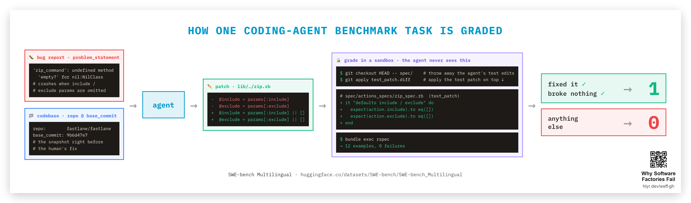

**题外话**——基准不是验证器——事实上它们必须彼此隔离（别在测试集上训练，等等等等）——我主要想借此传达"评判一条编码智能体轨迹质量"的形态及其局限。

模型是怎么得到正确答案的，无关紧要。只要测试通过，我们就赢了，但侵蚀代码库可维护性这件事，**没有任何代价**。

> **侵蚀代码库可维护性，没有任何代价**

这就是为什么你会看到到处都是 try/catch：

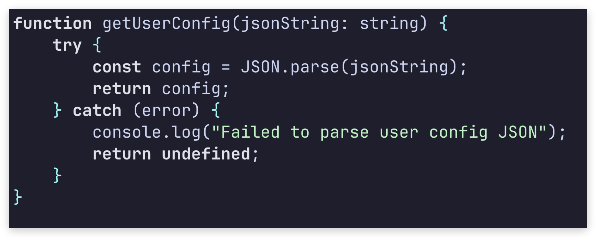{: width="50%" }

以及偷懒的类型强转，把用类型系统本应获得的好处整个架空：

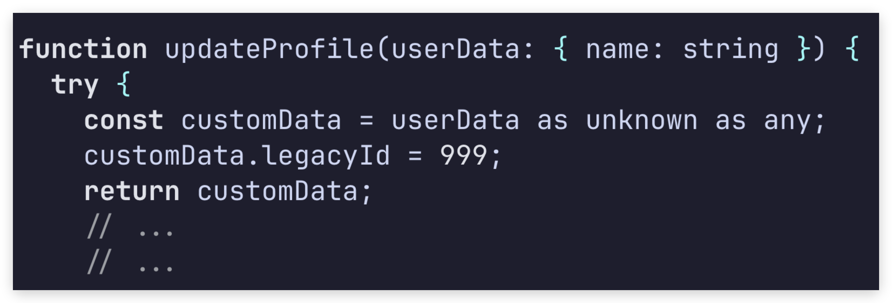{: width="50%" }

## 验证质量比"测试是否通过"难上数个数量级

跑测试能在大约几秒内给你一个干净的通过或失败。这就是为什么 RL 能跑上百万次循环去优化每一次模型生成。

但糟糕架构的代价函数，是用几周、几个月、甚至几年来衡量的。它发生在第一次有人为了一个一行改动而打开那个文件，却发现没法一行改完的时候——有人把它 vibe 得太猛了，现在我们必须对十一个地方做同样的改动，并祈祷不会在三个文件之外悄悄弄坏什么。

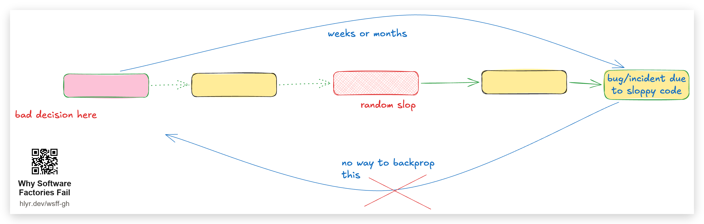{: width="70%" }

> **测试在几秒内给你反馈，但糟糕架构的代价函数是用几周、几个月、甚至几年来衡量的**

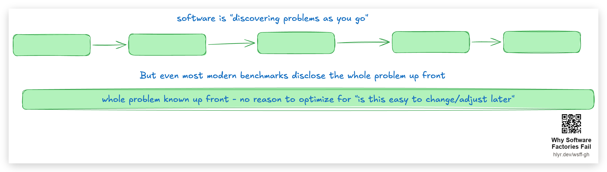{: width="70%" }

糟糕的设计，是当今基准唯一没法评的东西。我知道，我知道，RL ≠ 基准，但如果这能在 RL 里被解决，我相当确信它也会开始体现在我们基准的设计方式上。

无论如何，我个人不信任当今任何基准上的改进，把它们当作"模型突然善于不往你代码库里灌垃圾"的指标。

## 前沿模型在变好，只是很慢

当然，很多聪明人在做这件事。我的观点不是它做不到，而是[炒作跑到了纪律前面](https://www.youtube.com/watch?v=c35YoMdnI78)。

我觉得方向对的几个努力：

- [SWE-Marathon](https://www.swe-marathon.org/)（Abundant AI）：约 400 小时的任务，比如"把整个 Excel 克隆出来，每个功能都要"——用的是复合奖励通道，而非单个通过/失败位
- [DeepSWE](https://deepswe.datacurve.ai/blog/deepswe)（Datacurve）：在真实世界里从未真正构建过的 OSS 仓库上的大任务，因此从构造上就不可能已经躺在训练集里（解决了污染问题，但没解决质量问题）
- [Frontier Code](https://cognition.com/blog/frontier-code)（Cognition）：多 PR 任务，以及一个很巧妙的确定性评估质量的做法——它惩罚模型写出在补丁前代码上不会失败的测试（如果你从没听过[变异测试](https://en.wikipedia.org/wiki/Mutation_testing)，那你有段好玩的旅程在前面等着你[^5]）。它还**在 diff 上跑一个评判模型（judge model）来检查代码质量规则**。

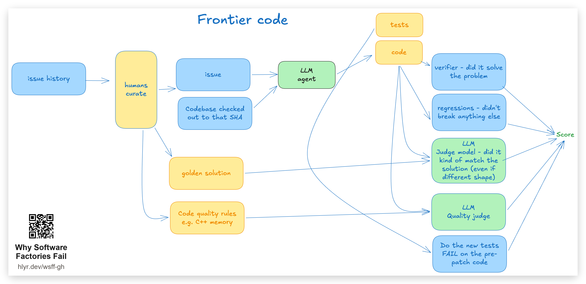{: width="70%" }

但一个模型能评判质量，也就到这了。

事实上，不难想象：如果一个模型能可靠地区分好代码和坏代码，它一开始可能就写出好的那个版本了。RL 需要一个快速且可靠的预言机（oracle），而可维护性我们还没有这样的预言机。

> **如果一个模型能可靠区分好代码和坏代码，它一开始可能就写出好的那个版本了；但可维护性没有快速的预言机，所以我们无法在 RL 期间为它给奖励**

当然，更多的评审智能体和更多的 Token 确实有帮助——它们抬高了下限，能抓住那些蠢错误。

但它们抬不高上限，因为上限就是我们在 RL 里设法教给模型的那些东西，而好的设计，正是我们还不知道怎么教它的东西。

所以我仍然不会拿我的代码库去赌其中任何一个。但它们是我见过的第一批甚至试图去给可维护性打分、而不只是停在通过/失败的评测。

**题外话** 也许未来的某个模型直接就懂了，我们就能停手。如果你想一直 yolo 式地 Prompt 到 GPT-7 发布再看结果，请便——但管它什么苦涩的教训，我们现在就有问题要解，而我会讲讲我们是怎么做的。

## 把灯重新打开

眼下，裁判是你——所以我们要把代码评审放回来：

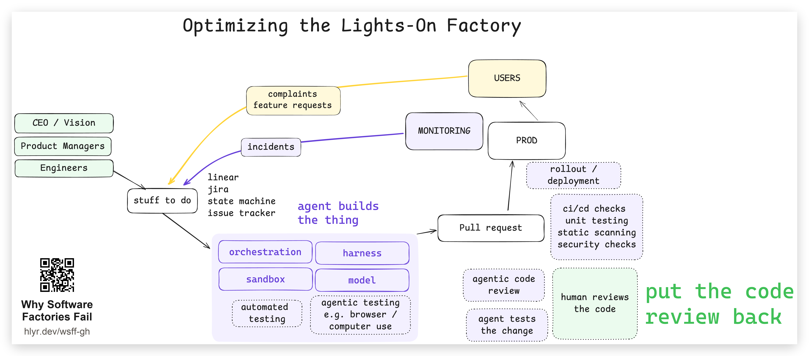{: width="70%" }

我们要重新拥抱 AI 之前就一直在做的那件事，也就是做一点[前置对齐](#前置对齐)，来降低出现漫长而艰难的评审的几率。

我们要找杠杆，并且要用 AI 来帮我们做这件事，跨越 4 个阶段：

- 产品需求（Product Requirements）
- 系统架构（System Architecture）
- 程序设计（Program Design）
- 垂直切片（Vertical Slices）

### 产品评审

一切都从产品评审开始：一份简短的文档，钉死我们*在构建什么*以及*为什么*。目标是把两句话或一段长长的语音碎碎念，变成某种半结构化的东西。

首先，我们在**要解决的问题**上对齐——真正的用户痛点，用用户自己的话。其次，**成功长什么样**——发布之后我们能读到什么，来判定这件事值得做。理想情况下这是个用户层面的结果，比如"能用更少时间完成 XYZ 工作流"，或者"更早到达上手里程碑 ABC"。有时它更底层，比如某个错误率或延迟数字，有时仅仅是"关于 X 的支持工单停了"。

我们尽量让这东西牢牢扎根在产品空间，而非技术空间。作为一个一只脚在产品的世界、一只脚在技术世界的人，我经常发现自己会飘进技术细节。这时候，我会尽量把它记下来留到后面阶段，回到用户实际体验到什么。如果技术决策卡住了产品决策，那我们就把已有的定下来，进入架构，或者做更多[关于可行性的原型研究](https://www.youtube.com/watch?v=Zx_GOhGik0o)。

而既然这大多是关于用户看到什么，我不去描述它——我画个模型出来。一个真实的、粗糙的 HTML 模型，能终结一场三段话只会拖长的争论。

这是一份进行中的真实例子——文档用一个 JSON 大纲钉住功能，然后是两张真实屏幕的粗糙 HTML 模型（点击放大）：

| 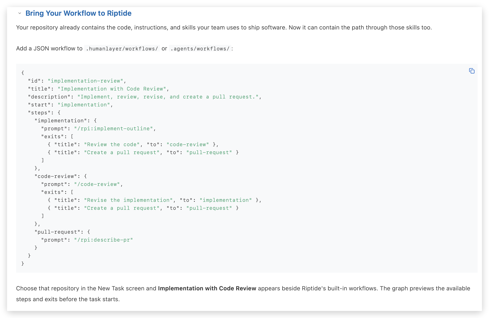 | 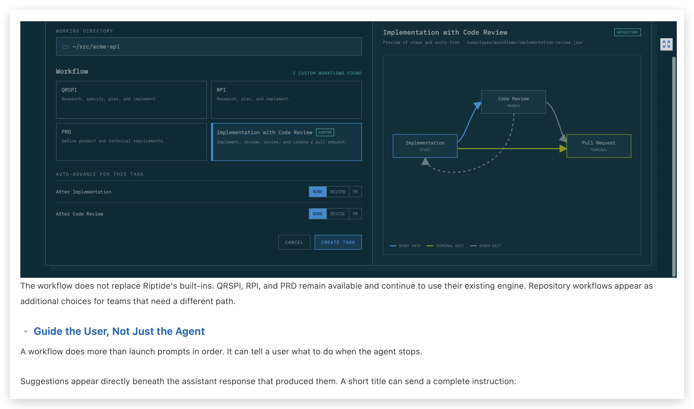 | 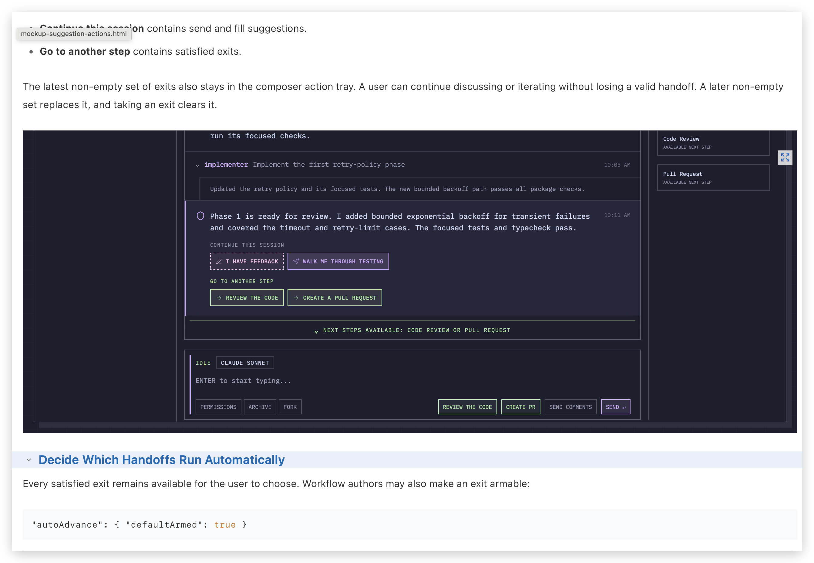 |
|---|---|---|

当然，不是所有东西都要做产品评审。一次文案微调、一个一次性的脚本、一个复现明显的 bug——这些我们仍然直接丢给智能体一把过。这是给那些"智能体误解我们意图代价很高"的改动用的。

对于本文以及该系列的所有文档，我们都做"作者选择加入"的评审。如果你想在评审时省时间，就挑那个本来会评审 PR 的人，和他一起过一遍产品/技术规格，要么异步地通过文档评论（我们用自己的 HumanLayer 做这个，但你同样可以轻松地在 GitHub/Notion/Plannotator 等里做）。

### 系统架构

产品评审定下来后，我们做系统架构。这倒不算新鲜，连氛围编程的人也开始 swear by 它了。

> **如果你想在评审时省时间，就挑那个本来会评审 PR 的人，在写代码之前和他一起过一遍产品/技术规格**

在这个阶段，我们对服务、端点、schema、队列和存储之间如何对话达成一致，而不陷进[程序设计](#程序设计)的细节。为了最大化人↔智能体的通信带宽，我们在这里重度使用可视化——比如时序图：

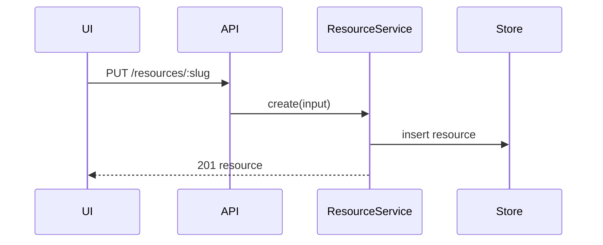
```mermaid
sequenceDiagram
  participant UI
  participant API
  participant ResourceService
  participant Store
  UI->>API: PUT /resources/:slug
  API->>ResourceService: create(input)
  ResourceService->>Store: insert resource
  ResourceService-->>UI: 201 resource
```

约定 / 端点形态：

```text
PUT /api/resources/:slug
  request:  { destination: string }
  response: { resource: Resource }
```

数据模型与转换：

```sql
-- new tables
CREATE TABLE resource (
  slug         TEXT PRIMARY KEY,
  destination  TEXT NOT NULL,
  created_at   TIMESTAMPTZ NOT NULL DEFAULT now()
);

-- new query shapes
-- SELECT ... FROM ...
```

Mermaid 在这里没问题，但它有时过度，有时会把你骗进一种"我们已经对齐了"的虚假安全感。架构的杠杆相当高，而且有很多潜在的、糟糕的模型习惯能在这个阶段被提前拦下。但它不足以产出高质量代码。为此我们需要**程序设计**。

### 程序设计 {#程序设计}

架构之后，我们要做一件我认为在智能体式编码中被可耻地低估了的事：**程序设计（program design）**。

多数人假设：只要架构对了，模型就能直接开做。你可以这么做，但你可能不会喜欢拿回来的东西。

但我看到的奏效方式是：在任何一个人（人或智能体）写实现之前，我们从架构再下一层，进入**代码的形态**：类型、方法签名、程序布局，以及调用栈。

我们第一版的程序设计技能很烂。难读，累人。我们试过 mermaid，它有其位置，但我们**真正喜欢**的，是用伪代码做的轻量可视化：

**调用栈树**，用于任何编排或控制流的改动。当有意思的部分是"正在变化的东西"时，用 diff 语法：

```diff
 entrypoint
   runCommand
+    handleCreateResource
+      ResourceClient.create(input)
+        POST /resources
+      renderResult
-    legacyCreateFlow
```

[Dillon Mulroy](https://x.com/dillon_mulroy/status/2059985696148849025) 谈过把调用图作为他规划过程的一部分，我认为那完全正确。

[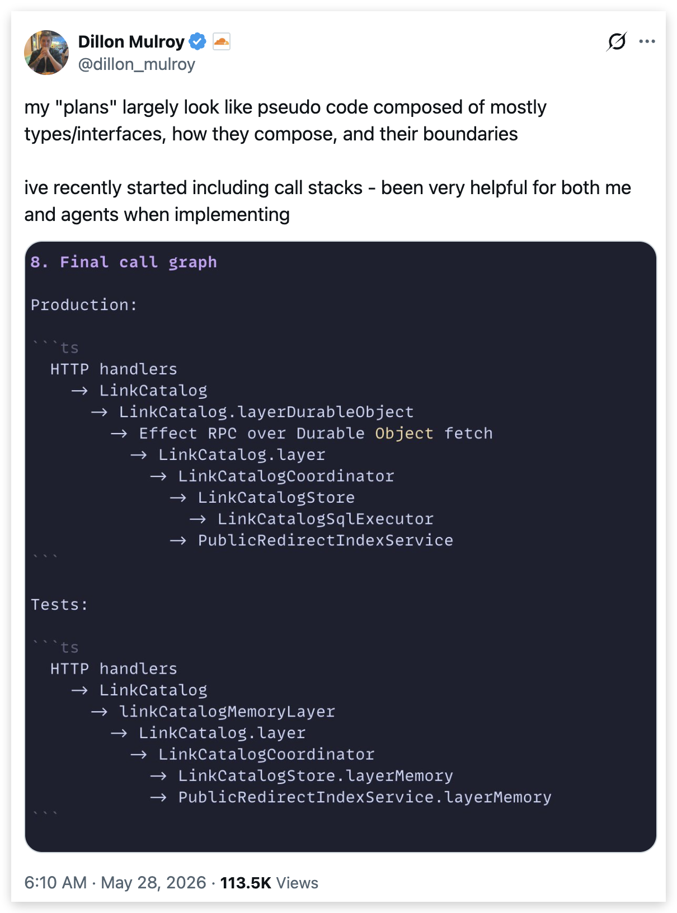](https://x.com/dillon_mulroy/status/2059985696148849025){: height="380" }

**文件树 diff**——这样你就能和代码库的布局、以及东西放在哪保持联系：

```diff
 src
 └── resource
+    ├── resource-client.ts      # NEW - wraps API contract calls
+    ├── resource-client.test.ts # NEW - covers request/response mapping
~    └── resource-route.ts       # MODIFIED - wires create action into UI
```

**关键新函数的类型和方法签名**——那些对架构文档来说太内部、但智能体仍可能搞错的东西：

```ts
interface Item {
  id: ItemId
  parentId: ItemId | null
  // ...
}

interface Cursor {
  position: ItemId
  direction: 'up' | 'down'
  // ...
}

resolveTarget(items: Item[], cursor: Cursor) -> ItemId | null
```

这些没有哪个要花很久去产出（模型起草，你来跟它争），而它们都是一些决定——否则你会在代码评审时隐式地去做它们——而那时改主意是最贵的。

### 垂直切片

接下来我们喜欢做我称之为"垂直切片（vertical slices）"的东西——Matt Pocock 和我在 [2026 年一月的直播里聊过垂直切片或"示踪子弹（tracer bullets）"](https://www.youtube.com/live/NKu3T9FUjmU?si=6BGnZLOkmuIPTjzh&t=2230)——它也被称作[示踪子弹](https://basecamp.com/shapeup/3.2-chapter-11#integrate-one-slice)。

模型喜欢我所谓的"水平计划（horizontal plans）"——按技术栈顺序做事：

1. 数据库迁移（Database Migrations）
2. 服务层（Service Layer）
3. API
4. 前端

[▶ 观看演示视频](https://github.com/user-attachments/assets/f9cf7cb7-3baf-48e2-a5dc-59b5fffab614)

实践中，这意味着你在做的过程中没有真正的方式去"触碰"这个方案。你可以用代码测试东西，但对我构建过的几乎任何功能来说，读测试只是个开始，而在浏览器里拉起点东西、或者边做边用 curl 打它，一直是我工作流里频繁的一部分。

在 AI 之前，任何人在不中途检查一下**某些东西**的情况下，写出 2000+ 行甚至 500 行代码，都是罕见的。

我花了一阵才注意到我习惯的不同——在 AI 之前写代码时，我总是从中间开始，向外扩展。大致是：

1. 创建 API 约定并服务 mock 数据，用 curl 测试
2. 创建前端来消费 mock 数据，在浏览器里迭代+打磨
3. 把 API 接到服务层（服务层服务 mock 数据/行为）
4. 加数据库迁移，把服务层接到数据库
5. 加一堆业务逻辑
6. 加一堆错误处理

而每一步我都在测试/迭代/打磨。

[▶ 观看演示视频](https://github.com/user-attachments/assets/62e73eb1-1298-4684-8308-12ab87c21654)

如果我很在意某段代码，或者怀疑模型在这一块代码库里干好活的能力，我每一步也会审查代码。检查 100–200 行然后重新引导方向，要便宜得多。

多数前沿模型在没有人工引导的情况下，不会设计出这样的计划；而且这很难按代码库甚至按任务去泛化，所以我倾向于在这里保持人在回路（in the loop）。相信我。如果我能[把思考外包](https://www.arthropod.software/p/vibe-coding-our-way-to-disaster#:~:text=The%20methodology%20I%27ve%20outlined%20goes%20beyond%20productivity%20with%20AI%20tools.%20At%20its%20core%2C%20it%20maintains%20the%20discipline%20and%20thoughtfulness%20that%20creates%20maintainable%2C%20understandable%20systems.%20It%20recognizes%20that%20the%20hard%20work%20of%20thinking%20can%27t%20be%20outsourced%20to%20AI%2C%20only%20amplified%20by%20it.)出去，我早就这么做了。

### 30 分钟规划，省下数小时审查

于是我们有一些步骤，我认为如果要维持接近人类的质量、而不必事后在一堆垃圾代码里刨着清理，人类就必须待在回路里。

1. 产品设计（Product Design）
2. 系统架构（System Architecture）
3. 程序设计（Program Design）
4. 垂直切片（Vertical Slices）

显然我们不会对所有发布的东西都走整套流程（见后面的 80/20 法则）。我猜分布大致是：

- 约 40% 的任务是一把过，或者一把过 + 1–2 轮轻量反馈
- 中等任务，我们把产品/系统设计都放在同一份计划文档里，不费心把工作拆成阶段
- 大东西，我们做全部分步。对于像大型重构这样没有意义的情况，我们会跳过产品部分

而大多数情况下，我会派一个模型一次做 1–3 个切片，并边做边审查。无论是对内部实现还是实际功能，早点重新引导方向，都比在 2000+ 行代码的对岸、完全不知道哪里坏了要容易得多。

## 你可能觉得自己 Pull Request 太多了

你不是 PR 太多。你是坏 PR 太多了。

早在 AI 之前，我们都评审过大量需要返工的 PR。

但一个出色的 PR 评审起来是一种享受。你滚动浏览每个文件，代码干净，遵循着你关于软件该怎么写的所有决定/讨论/来之不易的观点。

另一方面，如果一个 Pull Request 哪怕需要 20% 的返工（这已经很宽容了，我会说大多数 AI 一把过的 PR 更接近 50%），那对提交者**和**评审者都是一种**智力负担**和**情绪负担**。（即便提交者是 AI，多半也有人发起了这项工作、或者 vibe 打磨过 AI 的结果，或者至少，关心结果。）

为了省你的时间（我们快到结尾了），我在一条支线里更啰嗦地聊过这个：["时间都去哪了"](https://github.com/humanlayer/advanced-context-engineering-for-coding-agents/blob/main/side-quests/where-does-the-time-go.md)

## 约束理论（2026 版）

很容易对这里的核心理念感到有点丧气："眼下我们被困在读代码这件事里"。

我曾为一个世界兴奋过：我们只要提需求、让模型开做、不读代码，就能得到漂亮的生产级软件，它随时间演进、不会变烂。

但我在这里尽力铺陈的，无非是一些约束。模型擅长某些事，不那么擅长另一些。你该如何在这些约束下优化你的流程？

> **模型擅长某些事，不那么擅长另一些。你该如何在这些约束下优化你的流程？**

有可能你太忙着试图快 10–100 倍、并试图说服自己代码质量不再重要了，而其实你可以拥抱这些约束，安全地快 2–3 倍。

我这种收尾建议，大体上是：

1. 摸清这些约束，通过大量和模型共事来培养直觉
2. 在这些约束的场域内优化系统
3. 寻找杠杆
4. 去读那该死的代码

就这些。如果你想留下来听推销，继续往下滚吧。我希望这能帮你避开灾难，或者至少，你看那些可爱的小动画时玩得开心。

**感谢阅读**

🫡 -dex

* * *

### 后记：我们对此着迷

我们在做 [humanlayer.com](https://humanlayer.com?utm_source=wsff)，一个智能体式 IDE 与协作平台，帮你在维持人类（或非常接近人类）级别的代码质量的同时，快 2–3 倍。

我们朝着两个想法努力："你软件工厂的积木"，以及"更好的、用于软件可维护性的验证器"（也许还有更好的模型）。

HumanLayer 对最多 3 人的小团队免费，如果你想帮忙上手，可以来我们的 [discord](https://hlyr.dev/discord) 待着，或者给我们写信 [founders@humanlayer.dev](mailto:founders@humanlayer.dev)。

如果你想了解更多，我基本会对此喋喋不休，所以你可以在下面找到本文的所有链接，以及把这份材料投到播客、长版白板等的几个其他投影。

### 补充：其他资源

播客与文章：

- [Dex 和 Gergely 在 The Pragmatic Engineer 上聊上下文工程和软件工厂 - 2026 年 7 月](https://www.youtube.com/watch?v=Usufn8IQJgw)
- [Dex 和 Matt Pocock 聊常青的 AI 编码建议（以及 ralph 循环）- 2026 年 1 月](https://www.youtube.com/watch?v=NKu3T9FUjmU)

AI That Works 系列节目：

- [基准证明不了任何事](https://www.youtube.com/watch?v=X5mI1ZVxaIc)
- [面向 AI 编码的产品规格](https://www.youtube.com/watch?v=0LPBw3NO3Jc)
- [用于更好背压的学习测试](https://www.youtube.com/watch?v=Zx_GOhGik0o)
- [把 12-factor agents 原则应用到 AI 编码](https://www.youtube.com/watch?v=qgAny0sEdIk)

本文的链接：

- [Why Software Factories Fail 主题演讲 — AI Engineer World's Fair 2026](https://hlyr.dev/wsff-live)
- [StrongDM 的熄灯软件工厂](https://factory.strongdm.ai)
- [OpenAI：Harness Engineering（2026 年 2 月）](https://openai.com/index/harness-engineering/)
- [Ryan Lopopolo 谈 Symphony（演讲，2026 年 4 月）](https://www.youtube.com/watch?v=am_oeAoUhew)
- [Mario 在 AI Engineer Europe：「在垃圾世界里造 π」](https://www.youtube.com/watch?v=RjfbvDXpFls)
- [FT：Amazon 因编码智能体出岔子而宕机](https://www.ft.com/content/00c282de-ed14-4acd-a948-bc8d6bdb339d)
- [Matt Pocock：代码库在崩坏](https://www.youtube.com/watch?v=3MP8D-mdheA)
- [Faros AI：AI 加速的反噬报告](https://www.faros.ai/research/ai-acceleration-whiplash)
- [面向编码智能体的高级上下文工程（演讲 8/25）](https://hlyr.dev/ace)
- [不准靠感觉（演讲 11/25）](https://hlyr.dev/nva)
- [我们关于 RPI 的所有错误认知（演讲 3/26）](https://hlyr.dev/qrspi-mlops)
- [Awesome-RLVR - 强化学习资源](https://github.com/opendilab/awesome-RLVR)
- [面向编码智能体的高级上下文工程（成文版）](https://github.com/humanlayer/advanced-context-engineering-for-coding-agents/blob/main/ace-fca.md)
- [12-Factor Agents](https://hlyr.dev/12fa)
- [Addy Osmani 谈氛围编程 vs. 维护](https://x.com/addyosmani/status/2066595308629594363)
- [NATO 软件工程会议，1968](http://homepages.cs.ncl.ac.uk/brian.randell/NATO/nato1968.PDF)
- [DoD DevSecOps 参考设计（PDF）](https://dodcio.defense.gov/Portals/0/Documents/Library/DevSecOpsReferenceDesign.pdf)
- [Ramp 的编码智能体平台](https://infoq.com/news/2026/01/ramp-coding-agent-platform/)
- [Stripe：Minions，一次性端到端编码智能体](https://stripe.dev/blog/minions-stripes-one-shot-end-to-end-coding-agents)
- [WorkOS：Project Horizon](https://workos.com/blog/project-horizon)
- [Brex（Latent Space）](https://www.latent.space/p/brex)
- [Dan Shapiro：通往软件工厂的五个层级](https://www.danshapiro.com/blog/2026/01/the-five-levels-from-spicy-autocomplete-to-the-software-factory/)
- [Simon Willison 谈 StrongDM 的软件工厂](https://simonwillison.net/2026/Feb/7/software-factory/)
- [「煮干大海」](https://garryslist.org/posts/boil-the-ocean)
- [霰弹式修改（refactoring.guru）](https://refactoring.guru/smells/shotgun-surgery)
- [John Ousterhout — A Philosophy of Software Design](https://web.stanford.edu/~ouster/cgi-bin/aposd.php)
- [Robert C. Martin — Clean Code](https://www.oreilly.com/library/view/clean-code-a/9780136083238/)
- [Martin Fowler — Refactoring](https://martinfowler.com/books/refactoring.html)
- [aider](https://aider.chat)
- [cline](https://cline.bot)
- [codebuff](https://codebuff.com)
- [SWE-Agent 论文（2024）](https://arxiv.org/abs/2405.15793)
- [OpenAI Codex 演讲（11 月）](https://www.youtube.com/watch?v=wVl6ZjELpBk)
- [Calvin French-Owen — AI Council 演讲](https://www.youtube.com/watch?v=q-ntX4DLW_c)
- [SWE-bench Multilingual（数据集）](https://huggingface.co/datasets/SWE-bench/SWE-bench_Multilingual)
- [AIE Worlds Fair 2026 - 伟大的循环之争（「炒作跑到了纪律前面」）](https://www.youtube.com/watch?v=c35YoMdnI78)
- [SWE-Marathon（Abundant AI）](https://www.swe-marathon.org/)
- [DeepSWE（Datacurve）](https://deepswe.datacurve.ai/blog/deepswe)
- [Frontier Code（Cognition）](https://cognition.com/blog/frontier-code)
- [变异测试（Wikipedia）](https://en.wikipedia.org/wiki/Mutation_testing)
- [Dillon Mulroy 谈规划中的调用图](https://x.com/dillon_mulroy/status/2059985696148849025)
- [Dex × Matt Pocock：垂直切片 / 示踪子弹（直播，2026 年 1 月）](https://www.youtube.com/live/NKu3T9FUjmU?si=6BGnZLOkmuIPTjzh&t=2230)
- [「思考的苦活没法外包」（Jake Nations）](https://www.arthropod.software/p/vibe-coding-our-way-to-disaster)

[^1]: 循环作为一项 AI 技术，差不多是由一位[据说在澳大利亚海岸某偏远小岛上的山羊养殖户](https://ghuntley.com/ralph/)发现的。

[^1b]: 我做这件事感觉已经太久了，但公认的大转折点是 2025 年 12 月跨入新年的那阵子。

[^3]: 是的，你当然可以让 gpt-5.5 xhigh 做出**极其漂亮**的重构。但那是你告诉它去做的。而要告诉它去做，你得对自己的代码库有足够好的理解，才知道需要做这件事。我们在这里讨论的，正是为什么熄灯模式行不通。

[^5]: 大概 2013 年我在 sprout social 时，我老板跟我说过他喜欢玩的一个游戏：看你能从那个 python 单体里删掉多少行代码，而几千个单元测试一个都不失败。

[^6]: 是的，我选了这个词并且一个字符一个字符地敲出来，因为它在这里很贴切。如果你觉得那代码很烂，那关于智能体的垃圾废话就更别让我开腔了。
