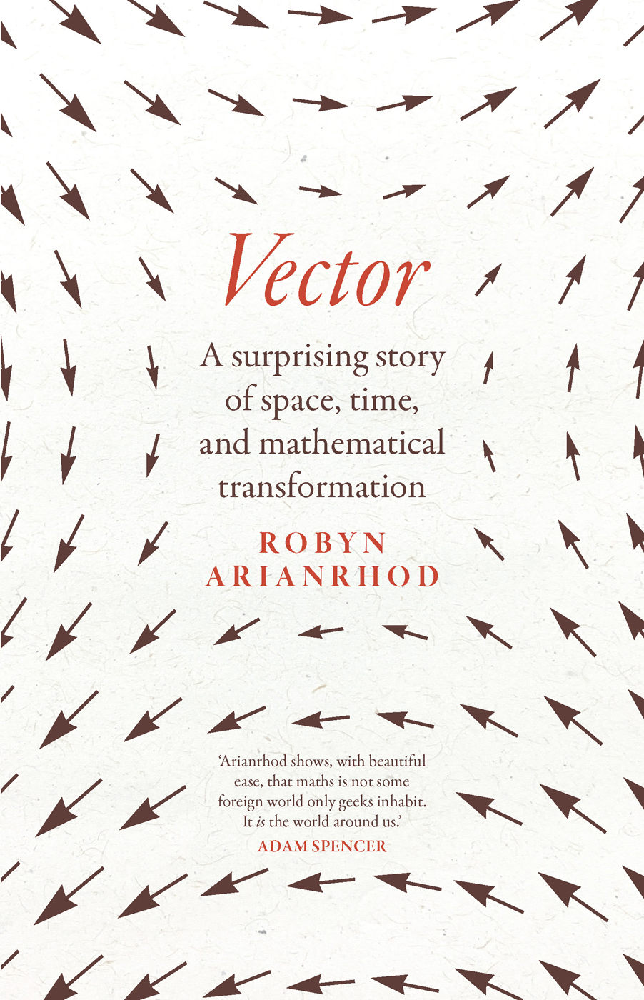

# 向量：一个关于空间、时间与数学变换的惊奇故事

{: .book-cover }

> *Vector: A Surprising Story of Space, Time, and Mathematical Transformation*
> Robyn Arianrhod（罗宾·阿里安罗德）著 · UNSW Press / NewSouth Publishing, 2024

从巴比伦泥板上的乘法表，到哈密顿在布鲁姆桥上刻下的四元数公式，再到麦克斯韦的电磁场、
闵可夫斯基的时空，以及爱因斯坦借张量写下的广义相对论——这本书讲向量与张量穿越五千年的故事。

- **中文译稿**：23 篇，汉字 26.3 万字
- **PDF 版**：[下载 vector-cn.pdf（A4，330 页，8.4 MB）](../../assets/pdf/vector-cn.pdf)
- 页边/行内的灰色小字是**英文原版页码**，供按索引与注释回查原书

## 目录

1. [译本说明](00-about-this-translation.md)
2. [名家推荐](01-praise.md)
3. [作者简介](02-about-the-author.md)
4. [献词](03-dedication.md)
5. [序言](04-prologue.md)
6. [第 1 章　代数的解放](05-ch01-liberation-of-algebra.md)
7. [第 2 章　微积分的登场](06-ch02-arrival-of-calculus.md)
8. [第 3 章　向量的构想](07-ch03-ideas-for-vectors.md)
9. [第 4 章　理解空间（与存储）](08-ch04-space-and-storage.md)
10. [第 5 章　出人意料的新角色与缓慢的接受](09-ch05-new-player-slow-reception.md)
11. [第 6 章　泰特与麦克斯韦](10-ch06-tait-and-maxwell.md)
12. [第 7 章　从四元数到向量](11-ch07-quaternions-to-vectors.md)
13. [第 8 章　向量分析终成正果](12-ch08-vector-analysis.md)
14. [第 9 章　从空间到时空](13-ch09-space-to-spacetime.md)
15. [第 10 章　弯曲的空间与不变的距离](14-ch10-curving-spaces.md)
16. [第 11 章　张量的发明](15-ch11-inventing-tensors.md)
17. [第 12 章　万物汇聚](16-ch12-everything-comes-together.md)
18. [第 13 章　后来发生了什么](17-ch13-what-happened-next.md)
19. [结语](18-epilogue.md)
20. [时间线](19-timeline.md)
21. [致谢](20-acknowledgments.md)
22. [注释（353 条）](21-notes.md)
23. [索引（636 条）](22-index.md)

---

## ⚠️ 版权与非商业声明

原书 *Vector: A Surprising Story of Space, Time, and Mathematical Transformation*，
© 2024 by Robyn Arianrhod，由 UNSW Press / NewSouth Publishing 出版
（美国版由 The University of Chicago Press 首版发行）。原书文字、插图与版式的著作权
归原作者与原出版社所有。

**本中文译本为个人学习与非商业交流用途。** 本译本不主张任何权利，也不得用于任何商业用途。
如权利人提出异议，请与本站联系，我将立即下架相关内容。
