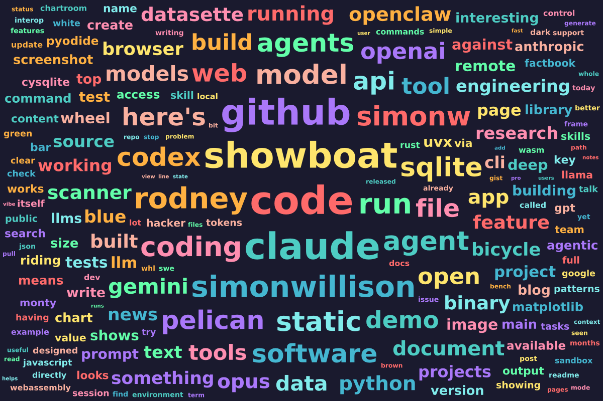
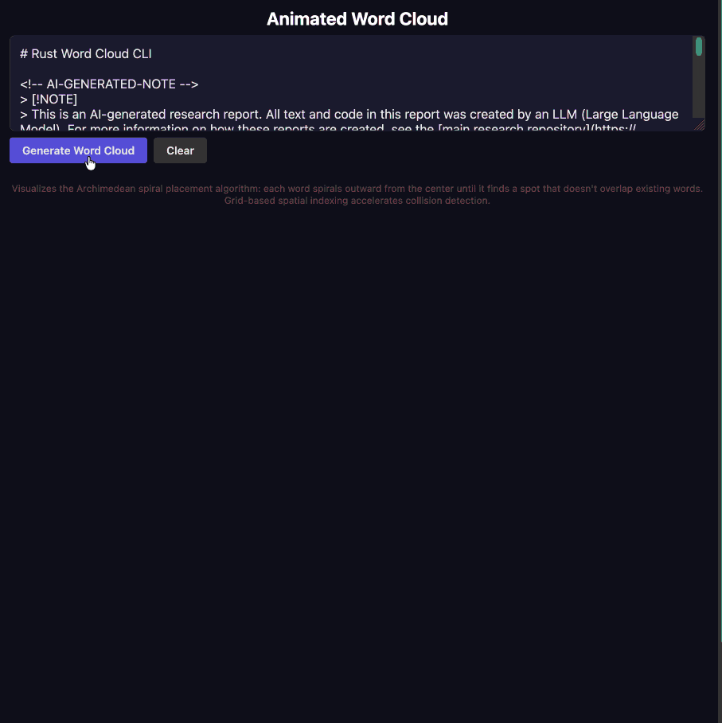

# 交互式解释

原文标题：Interactive explanations
原文链接：https://simonwillison.net/guides/agentic-engineering-patterns/interactive-explanations/
原文作者：Simon Willison
访问日期：2026-03-25
原文发布日期：2026-02-28
原文最后修改：2026-02-28
译文版本：v0.1

## 译文说明

本文为 Simon Willison《Agentic Engineering Patterns》系列中《Interactive explanations》的示范中文版。标题采用“交互式解释”，而没有翻成更口语的“互动讲解”，因为本文强调的不是人与人之间的互动感，而是用动画、界面和可操作演示来帮助人真正理解代码与算法。正文继续沿用本项目既定术语约定，将 Coding Agent 统一译为“编码智能体”，将 cognitive debt 处理为“认知债务（cognitive debt）”，并保留 Claude Code、Claude Opus 4.6、Rust、CLI、`walkthrough.md`、`curl`、`#fragment`、PNG、`animated-word-cloud.html` 等工具名、产品名、文件名与命令原文；文中的长 Prompt 继续保留英文原文，以保留其可执行输入属性。

## 正文

> 所属主题：代码理解
> 上一篇：[线性讲解](./linear_walkthroughs_demo_zh.md)
> 下一篇：[用 WebAssembly 和 Gifsicle 构建 GIF 优化工具](./gif_optimization_tool_using_webassembly_and_gifsicle_demo_zh.md)

当我们逐渐弄不清智能体替我们写出的代码到底是怎么工作的，我们就背上了认知债务（cognitive debt）。

很多时候这其实无所谓：如果那段代码只是从数据库里取一些数据，再把它输出成 JSON，那么实现细节往往足够简单，我们未必需要太在意。我们可以先试一下新功能，大致判断它是怎么工作的，然后再扫一眼代码确认即可。

但很多情况下，细节确实很重要。如果应用的核心部分变成了一个我们并不真正理解的黑盒，我们就没法再有把握地去推理它，这会让新功能规划变得更难，最终也会像不断积累的技术债务一样拖慢我们的进度。

那要怎么偿还认知债务？办法就是提升我们对代码工作方式的理解。

我最喜欢的办法之一，是去构造**交互式解释**。

## 理解词云

在 Max Woolf 的文章 [An AI agent coding skeptic tries AI agent coding, in excessive detail](https://minimaxir.com/2026/02/ai-agent-coding/) 里，他提到自己会用下面这段 Prompt 来测试 LLM 的 Rust 能力：`Create a Rust app that can create "word cloud" data visualizations given a long input text`。

这一下就击中了我的兴趣点：我一直都想知道词云到底是怎么工作的，于是我发起了一个[异步研究项目](https://simonwillison.net/2025/Nov/6/async-code-research/)来探索这个想法——[初始 Prompt 在这里](https://github.com/simonw/research/pull/91#issue-4002426963)，[代码和报告在这里](https://github.com/simonw/research/tree/main/rust-wordcloud)。

结果非常好：Claude Code for web 给我做了一个 Rust CLI 工具，能生成像下面这样的图片。

但它到底是怎么工作的？

Claude 的报告里写的是，它使用了“**Archimedean spiral placement** with per-word random angular offset for natural-looking layouts”。这对我帮助并不大。

于是我请求它对这个代码库做一份[线性讲解](./linear_walkthroughs_demo_zh.md)；那确实帮助我更细地理解了这份 Rust 代码——[讲解文档在这里](https://github.com/simonw/research/blob/main/rust-wordcloud/walkthrough.md)（[对应的 Prompt 在这里](https://github.com/simonw/research/commit/2cb8c62477173ef6a4c2e274be9f712734df6126)）。它帮我理解了 Rust 代码的结构，但我还是没有真正建立起对“Archimedean spiral placement”那部分工作机制的直觉。

所以我又要求它给一个**动画版解释**。我的做法是：把那份现成的 `walkthrough.md` 文档链接贴进一个 Claude Code 会话里，再附上下面这段内容：

> Fetch https://raw.githubusercontent.com/simonw/research/refs/heads/main/rust-wordcloud/walkthrough.md to /tmp using curl so you can read the whole thing
>
> Inspired by that, build animated-word-cloud.html - a page that accepts pasted text (which it persists in the `#fragment` of the URL such that a page loaded with that `#` populated will use that text as input and auto-submit it) such that when you submit the text it builds a word cloud using the algorithm described in that document but does it animated, to make the algorithm as clear to understand. Include a slider for the animation which can be paused and the speed adjusted or even stepped through frame by frame while paused. At any stage the visible in-progress word cloud can be downloaded as a PNG.

你可以[在这里直接玩这个结果](https://tools.simonwillison.net/animated-word-cloud)。原文这里还放了一段 GIF 动图演示。

这次用的是 Claude Opus 4.6。事实证明，它在构造“解释型动画”这件事上，审美还挺不错。

如果你仔细看那段动画，就会发现：对每一个词，它都会先在页面上尝试放一个框出来，然后检查这个框是否和已经存在的词发生相交。如果相交了，它就继续从中心开始沿着螺旋向外移动，不断寻找一个合适的位置。

我发现，这段动画确实让我一下子“看懂了”这个算法到底是怎么工作的。

一直以来，我都很喜欢用动画和交互式界面来解释各种概念。一个好的编码智能体可以按需把这种东西做出来，用来帮助你理解代码——不管那段代码是它自己写的，还是别人写的。
